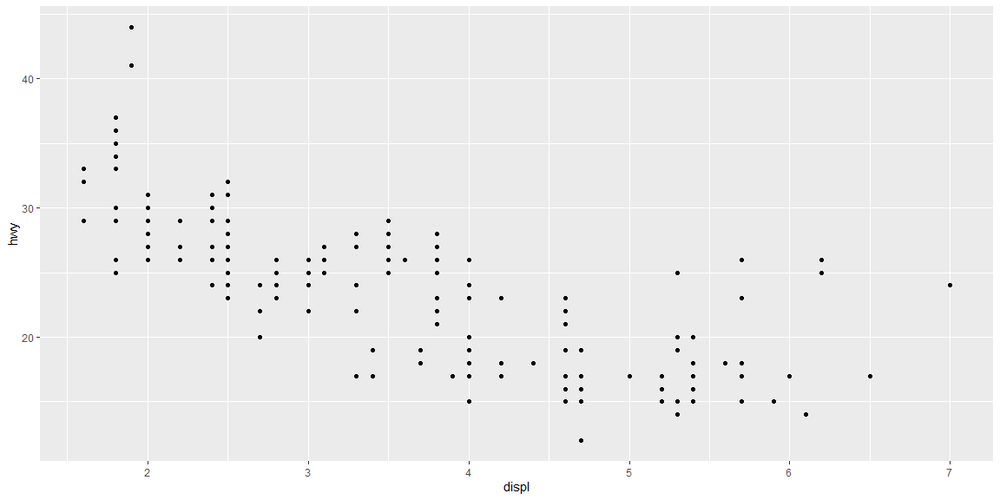
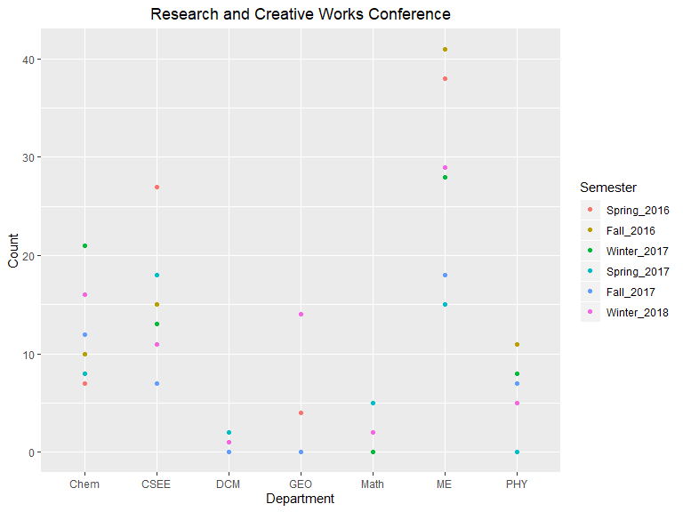

## Background
This task is intended to get all of us on the same page in R. You will copy code from your readings and then improve the Research and Creative Works conference visulization from this Excel file. Even if you have used R before, this will be an excellent refresher. If you do not get the title of this task, watch this.

## Readings
* Chapter 4: R for Data Scientists - Workflow Basics
* Modern Drive: Chapter 1 Getting Started with Data in R
* Using the geom_col function
* Using the geom_line function

## Tasks
[X] Make an R script that has the code examples from Chapter 4 of R for data science and Chapter 1 of Modern Drive 

* [X] Write a short comment in your R script that explains 1-2 new concepts you learned about R

Chapter 4 -- R for data science

```r
#Examples
1 / 200 * 30
```

```
## [1] 0.15
```

```r
(59 + 73 + 2) / 3
```

```
## [1] 44.66667
```

```r
sin(pi / 2)
```

```
## [1] 1
```

```r
x <- 3 * 4
x
```

```
## [1] 12
```

```r
x <- "hello world" #This is how to output 
x                  #things in variables
```

```
## [1] "hello world"
```

```r
x <- "hello" #Assignments are different then other programming languages  
x
```

```
## [1] "hello"
```

```r
y <- seq(1, 10, length.out = 5)
y
```

```
## [1]  1.00  3.25  5.50  7.75 10.00
```

```r
(y <- seq(1, 10, length.out = 5))
```

```
## [1]  1.00  3.25  5.50  7.75 10.00
```

```r
#Practice
my_variable <- 10
my_varıable
```

```
## [1] 10
```

```r
#Fix This Code
ggplot(data = mpg) + 
  geom_point(mapping = aes(x = displ, y = hwy))
```

<!-- -->

```r
 filter(mpg, cyl == 8)
```

```
## # A tibble: 70 x 11
##    manufacturer model     displ  year   cyl trans  drv     cty   hwy fl    class
##    <chr>        <chr>     <dbl> <int> <int> <chr>  <chr> <int> <int> <chr> <chr>
##  1 audi         a6 quatt…   4.2  2008     8 auto(… 4        16    23 p     mids…
##  2 chevrolet    c1500 su…   5.3  2008     8 auto(… r        14    20 r     suv  
##  3 chevrolet    c1500 su…   5.3  2008     8 auto(… r        11    15 e     suv  
##  4 chevrolet    c1500 su…   5.3  2008     8 auto(… r        14    20 r     suv  
##  5 chevrolet    c1500 su…   5.7  1999     8 auto(… r        13    17 r     suv  
##  6 chevrolet    c1500 su…   6    2008     8 auto(… r        12    17 r     suv  
##  7 chevrolet    corvette    5.7  1999     8 manua… r        16    26 p     2sea…
##  8 chevrolet    corvette    5.7  1999     8 auto(… r        15    23 p     2sea…
##  9 chevrolet    corvette    6.2  2008     8 manua… r        16    26 p     2sea…
## 10 chevrolet    corvette    6.2  2008     8 auto(… r        15    25 p     2sea…
## # … with 60 more rows
```

```r
 filter(diamonds, carat > 3)
```

```
## # A tibble: 32 x 10
##    carat cut     color clarity depth table price     x     y     z
##    <dbl> <ord>   <ord> <ord>   <dbl> <dbl> <int> <dbl> <dbl> <dbl>
##  1  3.01 Premium I     I1       62.7    58  8040  9.1   8.97  5.67
##  2  3.11 Fair    J     I1       65.9    57  9823  9.15  9.02  5.98
##  3  3.01 Premium F     I1       62.2    56  9925  9.24  9.13  5.73
##  4  3.05 Premium E     I1       60.9    58 10453  9.26  9.25  5.66
##  5  3.02 Fair    I     I1       65.2    56 10577  9.11  9.02  5.91
##  6  3.01 Fair    H     I1       56.1    62 10761  9.54  9.38  5.31
##  7  3.65 Fair    H     I1       67.1    53 11668  9.53  9.48  6.38
##  8  3.24 Premium H     I1       62.1    58 12300  9.44  9.4   5.85
##  9  3.22 Ideal   I     I1       62.6    55 12545  9.49  9.42  5.92
## 10  3.5  Ideal   H     I1       62.8    57 12587  9.65  9.59  6.03
## # … with 22 more rows
```
Chapter 1 -- Modern Drive

```r
#Examples
2 + 1 == 3 #Comparator operations
```

```
## [1] TRUE
```

```r
4 + 2 >= 3
```

```
## [1] TRUE
```

```r
3 + 5 <= 1
```

```
## [1] FALSE
```

```r
(2 + 1 == 3) & (2 + 1 == 4)
```

```
## [1] FALSE
```

```r
(2 + 1 == 3) | (2 + 1 == 4)
```

```
## [1] TRUE
```

```r
seq(from = 1, to = 1)
```

```
## [1] 1
```

```r
seq(from = 2, to = 5)
```

```
## [1] 2 3 4 5
```

```r
flights
```

```
## # A tibble: 336,776 x 19
##     year month   day dep_time sched_dep_time dep_delay arr_time sched_arr_time
##    <int> <int> <int>    <int>          <int>     <dbl>    <int>          <int>
##  1  2013     1     1      517            515         2      830            819
##  2  2013     1     1      533            529         4      850            830
##  3  2013     1     1      542            540         2      923            850
##  4  2013     1     1      544            545        -1     1004           1022
##  5  2013     1     1      554            600        -6      812            837
##  6  2013     1     1      554            558        -4      740            728
##  7  2013     1     1      555            600        -5      913            854
##  8  2013     1     1      557            600        -3      709            723
##  9  2013     1     1      557            600        -3      838            846
## 10  2013     1     1      558            600        -2      753            745
## # … with 336,766 more rows, and 11 more variables: arr_delay <dbl>,
## #   carrier <chr>, flight <int>, tailnum <chr>, origin <chr>, dest <chr>,
## #   air_time <dbl>, distance <dbl>, hour <dbl>, minute <dbl>, time_hour <dttm>
```

```r
View(flights)
glimpse(flights)
```

```
## Observations: 336,776
## Variables: 19
## $ year           <int> 2013, 2013, 2013, 2013, 2013, 2013, 2013, 2013, 2013, …
## $ month          <int> 1, 1, 1, 1, 1, 1, 1, 1, 1, 1, 1, 1, 1, 1, 1, 1, 1, 1, …
## $ day            <int> 1, 1, 1, 1, 1, 1, 1, 1, 1, 1, 1, 1, 1, 1, 1, 1, 1, 1, …
## $ dep_time       <int> 517, 533, 542, 544, 554, 554, 555, 557, 557, 558, 558,…
## $ sched_dep_time <int> 515, 529, 540, 545, 600, 558, 600, 600, 600, 600, 600,…
## $ dep_delay      <dbl> 2, 4, 2, -1, -6, -4, -5, -3, -3, -2, -2, -2, -2, -2, -…
## $ arr_time       <int> 830, 850, 923, 1004, 812, 740, 913, 709, 838, 753, 849…
## $ sched_arr_time <int> 819, 830, 850, 1022, 837, 728, 854, 723, 846, 745, 851…
## $ arr_delay      <dbl> 11, 20, 33, -18, -25, 12, 19, -14, -8, 8, -2, -3, 7, -…
## $ carrier        <chr> "UA", "UA", "AA", "B6", "DL", "UA", "B6", "EV", "B6", …
## $ flight         <int> 1545, 1714, 1141, 725, 461, 1696, 507, 5708, 79, 301, …
## $ tailnum        <chr> "N14228", "N24211", "N619AA", "N804JB", "N668DN", "N39…
## $ origin         <chr> "EWR", "LGA", "JFK", "JFK", "LGA", "EWR", "EWR", "LGA"…
## $ dest           <chr> "IAH", "IAH", "MIA", "BQN", "ATL", "ORD", "FLL", "IAD"…
## $ air_time       <dbl> 227, 227, 160, 183, 116, 150, 158, 53, 140, 138, 149, …
## $ distance       <dbl> 1400, 1416, 1089, 1576, 762, 719, 1065, 229, 944, 733,…
## $ hour           <dbl> 5, 5, 5, 5, 6, 5, 6, 6, 6, 6, 6, 6, 6, 6, 6, 5, 6, 6, …
## $ minute         <dbl> 15, 29, 40, 45, 0, 58, 0, 0, 0, 0, 0, 0, 0, 0, 0, 59, …
## $ time_hour      <dttm> 2013-01-01 05:00:00, 2013-01-01 05:00:00, 2013-01-01 …
```

```r
airlines
```

```
## # A tibble: 16 x 2
##    carrier name                       
##    <chr>   <chr>                      
##  1 9E      Endeavor Air Inc.          
##  2 AA      American Airlines Inc.     
##  3 AS      Alaska Airlines Inc.       
##  4 B6      JetBlue Airways            
##  5 DL      Delta Air Lines Inc.       
##  6 EV      ExpressJet Airlines Inc.   
##  7 F9      Frontier Airlines Inc.     
##  8 FL      AirTran Airways Corporation
##  9 HA      Hawaiian Airlines Inc.     
## 10 MQ      Envoy Air                  
## 11 OO      SkyWest Airlines Inc.      
## 12 UA      United Air Lines Inc.      
## 13 US      US Airways Inc.            
## 14 VX      Virgin America             
## 15 WN      Southwest Airlines Co.     
## 16 YV      Mesa Airlines Inc.
```

```r
kable(airlines)
```


carrier   name                        
--------  ----------------------------
9E        Endeavor Air Inc.           
AA        American Airlines Inc.      
AS        Alaska Airlines Inc.        
B6        JetBlue Airways             
DL        Delta Air Lines Inc.        
EV        ExpressJet Airlines Inc.    
F9        Frontier Airlines Inc.      
FL        AirTran Airways Corporation 
HA        Hawaiian Airlines Inc.      
MQ        Envoy Air                   
OO        SkyWest Airlines Inc.       
UA        United Air Lines Inc.       
US        US Airways Inc.             
VX        Virgin America              
WN        Southwest Airlines Co.      
YV        Mesa Airlines Inc.          

```r
airlines$name
```

```
##  [1] "Endeavor Air Inc."           "American Airlines Inc."     
##  [3] "Alaska Airlines Inc."        "JetBlue Airways"            
##  [5] "Delta Air Lines Inc."        "ExpressJet Airlines Inc."   
##  [7] "Frontier Airlines Inc."      "AirTran Airways Corporation"
##  [9] "Hawaiian Airlines Inc."      "Envoy Air"                  
## [11] "SkyWest Airlines Inc."       "United Air Lines Inc."      
## [13] "US Airways Inc."             "Virgin America"             
## [15] "Southwest Airlines Co."      "Mesa Airlines Inc."
```

```r
glimpse(airports)
```

```
## Observations: 1,458
## Variables: 8
## $ faa   <chr> "04G", "06A", "06C", "06N", "09J", "0A9", "0G6", "0G7", "0P2", …
## $ name  <chr> "Lansdowne Airport", "Moton Field Municipal Airport", "Schaumbu…
## $ lat   <dbl> 41.13047, 32.46057, 41.98934, 41.43191, 31.07447, 36.37122, 41.…
## $ lon   <dbl> -80.61958, -85.68003, -88.10124, -74.39156, -81.42778, -82.1734…
## $ alt   <dbl> 1044, 264, 801, 523, 11, 1593, 730, 492, 1000, 108, 409, 875, 1…
## $ tz    <dbl> -5, -6, -6, -5, -5, -5, -5, -5, -5, -8, -5, -6, -5, -5, -5, -5,…
## $ dst   <chr> "A", "A", "A", "A", "A", "A", "A", "A", "U", "A", "A", "U", "A"…
## $ tzone <chr> "America/New_York", "America/Chicago", "America/Chicago", "Amer…
```

[X] Improve the 3D barchart visuallization using R (code below) to provide a graphic that answers the question, What is the trend by department of RC&W attendance? (data and 3D visualization) ---
library(tidyverse)
dat <- read_csv("https://byuistats.github.io/M335/data/rcw.csv")


```r
theme_update(plot.title = element_text(hjust = 0.5))
dat <- read_csv("https://byuistats.github.io/M335/data/rcw.csv")
```

```
## Parsed with column specification:
## cols(
##   Year = col_double(),
##   Semester = col_character(),
##   Semester_Date = col_character(),
##   Count = col_double(),
##   Department = col_character()
## )
```

```r
dat %>%
  mutate(Year2 = Year %>% as.character(Year)) %>% 
  unite("Semester_Year", Semester, Year2, remove = FALSE) %>%
  mutate(Semester_Year = Semester_Year %>% 
           factor(level = c("Spring_2016", "Fall_2016", "Winter_2017", "Spring_2017", "Fall_2017", "Winter_2018"))) %>%
ggplot() +
  geom_point(mapping = aes(x = Department, y = Count, color = Semester_Year)) +
  labs(color = "Semester", 
       title = "Research and Creative Works Conference")
```

<!-- -->

[X] Create a GitHub account --- https://github.com/kctolli

* [X] Post your github username on the google docs sheet --- kctolli
* [X] Post a professional picture to your Github, LinkedIn, and Slack icons. Go to the BYU-I LinkedIn Photobooth if you don’t already have one.

[X] Attend Data Science Society on the second Wednesday of the semester. 

* 6pm in STC 385 

## Class Notes

### Effectively Communicating Numbers

1. Message
2. Graphics
3. Data Munging
4. Fine the Message
5. Clarify the point 

### Asking the Right Questions

* Harness the power of questions and Clarify Terms
* A truly wise person may not have the answers, but know which questions to ask

### Three Traits of a Data Scientist

1. Ask questions that matter?

* What does that mean?

2. Determine the question has been answered.

* Identify and satisfy assumptions
* A commitment to intellectual honesty
* What does that mean?

3. Creative thinking

* Vigorous attempts to fail their own answers?

An easy way to assess job candidates on the three traits is to ask them to briefly describe one or more of their past projects, and then ask them many follow-up questions about whether and how they applied the three traits.

### HotKeys

* %>% -- ctrl shift m
* comments -- ctrl shift c
* hotkeys -- shift alt k

