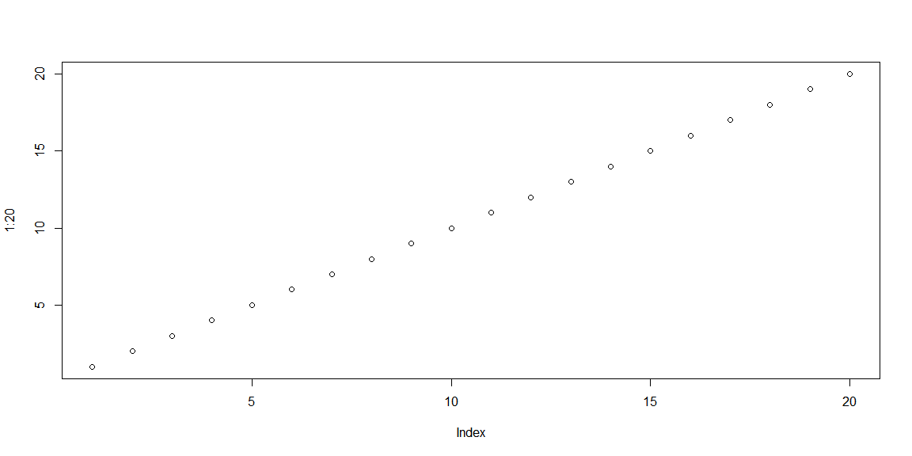

## Background
Your first weekly project requires you to submit a review of 4-5 different data visualizations used to answer specific questions. Some fun websites are wonkblog, fivethiryeight, and priceonomics (but you can use any website, blog, or article with a good visualization).

## Tasks
[X] Find 4-5 examples of data-driven answers and write a one-paragraph review of each.

* [X] List 2-3 items that are unique/good
* [X] Identify 1 issue with the each example

[X] Create an .Rmd file in R-Studio

* [X] Title it Case Study 1 in the YAML
* [X] Include links to the visualization post you found 
* [X] Write a one paragraph critique of each visualization
* [X] Add the R code Snippet to your .Rmd file --- Code Snippet: plot(1:20)
* [X] Knit the file to .html and keep the .md file as well

[X] Create an account on slack. Mine is kc_tolli.

* [X] Upload your intermediary .md file to the general channel in our Slack group

## Code Snippet 

<!-- -->

## Visualisations

1. https://projects.fivethirtyeight.com/2020-primary-forecast/?ex_cid=rrpromo

In this website there is a graph that projects the democratic primaries for 2020. the one issue is the beginning of the graph is all on top of each other show the firt part of the projection is hard to read. After that is is pretty easy to compare the values. I also think its good to see the averages for forcast of the each canadates. 

2. https://priceonomics.com/the-priceonomics-data-studio/

This website has a visualisation of the cost of rent per neighborhood. The problem is the colors are to close to the other colors. The good thing is there are values with each neighborhood. Another issue is some of the neighborhoods are too close to each other.

3. https://www.realclearpolitics.com/epolls/2020/president/us/2020_democratic_presidential_nomination-6730.html

This website shows a graph of the presidential nomination of 2020. The issue is there is an information overload. I like how you put your cursor over the graph to see the values of the graph at each interval. Something unique is that there are 2 graph in the same plot pane. I don't think that makes the graph easy to understand. 

4. https://projects.fivethirtyeight.com/trump-approval-ratings/

This website has a graph of trumps approval vs disproval with respect to months. The issue with it is the used curve fitting so they don't consider the outliers. One good thing about the graph is you can each value by just putting your cursor over the graph. another good thing is the values of the graph are easy to see and understand.   
