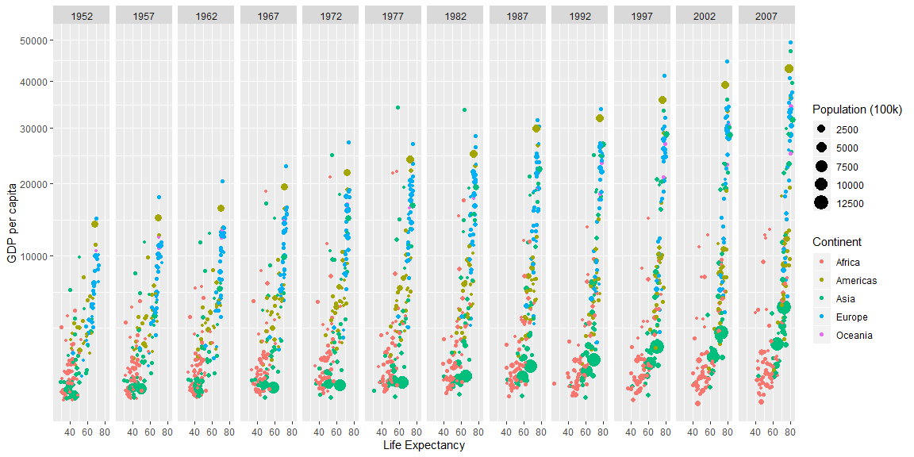

---  
title: "Case Study 2"  
subtitle: "Wealth and Life Expectancy (Gapminder)"
author: "Kyle Tolliver"  
date: "March 16, 2020"
output:
  html_document:  
    keep_md: true
    toc: true
    toc_float: true
    code_folding: hide
    fig_height: 6
    fig_width: 12
    fig_align: 'center'
    editor_options: 
    chunk_output_type: console
---   


## Background
Hans Rosling is one of the most popular data scientists on the web. His original TED talk was very popular among my friends when it came out. We are going to create some graphics using his formatted data as our weekly case study. Note that we need to remove Kuwait from the data (discussion on this)

## Tasks
[X] Recreate the two graphics shown below using gapminder dataset from library(gapminder) 
    (get them to match as closely as you can)

* [X] Use library(tidyverse) to load ggplot2 and dplyr and the theme_bw() to duplicate the first plot.
* [X] Use scale_y_continuous(trans = "sqrt") to get the correct scale on the y-axis.
* [X] Build weighted average data set using weighted. mean() and GDP with summarise() and group_by() that will be the black continent average line on the second plot.
* [X] Use theme_bw() to duplicate the second plot. You will need to use the new data to make the black lines and dots showing the continent average.
* [X] Use ggsave() and save each plot as a .png with a width of 15 inches


[X] Build an Rmd file that has the following features

* [X] The title is the same as listed in the task
* [X] You have two sections – 1) Background, 2) Images
* [X] In the background section write a few sentences about what you learned making these plots
* [X] In the Image section have two chunks. One for each image

[X] Save your .Rmd, .md, and the two .png’s of the plots into your git repository.

## Plot Background

I was able to learn a few different things in this case study. I was able to learn what how to use different data sets in ggplot. I learned how to use filter functions. I was also able to learn how group by and weighted mean.

## Images

### Image 1

#### Life Expectancy vs GDP per capita by Year


```r
gapminder %>%
 filter(country != "Kuwait") %>%
ggplot(mapping = aes(x=lifeExp, y=gdpPercap)) + 
  geom_point(mapping = aes(x=lifeExp, y=gdpPercap, color=continent, size=pop/100000)) +
  facet_wrap(~ year, nrow=1) + 
  scale_y_continuous(trans = "sqrt") + 
  labs(x = "Life Expectancy", y="GDP per capita",color = "Continent", size = "Population (100k)")
```

<!-- -->

```r
ggsave("case_study2a.png", width = 15, units = "in")
```

```
## Saving 15 x 6 in image
```

### Image 2

#### Year vs GDP per capita by Continent


```r
weight <- gapminder %>% 
  group_by(continent, year) %>% 
  mutate(w.mean=weighted.mean(x=gdpPercap, w=pop))

gapminder %>%
 filter(country != "Kuwait") %>% 
ggplot(aes(x=year, y=gdpPercap)) + 
  geom_line(aes(group=country, color=continent)) +
  geom_point(aes(color=continent, size=pop/40000)) +
  geom_point(data=weight, aes(x=year, y=w.mean, size=pop/40000), color="black") +
  geom_line(data=weight, aes(x=year, y=w.mean), color="black") +
  facet_wrap(~ continent, nrow=1) +
  theme_bw() +
  labs(y="GDP per capita", color="Continent", size="Population (100k)")
```

<!-- -->

```r
ggsave("case_study2b.png", width = 15, units = "in")
```

```
## Saving 15 x 6 in image
```
