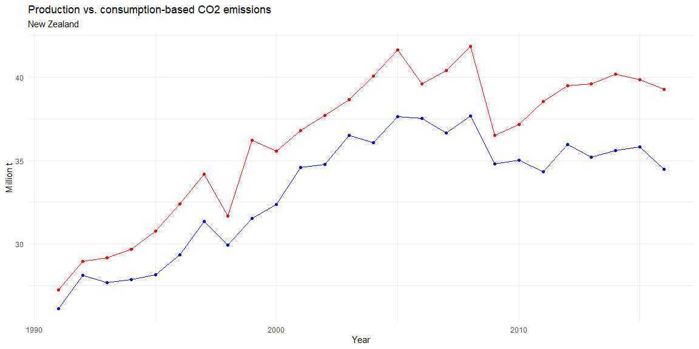
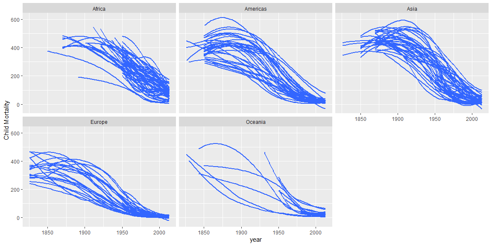
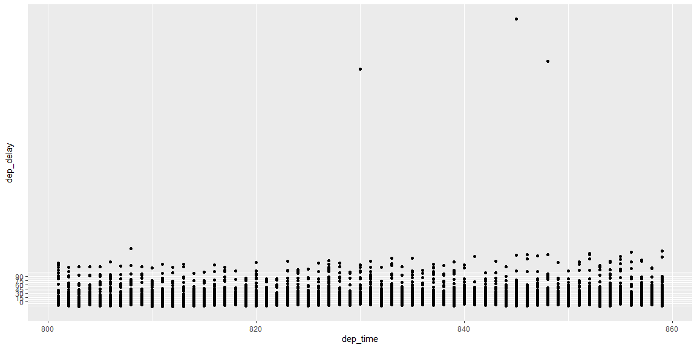
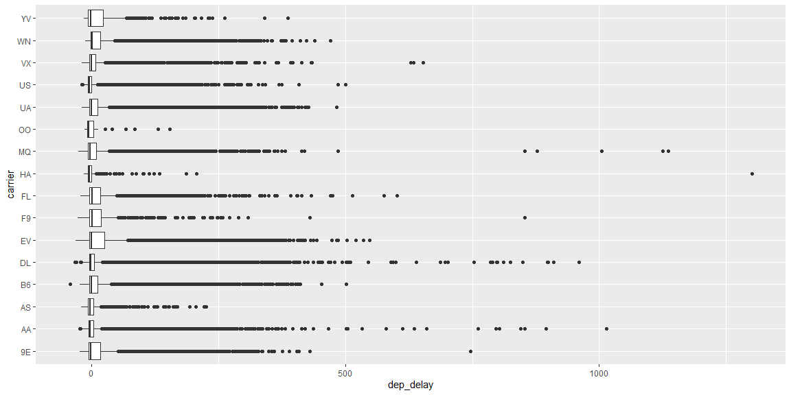
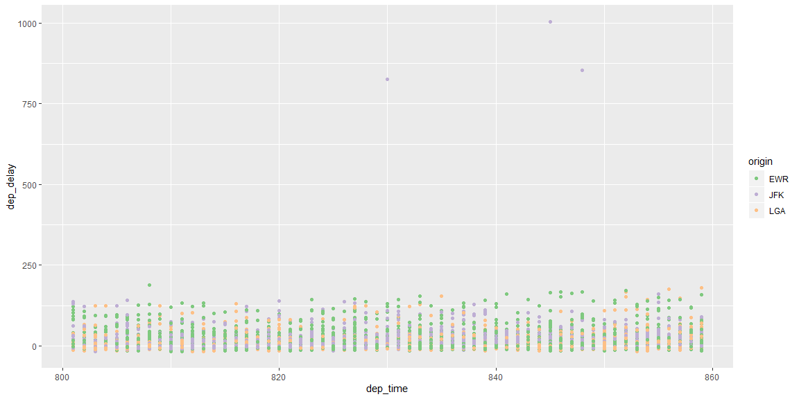
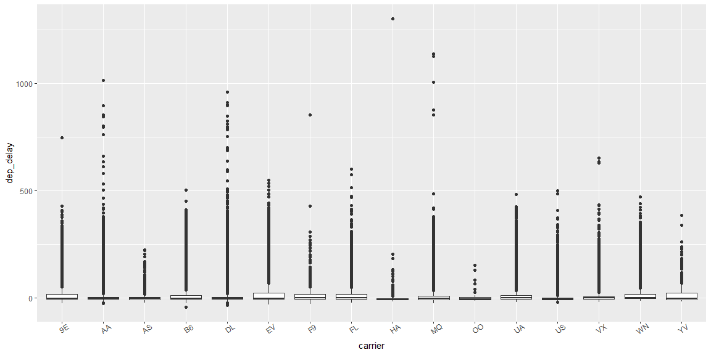
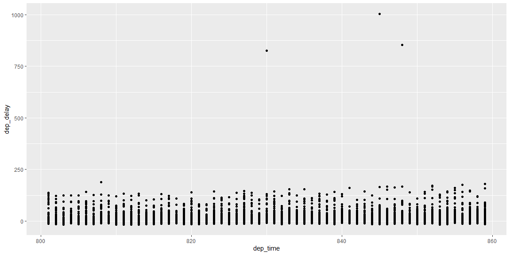

```r
# Use this R-Chunk to import all your datasets!
emissions <- read_csv(file="production-vs-consumption-co2-emissions.csv")
```

```
## Parsed with column specification:
## cols(
##   Entity = col_character(),
##   Code = col_character(),
##   Year = col_double(),
##   `Consumption-based (tonnes)` = col_double(),
##   `Production-based (tonnes )` = col_double()
## )
```

```r
#View(emissions)
child <- ourworldindata::child_mortality 
#View(child)
```

## Background

The Our World in Data website has world data. It is nice that they have provided graphics and then the data that they used to generate the graphics. We are going to recreate some of their visualizations in R and then make them better.

## Readings

* Chapter 28: R for Data Science - Graphics for communication
* Chapter 6: R for Data Science - Scripts
* Chapter 11: R for Data Science - Data Import

## Tasks

[X] Take notes on your reading of the specified ‘R for Data Science’ chapter in the README.md or in a ‘.R’ script in the class task folder

[X] Review the Our World in Data webpage and find a graphic that interests you.  
(https://ourworldindata.org/consumption-based-co2)

* [X] Recreate that graphic in R after downloading the data from their website


```r
dat <- emissions %>%
  filter(Year > 1990) %>% 
  filter(Entity == "New Zealand") %>% 
  rename(consumption = 'Consumption-based (tonnes)') %>% 
  rename(production = 'Production-based (tonnes )') %>%
  mutate(consumption = consumption/1000000) %>% 
  mutate(production = production/1000000) %>% 
  filter(consumption != "NA") 
  

Co2 <- ggplot(data=dat) + 
  geom_line(aes(x=Year, y=consumption, color="Consumption-based"), color="red") +
  geom_point(aes(x=Year, y=consumption, color="Consumption-based"), color="red") +
  geom_line(aes(x=Year, y=production, color="Production-based"), color="blue") + 
  geom_point(aes(x=Year, y=production, color="Production-based"), color="blue") +
  theme_minimal() +
  labs(y="Million t", title="Production vs. consumption-based CO₂ emissions", subtitle = "New Zealand")
```

[X] Explore the world data on child_mortality and create an interesting graphic that highlights this dataset.

* [X] Use devtools::install_github("drsimonj/ourworldindata") to get a larger dataset on child_mortality. This will require install.packages("devtools").
* [X] Create a graphic that you could use in a presentation to summarize world child mortality


```r
Mortality <- child %>% 
  filter(year > 1825) %>% 
  filter(population > 0) %>% 
  filter(child_mort != "NaN") %>%
  filter(continent != "NA") %>%
  filter(country != "NA") %>%
ggplot(aes(x=year, y=child_mort, by=country)) +
  geom_smooth(aes(group=country), se=F) +
  facet_wrap(~continent) +
  labs(y="Child Mortality")
```

[X] Include your plots in an .Rmd file with short paragraph describing your plots


```r
Co2
```

<!-- -->

This graph was a little complicated to figure out due to how messy my data set is. I was able to figure out how the plot was created. This plot shows the CO2 emissions per year.


```r
Mortality 
```

```
## `geom_smooth()` using method = 'loess' and formula 'y ~ x'
```

<!-- -->

This plot fliters out unused and unknown information. It plots a facet for each continent. This shows the year versus child mortality while grouping by country. I used geom_smooth() for this plot.  

[X] Push your .Rmd, .md, and .html to your GitHub repo

## Reading Notes

### Ch 6

Script Workflow

* Editor
* Console
* Output

### Ch 11

readr included in tidyverse

Functions

* read_csv()
* read_csv2()
* read_tsv()
* read_delim()
* read_fwf()
* fwf_width()
* fwf_positions()
* read_table()
* read_log()

Parsing files

### Ch 28

ggplot() labs()

* subtitle adds additional detail in a smaller font beneath the title.
* caption adds text at the bottom right of the plot, often used to describe the source of the data.

ggthemes() 

* fig.width()
* fig.length()
* fig.align()

## Class Notes

#### Example 1

```r
library(nycflights13)
library(tidyverse)

fl_bp <- flights %>%
  ggplot(aes(x = carrier, y = dep_delay))
fl_sc <- flights %>%
  filter(dep_time > 800, dep_time < 900) %>%
  ggplot(aes(x = dep_time, y = dep_delay))

fl_bp + geom_boxplot() + coord_flip()
```

```
## Warning: Removed 8255 rows containing non-finite values (stat_boxplot).
```

<!-- -->

```r
fl_sc + geom_point() + 
  scale_y_continuous(breaks = seq(0,100, by=15)) 
```

<!-- -->


```r
library(nycflights13)
library(tidyverse)

fl_bp <- flights %>%
  ggplot(aes(x = carrier, y = dep_delay))
fl_sc <- flights %>%
  filter(dep_time > 800, dep_time < 900) %>%
  ggplot(aes(x = dep_time, y = dep_delay))

fl_bp + geom_boxplot() + coord_flip()
```

```
## Warning: Removed 8255 rows containing non-finite values (stat_boxplot).
```

<!-- -->

```r
fl_sc + geom_point(aes(color=origin)) + 
  scale_color_brewer(type="qual") + coord_cartesian()
```

<!-- -->


```r
library(nycflights13)
library(tidyverse)

fl_bp <- flights %>%
  ggplot(aes(x = carrier, y = dep_delay))
fl_sc <- flights %>%
  filter(dep_time > 800, dep_time < 900) %>%
  ggplot(aes(x = dep_time, y = dep_delay))

fl_bp + geom_boxplot() + theme(axis.text.x = element_text(angle=35))
```

```
## Warning: Removed 8255 rows containing non-finite values (stat_boxplot).
```

<!-- -->

```r
fl_sc + geom_point()  
```

<!-- -->
