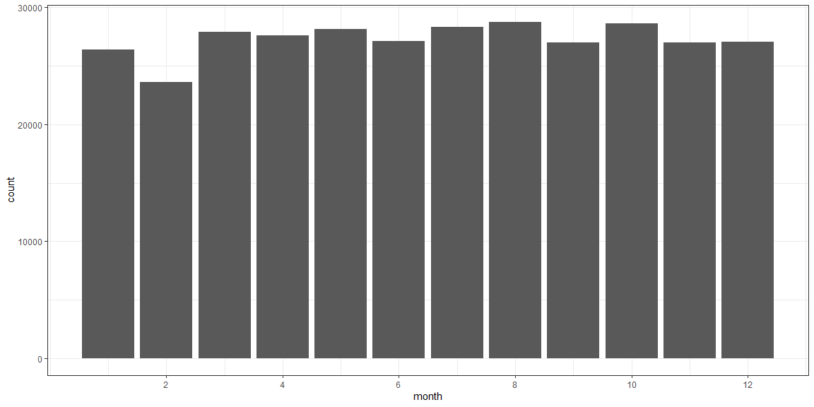
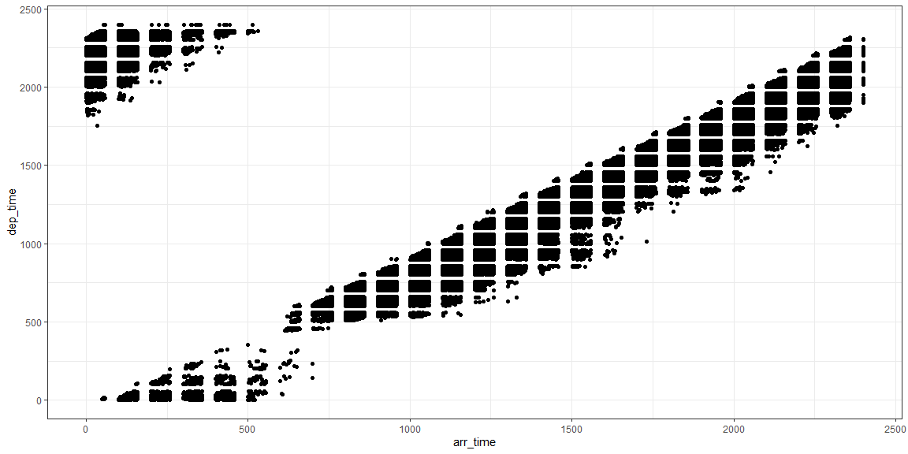
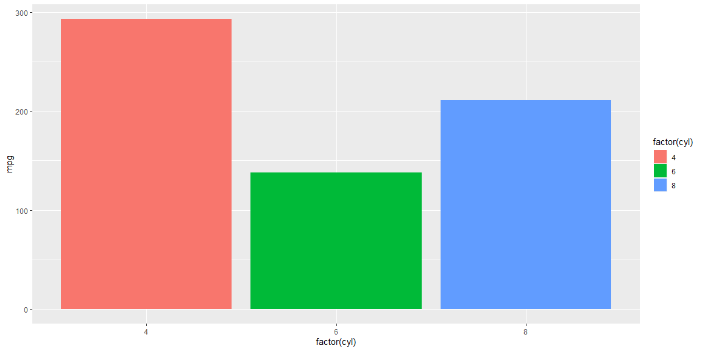
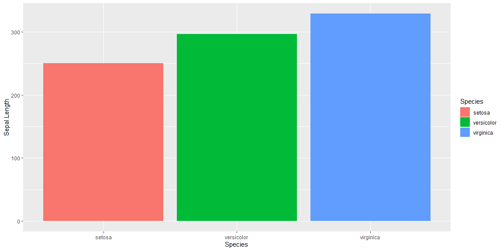
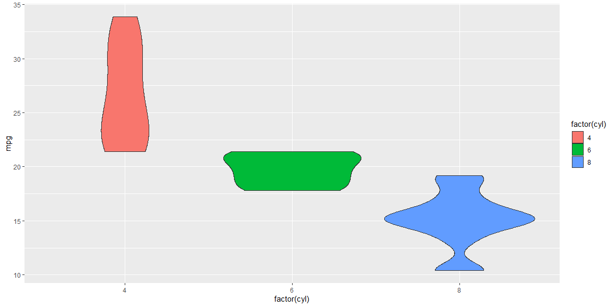
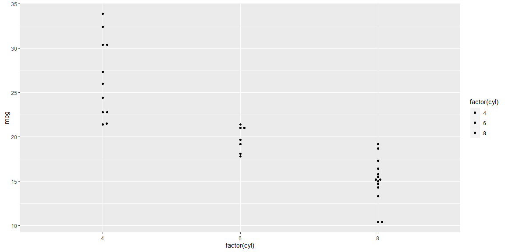
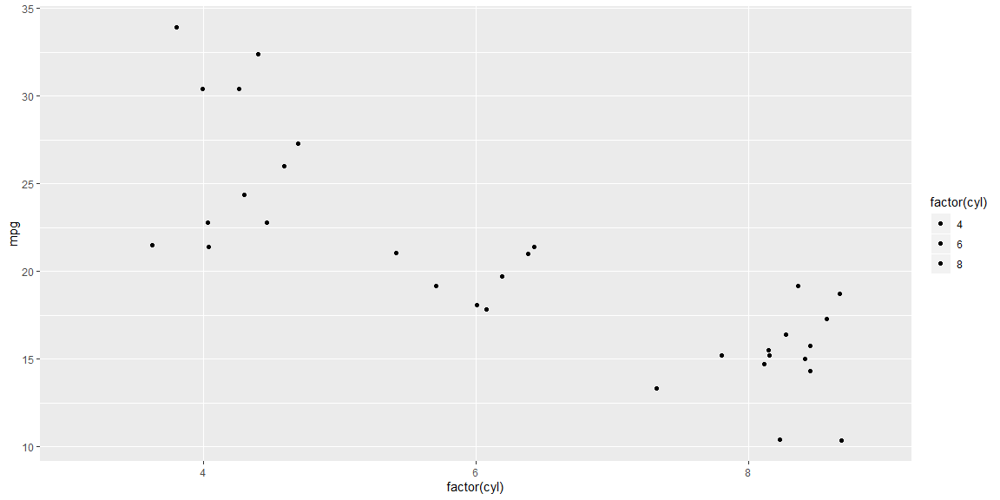
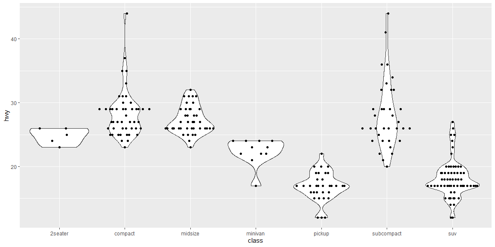
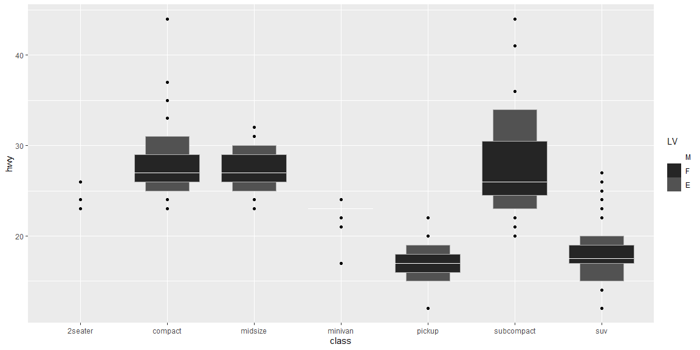

```r
# Use this R-Chunk to import all your datasets!
flight <- nycflights13::flights %>% na.omit()

#View(flight)
```

## Background

Before we can start to answer business questions we need to become familiar with our data. Often, you will want to start with the data dictionary. However, you can also just dive into the data and gain understanding based on the variable names and types.

Beyond the variable descriptions is how the variables relate to each other. We can create tables or visualizations that summarize how different variables relate to each other. At this point we are deepeing our understanding as well as beginning our analysis.

Remember: Your job is to become the data expert not the domain expert. You will build domain skills but you are not going to replace domain experts. People will depend on you to have a firm understanding of what data your company has available to answer domain specific questions.

Use nycflights13::flights to practice your data summary and data investigation through visualization skills.

## Reading

* Chapter 28: R for Data Science - Graphics for communication

## Tasks
[X] Find an insightful relationship between two of the variables (columns) and display that relationship in a table or graphic

* [X] Provide a distributional summary of the relevant variable in flights   
(nycflights13::flights)
* [X] Build bivariate summaries of the relevant variables
* [X] Document the iterative script that built to your insightful relationship

[X] Create an .R script that has your data visualization development with 1-2 commented paragraphs summarizing your 2 finalized graphics and the choices you made in the data presentation

[X] Save your .png images of each your final graphics and push all your work to your repository.

## Flights Dataset
### Provide a distributional summary of the relevant variable in flights

The graph below shows the amount of flights in the nycflights13::flights dataset. I have the x breaks by 2 months. This barplot allows us to view the month with the most and least amount of flights. 


```r
ggplot(dat = flight) + 
  geom_bar(aes(x = month)) +
  theme_bw() + 
  scale_x_continuous(breaks = seq(from = 2, to = 12, by = 2)) 
```

<!-- -->

```r
ggsave("task6a.png")
```

### Build bivariate summaries of the relevant variables

This scatterplot shows the relationship of departure time and arrival time. I was able to detect that air time of the flights is differing by the flight. I gained an insight of the departure time compared to arrival time. 


```r
ggplot(dat = flight) + 
  geom_point(aes(x = arr_time, y = dep_time)) + 
  theme_bw()
```

<!-- -->

```r
ggsave("task6b.png")
```

## Class Notes


```r
library(tidyverse)

#install.packages("downloader")

#downloader::download("https://raw.githubusercontent.com/byuistats/M335/master/docs/presentations_class_palmer/day_6_files/Lesson_6_Notes.R?token=ADMULC7DPFVF4UDCHNMSKYS6HHKX2", destfil = "script6.R", mode="wb")
#file.edit('script6.R')

############# Charts to Show a Distribution ############
library(ggplot2)
#Think of violin plots as sideways density plots
idata <- ggplot(iris,aes(x=Species, y=Sepal.Length, fill=Species))
p<-ggplot(mtcars, aes(x = factor(cyl), y = mpg, fill = factor(cyl))) 

p+geom_col()
```

<!-- -->

```r
idata+geom_col()
```

<!-- -->

```r
#What do you notice?
#What do you wonder?
#Can we create a chart that answers some of the "wonder questions"?


#What's wrong with bar charts?


# They only show ONE statistic or summary measure. When audiences see bar graphs of means, they erroneously judge values that fall inside a bar (i.e., below the mean) as more probable than values equidistant from the mean but outside a bar (Newman & Scholl, 2012). This bias doesn't affect violin plots because the region inside the violin contains all of the observed data. I'd guess that observers will correctly intuit that values in the wider parts of the violin are more probable than those in narrower parts (this is a good thing).

#You can always overlay additional info like a mean, median, or std. dev.


#Try the violin plot as an alternative
p+ geom_violin()
```

<!-- -->

```r
#Or try an alternative: the violin scatter plot. This shows all the points of the data, but follows the same general logic of a violin plot. This is also called a beeswarm plot
library(ggbeeswarm)
p + geom_beeswarm() 
```

<!-- -->

```r
p + geom_quasirandom()
```

<!-- -->

```r
p + geom_jitter() #compare to jitter
```

<!-- -->

```r
#Use the mpg dataset, create a violin plot for 'hwy' for each class of car, with a beeswarm plot overlayed
mpgviz <- ggplot(data=mpg, mapping = aes(x=class, y=hwy)) 

ex1 <- mpgviz +  
  geom_violin() + 
  geom_quasirandom()
ex1
```

<!-- -->

```r
####### Example 2, review############
#Now recreate the plot above, but switch the axes so the violin plots are horizontal and facet by `drv` (4 wheel, front wheel or rear wheel)
????? + 
  ?????? +
  ??????
mpgviz + geom_violin() + geom_quasirandom()
```

```
## Contacting Delphi...the oracle is unavailable.
## We apologize for any inconvenience.
```

```r
#install.packages("lvplot")

library(lvplot)
mpgviz + geom_lv(aes(fill = ..LV..)) + scale_fill_lv()
```

<!-- -->
