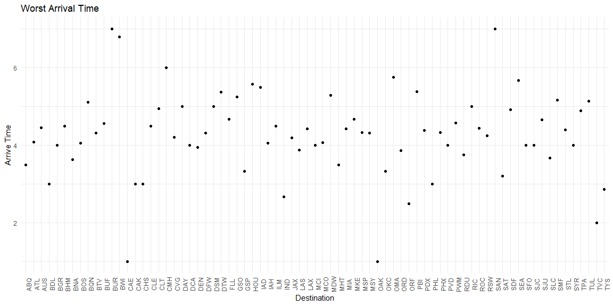

```r
# Use this R-Chunk to import all your datasets!
# Filtered the data to be useable

airport <- nycflights13::airports %>% 
  filter(name != "NA") 

airline <- nycflights13::airlines %>% 
  filter(name != "NA") 

flight <- nycflights13::flights %>% 
  filter(arr_time != "NA") %>% 
  filter(dep_time != "NA") %>% 
  filter(dep_delay != "NA") %>% 
  filter(air_time != "NA") %>% 
  filter(carrier != "NA") %>% 
  filter(origin != "NA") 

View(flight)
```

## Background

You just started your internship at a big firm in New York, and your manager gave you an extensive file of flights that departed JFK, LGA, or EWR in 2013. From this data (nycflights13::flights), which you can obtain in R (install.packages("nycflights13"); library(nycflights13)), your manager wants you to answer the following questions;

1. If I am leaving before noon, which two airlines do you recommend at each airport (JFK, LGA, EWR) that will have the lowest delay time at the 75th percentile?
2. Which origin airport is best to minimize my chances of a late arrival when I am using Delta Airlines?
3. Which destination airport is the worst (you decide on the metric for worst) airport for arrival time?


##### *I made up databending. It does not mean that we make up data or that we alter it. Like airbenders we control our data to answer the questions we need answered. The key to databending is flexibility and finding and following the path of least resistence.*

## Tasks

[X] Address at least two of the three questions in the background description (if you have time try to tackle all three)

* Which destination airport is the worst (you decide on the metric for worst) airport for arrival time?
* Which origin airport is best to minimize my chances of a late arrival when I am using Delta Airlines?

[X] Make sure to include one or more visualization that shows the complexity of the data.


[X] Create one .rmd file that has your report

* [X] Have a section for each question
* [X] Make sure your code is in the report but defaults to hidden
* [X] Write an introduction section that describes your results
* [ ] Make a plot of the data to show the answer to the specific question

[X] Push your .Rmd, .md, and .html to your GitHub repo

[X] Be prepared to discuss your analysis in the upcoming class

[X] Complete the recommended reading on posting issues.

[X] Find two other student’s compiled files in their repository and provide feedback using the issues feature in GitHub (Late due to computer problems)  
(If they already have three issues find a different student to critique)

[ ] Address 1-2 of the issues posted on your project and push the updates to GitHub

## Addressed Questions

### Introduction

My results answer two questions from using the nycflight13 library. I answered "Which destination airport is the worst (you decide on the metric for worst) airport for arrival time," and "Which origin airport is best to minimize my chances of a late arrival when I am using Delta Airlines?" I was able to learn more about using ggplot and other features in tidyverse, such as group_by() and summarise() in this Case Study. 

### Which destination airport is the worst (you decide on the metric for worst) airport for arrival time?


```r
flight %>% 
  filter(arr_time <= 8) %>% 
  group_by(dest) %>% 
  summarise(arr = mean(arr_time)) %>% 
ggplot() +
  geom_point(aes(x = dest, y = arr)) +
  theme_minimal() +
  theme(axis.text.x = element_text(angle = 90)) + 
  labs(title = "Worst Arrival Time", x = "Destination", y = "Arrive Time")
```

<!-- -->

### Which origin airport is best to minimize my chances of a late arrival when I am using Delta Airlines?


```r
flight %>% 
  filter(carrier == "DL") %>%   
  group_by(origin, dest) %>%
  summarise(delayarr = mean(arr_delay), minarr_delay = min(arr_delay), maxarr_delay = max(arr_delay)) %>% 
ggplot() +
  geom_point(aes(x = minarr_delay, y = delayarr)) +
  facet_wrap(~ origin) +
  labs(title = "Origin Airport to Min late Arrival", subtitle = "Delta Airlines", x = "Min Arrival Delay", y = "Average Arrival Delay") +
  theme_minimal()
```

<!-- -->

## Feedback Recieved
