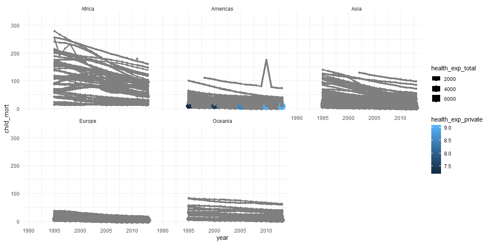
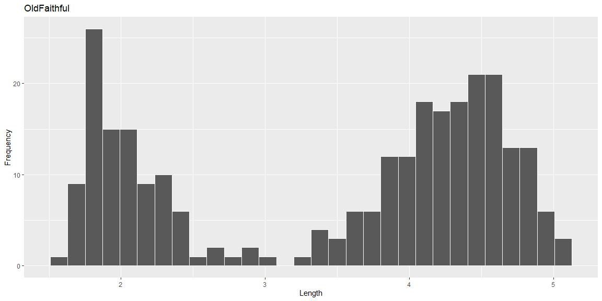
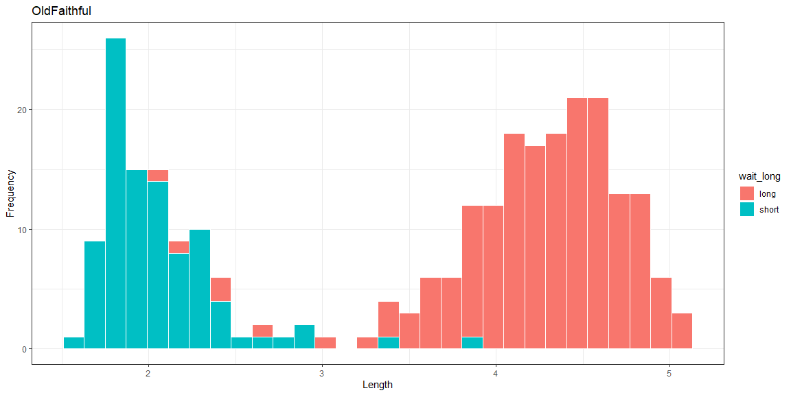

```r
# Use this R-Chunk to import all your datasets!
finance <- ourworldindata::financing_healthcare %>% 
  filter(year > 1825) %>%     
  filter(!is.na(child_mort)) %>%
  filter(!is.na(gdp)) %>%
  select(year, country, continent, child_mort, health_insurance, gdp, health_exp_total, health_exp_public, health_exp_private)

#View(finance)
```

## Background

The Our World in Data website has world data. It is nice that they have provided graphics and then the data that they used to generate the graphics. Once again, we are going to build visualizations in R using their data.

## Reading

* Chapter 7: R for Data Science - Exploratory Data Analysis        
* devtools R Package   

## Tasks

[X] Take notes on your reading of the specified ‘R for Data Science’ chapter in the Rmd

[X] Explore the world data on financing_healthcare and create an interesting graphic that highlights this dataset in relation to child mortality.

* [X] Use devtools::install_github("drsimonj/ourworldindata") to get a larger dataset on financing_healthcare
* [X] Create a graphic that you could use in a final presentation to summarize world child mortality (child_mort column)

[X] Push your .Rmd, .md, and .html to your GitHub repo

## Healthcare (Child Mortality)


```r
ggplot(data = finance, aes(x = year, y = child_mort, by = country, size = health_exp_total)) +
  geom_line(aes(group = country, color = health_exp_public)) +
  geom_point(aes(group = country, color = health_exp_public)) +
  facet_wrap(~continent) + theme_minimal()
```

<!-- -->


```r
ggplot(data = finance, aes(x = year, y = child_mort, by = country, size = health_exp_total)) +
  geom_line(aes(group = country, color = health_exp_private)) +
  geom_point(aes(group = country, color = health_exp_private)) +
  facet_wrap(~continent) + theme_minimal()
```

<!-- -->


## Reading Notes    
### Ch. 7

1. What type of variation occurs within my variables?
2. What type of covariation occurs between my variables?

* A variable is a quantity, quality, or property that you can measure.
* A value is the state of a variable when you measure it. The value of a variable may change from measurement to measurement.
* An observation is a set of measurements made under similar conditions (you usually make all of the measurements in an observation at the same time and on the same object). An observation will contain several values, each associated with a different variable. I’ll sometimes refer to an observation as a data point.
* Tabular data is a set of values, each associated with a variable and an observation. Tabular data is tidy if each value is placed in its own “cell”, each variable in its own column, and each observation in its own row.
* Variation is the tendency of the values of a variable to change from measurement to measurement
* Categorical Variable if it can only take one of a small set of values
* Continuous Variable if it can take any of an infinite set of ordered values
* Covariation is the tendency for the values of two or more variables to vary together in a related way
* A boxplot is a type of visual shorthand for a distribution of values that is popular among statisticians

## Class Notes


```r
faithful %>% ggplot() +   
  geom_histogram(aes(eruptions), color = "white") + 
  labs(x = "Length", y = "Frequency", title = "OldFaithful")
```

<!-- -->


```r
faithful %>%  mutate(
  wait_long = case_when(
  waiting >= 65 ~ "long",
  waiting <= 20 ~ "real short",
  TRUE ~ "short")) %>% 
  ggplot(mapping = aes(fill = wait_long)) +   
  geom_histogram(mapping = aes(eruptions), color = "white") + 
  labs(x = "Length", y = "Frequency", title = "OldFaithful") +
  theme_bw()
```

<!-- -->


```r
# faithful %>%  mutate(
#   wait_long = case_when(
#   waiting >= 65 ~ "long",
#   waiting <= 20 ~ "real short",
#   TRUE ~ "short")) %>% 
#   ggplot(mapping = aes(fill = wait_long)) +   
#   geom_hexbin(mapping = aes(x = eruptions, y = wait_long), color = "white") + 
#   labs(x = "Length", y = "Wait_time", title = "OldFaithful") +
#   theme_bw()
```
