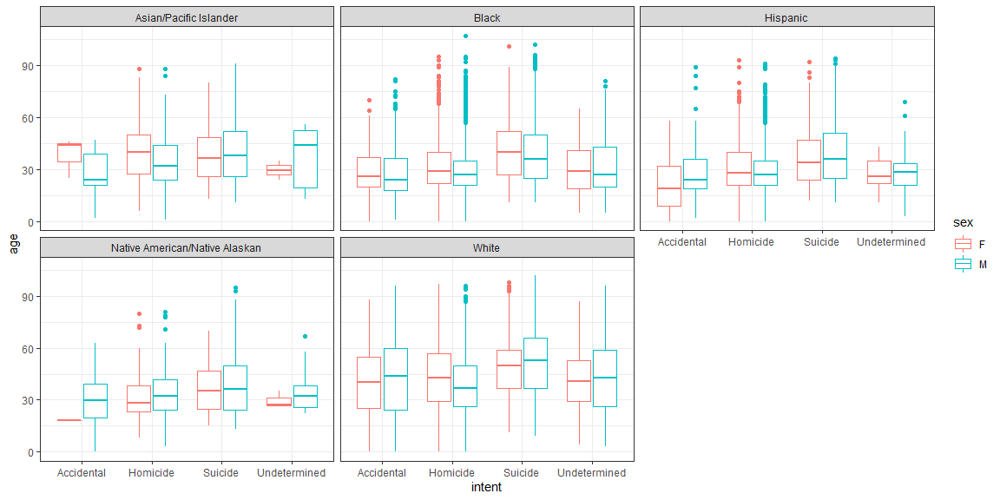
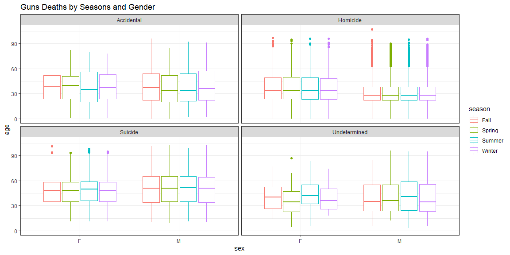
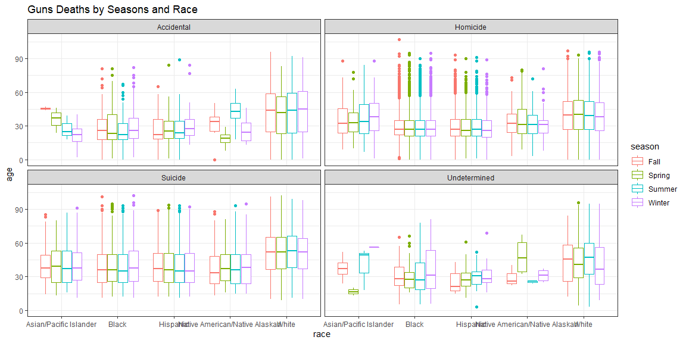
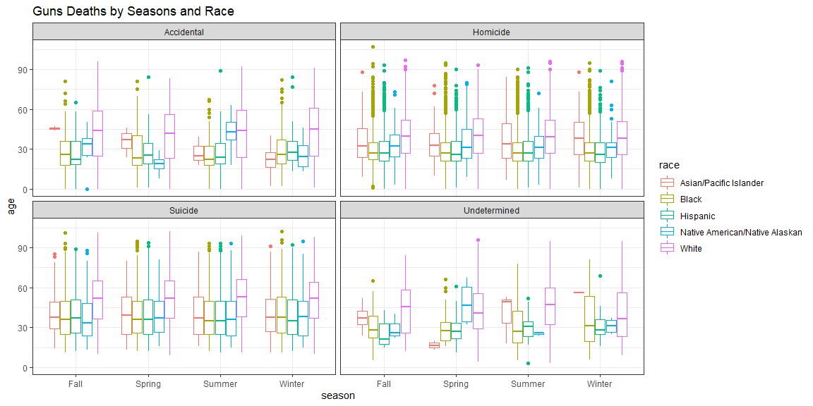
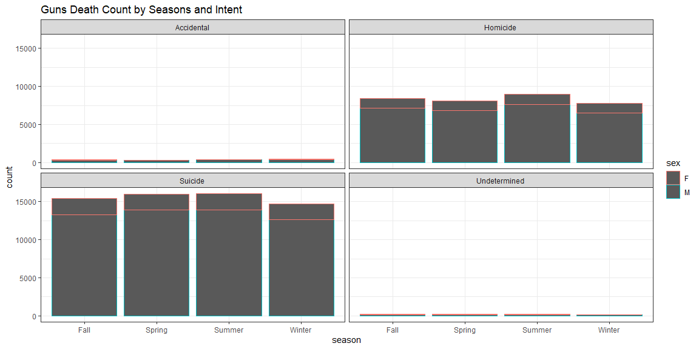
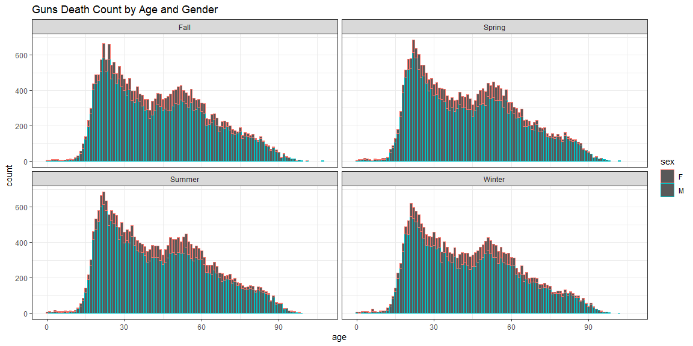
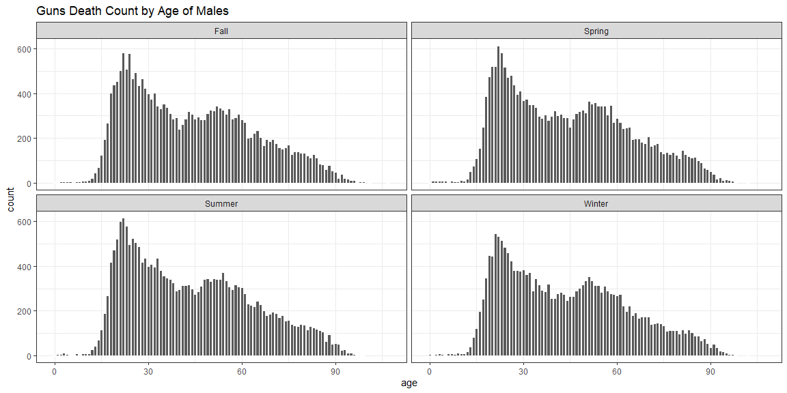
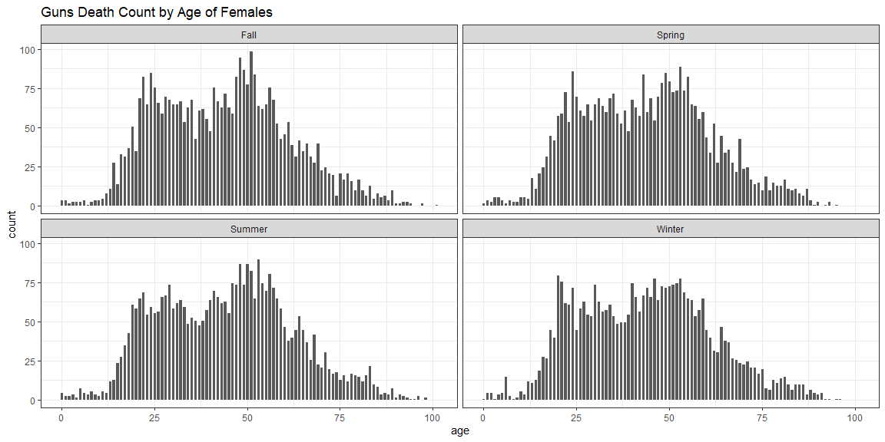
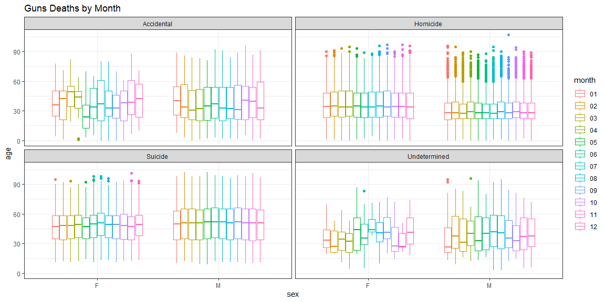

```r
# Use this R-Chunk to import all your datasets!
Guns <- #read_csv(file="Case_Study_04/analysis/full_data.csv") %>% 
  read_csv(file="full_data.csv") %>% 
  filter(!is.na(intent)) %>% na.omit() %>% 
  select(month, intent, police, sex, age, race) 

#View(Guns)

Guns_season <- Guns %>% 
  mutate(
    season = case_when(
      month %in% c("12","01","02") ~ "Winter",
      month %in% c("03","04","05") ~ "Spring",
      month %in% c("06","07","08") ~ "Summer",
      month %in% c("09","10","11") ~ "Fall",
    )
  )

#View(Guns_season)
```

## Background

The world is a dangerous place. During 2015 and 2016 there was a lot of discussion in the news about police shootings. FiveThirtyEight reported on gun deaths in 2016. As leaders in data journalism, they have posted a clean version of this data in their [GitHub](https://fivethirtyeight.com/features/gun-deaths/) repo called full_data.csv for us to use. 

While their visualizations focused on yearly averages, our client wants to create commercials that help reduce the gun deaths in the US. They would like to target the commercials in different seasons of the year (think month variable) to audiences that could have the most impact in reducing gun deaths. Our challenge is to summarize and visualize seasonal trends accros the other variables in these data.

## Tasks    
### Before Class

[X] Provide a brief summary of the FiveThirtyEight article

* [X] Create one plot that provides similar insight to their visualization in the article. It does not have to look like theirs.
* [X] Write a short paragraph summarizing their article

[X] Address the client’s need for emphasis areas of their commercials for different seasons of the year.

* [X] Provide plots that help them know the different potential groups (variables) they could address in different seasons (2-4 visualizations seem necessary)
* [X] Write a short paragraph describing each image

[X] Compile your .md and .html file into your git repository

### During/After Class

[X] Find two other student’s compiled files in their repository and provide feedback using the issues feature in GitHub     
(If they already have three issues find a different student to critique)

[X] Address 1-2 of the issues posted on your project and push the updates to GitHub

## FiveThirtyEight article    


```r
ggplot(data = Guns) +
  geom_boxplot(aes(x = intent, y = age, color = sex)) + 
  facet_wrap(~race) +
  theme_bw() 
```

<!-- -->

The article show the rates of the gun victims based on intent. Their plot is interactive. I created a boxplot, using facet wraps and colors. 

## Client’s Need    

```r
ggplot(data = Guns_season) +
  geom_boxplot(aes(x = sex, y = age, color = season)) + 
  facet_wrap(~intent) +
  labs(title = "Guns Deaths by Seasons and Gender") +
  theme_bw() 
```

<!-- -->


```r
ggplot(data = Guns_season) +
  geom_boxplot(aes(x = race, y = age, color = season)) + 
  facet_wrap(~intent) +
  labs(title = "Guns Deaths by Seasons and Race") +
  theme_bw()
```

<!-- -->


```r
ggplot(data = Guns_season) +
  geom_boxplot(aes(x = season, y = age, color = race)) + 
  facet_wrap(~intent) +
  labs(title = "Guns Deaths by Seasons and Race") +
  theme_bw()
```

<!-- -->


```r
ggplot(data = Guns_season) +
  geom_bar(aes(x = season, color = sex)) + 
  facet_wrap(~intent) +
  labs(title = "Guns Death Count by Seasons and Intent") +
  theme_bw()
```

<!-- -->


```r
ggplot(data = Guns_season) +
  geom_bar(aes(x = age, color = sex)) + 
  facet_wrap(~season) +
  labs(title = "Guns Death Count by Age and Gender") +
  theme_bw()
```

<!-- -->


```r
Guns_season %>% 
  filter(sex == "M") %>% 
ggplot() +
  geom_bar(aes(x = age), color = "white") + 
  facet_wrap(~season) +
  labs(title = "Guns Death Count by Age of Males") +
  theme_bw()
```

<!-- -->


```r
Guns_season %>% 
  filter(sex == "F") %>% 
ggplot() +
  geom_bar(aes(x = age), color = "white") + 
  facet_wrap(~season) +
  labs(title = "Guns Death Count by Age of Females") +
  theme_bw()
```

<!-- -->


```r
ggplot(data = Guns_season) +
  geom_boxplot(aes(x = sex, y = age, color = month)) + 
  facet_wrap(~intent) +
  labs(title = "Guns Deaths by Month") +
  theme_bw() 
```

<!-- -->

I created plot showing the gun deaths based on season. The first is intent compared with age and sex. The second is intent compared with age and race. Plot 3 and 4 are counts of the gun deaths based on different groups. The last is is the same as the first but facet wrapped by month. 
