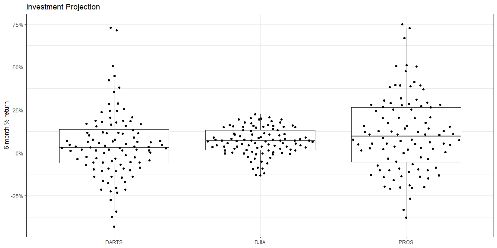

## Background

Data formats are varied and differ by domains and software. We could spend weeks on the different formats and file types that companies and governments use to store their data. We will practice with a few standard formats that are often used for storing data. In the future, you will most likely have to do some research to figure out other formats (but you can do it with R or Python). We have a challenge to read in the five formats of the DOW data and checking that they are all identical using all.equal(). One final note, your R script should do all the work. That is your script should download the files and/or read directly from the web location of the file.

Will be completed in class. 

## Reading

* Chapter 11: R for Data Science - Data Import    
* haven R Package    
* readxl R Package    
* downloader R Package    

## Tasks

[X] Take notes on your reading of the specified ‘R for Data Science’ chapter in the class task folder

[X] Use the appropriate functions in library(readr), library(haven), library(readxl) to read in the five files found on GitHub

* [X] Use read_rds(gzcon(url("WEBLOCATION.rds"))) to download and load the .rds file type
* [X] Use the library(downloader) R package and use the download(mode = "wb") function to download the xlsx data as read_xlsx() cannot read files from the web path
* [X] Use tempfile() function for downloading files

[X] Check that all five files you have imported into R are in fact the same with all.equal()

[X] Use one of the files to make a graphic showing the performance of the Dart, DJIA, and Pro stock selections

* [X] Include a boxplot, the jittered returns, and the average return in your graphic

[X] Save your .R script and your image to your repository and be ready to share your code that built your graphic in class

[X] Schedule a mid-semester 15-minute interview to discuss your progress in the class.

## Working with Libraries   


```r
datards <- read_rds(
  url("https://github.com/byuistats/data/blob/master/Dart_Expert_Dow_6month_anova/Dart_Expert_Dow_6month_anova.RDS?raw=true"
))
```


```r
download("https://raw.githubusercontent.com/byuistats/data/master/Dart_Expert_Dow_6month_anova/Dart_Expert_Dow_6month_anova.csv",mode = "wb", destfile = "task9.csv")
read_csv("task9.csv") #%>% View() 
```

```
## # A tibble: 300 x 3
##    contest_period             variable value
##    <chr>                      <chr>    <dbl>
##  1 January-June1990           PROS      12.7
##  2 February-July1990          PROS      26.4
##  3 March-August1990           PROS       2.5
##  4 April-September1990        PROS     -20  
##  5 May-October1990            PROS     -37.8
##  6 June-November1990          PROS     -33.3
##  7 July-December1990          PROS     -10.2
##  8 August1990-January1991     PROS     -20.3
##  9 September1990-February1991 PROS      38.9
## 10 October1990-March1991      PROS      20.2
## # … with 290 more rows
```


```r
csvdata <- tempfile("tsk9a", fileext = ".csv")
download("https://raw.githubusercontent.com/byuistats/data/master/Dart_Expert_Dow_6month_anova/Dart_Expert_Dow_6month_anova.csv",mode = "wb", destfile = csvdata)
datacsv <- read_csv(csvdata) #%>% View() 
```


```r
dtadata <- tempfile("tsk9b", fileext = ".dta")
download("https://github.com/byuistats/data/blob/master/Dart_Expert_Dow_6month_anova/Dart_Expert_Dow_6month_anova.dta?raw=true",mode = "wb", destfile = dtadata)
datadta <-read_dta(dtadata) #%>% View() 
```


```r
savdata <- tempfile("tsk9c", fileext = ".sav")
download("https://github.com/byuistats/data/raw/master/Dart_Expert_Dow_6month_anova/Dart_Expert_Dow_6month_anova.sav",mode = "wb", destfile = savdata)
datasav <-read_sav(savdata) #%>% View() 
```


```r
dataxls <- read_excel("Dart_Expert_Dow_6month_anova.xlsx")
```


```r
all.equal(datacsv, datadta, check.attributes = FALSE)
```

```
## [1] TRUE
```

```r
all.equal(datacsv, datasav, check.attributes = FALSE)
```

```
## [1] TRUE
```

```r
all.equal(datacsv, dataxls, check.attributes = FALSE)
```

```
## [1] TRUE
```

```r
all.equal(datacsv, datards, check.attributes = FALSE)
```

```
## [1] TRUE
```


```r
mreturns <- datacsv %>% 
  group_by(variable) %>% 
  summarise(mreturn = mean(value), medreturn = median(value))

datacsv %>% 
ggplot(mapping = aes(x = variable, y = value)) + 
  geom_boxplot(outlier.alpha = 0) + 
  geom_quasirandom() + theme_bw() + 
  theme(axis.title.x = element_blank()) +
  scale_x_discrete(labels = c(mreturns$variable, "\nmean=",
                              mreturns$mreturn)) + 
  scale_y_continuous(labels = scales::percent_format(scale = 1)) +
  labs(y = "6 month % return", title = "Investment Projection")
```

<!-- -->


## Reading Notes    
### Ch 11 

* read_csv()
* read_fwf()
* read_log()

read/write_rds()
