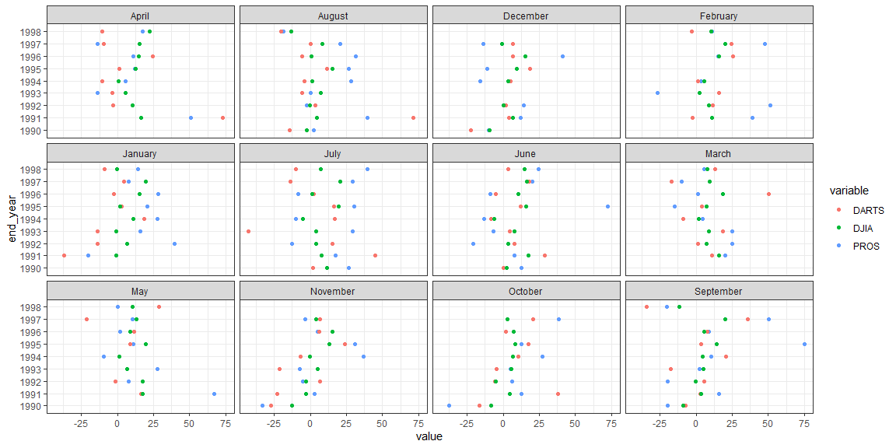
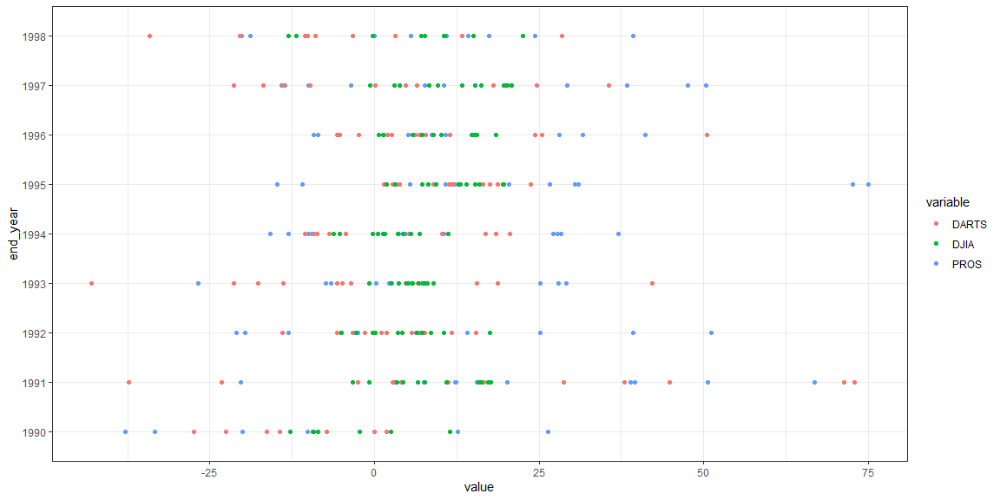
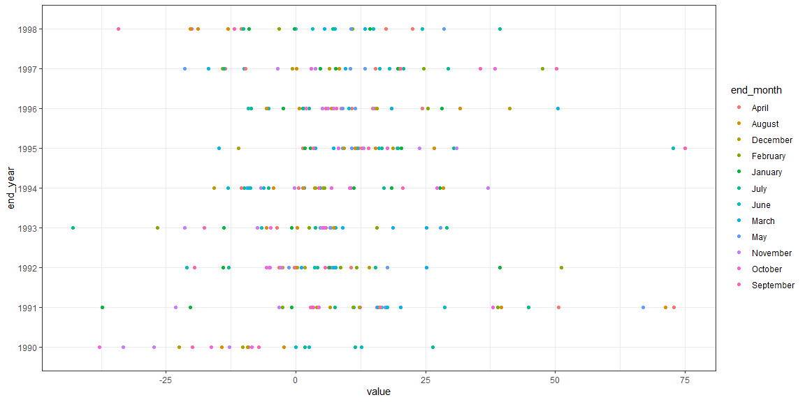

```r
# Use this R-Chunk to import all your datasets!
csvdata <- tempfile("tsk9a", fileext = ".csv")
download("https://raw.githubusercontent.com/byuistats/data/master/Dart_Expert_Dow_6month_anova/Dart_Expert_Dow_6month_anova.csv",mode = "wb", destfile = csvdata)
datacsv <- read_csv(csvdata) #%>% View() 
```

## Background

With stock return data from the previous task, we need to tidy this data for the creation of a time series plot. We want to look at the returns for each six-month period of the year in which the returns were reported. Your plot should highlight the tighter spread of the DJIA as compared to the other two selection methods (DARTS and PROS). We need to display a table of the DJIA returns with months on the rows and years in the columns (i.e. “spread” the data).

## Reading

* Chapter 12: R for Data Science - Tidy Data
* tidy R Package functions
* openxlsx R package

## Tasks

[X] Take notes on your reading of the specified ‘R for Data Science’ chapter in the class task folder

[X] Import the Dart_Expert_Dow_6month_anova data from GitHub (see details in previous task)

[X] The contestant_period column is not “tidy” we want to create a month_end and year_end column from the information it contains

[X] Save your “tidy” data as an .rds object

[X] Create a plot that shows the six-month returns by the year in which the returns are collected

[X] Create a table using code of the DJIA returns that matches the table shown below (“spread” the data)

[X] Include your plots in an .Rmd file with short paragraph describing your plots.     
* Make sure to display the tidyr code in your file

[X] Push your .Rmd, .md, and .html to your GitHub repo

## Reading        
### Ch 12

##### Tidy Data

* Pivot wider and longer
* Separate
* Unite
* Explicitly, i.e. flagged with NA.
* Implicitly, i.e. simply not present in the data.

## Data Wrangling


```r
tidyrds <- datacsv %>% 
  separate(contest_period, into = c("begin", "end"), sep = "-") %>% 
  separate(end, into = c("end_month", "end_year"), sep = -4) %>%  
  select(-"begin") %>% 
  na.omit() 

tidyrds %>% 
  saveRDS(file = "my_tidy_data.rds")
```

`tidyrds <- datacsv %>% 
  separate(contest_period, into = c("begin", "end"), sep = "-") %>% 
  separate(end, into = c("end_month", "end_year"), sep = -4) %>%  
  select(-"begin") %>% 
  na.omit() `

## Data Visualization


```r
tidyrds %>% 
  filter(end_month != "Dec.") %>% 
  filter(end_month != "Febuary") %>% 
  ggplot(aes(x = value, y = end_year, color = variable)) + 
  geom_point() +
  facet_wrap(~end_month) + 
  theme_bw()
```

<!-- -->


```r
tidyrds %>% 
  ggplot(aes(x = value, y = end_year, color = variable)) + 
  geom_point() + 
  theme_bw()
```

<!-- -->


```r
tidyrds %>% 
  filter(end_month != "Dec.") %>% 
  filter(end_month != "Febuary") %>% 
  ggplot(aes(x = value, y = end_year, color = end_month)) + 
  geom_point() + 
  theme_bw()
```

<!-- -->

I plotted 3 different graphs. The first is showing value vs year with respect to variable and month. The second is showing value vs year with respect to just variable. The third is showing value vs year with respect to just month.

## Data Table


```r
tidy <- tidyrds %>% 
  filter(end_month != "Dec.") %>% 
  filter(end_month != "Febuary") %>% 
  pivot_wider(names_from = end_year, values_from = value, values_fill = list(value = 0)) %>%
  select(-variable)

datatable(tidy)
```

<!--html_preserve--><div id="htmlwidget-68e261c5154dac4d00e5" style="width:100%;height:auto;" class="datatables html-widget"></div>
<script type="application/json" data-for="htmlwidget-68e261c5154dac4d00e5">{"x":{"filter":"none","data":[["1","2","3","4","5","6","7","8","9","10","11","12","13","14","15","16","17","18","19","20","21","22","23","24","25","26","27","28","29","30","31","32","33","34","35","36"],["June","July","August","September","October","November","December","January","February","March","April","May","June","July","August","September","October","November","December","January","February","March","April","May","June","July","August","September","October","November","December","January","February","March","April","May"],[12.7,26.4,2.5,-20,-37.8,-33.3,-10.2,0,0,0,0,0,0,1.8,-14.3,-7.2,-16.3,-27.4,-22.5,0,0,0,0,0,2.5,11.5,-2.3,-9.2,-8.5,-12.8,-9.3,0,0,0,0,0],[7.5,17.5,39.6,15.6,12.4,3,12.3,-20.3,38.9,20.2,50.6,66.9,28.7,44.8,71.3,2.8,38,-23.2,4.1,-37.3,-2.5,11.2,72.9,16.6,17.7,7.6,4.4,3.4,4.4,-3.3,6.6,-0.8,11,15.8,16.2,17.3],[-21,-13,-2.5,-19.6,6.3,-5.1,14.1,39.3,51.2,25.2,-3.3,7.7,7.7,15.4,3.6,5.7,-5.7,6.9,1.8,-14,11.7,1.1,-3.1,-1.4,3.6,4.2,-0.3,-0.1,-5,-2.8,0.2,6.5,8.6,7.2,10.6,17.6],[-6.6,29.1,0.3,2.6,5,-7.4,0,15.6,-26.7,25.2,-13.9,27.9,4.7,-43,-5.6,-17.7,-4.9,-21.4,0,-13.9,15.6,18.7,-3.6,6.6,7.7,3.7,7.3,5.2,5.7,4.9,0,-0.8,2.5,9,5.8,6.7],[-13.1,-10,28.4,10.6,27.2,37,-15.8,27.8,3.7,4.7,5.4,-9.5,-8.7,16.9,-4.3,20.6,10.3,-6.8,5.3,18.5,1.5,-9.2,-10.5,1.4,-6.2,-5.3,1.5,4.4,6.9,-0.3,3.6,11.2,5.5,1.6,0.5,1.3],[72.7,30.5,26.7,75,12.6,31,-11,20.4,0,-14.8,12.1,10.8,11.8,16.5,11.4,3.3,17.6,23.8,18.7,2.8,0,3.8,1.4,9,16,19.6,15.3,14,8.2,13.1,9.3,1.8,0,7.3,12.8,19.5],[-9.2,-8.6,31.7,8.7,7,5.1,41.2,28.1,15.1,1.5,10.8,2,-5.3,2.6,-5.7,7.8,2,6.2,6.9,-2.4,25.4,50.5,24.4,11.5,10.2,1.3,0.6,5.8,7.2,15.1,15.5,15,15.6,18.4,14.8,9],[20.2,29.3,20.7,50.3,38.4,-3.5,-14.1,7.7,47.6,-10,-13.6,10.5,18,-13.9,0.1,35.6,20.7,6.5,6.5,4.7,24.6,-16.9,-9.7,-21.4,16.2,20.8,8.3,20.2,3,3.8,-0.7,19.6,20.1,9.6,15.3,13.3],[24.4,39.3,-18.8,-20.1,0,0,0,14.3,10.9,5.5,17.4,0,3.2,-10.1,-20.4,-34.2,0,0,0,-9,-3.3,13.3,-10.5,28.5,15,7.1,-13.1,-11.8,0,0,0,-0.3,10.7,7.6,22.5,10.6]],"container":"<table class=\"display\">\n  <thead>\n    <tr>\n      <th> <\/th>\n      <th>end_month<\/th>\n      <th>1990<\/th>\n      <th>1991<\/th>\n      <th>1992<\/th>\n      <th>1993<\/th>\n      <th>1994<\/th>\n      <th>1995<\/th>\n      <th>1996<\/th>\n      <th>1997<\/th>\n      <th>1998<\/th>\n    <\/tr>\n  <\/thead>\n<\/table>","options":{"columnDefs":[{"className":"dt-right","targets":[2,3,4,5,6,7,8,9,10]},{"orderable":false,"targets":0}],"order":[],"autoWidth":false,"orderClasses":false}},"evals":[],"jsHooks":[]}</script><!--/html_preserve-->

```r
tidy %>% 
  saveRDS(file = "my_data.rds")
```
