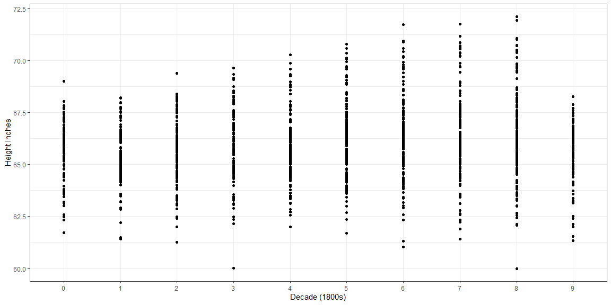
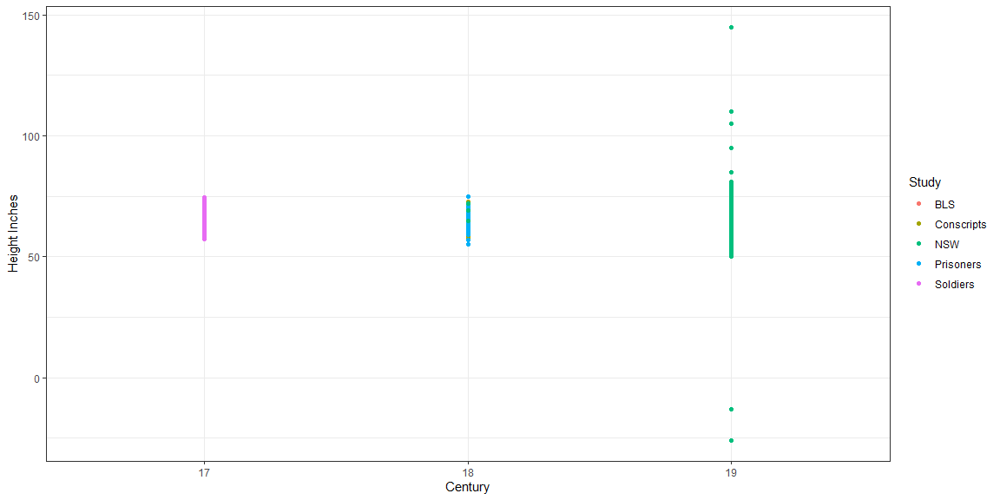

```r
# Use this R-Chunk to import all your datasets!
data <- tempfile("cs5excel", fileext = ".xlsx")
download("https://byuistats.github.io/M335/data/heights/Height.xlsx?raw=true",mode = "wb", destfile = data)
Height <- read_xlsx(data, skip = 2)
germanconscr <- read_dta(url("https://byuistats.github.io/M335/data/heights/germanconscr.dta"))  
germanprison <- read_dta(url("https://byuistats.github.io/M335/data/heights/germanprison.dta")) 
database <- read.dbf("B6090.DBF")
heights <- read_csv(url("https://github.com/hadley/r4ds/raw/master/data/heights.csv")) 
National <-read_sav(url("http://www.ssc.wisc.edu/nsfh/wave3/NSFH3%20Apr%202005%20release/main05022005.sav")) 
```

## Background

The Scientific American argues that humans have been getting taller over the years. As the data scientists that we are becoming, we would like to find data that validates this concept. Our challenge is to show different male heights across the centuries.

This project is not as severe as the two quotes below, but it will give you a taste of pulling various data and file formats together into “tidy” data for visualization and analysis. You will not need to search for data as all the files are listed here

1.“Classroom data are like teddy bears and real data are like a grizzly bear with salmon blood dripping out its mouth.” - Jenny Bryan    
2. “Up to 80% of data analysis is spent on the process of cleaning and preparing data” - Hadley Wickham

## Reading

[X] foreign R Package and read.dbf()'

## Tasks    
### Before Class

[X] Use the correct functions from library(haven) , library(readr), and library(readxl) to load the 6 data sets listed [here](https://byuistats.github.io/M335/maleheight.html)

[X] Tidy the Worldwide estimates .xlsx file

* [X] Make sure the file is in long format with year as a column. See [here](https://byuistats.github.io/M335/maleheight_tidy.html) for an example of the final format.
* [X] Use the separate() and mutate() functions to create a decade column.

[X] Import the other five datasets into R and combine them into one tidy dataset.

* [X] This dataset should have the following columns - birth_year, height.cm, height.in, and study_id
* [X] The BLS wage data does not have birth information. Let’s assume it is mid-twentieth century and use 1950.
* [X] See the reading of Task 9 for how to read in dbf files.

[X] Save the two tidy datasets to your repository - The world country estimates and the row-combined individual measurements.

[X] Make a plot with decade on the x-axis and height in inches on the y-axis with the points from Germany highlighted based on the data from the .xlsx file.

[ ] Make a small-multiples plot of the five studies to examine the question of height distribution across centuries

[X] Create an .Rmd file with 1-2 paragraphs summarizing your graphics and how those graphics answer the driving question

[X] Compile your .md and .html file into your git repository

### During/After Class

[X] Find two other student’s compiled files in their repository and provide feedback using the issues feature in GitHub (If they already have three issues find a different student to critique)

[X] Address 1-2 of the issues posted on your project and push the updates to GitHub

## Data Wrangling


```r
tidyHeight <- Height %>% 
  gather(`1800`:`2011`, key = "years", value = "heights", na.rm = TRUE) %>%
  mutate(height.cm = heights) %>% 
  mutate(year_decade = years) %>% 
  mutate(height.in = heights/2.54) %>% 
  select(-heights) %>% 
  separate(years, into = c("century", "decade", "year"), sep = c(-2, -1)) 

tidyHeight %>% 
  saveRDS(file = "height_excel.rds")
```


```r
national <- National %>% 
  select(DOBY, RT216F, RT216I) %>% 
  mutate(birth_year = as.numeric(1900 + DOBY)) %>% 
  mutate(height.in = (RT216F * 12) + RT216I) %>% 
  mutate(height.cm = ((RT216F * 12) + RT216I)/0.393701) %>% 
  mutate(study_id = "NSW") %>% 
  select(birth_year, height.in, height.cm, study_id)

height <- heights %>% 
  mutate(height.in = height) %>% 
  mutate(height.cm = height/0.393701) %>% 
  mutate(birth_year = as.numeric("1950")) %>% 
  mutate(study_id = "BLS") %>% 
  select(birth_year, height.in, height.cm, study_id)  

base_data <- database %>% 
  mutate(height.in = CMETER/2.54) %>% 
  mutate(height.cm = CMETER) %>% 
  mutate(birth_year = as.numeric(GEBJ)) %>% 
  mutate(study_id = "Soldiers") %>% 
  select(birth_year, height.in, height.cm, study_id)

prison <- germanprison %>% 
  mutate(height.in = height/2.54) %>% 
  mutate(height.cm = height) %>% 
  mutate(birth_year = as.numeric(bdec)) %>% 
  mutate(study_id = "Prisoners") %>% 
  select(birth_year, height.in, height.cm, study_id)

conscr <- germanconscr %>% 
  mutate(height.in = height/2.54) %>% 
  mutate(height.cm = height) %>% 
  mutate(birth_year = as.numeric(bdec)) %>% 
  mutate(study_id = "Conscripts") %>% 
  select(birth_year, height.in, height.cm, study_id)
```


```r
all_dataset <- bind_rows(conscr, prison, base_data, height, national) %>% 
  separate(birth_year, into = c("century", "decade", "year"), sep = c(-2, -1), remove = FALSE) %>% 
  filter(!is.na(century))

all_dataset %>% 
  saveRDS(file = "datasets.rds")
```

## Data Visualization


```r
tidyHeight %>% 
  ggplot(aes(x = decade, y = height.in)) +
  geom_point() +
  labs(x = "Decade (1800s)", y = "Height Inches") +
  theme_bw()
```

<!-- -->


```r
all_dataset %>% 
  ggplot(aes(x = century, y = height.in, color = study_id)) +
  geom_point() +
  labs(x = "Century", y = "Height Inches", color = "Study") +
  theme_bw()
```

<!-- -->

