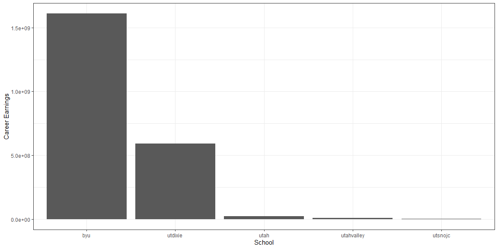
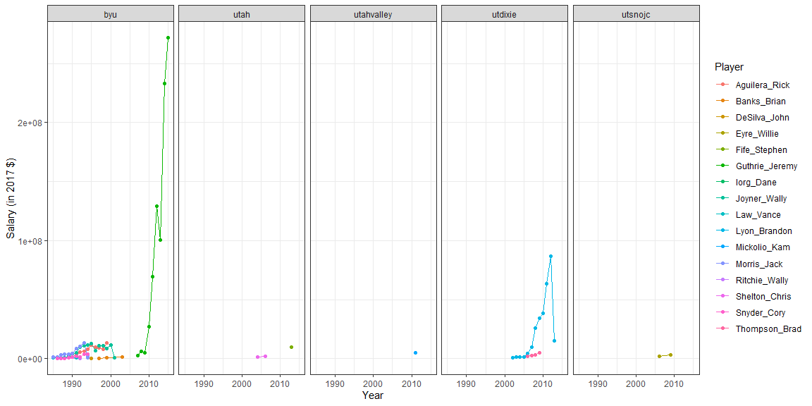

```r
# Use this R-Chunk to import all your datasets!
dat <- blscrapeR::inflation_adjust(2017) %>% 
  mutate(yearID = as.numeric(year)) %>% 
  select(-year)
playerdat <- People %>% 
  unite(name, nameLast, nameFirst, sep = "_") %>% 
  select(playerID, name)
salarydat <- Salaries %>% 
  mutate(base_year = "2017") %>% 
  select(yearID, playerID, salary, base_year)
collegedat <- Schools %>% 
  select(-country)
playingdat <- CollegePlaying %>%
  select(-yearID)
```


```r
View(dat)
View(playerdat)  
View(salarydat) 
View(collegedat)
View(playingdat)
```

## Background

Over the campfire, you and a friend get into a debate about which college in Utah has had the best MLB success. As an avid BYU fan, you want to prove your point, and you go to data to settle the debate. You need a clear visualization that depicts the performance of BYU players compared to other Utah college players that have played in the major leagues. The library(Lahman) package has a comprehensive set of baseball data. It is great for testing out our relational data skills. We will also need a function to inflation adjust the player salaries - library(blscrapeR). See this guide for an example.

## Reading

* Chapter 13: R for Data Science - Relational Data

## Tasks

[X] Take notes on your reading of the specified ‘R for Data Science’ chapter in the README.md or in a ‘.R’ script in the class task folder

[X] Install the library(Lahman) and examine the available data sets available

* [X] Find the 4-5 different data sets that you will need to show full college and player names as well as their annual earnings

[X] Install the library(blscrapeR) and use the inflation_adjust(2017) function to get all earnings in 2017 dollars

[X] Make a plot showing how professional baseball player earnings that played baseball at BYU compared to the players from other Utah schools

[X] Save your .R script and image to your repository and be ready to share your code and image at the beginning of class

## Data Wrangling    
### Joining     


```r
playersal <- left_join(playerdat, salarydat) %>% 
  select(-base_year)
collegeplaying <- left_join(collegedat, playingdat)
college <- left_join(playersal, collegeplaying, by = "playerID")  
masterdat <- left_join(college, dat, by = "yearID") %>%
  na.omit() %>% 
  filter(state == "UT") %>% 
  filter(!schoolID %in% c("eutah", "utslxxo", "sutah")) %>% 
  mutate(increase = as.numeric(pct_increase/100)) %>% 
  mutate(salary2017 = (-1 * (salary / increase)) + 1) 
baseball <- masterdat %>% 
  select(playerID, name, yearID, name_full, schoolID, salary2017) %>% 
  group_by(playerID, name, name_full, schoolID) %>% 
  summarize(career_earnings = sum(salary2017)) %>% 
  distinct()
```


```r
View(playersal)
View(collegeplaying)
View(college)
View(masterdat)
View(baseball)
```

## Data Visualization


```r
ggplot(data = baseball, aes(x = fct_reorder(schoolID, career_earnings, .fun = max, .desc = TRUE), y = career_earnings)) + 
  geom_col() +
  labs(x = "School", y = "Career Earnings") +
  theme_bw()
```

<!-- -->

```r
ggplot(data = masterdat, aes(x = yearID, y = salary2017, color = name)) +
  facet_wrap(~schoolID, nrow = 1) +
  geom_line() + geom_point() + 
  labs(x = "Year", y = "Salary (in 2017 $)", color = "Player") + 
  theme_bw()
```

<!-- -->

## Reading Notes    
### Ch 13

* Mutating joins, which add new variables to one data frame from matching observations in another
* Filtering joins, which filter observations from one data frame based on whether or not they match an observation in the other table
* Set operations, which treat observations as if they were set elements

* A primary key uniquely identifies an observation in its own table
* A foreign key uniquely identifies an observation in another table

* The simplest type of join is the inner join. An inner join matches pairs of observations whenever their keys are equal: (To be precise, this is an inner equijoin because the keys are matched using the equality operator. Since most joins are equijoins we usually drop that specification.)
* An outer join keeps observations that appear in at least one of the tables
* A left join keeps all observations in x
* A right join keeps all observations in y
* A full join keeps all observations in x and y
* A natural join uses all variables that appear in both tables

* semi_join(x, y) keeps all observations in x that have a match in y
* anti_join(x, y) drops all observations in x that have a match in y

* intersect(x, y): return only observations in both x and y
* union(x, y): return unique observations in x and y
* setdiff(x, y): return observations in x, but not in y
