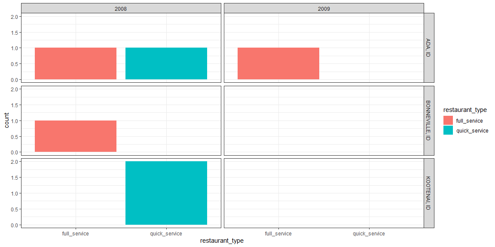
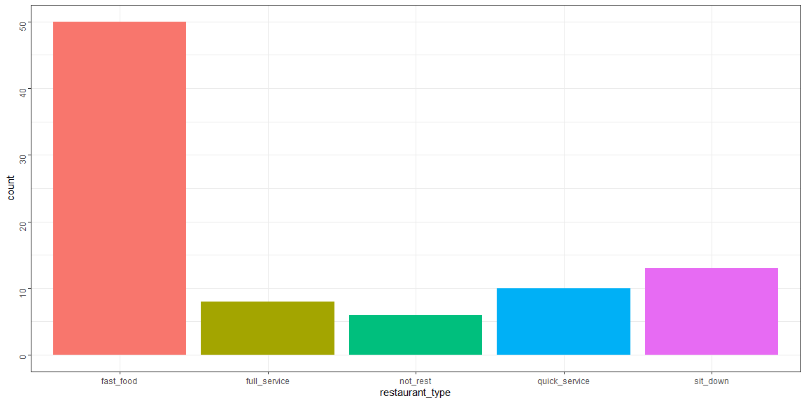
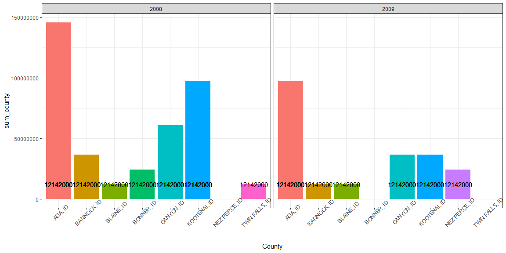
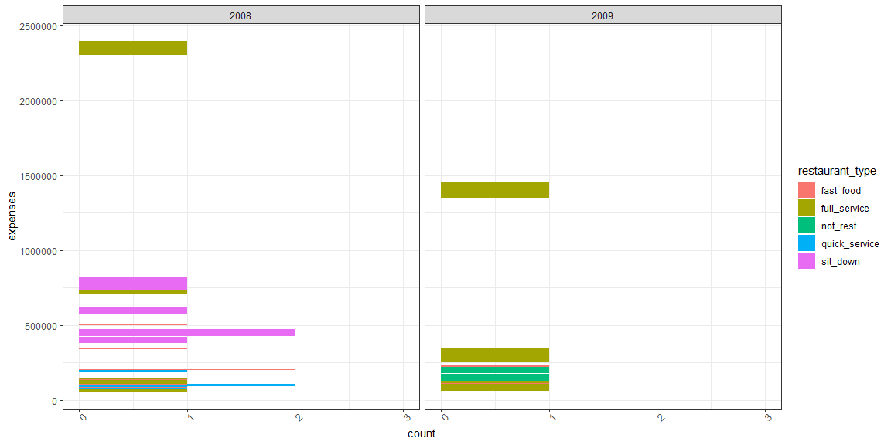

```r
# Use this R-Chunk to import all your datasets!
climate <- climate_zone_fips
builds <- buildings0809
climatebuild <- left_join(builds, climate)
not_restaurants <- c("development","Food preperation center", "Food Services center","bakery","Grocery","conceession","Cafeteria", "lunchroom","school","facility"," hall ")
standalone_retail <- c("Wine","Spirits","Liquor","Convenience","drugstore","Flying J", "Rite Aid ","walgreens ","Love's Travel ")
full_service_type <- c("Ristorante","mexican","pizza ","steakhouse"," grill ","buffet","tavern"," bar ","waffle","italian","steak house")
quick_service_type <- c("coffee"," java "," Donut ","Doughnut"," burger ","Ice Cream ","custard ","sandwich ","fast food "," bagel ")
quick_service_names <- restaurants$Restaurant[restaurants$Type %in% c("coffee","Ice Cream","Fast Food")]
full_service_names <- restaurants$Restaurant[restaurants$Type %in% c("Pizza","Casual Dining","Fast Casual")]
## After the above assignments the below rules need to be implemented
# Over 4,000 ADD and NEW construction get assigned to Sit Down Restaurants
# Under 4,000 sqft NEW construction get assigned to Fast Food
# all Type == "Food/Beverage Service" that don't get grouped based on the above are called "Unknown"
```


```r
View(climate)
View(builds)
View(climatebuild)
```

## Background

It is 2010, and you are working for the Idaho restaurant commission, and they need your help getting a clearer picture of how restaurant construction changed across Idaho from 2008 to 2009. They provided you a dataset of all commercial construction in Idaho for those two years. The data has a variable Type with a general category called Food_Beverage_Service that has other buildings besides restaurants in the category. You will need to use the restaurant names (see restaurants data object) and some additional key words to create the correct subgroupings. Your client expects to provide new data for 2010 and 2011 so your script needs to do the work. Make sure you do not use Excel to manipulate anything.

1. How did full-service restaurant construction compare to quick service restaurant construction across county and years?
2. How did restaurant construction fare compare to the other commercial construction in Idaho?
3. Which county in Idaho spent the most on fast food construction each year?
4. In that county how did other commercial construction compare?

## Tasks
### Before Class

[X] Load the R package from GitHub devtools::install_github("hathawayj/buildings") and find out what data is in the package

[X] Construction value is related to population in the area. Join the climate_zone_fips data to the buildings0809 data using the two FIPS columns for state and county.

[X] After filtering to Food_Beverage_Service group of buildings in the Type variable, use the ProjectTitle column to create new subgroups from the groupings in the code section below and the restaurant names in restaurants.

* [X] Restaurants that are not assigned using the names and keywords that are over 4000 square feet should be grouped into Full Service Restaurants and be in Quick Service Restaurants if they are under 4000 square feet and new construction.

[X] Make sure your text strings your are matching on are as standardized as possible

* [X] Leverage functions like str_to_lower() and str_trim() to get all the words in a standardized form
* [X] You could use the case_when() function to create the subgroups.

[X] Create an .Rmd file with 2-3 paragraphs summarizing your 3-4 graphics that inform the client questions

[X] Compile your .md and .html file into your git repository

### After Class

[ ] Find two other student’s compiled files in their repository and provide feedback using the issues feature in GitHub (If they already have three issues find a different student to critique)

[ ] Address 1-2 of the issues posted on your project and push the updates to GitHub

## Data Wrangling

String Manipulation


```r
not_restaurants <- not_restaurants %>% 
  str_to_lower() %>% 
  str_trim() %>% 
  unlist() %>% 
  str_flatten(collapse = "|")

standalone_retail <- standalone_retail %>% 
  str_to_lower() %>% 
  str_trim() %>% 
  unlist() %>% 
  str_flatten(collapse = "|")

full_service_type <- full_service_type %>% 
  str_to_lower() %>% 
  str_trim() %>% 
  unlist() %>% 
  str_flatten(collapse = "|")

quick_service_type <- quick_service_type %>% 
  str_to_lower() %>% 
  str_trim() %>% 
  unlist() %>% 
  str_flatten(collapse = "|")

climatebuild$ProjectTitle <- climatebuild$ProjectTitle %>% 
  str_to_lower() 
```

Tidying data


```r
# Use this R-Chunk to clean & wrangle your data!
climatebuild <- climatebuild %>% 
  filter(Type == "Food_Beverage_Service") %>% 
  mutate(restaurant_type = case_when(
    str_detect(ProjectTitle, not_restaurants) == TRUE ~ "not_rest",
    str_detect(ProjectTitle, standalone_retail) == TRUE ~ "stand_retail",
    str_detect(ProjectTitle, full_service_type) == TRUE ~ "full_service",
    str_detect(ProjectTitle, quick_service_type) == TRUE ~ "quick_service", 
    SqFt >= 4000 ~ "sit_down", 
    SqFt < 4000 & SqFt != 4000 ~ "fast_food",
    TRUE ~ "Unknown")) %>% 
  unique()
```


```r
View(climatebuild)
```

## Data Visualization

1. How did full-service restaurant construction compare to quick service restaurant construction across county and years?


```r
# Use this R-Chunk to plot & visualize your data!
climatebuild %>%
  filter(SqFt != 0, restaurant_type %in% c("full_service", "quick_service")) %>% 
ggplot(aes(x = restaurant_type)) +
  geom_bar(aes(fill = restaurant_type)) +
  facet_grid(County ~ Year) +
  theme_bw()
```

<!-- -->

2. How did restaurant construction fare compare to the other commercial construction in Idaho?


```r
climatebuildsqft <- climatebuild %>% 
  filter(SqFt > 0)

climatebuild %>%     
ggplot(aes(x = restaurant_type)) + geom_bar(aes(fill = restaurant_type)) + 
  geom_bar(data = climatebuildsqft, aes(x = restaurant_type, fill = restaurant_type)) + 
  theme_bw() +
  theme(axis.text.y = element_text(angle = 90), legend.position = "none")
```

<!-- -->

3. Which county in Idaho spent the most on fast food construction each year?


```r
climatebuild %>%  
  filter(restaurant_type == "fast_food") %>% 
  mutate(expenses = Value1000*1000) %>%
  mutate(sum_county = sum(expenses)) %>%
ggplot(aes(x = County, y = sum_county)) + 
  geom_col(aes(fill = County)) +
  theme_bw() + 
  facet_wrap(~Year) +
  geom_text(aes(label = format(sum_county, scientific = FALSE))) +
  scale_y_continuous(labels = function(sum_county) format(sum_county, scientific = FALSE)) + 
  theme(axis.text.x = element_text(angle = 45), legend.position = "none")
```

<!-- -->

4. In that county how did other commercial construction compare?


```r
climatebuild %>%  
  filter(County == "ADA, ID") %>% 
  mutate(expenses = Value1000*1000) %>%
ggplot(aes(x = expenses)) + 
  geom_bar(aes(fill = restaurant_type)) +
  theme_bw() + 
  coord_flip() + 
  facet_grid(~ Year) + 
  scale_x_continuous(labels = function(sum_county) format(sum_county, scientific = FALSE)) + 
  theme(axis.text.x = element_text(angle = 45))
```

<!-- -->

## Conclusions

1. How did full-service restaurant construction compare to quick service restaurant construction across county and years?

The quick service restaurant were constructed more then the full service restaurants. 

2. How did restaurant construction fare compare to the other commercial construction in Idaho?

The most built restaurant type was fast food compared to any other type.  

3. Which county in Idaho spent the most on fast food construction each year?

The County with the heightest constuction of fast food was ADA, ID.

4. In that county how did other commercial construction compare?

In ADA, ID county the most constucted was sit down or full service comparedto the other types. 
