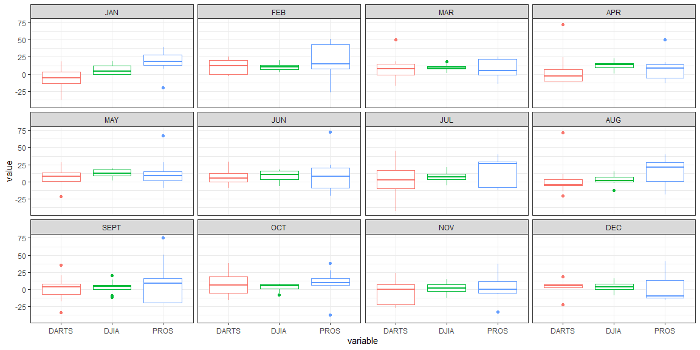

```r
# Use this R-Chunk to import all your datasets!
tidy <- readRDS("../../Case_Study_05/Class_Task_10/my_tidy_data.rds")
dat_month <- tibble(end_month = month.name, month_number = 1:12)
tidy <- tidy %>% 
  left_join(dat_month) %>% 
  arrange(month_number)
```

## Background

When we are visualizing data with categorical variables, we have to deal with character strings as groupings. The problem with summarizing categorical data in a table or a plot is how to order the groups. Using the concept of Factors allows us to dictate the order of these groupings for presentation. We will revisit the stock data from a previous task to create a table and a plot that has the months correctly labeled and ordered.

## Reading

* Chapter 15: R for Data Science - Factors
* forcats R package

## Tasks

[X ] Take notes on your reading of the specified ‘R for Data Science’ chapter 

[X] Load your “tidy” data from task 10 using the stock return data

[X] Create a plot that shows the six-month returns by the month in which the returns are collected using the eight years of data

[X] Include your plots in an .Rmd file with short paragraph describing your plots. Make sure to display the tidyr code in your file

[X] Push your .Rmd, .md, and .html to your GitHub repo

## Data Wrangling

`tidyrds <- datacsv %>% 
  separate(contest_period, into = c("begin", "end"), sep = "-") %>% 
  separate(end, into = c("end_month", "end_year"), sep = -4) %>% 
  select(-"begin") %>% 
  na.omit() `

## Data Visualization


```r
month <- c(`1` = "JAN", `2` = "FEB", `3` = "MAR", `4` = "APR", `5` = "MAY", `6` = "JUN", `7` = "JUL", `8` = "AUG", `9` = "SEPT", `10` = "OCT", `11` = "NOV", `12` = "DEC" )

tidy %>% 
  filter(end_month != "Dec.") %>% 
  filter(end_month != "Febuary") %>% 
  ggplot(aes(x = variable, y = value, color = variable, order = month_number)) + 
  geom_boxplot() + 
  facet_wrap(~month_number, labeller = labeller(month_number = month)) +
  theme_bw() +
  theme(legend.position = "none")
```

<!-- -->

I plotted a graph showing variable vs value with respect to just month. I had to change order of months then use labeller to relabel my months. 

## Reading Notes
### Chapter 15

f, the factor whose levels you want to modify.
x, a numeric vector that you want to use to reorder the levels.
Optionally, fun, a function that’s used if there are multiple values of x for each value of f. The default value is median.

Change Order 
