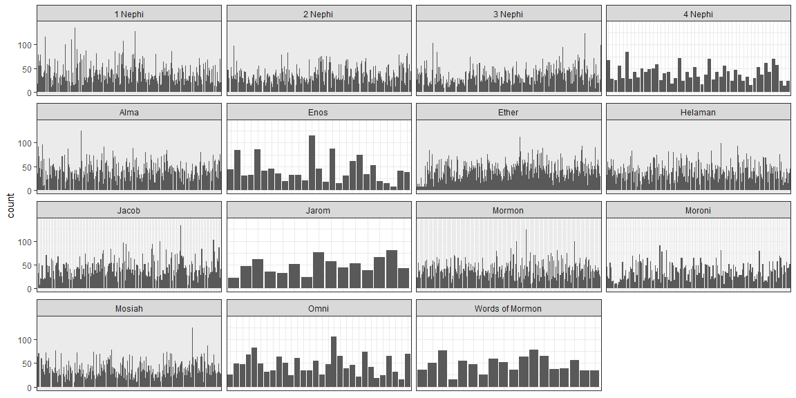

```r
# Use this R-Chunk to import all your datasets!
script <- read.csv("../../data/lds-scriptures.csv")
```

## Background

In 1978 Susan Easton Black penned an article in the Ensign title Even statistically, he is the dominant figure of the Book of Mormon. which makes some statistical claims about the Book of Mormon. We are going to use some of our “string” skills to count words and occurrences in the New Testament and in the Book of Mormon.

1. What is the average verse length (number of words) in the New Testament compared to the Book of Mormon?
2. How often is the word Jesus in the New Testament compared to the Book of Mormon?
3. How does the word count distribution by verse look for each book in the Book of Mormon?

## Reading 

* Chapter 21: Iteration (21.1-21.5 is all you will need)  
* Hadley Wickham - Cupcakes to teach for loops
* stringi R package and the stri_stats_latex() function

## Tasks

[X] Take notes on your reading of the specified ‘R for Data Science’ chapter 

[X] Download the data from http://scriptures.nephi.org/downloads/lds-scriptures.csv.zip

[X] Read in the .csv file that was in the zip file and examine the structure of the data

[X] Address questions 1 & 2 using R functions from install.packages("stringr") and install.packages("stringi")

* [X] Use the stri_stats_latex() and str_locate_all() functions from each package

[X] Create a visualization that addresses question 3

[X] Create an .Rmd file with 1-2 paragraphs and your graphics that answers the three questions

[X] Compile your .Rmd, .md and .html file into your git repository

## Data Wrangling & Visualization

<!-- 1. What is the average verse length (number of words) in the New Testament compared to the Book of Mormon? -->


```r
# Use this R-Chunk to clean & wrangle your data!
q1a <- script %>% 
  filter(volume_id == 2) %>% 
  pull(scripture_text) %>% # Pull selects column
  stri_stats_latex() %>% 
  enframe() %>% # Makes a Tibble
  filter(name == "Words") %>% 
  pull(value)

q1b <- script %>% 
  filter(volume_id == 3) %>% 
  pull(scripture_text) %>% 
  stri_stats_latex() %>% 
  enframe() %>% 
  filter(name == "Words") %>% 
  pull(value)

q1 <- c("New Testament", q1a / (31102 - 23146), "Book of Mormon", q1b / (37706 - 31102))

q1
```

```
## [1] "New Testament"    "22.7080191050779" "Book of Mormon"   "40.5086311326469"
```

<!-- 2. How often is the word Jesus in the New Testament compared to the Book of Mormon? -->


```r
# Use this R-Chunk to clean & wrangle your data!
q2a <- script %>% 
  filter(volume_id == 2) %>% 
  pull(scripture_text) %>% # Pull selects column
  str_locate_all("Jesus") %>%
  stri_stats_latex() %>% 
  enframe() %>% # Makes a Tibble
  filter(name == "Words") %>%
  pull(value)

q2b <- script %>% 
  filter(volume_id == 3) %>% 
  pull(scripture_text) %>% 
  str_locate_all("Jesus") %>%
  stri_stats_latex() %>% 
  enframe() %>%
  filter(name == "Words") %>%
  pull(value)

q2 <- c("New Testament", q2a, "Book of Mormon", q2b)

q2
```

```
## [1] "New Testament"  "7957"           "Book of Mormon" "6604"
```

<!-- 3. How does the word count distribution by verse look for each book in the Book of Mormon? -->


```r
# Use this R-Chunk to clean & wrangle your data!
script %>% 
  filter(volume_id == 3) %>% 
  group_by(scripture_text) %>% 
  mutate(count = stri_stats_latex(scripture_text)["Words"]) %>% 
ggplot(aes(x = verse_short_title, y = count)) + 
  geom_col() + 
  facet_wrap(~ book_title, scales = "free_x") + 
  theme_bw() +
  theme(axis.title.x = element_blank(), axis.text.x = element_blank(), axis.ticks.x = element_blank())
```

<!-- -->

### Conclusions

For Question 1 and 2 I used `str_locate_all("Jesus")` and `stri_stats_latex()` to find the word average per verse and the number of occurrences of Jesus in the Book of Mormon and New Testament. 

For Question 3 I used `stri_stats_latex(scripture_text)["Words"]` to find the word count then plotted    `ggplot(aes(x = verse_short_title, y = count)) + geom_col() + facet_wrap(~ book_title, scales = "free_x") + theme_bw() + theme(axis.title.x = element_blank(), axis.text.x = element_blank(), axis.ticks.x = element_blank())` which allowed me compare the distribution of the verse word count. 

## Reading Notes    
### Chapter 21

To solve this with a for loop we again think about the three components:

1. Output: we already have the output — it’s the same as the input!
2. Sequence: we can think about a data frame as a list of columns, so we can iterate over each column with seq_along(df).
3. Body: apply rescale01()
