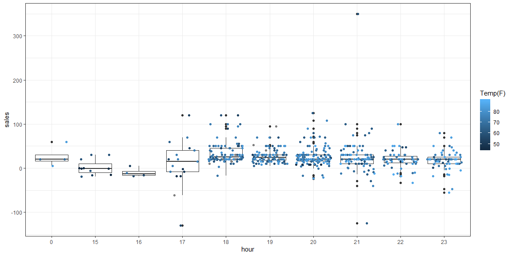

```r
# Use this R-Chunk to import all your datasets!
carwash <- read_csv(url("https://byuistats.github.io/M335/data/carwash.csv")) %>% 
  mutate(mountain_time = with_tz(time, tzone = "US/Denver")) %>% 
  mutate(hour_time = ceiling_date(mountain_time, unit = "hour")) %>% 
  select(amount, hour_time) %>% 
  na.omit()
```

## Background

A car wash business wants to see if the temperature hurts their bottom line. They have point of sale data for the months of April, May, June, and July. You will need to aggregate the data into hourly sales totals and merge the sales data together with the temperature data to provide insight into the relationship between temperature and car wash sales.

## Reading 

* Chapter 16: R for Data Science - Dates and Times
* Time Series Visualization Gallery
* lubridate Vignette

## Tasks

[X] Read in the car wash data https://byuistats.github.io/M335/data/carwash.csv and format it for the needs of this task

* [X] Convert the times from UTC time to mountain time using the right function out of library(lubridate).
* [X] Create a new hourly grouping variable using ceiling_date() from library(lubridate)
* [X] Aggregate the point of sale data into hour sales totals

[X] Use riem_measures(station = "RXE",  date_start  = ,  date_end  =  ) for station RXE from library(riem) to get the matching temperatures

* [X] Create a new hourly variable that matches your car wash hourly variable

[X] Merge the two datasets together

[X] Create a visualization that provides insight into the relationship between sales and temperature by hour of the day

## Data Wrangling 


```r
temperature_RXE <- riem_measures(station = "RXE",  date_start  = "2016-05-13" ,  date_end  = "2016-07-18" ) %>% 
  mutate(hour_time = ceiling_date(valid, unit = "hour")) %>% 
  select(hour_time, tmpf) %>% 
  na.omit()
```


```r
car_temp <- left_join(carwash, temperature_RXE) %>% 
  mutate(hour_in_day = hour(hour_time))
```

## Data Visualization


```r
car_temp %>% 
ggplot(aes(x = as.factor(hour_in_day), y = amount)) +
  geom_boxplot() +
  geom_jitter(aes(color = tmpf)) +
  labs(x = "hour", y = "sales", color = "Temp(F)") + 
  theme_bw()
```

<!-- -->
