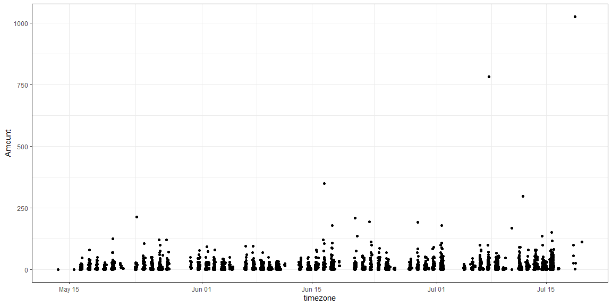
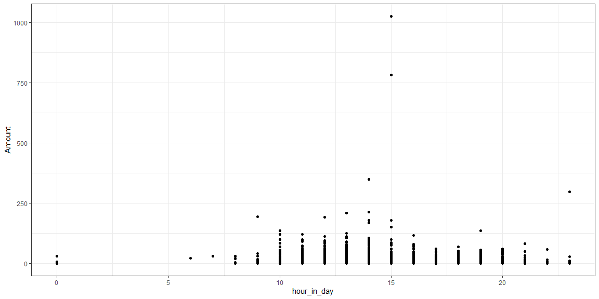
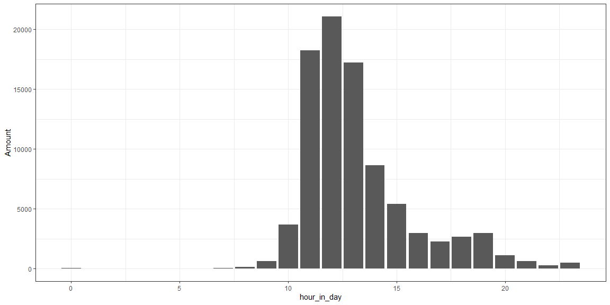
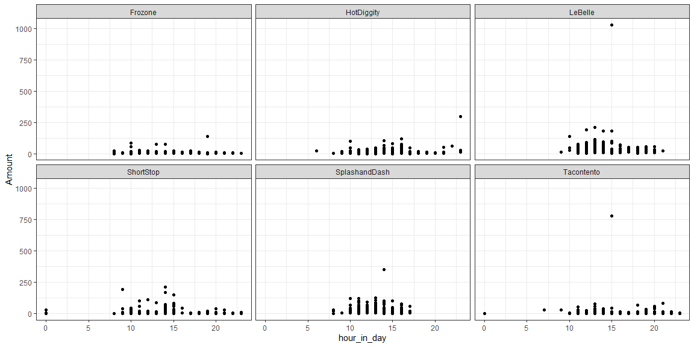
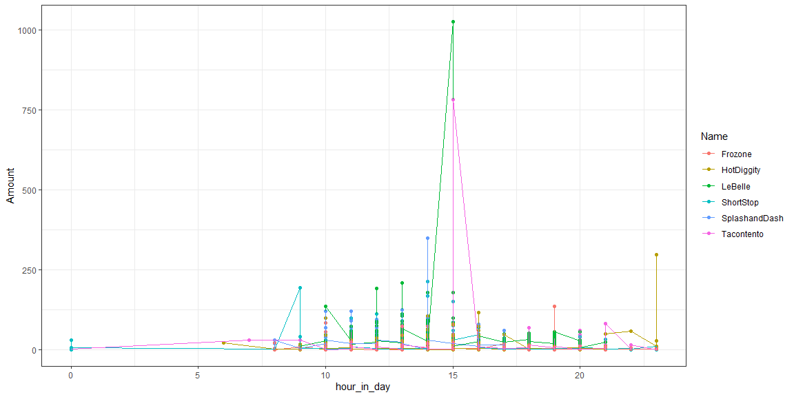

```r
# Use this R-Chunk to import all your datasets!
sales <- read_csv(url("https://byuistats.github.io/M335/data/sales.csv")) %>% 
  mutate(timezone = with_tz(Time, Sys.timezone(location = TRUE))) %>% 
  mutate(hourtime = floor_date(timezone, unit = "second")) %>% 
  mutate(hour_in_day = hour(hourtime)) %>% 
  filter(Amount >= 0)

sales$Name <- str_trim(sales$Name, "both") 
sales$Name <- str_replace_all(sales$Name, "Missing", "NA")

sales <- sales %>% 
  filter(Name != "NA")
```

## Background

We have transaction data for a few businesses that have been in operation for three months. Each of these companies has come to your investment company for a loan to expand their business. Your boss has asked you to go through the transactions for each business and provide daily, weekly, and monthly gross revenue summaries and comparisons. Your boss would like a short write up with tables and visualizations that help with the decision of which company did the best over the three month period. You will also need to provide a short paragraph with your recommendation after building your analysis.

In our course we are only looking at understanding and visualizing recorded time series data. If you would like to learn more about forecasting I would recommend Forecasting: Principles and Practice and for a quick introduction see here

## Tasks

### Before Class

[X] Read in the data from https://byuistats.github.io/M335/data/sales.csv and format it for visualization and analysis

* [X] The data are for businesses in the mountain time zone make sure you read in times correctly
* [X] This is point of sale (pos) data, so you will need to use library(lubridate) to create the correct time aggregations
* [X] Check the data for any inaccuracies

[X] Help your boss understand which business is the best investment through visualizations

* [X] Provide an understanding and recommendation for hours of operation
* [X] We don’t have employee numbers, but sales traffic can help. Provide some visualizations on customer traffic
* [X] Provide a final comparison of the six companies and a final recommendation

[X] Compile your .md and .html file into your git repository

### After Class

[ ] Find two other student’s compiled files in their repository and provide feedback using the issues feature in GitHub (If they already have three issues find a different student to critique)

[ ] Address 1-2 of the issues posted on your project and push the updates to GitHub

## Data Wrangling & Visualization


```r
sales %>%  
ggplot(aes(x = timezone, y = Amount)) +
  geom_point() + 
  theme_bw()
```

<!-- -->

```r
sales %>% 
ggplot(aes(x = hour_in_day, y = Amount)) + 
  geom_point() +
  theme_bw()
```

<!-- -->

```r
sales %>% 
ggplot(aes(x = hour_in_day, y = Amount)) + 
  geom_col() +
  theme_bw()
```

<!-- -->

```r
sales %>% 
ggplot(aes(x = hour_in_day, y = Amount)) + 
  geom_point() +
  facet_wrap(~Name) + 
  theme_bw()  
```

<!-- -->

```r
sales %>% 
ggplot(aes(x = hour_in_day, y = Amount, color = Name)) + 
  geom_point() +
  geom_line() + 
  theme_bw()  
```

<!-- -->

## Conclusions

I plotted a few different graphs to analysis which time or company is the best. Plot 1 shows any inaccuracies. Plot 2 shows the answer to provide an understanding and recommendation for hours of operation. Plot 3 shows the solution to we don’t have employee numbers, but sales traffic can help. Provide some visualizations on customer traffic. And plot 4 and 5 answers provide a final comparison of the six companies and a final recommendation. 
