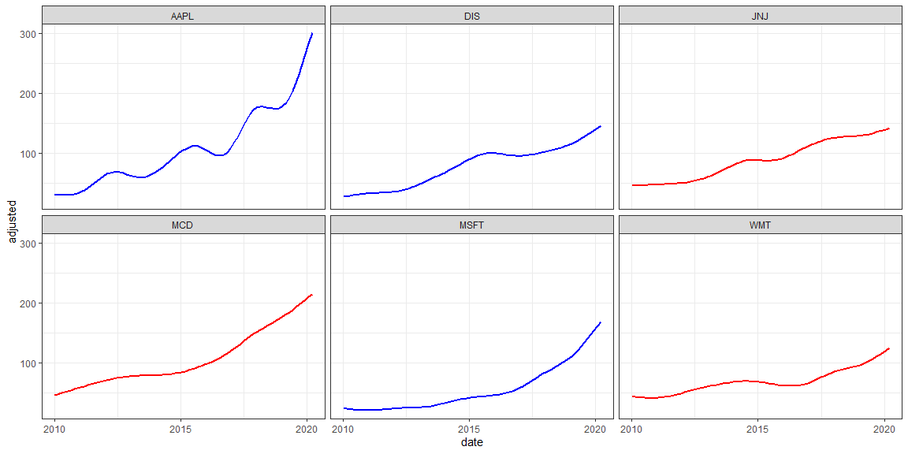

## Background

The stock market is overflowing with data. There are many packages in R that allow us to get quick access to information on publicly traded companies. Imagine that you and a friend each purchased about $1,000 of stock in three different stocks at the start of October last year, and you want to compare your performance up to this week. Use the stock shares purchased and share prices to demonstrate how each of you fared over the period you were competing (assuming that you did not change your allocations).

## Reading

* [tidyquants R package](https://github.com/business-science/tidyquant)

## Tasks

* [X] Take notes on your reading of the new R package in the README.md or in a ‘.R’ script in the class task folder
* [X] List the three stocks that your friend picks and the three that you pick
* [X] Pull the price performance data using library(tidyquant) or library(quantmod)
* [X] Build a visualization that shows who is winning each day of the competition
* [X] In the previous visualization or with another visualization show which stock is helping the winner of the competition
* [X] Create an .Rmd file with 1-2 paragraphs summarizing your graphics and the choices you made in the data presentation
* [X] Compile your .md and .html file into your git repository

## Data Wrangling and Visualization


```r
# Use this R-Chunk to clean & wrangle your data!
index <- tq_index_options()
dow <- tq_index("DOW")

stock_price <- tq_get(c("AAPL", "MSFT", "DIS", "WMT", "JNJ", "MCD"), get = "stock.prices") %>% 
  select(symbol, date, adjusted)

# Use this R-Chunk to plot & visualize your data!
stock_price %>% 
ggplot(aes(x = date, y = adjusted, color = symbol)) +
  geom_smooth(se = FALSE) + 
  facet_wrap(~ symbol) +
  scale_color_manual(values = c("blue", "blue", "red", "red", "blue", "red")) + 
  theme_bw() +
  theme(legend.position = "none")
```

<!-- -->

## Conclusions

From the graph you can tell that the blue won. Apples stock has grown rapidly in the 10 years. McDonalds is the second highest growth giving red a fighting chance with the blue. 

## Class Notes


```r
library(DT)
datatable(iris)
```

<!--html_preserve--><div id="htmlwidget-5b205ecc5321a3995db1" style="width:100%;height:auto;" class="datatables html-widget"></div>
<script type="application/json" data-for="htmlwidget-5b205ecc5321a3995db1">{"x":{"filter":"none","data":[["1","2","3","4","5","6","7","8","9","10","11","12","13","14","15","16","17","18","19","20","21","22","23","24","25","26","27","28","29","30","31","32","33","34","35","36","37","38","39","40","41","42","43","44","45","46","47","48","49","50","51","52","53","54","55","56","57","58","59","60","61","62","63","64","65","66","67","68","69","70","71","72","73","74","75","76","77","78","79","80","81","82","83","84","85","86","87","88","89","90","91","92","93","94","95","96","97","98","99","100","101","102","103","104","105","106","107","108","109","110","111","112","113","114","115","116","117","118","119","120","121","122","123","124","125","126","127","128","129","130","131","132","133","134","135","136","137","138","139","140","141","142","143","144","145","146","147","148","149","150"],[5.1,4.9,4.7,4.6,5,5.4,4.6,5,4.4,4.9,5.4,4.8,4.8,4.3,5.8,5.7,5.4,5.1,5.7,5.1,5.4,5.1,4.6,5.1,4.8,5,5,5.2,5.2,4.7,4.8,5.4,5.2,5.5,4.9,5,5.5,4.9,4.4,5.1,5,4.5,4.4,5,5.1,4.8,5.1,4.6,5.3,5,7,6.4,6.9,5.5,6.5,5.7,6.3,4.9,6.6,5.2,5,5.9,6,6.1,5.6,6.7,5.6,5.8,6.2,5.6,5.9,6.1,6.3,6.1,6.4,6.6,6.8,6.7,6,5.7,5.5,5.5,5.8,6,5.4,6,6.7,6.3,5.6,5.5,5.5,6.1,5.8,5,5.6,5.7,5.7,6.2,5.1,5.7,6.3,5.8,7.1,6.3,6.5,7.6,4.9,7.3,6.7,7.2,6.5,6.4,6.8,5.7,5.8,6.4,6.5,7.7,7.7,6,6.9,5.6,7.7,6.3,6.7,7.2,6.2,6.1,6.4,7.2,7.4,7.9,6.4,6.3,6.1,7.7,6.3,6.4,6,6.9,6.7,6.9,5.8,6.8,6.7,6.7,6.3,6.5,6.2,5.9],[3.5,3,3.2,3.1,3.6,3.9,3.4,3.4,2.9,3.1,3.7,3.4,3,3,4,4.4,3.9,3.5,3.8,3.8,3.4,3.7,3.6,3.3,3.4,3,3.4,3.5,3.4,3.2,3.1,3.4,4.1,4.2,3.1,3.2,3.5,3.6,3,3.4,3.5,2.3,3.2,3.5,3.8,3,3.8,3.2,3.7,3.3,3.2,3.2,3.1,2.3,2.8,2.8,3.3,2.4,2.9,2.7,2,3,2.2,2.9,2.9,3.1,3,2.7,2.2,2.5,3.2,2.8,2.5,2.8,2.9,3,2.8,3,2.9,2.6,2.4,2.4,2.7,2.7,3,3.4,3.1,2.3,3,2.5,2.6,3,2.6,2.3,2.7,3,2.9,2.9,2.5,2.8,3.3,2.7,3,2.9,3,3,2.5,2.9,2.5,3.6,3.2,2.7,3,2.5,2.8,3.2,3,3.8,2.6,2.2,3.2,2.8,2.8,2.7,3.3,3.2,2.8,3,2.8,3,2.8,3.8,2.8,2.8,2.6,3,3.4,3.1,3,3.1,3.1,3.1,2.7,3.2,3.3,3,2.5,3,3.4,3],[1.4,1.4,1.3,1.5,1.4,1.7,1.4,1.5,1.4,1.5,1.5,1.6,1.4,1.1,1.2,1.5,1.3,1.4,1.7,1.5,1.7,1.5,1,1.7,1.9,1.6,1.6,1.5,1.4,1.6,1.6,1.5,1.5,1.4,1.5,1.2,1.3,1.4,1.3,1.5,1.3,1.3,1.3,1.6,1.9,1.4,1.6,1.4,1.5,1.4,4.7,4.5,4.9,4,4.6,4.5,4.7,3.3,4.6,3.9,3.5,4.2,4,4.7,3.6,4.4,4.5,4.1,4.5,3.9,4.8,4,4.9,4.7,4.3,4.4,4.8,5,4.5,3.5,3.8,3.7,3.9,5.1,4.5,4.5,4.7,4.4,4.1,4,4.4,4.6,4,3.3,4.2,4.2,4.2,4.3,3,4.1,6,5.1,5.9,5.6,5.8,6.6,4.5,6.3,5.8,6.1,5.1,5.3,5.5,5,5.1,5.3,5.5,6.7,6.9,5,5.7,4.9,6.7,4.9,5.7,6,4.8,4.9,5.6,5.8,6.1,6.4,5.6,5.1,5.6,6.1,5.6,5.5,4.8,5.4,5.6,5.1,5.1,5.9,5.7,5.2,5,5.2,5.4,5.1],[0.2,0.2,0.2,0.2,0.2,0.4,0.3,0.2,0.2,0.1,0.2,0.2,0.1,0.1,0.2,0.4,0.4,0.3,0.3,0.3,0.2,0.4,0.2,0.5,0.2,0.2,0.4,0.2,0.2,0.2,0.2,0.4,0.1,0.2,0.2,0.2,0.2,0.1,0.2,0.2,0.3,0.3,0.2,0.6,0.4,0.3,0.2,0.2,0.2,0.2,1.4,1.5,1.5,1.3,1.5,1.3,1.6,1,1.3,1.4,1,1.5,1,1.4,1.3,1.4,1.5,1,1.5,1.1,1.8,1.3,1.5,1.2,1.3,1.4,1.4,1.7,1.5,1,1.1,1,1.2,1.6,1.5,1.6,1.5,1.3,1.3,1.3,1.2,1.4,1.2,1,1.3,1.2,1.3,1.3,1.1,1.3,2.5,1.9,2.1,1.8,2.2,2.1,1.7,1.8,1.8,2.5,2,1.9,2.1,2,2.4,2.3,1.8,2.2,2.3,1.5,2.3,2,2,1.8,2.1,1.8,1.8,1.8,2.1,1.6,1.9,2,2.2,1.5,1.4,2.3,2.4,1.8,1.8,2.1,2.4,2.3,1.9,2.3,2.5,2.3,1.9,2,2.3,1.8],["setosa","setosa","setosa","setosa","setosa","setosa","setosa","setosa","setosa","setosa","setosa","setosa","setosa","setosa","setosa","setosa","setosa","setosa","setosa","setosa","setosa","setosa","setosa","setosa","setosa","setosa","setosa","setosa","setosa","setosa","setosa","setosa","setosa","setosa","setosa","setosa","setosa","setosa","setosa","setosa","setosa","setosa","setosa","setosa","setosa","setosa","setosa","setosa","setosa","setosa","versicolor","versicolor","versicolor","versicolor","versicolor","versicolor","versicolor","versicolor","versicolor","versicolor","versicolor","versicolor","versicolor","versicolor","versicolor","versicolor","versicolor","versicolor","versicolor","versicolor","versicolor","versicolor","versicolor","versicolor","versicolor","versicolor","versicolor","versicolor","versicolor","versicolor","versicolor","versicolor","versicolor","versicolor","versicolor","versicolor","versicolor","versicolor","versicolor","versicolor","versicolor","versicolor","versicolor","versicolor","versicolor","versicolor","versicolor","versicolor","versicolor","versicolor","virginica","virginica","virginica","virginica","virginica","virginica","virginica","virginica","virginica","virginica","virginica","virginica","virginica","virginica","virginica","virginica","virginica","virginica","virginica","virginica","virginica","virginica","virginica","virginica","virginica","virginica","virginica","virginica","virginica","virginica","virginica","virginica","virginica","virginica","virginica","virginica","virginica","virginica","virginica","virginica","virginica","virginica","virginica","virginica","virginica","virginica","virginica","virginica","virginica","virginica"]],"container":"<table class=\"display\">\n  <thead>\n    <tr>\n      <th> <\/th>\n      <th>Sepal.Length<\/th>\n      <th>Sepal.Width<\/th>\n      <th>Petal.Length<\/th>\n      <th>Petal.Width<\/th>\n      <th>Species<\/th>\n    <\/tr>\n  <\/thead>\n<\/table>","options":{"columnDefs":[{"className":"dt-right","targets":[1,2,3,4]},{"orderable":false,"targets":0}],"order":[],"autoWidth":false,"orderClasses":false}},"evals":[],"jsHooks":[]}</script><!--/html_preserve-->

```r
datatable(head(iris), class = 'cell-border stripe') ## Mod 1
```

<!--html_preserve--><div id="htmlwidget-0a2d8f2b4a3a356728f9" style="width:100%;height:auto;" class="datatables html-widget"></div>
<script type="application/json" data-for="htmlwidget-0a2d8f2b4a3a356728f9">{"x":{"filter":"none","data":[["1","2","3","4","5","6"],[5.1,4.9,4.7,4.6,5,5.4],[3.5,3,3.2,3.1,3.6,3.9],[1.4,1.4,1.3,1.5,1.4,1.7],[0.2,0.2,0.2,0.2,0.2,0.4],["setosa","setosa","setosa","setosa","setosa","setosa"]],"container":"<table class=\"cell-border stripe\">\n  <thead>\n    <tr>\n      <th> <\/th>\n      <th>Sepal.Length<\/th>\n      <th>Sepal.Width<\/th>\n      <th>Petal.Length<\/th>\n      <th>Petal.Width<\/th>\n      <th>Species<\/th>\n    <\/tr>\n  <\/thead>\n<\/table>","options":{"columnDefs":[{"className":"dt-right","targets":[1,2,3,4]},{"orderable":false,"targets":0}],"order":[],"autoWidth":false,"orderClasses":false}},"evals":[],"jsHooks":[]}</script><!--/html_preserve-->

```r
datatable(head(iris), editable = 'cell') ## Mod 2
```

<!--html_preserve--><div id="htmlwidget-1709875fc70b235da24e" style="width:100%;height:auto;" class="datatables html-widget"></div>
<script type="application/json" data-for="htmlwidget-1709875fc70b235da24e">{"x":{"filter":"none","editable":{"target":"cell","disable":{"columns":null}},"data":[["1","2","3","4","5","6"],[5.1,4.9,4.7,4.6,5,5.4],[3.5,3,3.2,3.1,3.6,3.9],[1.4,1.4,1.3,1.5,1.4,1.7],[0.2,0.2,0.2,0.2,0.2,0.4],["setosa","setosa","setosa","setosa","setosa","setosa"]],"container":"<table class=\"display\">\n  <thead>\n    <tr>\n      <th> <\/th>\n      <th>Sepal.Length<\/th>\n      <th>Sepal.Width<\/th>\n      <th>Petal.Length<\/th>\n      <th>Petal.Width<\/th>\n      <th>Species<\/th>\n    <\/tr>\n  <\/thead>\n<\/table>","options":{"columnDefs":[{"className":"dt-right","targets":[1,2,3,4]},{"orderable":false,"targets":0}],"order":[],"autoWidth":false,"orderClasses":false}},"evals":[],"jsHooks":[]}</script><!--/html_preserve-->

## Reading Notes

* tidyquant integrates the best resources for collecting and analyzing financial data, zoo, xts, quantmod, TTR, and PerformanceAnalytics, with the tidy data infrastructure of the tidyverse allowing for seamless interaction between each. 
  + You can now perform complete financial analyses in the tidyverse.
