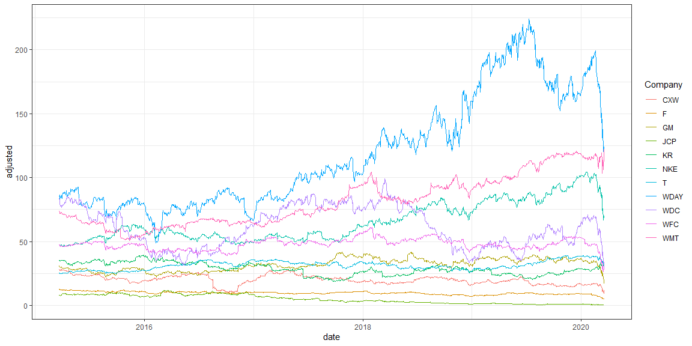

```r
# Use this R-Chunk to import all your datasets!
tickers_today <- c("CXW", "F", "GM", "JCP", "KR", "WDC", "NKE","T", "WDAY", "WFC", "WMT")
stocks <- tq_get(tickers_today) %>% select(date, symbol, adjusted)
stock <- stocks %>% pivot_wider(names_from = symbol, values_from = adjusted)
stk <- tk_xts(stock, date_var = date)

sys_now <- now() - ddays(x = 1)
sys_minus_5yr <- sys_now - dyears(x = 5)
```

## Background

Your data science income has ballooned, and you need to find somewhere to invest $25,000 that you have saved over the last year. You have a savvy investment friend that is kind enough to tell you ten stocks he has been watching during the last year. You will need to visualize the last five years performance to help in the in the conversation with your friend.

Your friend is going to give you his tickers at the beginning of your half-hour meeting with him (he is a busy friend). You will need to build an .Rmd file that will build a suite of visualizations rapidly for your conversation. You will need a series of stock performance graphics using library(dygraphs) and library(ggplot2). In real life, you might use one or the other, but this task is built to help you move from ts and xts to tidy objects for visualization.

Specifically, in class the Tuesday following this case study you will get 5 - 10 ticker symbols and will need to build visualizations quickly that allows you to answer questions about the stocks in a few seconds.

## Tasks

### Before Class

* [X] For your coding development use these tickers - tickers_today <- c("CXW", "F", "GM", "JCP", "KR", "WDC", "NKE","T", "WDAY", "WFC", "WMT")
* [X] Use library(dygraphs) to build interactive visualizations of the stock performances over the last 5 years.
* [X] Make a library(ggplot2) graphic that helps you build a solid question around how an investor would use volume in their trading strategy
* [X] Create an .Rmd file with 1-2 paragraphs summarizing your graphics and the choices you made in your visualization
* [X] Compile your .md and .html file into your git repository

### After Class

* [ ] Find two other student’s compiled files in their repository and provide feedback using the issues feature in GitHub (If they already have three issues find a different student to critique)
* [ ] Address 1-2 of the issues posted on your project and push the updates to GitHub
* [X] Publish your case study to Rstudio Connect at shiny.byui.edu

## Data Wrangling & Visualization


```r
dygraph(stk) %>% 
  dyRangeSelector(dateWindow = c(sys_minus_5yr, sys_now))
```

<!--html_preserve--><div id="htmlwidget-2ca4113a75cdbae9d7aa" style="width:1152px;height:576px;" class="dygraphs html-widget"></div>
<script type="application/json" data-for="htmlwidget-2ca4113a75cdbae9d7aa">{"x":{"attrs":{"labels":["day","CXW","F","GM","JCP","KR","WDC","NKE","T","WDAY","WFC","WMT"],"legend":"auto","retainDateWindow":false,"axes":{"x":{"pixelsPerLabel":60}},"showRangeSelector":true,"dateWindow":["2015-03-20T22:01:46.416Z","2020-03-18T22:01:46.416Z"],"rangeSelectorHeight":40,"rangeSelectorPlotFillColor":" #A7B1C4","rangeSelectorPlotStrokeColor":"#808FAB","interactionModel":"Dygraph.Interaction.defaultModel"},"scale":"daily","annotations":[],"shadings":[],"events":[],"format":"date","data":[["2010-01-04T00:00:00.000Z","2010-01-05T00:00:00.000Z","2010-01-06T00:00:00.000Z","2010-01-07T00:00:00.000Z","2010-01-08T00:00:00.000Z","2010-01-11T00:00:00.000Z","2010-01-12T00:00:00.000Z","2010-01-13T00:00:00.000Z","2010-01-14T00:00:00.000Z","2010-01-15T00:00:00.000Z","2010-01-19T00:00:00.000Z","2010-01-20T00:00:00.000Z","2010-01-21T00:00:00.000Z","2010-01-22T00:00:00.000Z","2010-01-25T00:00:00.000Z","2010-01-26T00:00:00.000Z","2010-01-27T00:00:00.000Z","2010-01-28T00:00:00.000Z","2010-01-29T00:00:00.000Z","2010-02-01T00:00:00.000Z","2010-02-02T00:00:00.000Z","2010-02-03T00:00:00.000Z","2010-02-04T00:00:00.000Z","2010-02-05T00:00:00.000Z","2010-02-08T00:00:00.000Z","2010-02-09T00:00:00.000Z","2010-02-10T00:00:00.000Z","2010-02-11T00:00:00.000Z","2010-02-12T00:00:00.000Z","2010-02-16T00:00:00.000Z","2010-02-17T00:00:00.000Z","2010-02-18T00:00:00.000Z","2010-02-19T00:00:00.000Z","2010-02-22T00:00:00.000Z","2010-02-23T00:00:00.000Z","2010-02-24T00:00:00.000Z","2010-02-25T00:00:00.000Z","2010-02-26T00:00:00.000Z","2010-03-01T00:00:00.000Z","2010-03-02T00:00:00.000Z","2010-03-03T00:00:00.000Z","2010-03-04T00:00:00.000Z","2010-03-05T00:00:00.000Z","2010-03-08T00:00:00.000Z","2010-03-09T00:00:00.000Z","2010-03-10T00:00:00.000Z","2010-03-11T00:00:00.000Z","2010-03-12T00:00:00.000Z","2010-03-15T00:00:00.000Z","2010-03-16T00:00:00.000Z","2010-03-17T00:00:00.000Z","2010-03-18T00:00:00.000Z","2010-03-19T00:00:00.000Z","2010-03-22T00:00:00.000Z","2010-03-23T00:00:00.000Z","2010-03-24T00:00:00.000Z","2010-03-25T00:00:00.000Z","2010-03-26T00:00:00.000Z","2010-03-29T00:00:00.000Z","2010-03-30T00:00:00.000Z","2010-03-31T00:00:00.000Z","2010-04-01T00:00:00.000Z","2010-04-05T00:00:00.000Z","2010-04-06T00:00:00.000Z","2010-04-07T00:00:00.000Z","2010-04-08T00:00:00.000Z","2010-04-09T00:00:00.000Z","2010-04-12T00:00:00.000Z","2010-04-13T00:00:00.000Z","2010-04-14T00:00:00.000Z","2010-04-15T00:00:00.000Z","2010-04-16T00:00:00.000Z","2010-04-19T00:00:00.000Z","2010-04-20T00:00:00.000Z","2010-04-21T00:00:00.000Z","2010-04-22T00:00:00.000Z","2010-04-23T00:00:00.000Z","2010-04-26T00:00:00.000Z","2010-04-27T00:00:00.000Z","2010-04-28T00:00:00.000Z","2010-04-29T00:00:00.000Z","2010-04-30T00:00:00.000Z","2010-05-03T00:00:00.000Z","2010-05-04T00:00:00.000Z","2010-05-05T00:00:00.000Z","2010-05-06T00:00:00.000Z","2010-05-07T00:00:00.000Z","2010-05-10T00:00:00.000Z","2010-05-11T00:00:00.000Z","2010-05-12T00:00:00.000Z","2010-05-13T00:00:00.000Z","2010-05-14T00:00:00.000Z","2010-05-17T00:00:00.000Z","2010-05-18T00:00:00.000Z","2010-05-19T00:00:00.000Z","2010-05-20T00:00:00.000Z","2010-05-21T00:00:00.000Z","2010-05-24T00:00:00.000Z","2010-05-25T00:00:00.000Z","2010-05-26T00:00:00.000Z","2010-05-27T00:00:00.000Z","2010-05-28T00:00:00.000Z","2010-06-01T00:00:00.000Z","2010-06-02T00:00:00.000Z","2010-06-03T00:00:00.000Z","2010-06-04T00:00:00.000Z","2010-06-07T00:00:00.000Z","2010-06-08T00:00:00.000Z","2010-06-09T00:00:00.000Z","2010-06-10T00:00:00.000Z","2010-06-11T00:00:00.000Z","2010-06-14T00:00:00.000Z","2010-06-15T00:00:00.000Z","2010-06-16T00:00:00.000Z","2010-06-17T00:00:00.000Z","2010-06-18T00:00:00.000Z","2010-06-21T00:00:00.000Z","2010-06-22T00:00:00.000Z","2010-06-23T00:00:00.000Z","2010-06-24T00:00:00.000Z","2010-06-25T00:00:00.000Z","2010-06-28T00:00:00.000Z","2010-06-29T00:00:00.000Z","2010-06-30T00:00:00.000Z","2010-07-01T00:00:00.000Z","2010-07-02T00:00:00.000Z","2010-07-06T00:00:00.000Z","2010-07-07T00:00:00.000Z","2010-07-08T00:00:00.000Z","2010-07-09T00:00:00.000Z","2010-07-12T00:00:00.000Z","2010-07-13T00:00:00.000Z","2010-07-14T00:00:00.000Z","2010-07-15T00:00:00.000Z","2010-07-16T00:00:00.000Z","2010-07-19T00:00:00.000Z","2010-07-20T00:00:00.000Z","2010-07-21T00:00:00.000Z","2010-07-22T00:00:00.000Z","2010-07-23T00:00:00.000Z","2010-07-26T00:00:00.000Z","2010-07-27T00:00:00.000Z","2010-07-28T00:00:00.000Z","2010-07-29T00:00:00.000Z","2010-07-30T00:00:00.000Z","2010-08-02T00:00:00.000Z","2010-08-03T00:00:00.000Z","2010-08-04T00:00:00.000Z","2010-08-05T00:00:00.000Z","2010-08-06T00:00:00.000Z","2010-08-09T00:00:00.000Z","2010-08-10T00:00:00.000Z","2010-08-11T00:00:00.000Z","2010-08-12T00:00:00.000Z","2010-08-13T00:00:00.000Z","2010-08-16T00:00:00.000Z","2010-08-17T00:00:00.000Z","2010-08-18T00:00:00.000Z","2010-08-19T00:00:00.000Z","2010-08-20T00:00:00.000Z","2010-08-23T00:00:00.000Z","2010-08-24T00:00:00.000Z","2010-08-25T00:00:00.000Z","2010-08-26T00:00:00.000Z","2010-08-27T00:00:00.000Z","2010-08-30T00:00:00.000Z","2010-08-31T00:00:00.000Z","2010-09-01T00:00:00.000Z","2010-09-02T00:00:00.000Z","2010-09-03T00:00:00.000Z","2010-09-07T00:00:00.000Z","2010-09-08T00:00:00.000Z","2010-09-09T00:00:00.000Z","2010-09-10T00:00:00.000Z","2010-09-13T00:00:00.000Z","2010-09-14T00:00:00.000Z","2010-09-15T00:00:00.000Z","2010-09-16T00:00:00.000Z","2010-09-17T00:00:00.000Z","2010-09-20T00:00:00.000Z","2010-09-21T00:00:00.000Z","2010-09-22T00:00:00.000Z","2010-09-23T00:00:00.000Z","2010-09-24T00:00:00.000Z","2010-09-27T00:00:00.000Z","2010-09-28T00:00:00.000Z","2010-09-29T00:00:00.000Z","2010-09-30T00:00:00.000Z","2010-10-01T00:00:00.000Z","2010-10-04T00:00:00.000Z","2010-10-05T00:00:00.000Z","2010-10-06T00:00:00.000Z","2010-10-07T00:00:00.000Z","2010-10-08T00:00:00.000Z","2010-10-11T00:00:00.000Z","2010-10-12T00:00:00.000Z","2010-10-13T00:00:00.000Z","2010-10-14T00:00:00.000Z","2010-10-15T00:00:00.000Z","2010-10-18T00:00:00.000Z","2010-10-19T00:00:00.000Z","2010-10-20T00:00:00.000Z","2010-10-21T00:00:00.000Z","2010-10-22T00:00:00.000Z","2010-10-25T00:00:00.000Z","2010-10-26T00:00:00.000Z","2010-10-27T00:00:00.000Z","2010-10-28T00:00:00.000Z","2010-10-29T00:00:00.000Z","2010-11-01T00:00:00.000Z","2010-11-02T00:00:00.000Z","2010-11-03T00:00:00.000Z","2010-11-04T00:00:00.000Z","2010-11-05T00:00:00.000Z","2010-11-08T00:00:00.000Z","2010-11-09T00:00:00.000Z","2010-11-10T00:00:00.000Z","2010-11-11T00:00:00.000Z","2010-11-12T00:00:00.000Z","2010-11-15T00:00:00.000Z","2010-11-16T00:00:00.000Z","2010-11-17T00:00:00.000Z","2010-11-18T00:00:00.000Z","2010-11-19T00:00:00.000Z","2010-11-22T00:00:00.000Z","2010-11-23T00:00:00.000Z","2010-11-24T00:00:00.000Z","2010-11-26T00:00:00.000Z","2010-11-29T00:00:00.000Z","2010-11-30T00:00:00.000Z","2010-12-01T00:00:00.000Z","2010-12-02T00:00:00.000Z","2010-12-03T00:00:00.000Z","2010-12-06T00:00:00.000Z","2010-12-07T00:00:00.000Z","2010-12-08T00:00:00.000Z","2010-12-09T00:00:00.000Z","2010-12-10T00:00:00.000Z","2010-12-13T00:00:00.000Z","2010-12-14T00:00:00.000Z","2010-12-15T00:00:00.000Z","2010-12-16T00:00:00.000Z","2010-12-17T00:00:00.000Z","2010-12-20T00:00:00.000Z","2010-12-21T00:00:00.000Z","2010-12-22T00:00:00.000Z","2010-12-23T00:00:00.000Z","2010-12-27T00:00:00.000Z","2010-12-28T00:00:00.000Z","2010-12-29T00:00:00.000Z","2010-12-30T00:00:00.000Z","2010-12-31T00:00:00.000Z","2011-01-03T00:00:00.000Z","2011-01-04T00:00:00.000Z","2011-01-05T00:00:00.000Z","2011-01-06T00:00:00.000Z","2011-01-07T00:00:00.000Z","2011-01-10T00:00:00.000Z","2011-01-11T00:00:00.000Z","2011-01-12T00:00:00.000Z","2011-01-13T00:00:00.000Z","2011-01-14T00:00:00.000Z","2011-01-18T00:00:00.000Z","2011-01-19T00:00:00.000Z","2011-01-20T00:00:00.000Z","2011-01-21T00:00:00.000Z","2011-01-24T00:00:00.000Z","2011-01-25T00:00:00.000Z","2011-01-26T00:00:00.000Z","2011-01-27T00:00:00.000Z","2011-01-28T00:00:00.000Z","2011-01-31T00:00:00.000Z","2011-02-01T00:00:00.000Z","2011-02-02T00:00:00.000Z","2011-02-03T00:00:00.000Z","2011-02-04T00:00:00.000Z","2011-02-07T00:00:00.000Z","2011-02-08T00:00:00.000Z","2011-02-09T00:00:00.000Z","2011-02-10T00:00:00.000Z","2011-02-11T00:00:00.000Z","2011-02-14T00:00:00.000Z","2011-02-15T00:00:00.000Z","2011-02-16T00:00:00.000Z","2011-02-17T00:00:00.000Z","2011-02-18T00:00:00.000Z","2011-02-22T00:00:00.000Z","2011-02-23T00:00:00.000Z","2011-02-24T00:00:00.000Z","2011-02-25T00:00:00.000Z","2011-02-28T00:00:00.000Z","2011-03-01T00:00:00.000Z","2011-03-02T00:00:00.000Z","2011-03-03T00:00:00.000Z","2011-03-04T00:00:00.000Z","2011-03-07T00:00:00.000Z","2011-03-08T00:00:00.000Z","2011-03-09T00:00:00.000Z","2011-03-10T00:00:00.000Z","2011-03-11T00:00:00.000Z","2011-03-14T00:00:00.000Z","2011-03-15T00:00:00.000Z","2011-03-16T00:00:00.000Z","2011-03-17T00:00:00.000Z","2011-03-18T00:00:00.000Z","2011-03-21T00:00:00.000Z","2011-03-22T00:00:00.000Z","2011-03-23T00:00:00.000Z","2011-03-24T00:00:00.000Z","2011-03-25T00:00:00.000Z","2011-03-28T00:00:00.000Z","2011-03-29T00:00:00.000Z","2011-03-30T00:00:00.000Z","2011-03-31T00:00:00.000Z","2011-04-01T00:00:00.000Z","2011-04-04T00:00:00.000Z","2011-04-05T00:00:00.000Z","2011-04-06T00:00:00.000Z","2011-04-07T00:00:00.000Z","2011-04-08T00:00:00.000Z","2011-04-11T00:00:00.000Z","2011-04-12T00:00:00.000Z","2011-04-13T00:00:00.000Z","2011-04-14T00:00:00.000Z","2011-04-15T00:00:00.000Z","2011-04-18T00:00:00.000Z","2011-04-19T00:00:00.000Z","2011-04-20T00:00:00.000Z","2011-04-21T00:00:00.000Z","2011-04-25T00:00:00.000Z","2011-04-26T00:00:00.000Z","2011-04-27T00:00:00.000Z","2011-04-28T00:00:00.000Z","2011-04-29T00:00:00.000Z","2011-05-02T00:00:00.000Z","2011-05-03T00:00:00.000Z","2011-05-04T00:00:00.000Z","2011-05-05T00:00:00.000Z","2011-05-06T00:00:00.000Z","2011-05-09T00:00:00.000Z","2011-05-10T00:00:00.000Z","2011-05-11T00:00:00.000Z","2011-05-12T00:00:00.000Z","2011-05-13T00:00:00.000Z","2011-05-16T00:00:00.000Z","2011-05-17T00:00:00.000Z","2011-05-18T00:00:00.000Z","2011-05-19T00:00:00.000Z","2011-05-20T00:00:00.000Z","2011-05-23T00:00:00.000Z","2011-05-24T00:00:00.000Z","2011-05-25T00:00:00.000Z","2011-05-26T00:00:00.000Z","2011-05-27T00:00:00.000Z","2011-05-31T00:00:00.000Z","2011-06-01T00:00:00.000Z","2011-06-02T00:00:00.000Z","2011-06-03T00:00:00.000Z","2011-06-06T00:00:00.000Z","2011-06-07T00:00:00.000Z","2011-06-08T00:00:00.000Z","2011-06-09T00:00:00.000Z","2011-06-10T00:00:00.000Z","2011-06-13T00:00:00.000Z","2011-06-14T00:00:00.000Z","2011-06-15T00:00:00.000Z","2011-06-16T00:00:00.000Z","2011-06-17T00:00:00.000Z","2011-06-20T00:00:00.000Z","2011-06-21T00:00:00.000Z","2011-06-22T00:00:00.000Z","2011-06-23T00:00:00.000Z","2011-06-24T00:00:00.000Z","2011-06-27T00:00:00.000Z","2011-06-28T00:00:00.000Z","2011-06-29T00:00:00.000Z","2011-06-30T00:00:00.000Z","2011-07-01T00:00:00.000Z","2011-07-05T00:00:00.000Z","2011-07-06T00:00:00.000Z","2011-07-07T00:00:00.000Z","2011-07-08T00:00:00.000Z","2011-07-11T00:00:00.000Z","2011-07-12T00:00:00.000Z","2011-07-13T00:00:00.000Z","2011-07-14T00:00:00.000Z","2011-07-15T00:00:00.000Z","2011-07-18T00:00:00.000Z","2011-07-19T00:00:00.000Z","2011-07-20T00:00:00.000Z","2011-07-21T00:00:00.000Z","2011-07-22T00:00:00.000Z","2011-07-25T00:00:00.000Z","2011-07-26T00:00:00.000Z","2011-07-27T00:00:00.000Z","2011-07-28T00:00:00.000Z","2011-07-29T00:00:00.000Z","2011-08-01T00:00:00.000Z","2011-08-02T00:00:00.000Z","2011-08-03T00:00:00.000Z","2011-08-04T00:00:00.000Z","2011-08-05T00:00:00.000Z","2011-08-08T00:00:00.000Z","2011-08-09T00:00:00.000Z","2011-08-10T00:00:00.000Z","2011-08-11T00:00:00.000Z","2011-08-12T00:00:00.000Z","2011-08-15T00:00:00.000Z","2011-08-16T00:00:00.000Z","2011-08-17T00:00:00.000Z","2011-08-18T00:00:00.000Z","2011-08-19T00:00:00.000Z","2011-08-22T00:00:00.000Z","2011-08-23T00:00:00.000Z","2011-08-24T00:00:00.000Z","2011-08-25T00:00:00.000Z","2011-08-26T00:00:00.000Z","2011-08-29T00:00:00.000Z","2011-08-30T00:00:00.000Z","2011-08-31T00:00:00.000Z","2011-09-01T00:00:00.000Z","2011-09-02T00:00:00.000Z","2011-09-06T00:00:00.000Z","2011-09-07T00:00:00.000Z","2011-09-08T00:00:00.000Z","2011-09-09T00:00:00.000Z","2011-09-12T00:00:00.000Z","2011-09-13T00:00:00.000Z","2011-09-14T00:00:00.000Z","2011-09-15T00:00:00.000Z","2011-09-16T00:00:00.000Z","2011-09-19T00:00:00.000Z","2011-09-20T00:00:00.000Z","2011-09-21T00:00:00.000Z","2011-09-22T00:00:00.000Z","2011-09-23T00:00:00.000Z","2011-09-26T00:00:00.000Z","2011-09-27T00:00:00.000Z","2011-09-28T00:00:00.000Z","2011-09-29T00:00:00.000Z","2011-09-30T00:00:00.000Z","2011-10-03T00:00:00.000Z","2011-10-04T00:00:00.000Z","2011-10-05T00:00:00.000Z","2011-10-06T00:00:00.000Z","2011-10-07T00:00:00.000Z","2011-10-10T00:00:00.000Z","2011-10-11T00:00:00.000Z","2011-10-12T00:00:00.000Z","2011-10-13T00:00:00.000Z","2011-10-14T00:00:00.000Z","2011-10-17T00:00:00.000Z","2011-10-18T00:00:00.000Z","2011-10-19T00:00:00.000Z","2011-10-20T00:00:00.000Z","2011-10-21T00:00:00.000Z","2011-10-24T00:00:00.000Z","2011-10-25T00:00:00.000Z","2011-10-26T00:00:00.000Z","2011-10-27T00:00:00.000Z","2011-10-28T00:00:00.000Z","2011-10-31T00:00:00.000Z","2011-11-01T00:00:00.000Z","2011-11-02T00:00:00.000Z","2011-11-03T00:00:00.000Z","2011-11-04T00:00:00.000Z","2011-11-07T00:00:00.000Z","2011-11-08T00:00:00.000Z","2011-11-09T00:00:00.000Z","2011-11-10T00:00:00.000Z","2011-11-11T00:00:00.000Z","2011-11-14T00:00:00.000Z","2011-11-15T00:00:00.000Z","2011-11-16T00:00:00.000Z","2011-11-17T00:00:00.000Z","2011-11-18T00:00:00.000Z","2011-11-21T00:00:00.000Z","2011-11-22T00:00:00.000Z","2011-11-23T00:00:00.000Z","2011-11-25T00:00:00.000Z","2011-11-28T00:00:00.000Z","2011-11-29T00:00:00.000Z","2011-11-30T00:00:00.000Z","2011-12-01T00:00:00.000Z","2011-12-02T00:00:00.000Z","2011-12-05T00:00:00.000Z","2011-12-06T00:00:00.000Z","2011-12-07T00:00:00.000Z","2011-12-08T00:00:00.000Z","2011-12-09T00:00:00.000Z","2011-12-12T00:00:00.000Z","2011-12-13T00:00:00.000Z","2011-12-14T00:00:00.000Z","2011-12-15T00:00:00.000Z","2011-12-16T00:00:00.000Z","2011-12-19T00:00:00.000Z","2011-12-20T00:00:00.000Z","2011-12-21T00:00:00.000Z","2011-12-22T00:00:00.000Z","2011-12-23T00:00:00.000Z","2011-12-27T00:00:00.000Z","2011-12-28T00:00:00.000Z","2011-12-29T00:00:00.000Z","2011-12-30T00:00:00.000Z","2012-01-03T00:00:00.000Z","2012-01-04T00:00:00.000Z","2012-01-05T00:00:00.000Z","2012-01-06T00:00:00.000Z","2012-01-09T00:00:00.000Z","2012-01-10T00:00:00.000Z","2012-01-11T00:00:00.000Z","2012-01-12T00:00:00.000Z","2012-01-13T00:00:00.000Z","2012-01-17T00:00:00.000Z","2012-01-18T00:00:00.000Z","2012-01-19T00:00:00.000Z","2012-01-20T00:00:00.000Z","2012-01-23T00:00:00.000Z","2012-01-24T00:00:00.000Z","2012-01-25T00:00:00.000Z","2012-01-26T00:00:00.000Z","2012-01-27T00:00:00.000Z","2012-01-30T00:00:00.000Z","2012-01-31T00:00:00.000Z","2012-02-01T00:00:00.000Z","2012-02-02T00:00:00.000Z","2012-02-03T00:00:00.000Z","2012-02-06T00:00:00.000Z","2012-02-07T00:00:00.000Z","2012-02-08T00:00:00.000Z","2012-02-09T00:00:00.000Z","2012-02-10T00:00:00.000Z","2012-02-13T00:00:00.000Z","2012-02-14T00:00:00.000Z","2012-02-15T00:00:00.000Z","2012-02-16T00:00:00.000Z","2012-02-17T00:00:00.000Z","2012-02-21T00:00:00.000Z","2012-02-22T00:00:00.000Z","2012-02-23T00:00:00.000Z","2012-02-24T00:00:00.000Z","2012-02-27T00:00:00.000Z","2012-02-28T00:00:00.000Z","2012-02-29T00:00:00.000Z","2012-03-01T00:00:00.000Z","2012-03-02T00:00:00.000Z","2012-03-05T00:00:00.000Z","2012-03-06T00:00:00.000Z","2012-03-07T00:00:00.000Z","2012-03-08T00:00:00.000Z","2012-03-09T00:00:00.000Z","2012-03-12T00:00:00.000Z","2012-03-13T00:00:00.000Z","2012-03-14T00:00:00.000Z","2012-03-15T00:00:00.000Z","2012-03-16T00:00:00.000Z","2012-03-19T00:00:00.000Z","2012-03-20T00:00:00.000Z","2012-03-21T00:00:00.000Z","2012-03-22T00:00:00.000Z","2012-03-23T00:00:00.000Z","2012-03-26T00:00:00.000Z","2012-03-27T00:00:00.000Z","2012-03-28T00:00:00.000Z","2012-03-29T00:00:00.000Z","2012-03-30T00:00:00.000Z","2012-04-02T00:00:00.000Z","2012-04-03T00:00:00.000Z","2012-04-04T00:00:00.000Z","2012-04-05T00:00:00.000Z","2012-04-09T00:00:00.000Z","2012-04-10T00:00:00.000Z","2012-04-11T00:00:00.000Z","2012-04-12T00:00:00.000Z","2012-04-13T00:00:00.000Z","2012-04-16T00:00:00.000Z","2012-04-17T00:00:00.000Z","2012-04-18T00:00:00.000Z","2012-04-19T00:00:00.000Z","2012-04-20T00:00:00.000Z","2012-04-23T00:00:00.000Z","2012-04-24T00:00:00.000Z","2012-04-25T00:00:00.000Z","2012-04-26T00:00:00.000Z","2012-04-27T00:00:00.000Z","2012-04-30T00:00:00.000Z","2012-05-01T00:00:00.000Z","2012-05-02T00:00:00.000Z","2012-05-03T00:00:00.000Z","2012-05-04T00:00:00.000Z","2012-05-07T00:00:00.000Z","2012-05-08T00:00:00.000Z","2012-05-09T00:00:00.000Z","2012-05-10T00:00:00.000Z","2012-05-11T00:00:00.000Z","2012-05-14T00:00:00.000Z","2012-05-15T00:00:00.000Z","2012-05-16T00:00:00.000Z","2012-05-17T00:00:00.000Z","2012-05-18T00:00:00.000Z","2012-05-21T00:00:00.000Z","2012-05-22T00:00:00.000Z","2012-05-23T00:00:00.000Z","2012-05-24T00:00:00.000Z","2012-05-25T00:00:00.000Z","2012-05-29T00:00:00.000Z","2012-05-30T00:00:00.000Z","2012-05-31T00:00:00.000Z","2012-06-01T00:00:00.000Z","2012-06-04T00:00:00.000Z","2012-06-05T00:00:00.000Z","2012-06-06T00:00:00.000Z","2012-06-07T00:00:00.000Z","2012-06-08T00:00:00.000Z","2012-06-11T00:00:00.000Z","2012-06-12T00:00:00.000Z","2012-06-13T00:00:00.000Z","2012-06-14T00:00:00.000Z","2012-06-15T00:00:00.000Z","2012-06-18T00:00:00.000Z","2012-06-19T00:00:00.000Z","2012-06-20T00:00:00.000Z","2012-06-21T00:00:00.000Z","2012-06-22T00:00:00.000Z","2012-06-25T00:00:00.000Z","2012-06-26T00:00:00.000Z","2012-06-27T00:00:00.000Z","2012-06-28T00:00:00.000Z","2012-06-29T00:00:00.000Z","2012-07-02T00:00:00.000Z","2012-07-03T00:00:00.000Z","2012-07-05T00:00:00.000Z","2012-07-06T00:00:00.000Z","2012-07-09T00:00:00.000Z","2012-07-10T00:00:00.000Z","2012-07-11T00:00:00.000Z","2012-07-12T00:00:00.000Z","2012-07-13T00:00:00.000Z","2012-07-16T00:00:00.000Z","2012-07-17T00:00:00.000Z","2012-07-18T00:00:00.000Z","2012-07-19T00:00:00.000Z","2012-07-20T00:00:00.000Z","2012-07-23T00:00:00.000Z","2012-07-24T00:00:00.000Z","2012-07-25T00:00:00.000Z","2012-07-26T00:00:00.000Z","2012-07-27T00:00:00.000Z","2012-07-30T00:00:00.000Z","2012-07-31T00:00:00.000Z","2012-08-01T00:00:00.000Z","2012-08-02T00:00:00.000Z","2012-08-03T00:00:00.000Z","2012-08-06T00:00:00.000Z","2012-08-07T00:00:00.000Z","2012-08-08T00:00:00.000Z","2012-08-09T00:00:00.000Z","2012-08-10T00:00:00.000Z","2012-08-13T00:00:00.000Z","2012-08-14T00:00:00.000Z","2012-08-15T00:00:00.000Z","2012-08-16T00:00:00.000Z","2012-08-17T00:00:00.000Z","2012-08-20T00:00:00.000Z","2012-08-21T00:00:00.000Z","2012-08-22T00:00:00.000Z","2012-08-23T00:00:00.000Z","2012-08-24T00:00:00.000Z","2012-08-27T00:00:00.000Z","2012-08-28T00:00:00.000Z","2012-08-29T00:00:00.000Z","2012-08-30T00:00:00.000Z","2012-08-31T00:00:00.000Z","2012-09-04T00:00:00.000Z","2012-09-05T00:00:00.000Z","2012-09-06T00:00:00.000Z","2012-09-07T00:00:00.000Z","2012-09-10T00:00:00.000Z","2012-09-11T00:00:00.000Z","2012-09-12T00:00:00.000Z","2012-09-13T00:00:00.000Z","2012-09-14T00:00:00.000Z","2012-09-17T00:00:00.000Z","2012-09-18T00:00:00.000Z","2012-09-19T00:00:00.000Z","2012-09-20T00:00:00.000Z","2012-09-21T00:00:00.000Z","2012-09-24T00:00:00.000Z","2012-09-25T00:00:00.000Z","2012-09-26T00:00:00.000Z","2012-09-27T00:00:00.000Z","2012-09-28T00:00:00.000Z","2012-10-01T00:00:00.000Z","2012-10-02T00:00:00.000Z","2012-10-03T00:00:00.000Z","2012-10-04T00:00:00.000Z","2012-10-05T00:00:00.000Z","2012-10-08T00:00:00.000Z","2012-10-09T00:00:00.000Z","2012-10-10T00:00:00.000Z","2012-10-11T00:00:00.000Z","2012-10-12T00:00:00.000Z","2012-10-15T00:00:00.000Z","2012-10-16T00:00:00.000Z","2012-10-17T00:00:00.000Z","2012-10-18T00:00:00.000Z","2012-10-19T00:00:00.000Z","2012-10-22T00:00:00.000Z","2012-10-23T00:00:00.000Z","2012-10-24T00:00:00.000Z","2012-10-25T00:00:00.000Z","2012-10-26T00:00:00.000Z","2012-10-31T00:00:00.000Z","2012-11-01T00:00:00.000Z","2012-11-02T00:00:00.000Z","2012-11-05T00:00:00.000Z","2012-11-06T00:00:00.000Z","2012-11-07T00:00:00.000Z","2012-11-08T00:00:00.000Z","2012-11-09T00:00:00.000Z","2012-11-12T00:00:00.000Z","2012-11-13T00:00:00.000Z","2012-11-14T00:00:00.000Z","2012-11-15T00:00:00.000Z","2012-11-16T00:00:00.000Z","2012-11-19T00:00:00.000Z","2012-11-20T00:00:00.000Z","2012-11-21T00:00:00.000Z","2012-11-23T00:00:00.000Z","2012-11-26T00:00:00.000Z","2012-11-27T00:00:00.000Z","2012-11-28T00:00:00.000Z","2012-11-29T00:00:00.000Z","2012-11-30T00:00:00.000Z","2012-12-03T00:00:00.000Z","2012-12-04T00:00:00.000Z","2012-12-05T00:00:00.000Z","2012-12-06T00:00:00.000Z","2012-12-07T00:00:00.000Z","2012-12-10T00:00:00.000Z","2012-12-11T00:00:00.000Z","2012-12-12T00:00:00.000Z","2012-12-13T00:00:00.000Z","2012-12-14T00:00:00.000Z","2012-12-17T00:00:00.000Z","2012-12-18T00:00:00.000Z","2012-12-19T00:00:00.000Z","2012-12-20T00:00:00.000Z","2012-12-21T00:00:00.000Z","2012-12-24T00:00:00.000Z","2012-12-26T00:00:00.000Z","2012-12-27T00:00:00.000Z","2012-12-28T00:00:00.000Z","2012-12-31T00:00:00.000Z","2013-01-02T00:00:00.000Z","2013-01-03T00:00:00.000Z","2013-01-04T00:00:00.000Z","2013-01-07T00:00:00.000Z","2013-01-08T00:00:00.000Z","2013-01-09T00:00:00.000Z","2013-01-10T00:00:00.000Z","2013-01-11T00:00:00.000Z","2013-01-14T00:00:00.000Z","2013-01-15T00:00:00.000Z","2013-01-16T00:00:00.000Z","2013-01-17T00:00:00.000Z","2013-01-18T00:00:00.000Z","2013-01-22T00:00:00.000Z","2013-01-23T00:00:00.000Z","2013-01-24T00:00:00.000Z","2013-01-25T00:00:00.000Z","2013-01-28T00:00:00.000Z","2013-01-29T00:00:00.000Z","2013-01-30T00:00:00.000Z","2013-01-31T00:00:00.000Z","2013-02-01T00:00:00.000Z","2013-02-04T00:00:00.000Z","2013-02-05T00:00:00.000Z","2013-02-06T00:00:00.000Z","2013-02-07T00:00:00.000Z","2013-02-08T00:00:00.000Z","2013-02-11T00:00:00.000Z","2013-02-12T00:00:00.000Z","2013-02-13T00:00:00.000Z","2013-02-14T00:00:00.000Z","2013-02-15T00:00:00.000Z","2013-02-19T00:00:00.000Z","2013-02-20T00:00:00.000Z","2013-02-21T00:00:00.000Z","2013-02-22T00:00:00.000Z","2013-02-25T00:00:00.000Z","2013-02-26T00:00:00.000Z","2013-02-27T00:00:00.000Z","2013-02-28T00:00:00.000Z","2013-03-01T00:00:00.000Z","2013-03-04T00:00:00.000Z","2013-03-05T00:00:00.000Z","2013-03-06T00:00:00.000Z","2013-03-07T00:00:00.000Z","2013-03-08T00:00:00.000Z","2013-03-11T00:00:00.000Z","2013-03-12T00:00:00.000Z","2013-03-13T00:00:00.000Z","2013-03-14T00:00:00.000Z","2013-03-15T00:00:00.000Z","2013-03-18T00:00:00.000Z","2013-03-19T00:00:00.000Z","2013-03-20T00:00:00.000Z","2013-03-21T00:00:00.000Z","2013-03-22T00:00:00.000Z","2013-03-25T00:00:00.000Z","2013-03-26T00:00:00.000Z","2013-03-27T00:00:00.000Z","2013-03-28T00:00:00.000Z","2013-04-01T00:00:00.000Z","2013-04-02T00:00:00.000Z","2013-04-03T00:00:00.000Z","2013-04-04T00:00:00.000Z","2013-04-05T00:00:00.000Z","2013-04-08T00:00:00.000Z","2013-04-09T00:00:00.000Z","2013-04-10T00:00:00.000Z","2013-04-11T00:00:00.000Z","2013-04-12T00:00:00.000Z","2013-04-15T00:00:00.000Z","2013-04-16T00:00:00.000Z","2013-04-17T00:00:00.000Z","2013-04-18T00:00:00.000Z","2013-04-19T00:00:00.000Z","2013-04-22T00:00:00.000Z","2013-04-23T00:00:00.000Z","2013-04-24T00:00:00.000Z","2013-04-25T00:00:00.000Z","2013-04-26T00:00:00.000Z","2013-04-29T00:00:00.000Z","2013-04-30T00:00:00.000Z","2013-05-01T00:00:00.000Z","2013-05-02T00:00:00.000Z","2013-05-03T00:00:00.000Z","2013-05-06T00:00:00.000Z","2013-05-07T00:00:00.000Z","2013-05-08T00:00:00.000Z","2013-05-09T00:00:00.000Z","2013-05-10T00:00:00.000Z","2013-05-13T00:00:00.000Z","2013-05-14T00:00:00.000Z","2013-05-15T00:00:00.000Z","2013-05-16T00:00:00.000Z","2013-05-17T00:00:00.000Z","2013-05-20T00:00:00.000Z","2013-05-21T00:00:00.000Z","2013-05-22T00:00:00.000Z","2013-05-23T00:00:00.000Z","2013-05-24T00:00:00.000Z","2013-05-28T00:00:00.000Z","2013-05-29T00:00:00.000Z","2013-05-30T00:00:00.000Z","2013-05-31T00:00:00.000Z","2013-06-03T00:00:00.000Z","2013-06-04T00:00:00.000Z","2013-06-05T00:00:00.000Z","2013-06-06T00:00:00.000Z","2013-06-07T00:00:00.000Z","2013-06-10T00:00:00.000Z","2013-06-11T00:00:00.000Z","2013-06-12T00:00:00.000Z","2013-06-13T00:00:00.000Z","2013-06-14T00:00:00.000Z","2013-06-17T00:00:00.000Z","2013-06-18T00:00:00.000Z","2013-06-19T00:00:00.000Z","2013-06-20T00:00:00.000Z","2013-06-21T00:00:00.000Z","2013-06-24T00:00:00.000Z","2013-06-25T00:00:00.000Z","2013-06-26T00:00:00.000Z","2013-06-27T00:00:00.000Z","2013-06-28T00:00:00.000Z","2013-07-01T00:00:00.000Z","2013-07-02T00:00:00.000Z","2013-07-03T00:00:00.000Z","2013-07-05T00:00:00.000Z","2013-07-08T00:00:00.000Z","2013-07-09T00:00:00.000Z","2013-07-10T00:00:00.000Z","2013-07-11T00:00:00.000Z","2013-07-12T00:00:00.000Z","2013-07-15T00:00:00.000Z","2013-07-16T00:00:00.000Z","2013-07-17T00:00:00.000Z","2013-07-18T00:00:00.000Z","2013-07-19T00:00:00.000Z","2013-07-22T00:00:00.000Z","2013-07-23T00:00:00.000Z","2013-07-24T00:00:00.000Z","2013-07-25T00:00:00.000Z","2013-07-26T00:00:00.000Z","2013-07-29T00:00:00.000Z","2013-07-30T00:00:00.000Z","2013-07-31T00:00:00.000Z","2013-08-01T00:00:00.000Z","2013-08-02T00:00:00.000Z","2013-08-05T00:00:00.000Z","2013-08-06T00:00:00.000Z","2013-08-07T00:00:00.000Z","2013-08-08T00:00:00.000Z","2013-08-09T00:00:00.000Z","2013-08-12T00:00:00.000Z","2013-08-13T00:00:00.000Z","2013-08-14T00:00:00.000Z","2013-08-15T00:00:00.000Z","2013-08-16T00:00:00.000Z","2013-08-19T00:00:00.000Z","2013-08-20T00:00:00.000Z","2013-08-21T00:00:00.000Z","2013-08-22T00:00:00.000Z","2013-08-23T00:00:00.000Z","2013-08-26T00:00:00.000Z","2013-08-27T00:00:00.000Z","2013-08-28T00:00:00.000Z","2013-08-29T00:00:00.000Z","2013-08-30T00:00:00.000Z","2013-09-03T00:00:00.000Z","2013-09-04T00:00:00.000Z","2013-09-05T00:00:00.000Z","2013-09-06T00:00:00.000Z","2013-09-09T00:00:00.000Z","2013-09-10T00:00:00.000Z","2013-09-11T00:00:00.000Z","2013-09-12T00:00:00.000Z","2013-09-13T00:00:00.000Z","2013-09-16T00:00:00.000Z","2013-09-17T00:00:00.000Z","2013-09-18T00:00:00.000Z","2013-09-19T00:00:00.000Z","2013-09-20T00:00:00.000Z","2013-09-23T00:00:00.000Z","2013-09-24T00:00:00.000Z","2013-09-25T00:00:00.000Z","2013-09-26T00:00:00.000Z","2013-09-27T00:00:00.000Z","2013-09-30T00:00:00.000Z","2013-10-01T00:00:00.000Z","2013-10-02T00:00:00.000Z","2013-10-03T00:00:00.000Z","2013-10-04T00:00:00.000Z","2013-10-07T00:00:00.000Z","2013-10-08T00:00:00.000Z","2013-10-09T00:00:00.000Z","2013-10-10T00:00:00.000Z","2013-10-11T00:00:00.000Z","2013-10-14T00:00:00.000Z","2013-10-15T00:00:00.000Z","2013-10-16T00:00:00.000Z","2013-10-17T00:00:00.000Z","2013-10-18T00:00:00.000Z","2013-10-21T00:00:00.000Z","2013-10-22T00:00:00.000Z","2013-10-23T00:00:00.000Z","2013-10-24T00:00:00.000Z","2013-10-25T00:00:00.000Z","2013-10-28T00:00:00.000Z","2013-10-29T00:00:00.000Z","2013-10-30T00:00:00.000Z","2013-10-31T00:00:00.000Z","2013-11-01T00:00:00.000Z","2013-11-04T00:00:00.000Z","2013-11-05T00:00:00.000Z","2013-11-06T00:00:00.000Z","2013-11-07T00:00:00.000Z","2013-11-08T00:00:00.000Z","2013-11-11T00:00:00.000Z","2013-11-12T00:00:00.000Z","2013-11-13T00:00:00.000Z","2013-11-14T00:00:00.000Z","2013-11-15T00:00:00.000Z","2013-11-18T00:00:00.000Z","2013-11-19T00:00:00.000Z","2013-11-20T00:00:00.000Z","2013-11-21T00:00:00.000Z","2013-11-22T00:00:00.000Z","2013-11-25T00:00:00.000Z","2013-11-26T00:00:00.000Z","2013-11-27T00:00:00.000Z","2013-11-29T00:00:00.000Z","2013-12-02T00:00:00.000Z","2013-12-03T00:00:00.000Z","2013-12-04T00:00:00.000Z","2013-12-05T00:00:00.000Z","2013-12-06T00:00:00.000Z","2013-12-09T00:00:00.000Z","2013-12-10T00:00:00.000Z","2013-12-11T00:00:00.000Z","2013-12-12T00:00:00.000Z","2013-12-13T00:00:00.000Z","2013-12-16T00:00:00.000Z","2013-12-17T00:00:00.000Z","2013-12-18T00:00:00.000Z","2013-12-19T00:00:00.000Z","2013-12-20T00:00:00.000Z","2013-12-23T00:00:00.000Z","2013-12-24T00:00:00.000Z","2013-12-26T00:00:00.000Z","2013-12-27T00:00:00.000Z","2013-12-30T00:00:00.000Z","2013-12-31T00:00:00.000Z","2014-01-02T00:00:00.000Z","2014-01-03T00:00:00.000Z","2014-01-06T00:00:00.000Z","2014-01-07T00:00:00.000Z","2014-01-08T00:00:00.000Z","2014-01-09T00:00:00.000Z","2014-01-10T00:00:00.000Z","2014-01-13T00:00:00.000Z","2014-01-14T00:00:00.000Z","2014-01-15T00:00:00.000Z","2014-01-16T00:00:00.000Z","2014-01-17T00:00:00.000Z","2014-01-21T00:00:00.000Z","2014-01-22T00:00:00.000Z","2014-01-23T00:00:00.000Z","2014-01-24T00:00:00.000Z","2014-01-27T00:00:00.000Z","2014-01-28T00:00:00.000Z","2014-01-29T00:00:00.000Z","2014-01-30T00:00:00.000Z","2014-01-31T00:00:00.000Z","2014-02-03T00:00:00.000Z","2014-02-04T00:00:00.000Z","2014-02-05T00:00:00.000Z","2014-02-06T00:00:00.000Z","2014-02-07T00:00:00.000Z","2014-02-10T00:00:00.000Z","2014-02-11T00:00:00.000Z","2014-02-12T00:00:00.000Z","2014-02-13T00:00:00.000Z","2014-02-14T00:00:00.000Z","2014-02-18T00:00:00.000Z","2014-02-19T00:00:00.000Z","2014-02-20T00:00:00.000Z","2014-02-21T00:00:00.000Z","2014-02-24T00:00:00.000Z","2014-02-25T00:00:00.000Z","2014-02-26T00:00:00.000Z","2014-02-27T00:00:00.000Z","2014-02-28T00:00:00.000Z","2014-03-03T00:00:00.000Z","2014-03-04T00:00:00.000Z","2014-03-05T00:00:00.000Z","2014-03-06T00:00:00.000Z","2014-03-07T00:00:00.000Z","2014-03-10T00:00:00.000Z","2014-03-11T00:00:00.000Z","2014-03-12T00:00:00.000Z","2014-03-13T00:00:00.000Z","2014-03-14T00:00:00.000Z","2014-03-17T00:00:00.000Z","2014-03-18T00:00:00.000Z","2014-03-19T00:00:00.000Z","2014-03-20T00:00:00.000Z","2014-03-21T00:00:00.000Z","2014-03-24T00:00:00.000Z","2014-03-25T00:00:00.000Z","2014-03-26T00:00:00.000Z","2014-03-27T00:00:00.000Z","2014-03-28T00:00:00.000Z","2014-03-31T00:00:00.000Z","2014-04-01T00:00:00.000Z","2014-04-02T00:00:00.000Z","2014-04-03T00:00:00.000Z","2014-04-04T00:00:00.000Z","2014-04-07T00:00:00.000Z","2014-04-08T00:00:00.000Z","2014-04-09T00:00:00.000Z","2014-04-10T00:00:00.000Z","2014-04-11T00:00:00.000Z","2014-04-14T00:00:00.000Z","2014-04-15T00:00:00.000Z","2014-04-16T00:00:00.000Z","2014-04-17T00:00:00.000Z","2014-04-21T00:00:00.000Z","2014-04-22T00:00:00.000Z","2014-04-23T00:00:00.000Z","2014-04-24T00:00:00.000Z","2014-04-25T00:00:00.000Z","2014-04-28T00:00:00.000Z","2014-04-29T00:00:00.000Z","2014-04-30T00:00:00.000Z","2014-05-01T00:00:00.000Z","2014-05-02T00:00:00.000Z","2014-05-05T00:00:00.000Z","2014-05-06T00:00:00.000Z","2014-05-07T00:00:00.000Z","2014-05-08T00:00:00.000Z","2014-05-09T00:00:00.000Z","2014-05-12T00:00:00.000Z","2014-05-13T00:00:00.000Z","2014-05-14T00:00:00.000Z","2014-05-15T00:00:00.000Z","2014-05-16T00:00:00.000Z","2014-05-19T00:00:00.000Z","2014-05-20T00:00:00.000Z","2014-05-21T00:00:00.000Z","2014-05-22T00:00:00.000Z","2014-05-23T00:00:00.000Z","2014-05-27T00:00:00.000Z","2014-05-28T00:00:00.000Z","2014-05-29T00:00:00.000Z","2014-05-30T00:00:00.000Z","2014-06-02T00:00:00.000Z","2014-06-03T00:00:00.000Z","2014-06-04T00:00:00.000Z","2014-06-05T00:00:00.000Z","2014-06-06T00:00:00.000Z","2014-06-09T00:00:00.000Z","2014-06-10T00:00:00.000Z","2014-06-11T00:00:00.000Z","2014-06-12T00:00:00.000Z","2014-06-13T00:00:00.000Z","2014-06-16T00:00:00.000Z","2014-06-17T00:00:00.000Z","2014-06-18T00:00:00.000Z","2014-06-19T00:00:00.000Z","2014-06-20T00:00:00.000Z","2014-06-23T00:00:00.000Z","2014-06-24T00:00:00.000Z","2014-06-25T00:00:00.000Z","2014-06-26T00:00:00.000Z","2014-06-27T00:00:00.000Z","2014-06-30T00:00:00.000Z","2014-07-01T00:00:00.000Z","2014-07-02T00:00:00.000Z","2014-07-03T00:00:00.000Z","2014-07-07T00:00:00.000Z","2014-07-08T00:00:00.000Z","2014-07-09T00:00:00.000Z","2014-07-10T00:00:00.000Z","2014-07-11T00:00:00.000Z","2014-07-14T00:00:00.000Z","2014-07-15T00:00:00.000Z","2014-07-16T00:00:00.000Z","2014-07-17T00:00:00.000Z","2014-07-18T00:00:00.000Z","2014-07-21T00:00:00.000Z","2014-07-22T00:00:00.000Z","2014-07-23T00:00:00.000Z","2014-07-24T00:00:00.000Z","2014-07-25T00:00:00.000Z","2014-07-28T00:00:00.000Z","2014-07-29T00:00:00.000Z","2014-07-30T00:00:00.000Z","2014-07-31T00:00:00.000Z","2014-08-01T00:00:00.000Z","2014-08-04T00:00:00.000Z","2014-08-05T00:00:00.000Z","2014-08-06T00:00:00.000Z","2014-08-07T00:00:00.000Z","2014-08-08T00:00:00.000Z","2014-08-11T00:00:00.000Z","2014-08-12T00:00:00.000Z","2014-08-13T00:00:00.000Z","2014-08-14T00:00:00.000Z","2014-08-15T00:00:00.000Z","2014-08-18T00:00:00.000Z","2014-08-19T00:00:00.000Z","2014-08-20T00:00:00.000Z","2014-08-21T00:00:00.000Z","2014-08-22T00:00:00.000Z","2014-08-25T00:00:00.000Z","2014-08-26T00:00:00.000Z","2014-08-27T00:00:00.000Z","2014-08-28T00:00:00.000Z","2014-08-29T00:00:00.000Z","2014-09-02T00:00:00.000Z","2014-09-03T00:00:00.000Z","2014-09-04T00:00:00.000Z","2014-09-05T00:00:00.000Z","2014-09-08T00:00:00.000Z","2014-09-09T00:00:00.000Z","2014-09-10T00:00:00.000Z","2014-09-11T00:00:00.000Z","2014-09-12T00:00:00.000Z","2014-09-15T00:00:00.000Z","2014-09-16T00:00:00.000Z","2014-09-17T00:00:00.000Z","2014-09-18T00:00:00.000Z","2014-09-19T00:00:00.000Z","2014-09-22T00:00:00.000Z","2014-09-23T00:00:00.000Z","2014-09-24T00:00:00.000Z","2014-09-25T00:00:00.000Z","2014-09-26T00:00:00.000Z","2014-09-29T00:00:00.000Z","2014-09-30T00:00:00.000Z","2014-10-01T00:00:00.000Z","2014-10-02T00:00:00.000Z","2014-10-03T00:00:00.000Z","2014-10-06T00:00:00.000Z","2014-10-07T00:00:00.000Z","2014-10-08T00:00:00.000Z","2014-10-09T00:00:00.000Z","2014-10-10T00:00:00.000Z","2014-10-13T00:00:00.000Z","2014-10-14T00:00:00.000Z","2014-10-15T00:00:00.000Z","2014-10-16T00:00:00.000Z","2014-10-17T00:00:00.000Z","2014-10-20T00:00:00.000Z","2014-10-21T00:00:00.000Z","2014-10-22T00:00:00.000Z","2014-10-23T00:00:00.000Z","2014-10-24T00:00:00.000Z","2014-10-27T00:00:00.000Z","2014-10-28T00:00:00.000Z","2014-10-29T00:00:00.000Z","2014-10-30T00:00:00.000Z","2014-10-31T00:00:00.000Z","2014-11-03T00:00:00.000Z","2014-11-04T00:00:00.000Z","2014-11-05T00:00:00.000Z","2014-11-06T00:00:00.000Z","2014-11-07T00:00:00.000Z","2014-11-10T00:00:00.000Z","2014-11-11T00:00:00.000Z","2014-11-12T00:00:00.000Z","2014-11-13T00:00:00.000Z","2014-11-14T00:00:00.000Z","2014-11-17T00:00:00.000Z","2014-11-18T00:00:00.000Z","2014-11-19T00:00:00.000Z","2014-11-20T00:00:00.000Z","2014-11-21T00:00:00.000Z","2014-11-24T00:00:00.000Z","2014-11-25T00:00:00.000Z","2014-11-26T00:00:00.000Z","2014-11-28T00:00:00.000Z","2014-12-01T00:00:00.000Z","2014-12-02T00:00:00.000Z","2014-12-03T00:00:00.000Z","2014-12-04T00:00:00.000Z","2014-12-05T00:00:00.000Z","2014-12-08T00:00:00.000Z","2014-12-09T00:00:00.000Z","2014-12-10T00:00:00.000Z","2014-12-11T00:00:00.000Z","2014-12-12T00:00:00.000Z","2014-12-15T00:00:00.000Z","2014-12-16T00:00:00.000Z","2014-12-17T00:00:00.000Z","2014-12-18T00:00:00.000Z","2014-12-19T00:00:00.000Z","2014-12-22T00:00:00.000Z","2014-12-23T00:00:00.000Z","2014-12-24T00:00:00.000Z","2014-12-26T00:00:00.000Z","2014-12-29T00:00:00.000Z","2014-12-30T00:00:00.000Z","2014-12-31T00:00:00.000Z","2015-01-02T00:00:00.000Z","2015-01-05T00:00:00.000Z","2015-01-06T00:00:00.000Z","2015-01-07T00:00:00.000Z","2015-01-08T00:00:00.000Z","2015-01-09T00:00:00.000Z","2015-01-12T00:00:00.000Z","2015-01-13T00:00:00.000Z","2015-01-14T00:00:00.000Z","2015-01-15T00:00:00.000Z","2015-01-16T00:00:00.000Z","2015-01-20T00:00:00.000Z","2015-01-21T00:00:00.000Z","2015-01-22T00:00:00.000Z","2015-01-23T00:00:00.000Z","2015-01-26T00:00:00.000Z","2015-01-27T00:00:00.000Z","2015-01-28T00:00:00.000Z","2015-01-29T00:00:00.000Z","2015-01-30T00:00:00.000Z","2015-02-02T00:00:00.000Z","2015-02-03T00:00:00.000Z","2015-02-04T00:00:00.000Z","2015-02-05T00:00:00.000Z","2015-02-06T00:00:00.000Z","2015-02-09T00:00:00.000Z","2015-02-10T00:00:00.000Z","2015-02-11T00:00:00.000Z","2015-02-12T00:00:00.000Z","2015-02-13T00:00:00.000Z","2015-02-17T00:00:00.000Z","2015-02-18T00:00:00.000Z","2015-02-19T00:00:00.000Z","2015-02-20T00:00:00.000Z","2015-02-23T00:00:00.000Z","2015-02-24T00:00:00.000Z","2015-02-25T00:00:00.000Z","2015-02-26T00:00:00.000Z","2015-02-27T00:00:00.000Z","2015-03-02T00:00:00.000Z","2015-03-03T00:00:00.000Z","2015-03-04T00:00:00.000Z","2015-03-05T00:00:00.000Z","2015-03-06T00:00:00.000Z","2015-03-09T00:00:00.000Z","2015-03-10T00:00:00.000Z","2015-03-11T00:00:00.000Z","2015-03-12T00:00:00.000Z","2015-03-13T00:00:00.000Z","2015-03-16T00:00:00.000Z","2015-03-17T00:00:00.000Z","2015-03-18T00:00:00.000Z","2015-03-19T00:00:00.000Z","2015-03-20T00:00:00.000Z","2015-03-23T00:00:00.000Z","2015-03-24T00:00:00.000Z","2015-03-25T00:00:00.000Z","2015-03-26T00:00:00.000Z","2015-03-27T00:00:00.000Z","2015-03-30T00:00:00.000Z","2015-03-31T00:00:00.000Z","2015-04-01T00:00:00.000Z","2015-04-02T00:00:00.000Z","2015-04-06T00:00:00.000Z","2015-04-07T00:00:00.000Z","2015-04-08T00:00:00.000Z","2015-04-09T00:00:00.000Z","2015-04-10T00:00:00.000Z","2015-04-13T00:00:00.000Z","2015-04-14T00:00:00.000Z","2015-04-15T00:00:00.000Z","2015-04-16T00:00:00.000Z","2015-04-17T00:00:00.000Z","2015-04-20T00:00:00.000Z","2015-04-21T00:00:00.000Z","2015-04-22T00:00:00.000Z","2015-04-23T00:00:00.000Z","2015-04-24T00:00:00.000Z","2015-04-27T00:00:00.000Z","2015-04-28T00:00:00.000Z","2015-04-29T00:00:00.000Z","2015-04-30T00:00:00.000Z","2015-05-01T00:00:00.000Z","2015-05-04T00:00:00.000Z","2015-05-05T00:00:00.000Z","2015-05-06T00:00:00.000Z","2015-05-07T00:00:00.000Z","2015-05-08T00:00:00.000Z","2015-05-11T00:00:00.000Z","2015-05-12T00:00:00.000Z","2015-05-13T00:00:00.000Z","2015-05-14T00:00:00.000Z","2015-05-15T00:00:00.000Z","2015-05-18T00:00:00.000Z","2015-05-19T00:00:00.000Z","2015-05-20T00:00:00.000Z","2015-05-21T00:00:00.000Z","2015-05-22T00:00:00.000Z","2015-05-26T00:00:00.000Z","2015-05-27T00:00:00.000Z","2015-05-28T00:00:00.000Z","2015-05-29T00:00:00.000Z","2015-06-01T00:00:00.000Z","2015-06-02T00:00:00.000Z","2015-06-03T00:00:00.000Z","2015-06-04T00:00:00.000Z","2015-06-05T00:00:00.000Z","2015-06-08T00:00:00.000Z","2015-06-09T00:00:00.000Z","2015-06-10T00:00:00.000Z","2015-06-11T00:00:00.000Z","2015-06-12T00:00:00.000Z","2015-06-15T00:00:00.000Z","2015-06-16T00:00:00.000Z","2015-06-17T00:00:00.000Z","2015-06-18T00:00:00.000Z","2015-06-19T00:00:00.000Z","2015-06-22T00:00:00.000Z","2015-06-23T00:00:00.000Z","2015-06-24T00:00:00.000Z","2015-06-25T00:00:00.000Z","2015-06-26T00:00:00.000Z","2015-06-29T00:00:00.000Z","2015-06-30T00:00:00.000Z","2015-07-01T00:00:00.000Z","2015-07-02T00:00:00.000Z","2015-07-06T00:00:00.000Z","2015-07-07T00:00:00.000Z","2015-07-08T00:00:00.000Z","2015-07-09T00:00:00.000Z","2015-07-10T00:00:00.000Z","2015-07-13T00:00:00.000Z","2015-07-14T00:00:00.000Z","2015-07-15T00:00:00.000Z","2015-07-16T00:00:00.000Z","2015-07-17T00:00:00.000Z","2015-07-20T00:00:00.000Z","2015-07-21T00:00:00.000Z","2015-07-22T00:00:00.000Z","2015-07-23T00:00:00.000Z","2015-07-24T00:00:00.000Z","2015-07-27T00:00:00.000Z","2015-07-28T00:00:00.000Z","2015-07-29T00:00:00.000Z","2015-07-30T00:00:00.000Z","2015-07-31T00:00:00.000Z","2015-08-03T00:00:00.000Z","2015-08-04T00:00:00.000Z","2015-08-05T00:00:00.000Z","2015-08-06T00:00:00.000Z","2015-08-07T00:00:00.000Z","2015-08-10T00:00:00.000Z","2015-08-11T00:00:00.000Z","2015-08-12T00:00:00.000Z","2015-08-13T00:00:00.000Z","2015-08-14T00:00:00.000Z","2015-08-17T00:00:00.000Z","2015-08-18T00:00:00.000Z","2015-08-19T00:00:00.000Z","2015-08-20T00:00:00.000Z","2015-08-21T00:00:00.000Z","2015-08-24T00:00:00.000Z","2015-08-25T00:00:00.000Z","2015-08-26T00:00:00.000Z","2015-08-27T00:00:00.000Z","2015-08-28T00:00:00.000Z","2015-08-31T00:00:00.000Z","2015-09-01T00:00:00.000Z","2015-09-02T00:00:00.000Z","2015-09-03T00:00:00.000Z","2015-09-04T00:00:00.000Z","2015-09-08T00:00:00.000Z","2015-09-09T00:00:00.000Z","2015-09-10T00:00:00.000Z","2015-09-11T00:00:00.000Z","2015-09-14T00:00:00.000Z","2015-09-15T00:00:00.000Z","2015-09-16T00:00:00.000Z","2015-09-17T00:00:00.000Z","2015-09-18T00:00:00.000Z","2015-09-21T00:00:00.000Z","2015-09-22T00:00:00.000Z","2015-09-23T00:00:00.000Z","2015-09-24T00:00:00.000Z","2015-09-25T00:00:00.000Z","2015-09-28T00:00:00.000Z","2015-09-29T00:00:00.000Z","2015-09-30T00:00:00.000Z","2015-10-01T00:00:00.000Z","2015-10-02T00:00:00.000Z","2015-10-05T00:00:00.000Z","2015-10-06T00:00:00.000Z","2015-10-07T00:00:00.000Z","2015-10-08T00:00:00.000Z","2015-10-09T00:00:00.000Z","2015-10-12T00:00:00.000Z","2015-10-13T00:00:00.000Z","2015-10-14T00:00:00.000Z","2015-10-15T00:00:00.000Z","2015-10-16T00:00:00.000Z","2015-10-19T00:00:00.000Z","2015-10-20T00:00:00.000Z","2015-10-21T00:00:00.000Z","2015-10-22T00:00:00.000Z","2015-10-23T00:00:00.000Z","2015-10-26T00:00:00.000Z","2015-10-27T00:00:00.000Z","2015-10-28T00:00:00.000Z","2015-10-29T00:00:00.000Z","2015-10-30T00:00:00.000Z","2015-11-02T00:00:00.000Z","2015-11-03T00:00:00.000Z","2015-11-04T00:00:00.000Z","2015-11-05T00:00:00.000Z","2015-11-06T00:00:00.000Z","2015-11-09T00:00:00.000Z","2015-11-10T00:00:00.000Z","2015-11-11T00:00:00.000Z","2015-11-12T00:00:00.000Z","2015-11-13T00:00:00.000Z","2015-11-16T00:00:00.000Z","2015-11-17T00:00:00.000Z","2015-11-18T00:00:00.000Z","2015-11-19T00:00:00.000Z","2015-11-20T00:00:00.000Z","2015-11-23T00:00:00.000Z","2015-11-24T00:00:00.000Z","2015-11-25T00:00:00.000Z","2015-11-27T00:00:00.000Z","2015-11-30T00:00:00.000Z","2015-12-01T00:00:00.000Z","2015-12-02T00:00:00.000Z","2015-12-03T00:00:00.000Z","2015-12-04T00:00:00.000Z","2015-12-07T00:00:00.000Z","2015-12-08T00:00:00.000Z","2015-12-09T00:00:00.000Z","2015-12-10T00:00:00.000Z","2015-12-11T00:00:00.000Z","2015-12-14T00:00:00.000Z","2015-12-15T00:00:00.000Z","2015-12-16T00:00:00.000Z","2015-12-17T00:00:00.000Z","2015-12-18T00:00:00.000Z","2015-12-21T00:00:00.000Z","2015-12-22T00:00:00.000Z","2015-12-23T00:00:00.000Z","2015-12-24T00:00:00.000Z","2015-12-28T00:00:00.000Z","2015-12-29T00:00:00.000Z","2015-12-30T00:00:00.000Z","2015-12-31T00:00:00.000Z","2016-01-04T00:00:00.000Z","2016-01-05T00:00:00.000Z","2016-01-06T00:00:00.000Z","2016-01-07T00:00:00.000Z","2016-01-08T00:00:00.000Z","2016-01-11T00:00:00.000Z","2016-01-12T00:00:00.000Z","2016-01-13T00:00:00.000Z","2016-01-14T00:00:00.000Z","2016-01-15T00:00:00.000Z","2016-01-19T00:00:00.000Z","2016-01-20T00:00:00.000Z","2016-01-21T00:00:00.000Z","2016-01-22T00:00:00.000Z","2016-01-25T00:00:00.000Z","2016-01-26T00:00:00.000Z","2016-01-27T00:00:00.000Z","2016-01-28T00:00:00.000Z","2016-01-29T00:00:00.000Z","2016-02-01T00:00:00.000Z","2016-02-02T00:00:00.000Z","2016-02-03T00:00:00.000Z","2016-02-04T00:00:00.000Z","2016-02-05T00:00:00.000Z","2016-02-08T00:00:00.000Z","2016-02-09T00:00:00.000Z","2016-02-10T00:00:00.000Z","2016-02-11T00:00:00.000Z","2016-02-12T00:00:00.000Z","2016-02-16T00:00:00.000Z","2016-02-17T00:00:00.000Z","2016-02-18T00:00:00.000Z","2016-02-19T00:00:00.000Z","2016-02-22T00:00:00.000Z","2016-02-23T00:00:00.000Z","2016-02-24T00:00:00.000Z","2016-02-25T00:00:00.000Z","2016-02-26T00:00:00.000Z","2016-02-29T00:00:00.000Z","2016-03-01T00:00:00.000Z","2016-03-02T00:00:00.000Z","2016-03-03T00:00:00.000Z","2016-03-04T00:00:00.000Z","2016-03-07T00:00:00.000Z","2016-03-08T00:00:00.000Z","2016-03-09T00:00:00.000Z","2016-03-10T00:00:00.000Z","2016-03-11T00:00:00.000Z","2016-03-14T00:00:00.000Z","2016-03-15T00:00:00.000Z","2016-03-16T00:00:00.000Z","2016-03-17T00:00:00.000Z","2016-03-18T00:00:00.000Z","2016-03-21T00:00:00.000Z","2016-03-22T00:00:00.000Z","2016-03-23T00:00:00.000Z","2016-03-24T00:00:00.000Z","2016-03-28T00:00:00.000Z","2016-03-29T00:00:00.000Z","2016-03-30T00:00:00.000Z","2016-03-31T00:00:00.000Z","2016-04-01T00:00:00.000Z","2016-04-04T00:00:00.000Z","2016-04-05T00:00:00.000Z","2016-04-06T00:00:00.000Z","2016-04-07T00:00:00.000Z","2016-04-08T00:00:00.000Z","2016-04-11T00:00:00.000Z","2016-04-12T00:00:00.000Z","2016-04-13T00:00:00.000Z","2016-04-14T00:00:00.000Z","2016-04-15T00:00:00.000Z","2016-04-18T00:00:00.000Z","2016-04-19T00:00:00.000Z","2016-04-20T00:00:00.000Z","2016-04-21T00:00:00.000Z","2016-04-22T00:00:00.000Z","2016-04-25T00:00:00.000Z","2016-04-26T00:00:00.000Z","2016-04-27T00:00:00.000Z","2016-04-28T00:00:00.000Z","2016-04-29T00:00:00.000Z","2016-05-02T00:00:00.000Z","2016-05-03T00:00:00.000Z","2016-05-04T00:00:00.000Z","2016-05-05T00:00:00.000Z","2016-05-06T00:00:00.000Z","2016-05-09T00:00:00.000Z","2016-05-10T00:00:00.000Z","2016-05-11T00:00:00.000Z","2016-05-12T00:00:00.000Z","2016-05-13T00:00:00.000Z","2016-05-16T00:00:00.000Z","2016-05-17T00:00:00.000Z","2016-05-18T00:00:00.000Z","2016-05-19T00:00:00.000Z","2016-05-20T00:00:00.000Z","2016-05-23T00:00:00.000Z","2016-05-24T00:00:00.000Z","2016-05-25T00:00:00.000Z","2016-05-26T00:00:00.000Z","2016-05-27T00:00:00.000Z","2016-05-31T00:00:00.000Z","2016-06-01T00:00:00.000Z","2016-06-02T00:00:00.000Z","2016-06-03T00:00:00.000Z","2016-06-06T00:00:00.000Z","2016-06-07T00:00:00.000Z","2016-06-08T00:00:00.000Z","2016-06-09T00:00:00.000Z","2016-06-10T00:00:00.000Z","2016-06-13T00:00:00.000Z","2016-06-14T00:00:00.000Z","2016-06-15T00:00:00.000Z","2016-06-16T00:00:00.000Z","2016-06-17T00:00:00.000Z","2016-06-20T00:00:00.000Z","2016-06-21T00:00:00.000Z","2016-06-22T00:00:00.000Z","2016-06-23T00:00:00.000Z","2016-06-24T00:00:00.000Z","2016-06-27T00:00:00.000Z","2016-06-28T00:00:00.000Z","2016-06-29T00:00:00.000Z","2016-06-30T00:00:00.000Z","2016-07-01T00:00:00.000Z","2016-07-05T00:00:00.000Z","2016-07-06T00:00:00.000Z","2016-07-07T00:00:00.000Z","2016-07-08T00:00:00.000Z","2016-07-11T00:00:00.000Z","2016-07-12T00:00:00.000Z","2016-07-13T00:00:00.000Z","2016-07-14T00:00:00.000Z","2016-07-15T00:00:00.000Z","2016-07-18T00:00:00.000Z","2016-07-19T00:00:00.000Z","2016-07-20T00:00:00.000Z","2016-07-21T00:00:00.000Z","2016-07-22T00:00:00.000Z","2016-07-25T00:00:00.000Z","2016-07-26T00:00:00.000Z","2016-07-27T00:00:00.000Z","2016-07-28T00:00:00.000Z","2016-07-29T00:00:00.000Z","2016-08-01T00:00:00.000Z","2016-08-02T00:00:00.000Z","2016-08-03T00:00:00.000Z","2016-08-04T00:00:00.000Z","2016-08-05T00:00:00.000Z","2016-08-08T00:00:00.000Z","2016-08-09T00:00:00.000Z","2016-08-10T00:00:00.000Z","2016-08-11T00:00:00.000Z","2016-08-12T00:00:00.000Z","2016-08-15T00:00:00.000Z","2016-08-16T00:00:00.000Z","2016-08-17T00:00:00.000Z","2016-08-18T00:00:00.000Z","2016-08-19T00:00:00.000Z","2016-08-22T00:00:00.000Z","2016-08-23T00:00:00.000Z","2016-08-24T00:00:00.000Z","2016-08-25T00:00:00.000Z","2016-08-26T00:00:00.000Z","2016-08-29T00:00:00.000Z","2016-08-30T00:00:00.000Z","2016-08-31T00:00:00.000Z","2016-09-01T00:00:00.000Z","2016-09-02T00:00:00.000Z","2016-09-06T00:00:00.000Z","2016-09-07T00:00:00.000Z","2016-09-08T00:00:00.000Z","2016-09-09T00:00:00.000Z","2016-09-12T00:00:00.000Z","2016-09-13T00:00:00.000Z","2016-09-14T00:00:00.000Z","2016-09-15T00:00:00.000Z","2016-09-16T00:00:00.000Z","2016-09-19T00:00:00.000Z","2016-09-20T00:00:00.000Z","2016-09-21T00:00:00.000Z","2016-09-22T00:00:00.000Z","2016-09-23T00:00:00.000Z","2016-09-26T00:00:00.000Z","2016-09-27T00:00:00.000Z","2016-09-28T00:00:00.000Z","2016-09-29T00:00:00.000Z","2016-09-30T00:00:00.000Z","2016-10-03T00:00:00.000Z","2016-10-04T00:00:00.000Z","2016-10-05T00:00:00.000Z","2016-10-06T00:00:00.000Z","2016-10-07T00:00:00.000Z","2016-10-10T00:00:00.000Z","2016-10-11T00:00:00.000Z","2016-10-12T00:00:00.000Z","2016-10-13T00:00:00.000Z","2016-10-14T00:00:00.000Z","2016-10-17T00:00:00.000Z","2016-10-18T00:00:00.000Z","2016-10-19T00:00:00.000Z","2016-10-20T00:00:00.000Z","2016-10-21T00:00:00.000Z","2016-10-24T00:00:00.000Z","2016-10-25T00:00:00.000Z","2016-10-26T00:00:00.000Z","2016-10-27T00:00:00.000Z","2016-10-28T00:00:00.000Z","2016-10-31T00:00:00.000Z","2016-11-01T00:00:00.000Z","2016-11-02T00:00:00.000Z","2016-11-03T00:00:00.000Z","2016-11-04T00:00:00.000Z","2016-11-07T00:00:00.000Z","2016-11-08T00:00:00.000Z","2016-11-09T00:00:00.000Z","2016-11-10T00:00:00.000Z","2016-11-11T00:00:00.000Z","2016-11-14T00:00:00.000Z","2016-11-15T00:00:00.000Z","2016-11-16T00:00:00.000Z","2016-11-17T00:00:00.000Z","2016-11-18T00:00:00.000Z","2016-11-21T00:00:00.000Z","2016-11-22T00:00:00.000Z","2016-11-23T00:00:00.000Z","2016-11-25T00:00:00.000Z","2016-11-28T00:00:00.000Z","2016-11-29T00:00:00.000Z","2016-11-30T00:00:00.000Z","2016-12-01T00:00:00.000Z","2016-12-02T00:00:00.000Z","2016-12-05T00:00:00.000Z","2016-12-06T00:00:00.000Z","2016-12-07T00:00:00.000Z","2016-12-08T00:00:00.000Z","2016-12-09T00:00:00.000Z","2016-12-12T00:00:00.000Z","2016-12-13T00:00:00.000Z","2016-12-14T00:00:00.000Z","2016-12-15T00:00:00.000Z","2016-12-16T00:00:00.000Z","2016-12-19T00:00:00.000Z","2016-12-20T00:00:00.000Z","2016-12-21T00:00:00.000Z","2016-12-22T00:00:00.000Z","2016-12-23T00:00:00.000Z","2016-12-27T00:00:00.000Z","2016-12-28T00:00:00.000Z","2016-12-29T00:00:00.000Z","2016-12-30T00:00:00.000Z","2017-01-03T00:00:00.000Z","2017-01-04T00:00:00.000Z","2017-01-05T00:00:00.000Z","2017-01-06T00:00:00.000Z","2017-01-09T00:00:00.000Z","2017-01-10T00:00:00.000Z","2017-01-11T00:00:00.000Z","2017-01-12T00:00:00.000Z","2017-01-13T00:00:00.000Z","2017-01-17T00:00:00.000Z","2017-01-18T00:00:00.000Z","2017-01-19T00:00:00.000Z","2017-01-20T00:00:00.000Z","2017-01-23T00:00:00.000Z","2017-01-24T00:00:00.000Z","2017-01-25T00:00:00.000Z","2017-01-26T00:00:00.000Z","2017-01-27T00:00:00.000Z","2017-01-30T00:00:00.000Z","2017-01-31T00:00:00.000Z","2017-02-01T00:00:00.000Z","2017-02-02T00:00:00.000Z","2017-02-03T00:00:00.000Z","2017-02-06T00:00:00.000Z","2017-02-07T00:00:00.000Z","2017-02-08T00:00:00.000Z","2017-02-09T00:00:00.000Z","2017-02-10T00:00:00.000Z","2017-02-13T00:00:00.000Z","2017-02-14T00:00:00.000Z","2017-02-15T00:00:00.000Z","2017-02-16T00:00:00.000Z","2017-02-17T00:00:00.000Z","2017-02-21T00:00:00.000Z","2017-02-22T00:00:00.000Z","2017-02-23T00:00:00.000Z","2017-02-24T00:00:00.000Z","2017-02-27T00:00:00.000Z","2017-02-28T00:00:00.000Z","2017-03-01T00:00:00.000Z","2017-03-02T00:00:00.000Z","2017-03-03T00:00:00.000Z","2017-03-06T00:00:00.000Z","2017-03-07T00:00:00.000Z","2017-03-08T00:00:00.000Z","2017-03-09T00:00:00.000Z","2017-03-10T00:00:00.000Z","2017-03-13T00:00:00.000Z","2017-03-14T00:00:00.000Z","2017-03-15T00:00:00.000Z","2017-03-16T00:00:00.000Z","2017-03-17T00:00:00.000Z","2017-03-20T00:00:00.000Z","2017-03-21T00:00:00.000Z","2017-03-22T00:00:00.000Z","2017-03-23T00:00:00.000Z","2017-03-24T00:00:00.000Z","2017-03-27T00:00:00.000Z","2017-03-28T00:00:00.000Z","2017-03-29T00:00:00.000Z","2017-03-30T00:00:00.000Z","2017-03-31T00:00:00.000Z","2017-04-03T00:00:00.000Z","2017-04-04T00:00:00.000Z","2017-04-05T00:00:00.000Z","2017-04-06T00:00:00.000Z","2017-04-07T00:00:00.000Z","2017-04-10T00:00:00.000Z","2017-04-11T00:00:00.000Z","2017-04-12T00:00:00.000Z","2017-04-13T00:00:00.000Z","2017-04-17T00:00:00.000Z","2017-04-18T00:00:00.000Z","2017-04-19T00:00:00.000Z","2017-04-20T00:00:00.000Z","2017-04-21T00:00:00.000Z","2017-04-24T00:00:00.000Z","2017-04-25T00:00:00.000Z","2017-04-26T00:00:00.000Z","2017-04-27T00:00:00.000Z","2017-04-28T00:00:00.000Z","2017-05-01T00:00:00.000Z","2017-05-02T00:00:00.000Z","2017-05-03T00:00:00.000Z","2017-05-04T00:00:00.000Z","2017-05-05T00:00:00.000Z","2017-05-08T00:00:00.000Z","2017-05-09T00:00:00.000Z","2017-05-10T00:00:00.000Z","2017-05-11T00:00:00.000Z","2017-05-12T00:00:00.000Z","2017-05-15T00:00:00.000Z","2017-05-16T00:00:00.000Z","2017-05-17T00:00:00.000Z","2017-05-18T00:00:00.000Z","2017-05-19T00:00:00.000Z","2017-05-22T00:00:00.000Z","2017-05-23T00:00:00.000Z","2017-05-24T00:00:00.000Z","2017-05-25T00:00:00.000Z","2017-05-26T00:00:00.000Z","2017-05-30T00:00:00.000Z","2017-05-31T00:00:00.000Z","2017-06-01T00:00:00.000Z","2017-06-02T00:00:00.000Z","2017-06-05T00:00:00.000Z","2017-06-06T00:00:00.000Z","2017-06-07T00:00:00.000Z","2017-06-08T00:00:00.000Z","2017-06-09T00:00:00.000Z","2017-06-12T00:00:00.000Z","2017-06-13T00:00:00.000Z","2017-06-14T00:00:00.000Z","2017-06-15T00:00:00.000Z","2017-06-16T00:00:00.000Z","2017-06-19T00:00:00.000Z","2017-06-20T00:00:00.000Z","2017-06-21T00:00:00.000Z","2017-06-22T00:00:00.000Z","2017-06-23T00:00:00.000Z","2017-06-26T00:00:00.000Z","2017-06-27T00:00:00.000Z","2017-06-28T00:00:00.000Z","2017-06-29T00:00:00.000Z","2017-06-30T00:00:00.000Z","2017-07-03T00:00:00.000Z","2017-07-05T00:00:00.000Z","2017-07-06T00:00:00.000Z","2017-07-07T00:00:00.000Z","2017-07-10T00:00:00.000Z","2017-07-11T00:00:00.000Z","2017-07-12T00:00:00.000Z","2017-07-13T00:00:00.000Z","2017-07-14T00:00:00.000Z","2017-07-17T00:00:00.000Z","2017-07-18T00:00:00.000Z","2017-07-19T00:00:00.000Z","2017-07-20T00:00:00.000Z","2017-07-21T00:00:00.000Z","2017-07-24T00:00:00.000Z","2017-07-25T00:00:00.000Z","2017-07-26T00:00:00.000Z","2017-07-27T00:00:00.000Z","2017-07-28T00:00:00.000Z","2017-07-31T00:00:00.000Z","2017-08-01T00:00:00.000Z","2017-08-02T00:00:00.000Z","2017-08-03T00:00:00.000Z","2017-08-04T00:00:00.000Z","2017-08-07T00:00:00.000Z","2017-08-08T00:00:00.000Z","2017-08-09T00:00:00.000Z","2017-08-10T00:00:00.000Z","2017-08-11T00:00:00.000Z","2017-08-14T00:00:00.000Z","2017-08-15T00:00:00.000Z","2017-08-16T00:00:00.000Z","2017-08-17T00:00:00.000Z","2017-08-18T00:00:00.000Z","2017-08-21T00:00:00.000Z","2017-08-22T00:00:00.000Z","2017-08-23T00:00:00.000Z","2017-08-24T00:00:00.000Z","2017-08-25T00:00:00.000Z","2017-08-28T00:00:00.000Z","2017-08-29T00:00:00.000Z","2017-08-30T00:00:00.000Z","2017-08-31T00:00:00.000Z","2017-09-01T00:00:00.000Z","2017-09-05T00:00:00.000Z","2017-09-06T00:00:00.000Z","2017-09-07T00:00:00.000Z","2017-09-08T00:00:00.000Z","2017-09-11T00:00:00.000Z","2017-09-12T00:00:00.000Z","2017-09-13T00:00:00.000Z","2017-09-14T00:00:00.000Z","2017-09-15T00:00:00.000Z","2017-09-18T00:00:00.000Z","2017-09-19T00:00:00.000Z","2017-09-20T00:00:00.000Z","2017-09-21T00:00:00.000Z","2017-09-22T00:00:00.000Z","2017-09-25T00:00:00.000Z","2017-09-26T00:00:00.000Z","2017-09-27T00:00:00.000Z","2017-09-28T00:00:00.000Z","2017-09-29T00:00:00.000Z","2017-10-02T00:00:00.000Z","2017-10-03T00:00:00.000Z","2017-10-04T00:00:00.000Z","2017-10-05T00:00:00.000Z","2017-10-06T00:00:00.000Z","2017-10-09T00:00:00.000Z","2017-10-10T00:00:00.000Z","2017-10-11T00:00:00.000Z","2017-10-12T00:00:00.000Z","2017-10-13T00:00:00.000Z","2017-10-16T00:00:00.000Z","2017-10-17T00:00:00.000Z","2017-10-18T00:00:00.000Z","2017-10-19T00:00:00.000Z","2017-10-20T00:00:00.000Z","2017-10-23T00:00:00.000Z","2017-10-24T00:00:00.000Z","2017-10-25T00:00:00.000Z","2017-10-26T00:00:00.000Z","2017-10-27T00:00:00.000Z","2017-10-30T00:00:00.000Z","2017-10-31T00:00:00.000Z","2017-11-01T00:00:00.000Z","2017-11-02T00:00:00.000Z","2017-11-03T00:00:00.000Z","2017-11-06T00:00:00.000Z","2017-11-07T00:00:00.000Z","2017-11-08T00:00:00.000Z","2017-11-09T00:00:00.000Z","2017-11-10T00:00:00.000Z","2017-11-13T00:00:00.000Z","2017-11-14T00:00:00.000Z","2017-11-15T00:00:00.000Z","2017-11-16T00:00:00.000Z","2017-11-17T00:00:00.000Z","2017-11-20T00:00:00.000Z","2017-11-21T00:00:00.000Z","2017-11-22T00:00:00.000Z","2017-11-24T00:00:00.000Z","2017-11-27T00:00:00.000Z","2017-11-28T00:00:00.000Z","2017-11-29T00:00:00.000Z","2017-11-30T00:00:00.000Z","2017-12-01T00:00:00.000Z","2017-12-04T00:00:00.000Z","2017-12-05T00:00:00.000Z","2017-12-06T00:00:00.000Z","2017-12-07T00:00:00.000Z","2017-12-08T00:00:00.000Z","2017-12-11T00:00:00.000Z","2017-12-12T00:00:00.000Z","2017-12-13T00:00:00.000Z","2017-12-14T00:00:00.000Z","2017-12-15T00:00:00.000Z","2017-12-18T00:00:00.000Z","2017-12-19T00:00:00.000Z","2017-12-20T00:00:00.000Z","2017-12-21T00:00:00.000Z","2017-12-22T00:00:00.000Z","2017-12-26T00:00:00.000Z","2017-12-27T00:00:00.000Z","2017-12-28T00:00:00.000Z","2017-12-29T00:00:00.000Z","2018-01-02T00:00:00.000Z","2018-01-03T00:00:00.000Z","2018-01-04T00:00:00.000Z","2018-01-05T00:00:00.000Z","2018-01-08T00:00:00.000Z","2018-01-09T00:00:00.000Z","2018-01-10T00:00:00.000Z","2018-01-11T00:00:00.000Z","2018-01-12T00:00:00.000Z","2018-01-16T00:00:00.000Z","2018-01-17T00:00:00.000Z","2018-01-18T00:00:00.000Z","2018-01-19T00:00:00.000Z","2018-01-22T00:00:00.000Z","2018-01-23T00:00:00.000Z","2018-01-24T00:00:00.000Z","2018-01-25T00:00:00.000Z","2018-01-26T00:00:00.000Z","2018-01-29T00:00:00.000Z","2018-01-30T00:00:00.000Z","2018-01-31T00:00:00.000Z","2018-02-01T00:00:00.000Z","2018-02-02T00:00:00.000Z","2018-02-05T00:00:00.000Z","2018-02-06T00:00:00.000Z","2018-02-07T00:00:00.000Z","2018-02-08T00:00:00.000Z","2018-02-09T00:00:00.000Z","2018-02-12T00:00:00.000Z","2018-02-13T00:00:00.000Z","2018-02-14T00:00:00.000Z","2018-02-15T00:00:00.000Z","2018-02-16T00:00:00.000Z","2018-02-20T00:00:00.000Z","2018-02-21T00:00:00.000Z","2018-02-22T00:00:00.000Z","2018-02-23T00:00:00.000Z","2018-02-26T00:00:00.000Z","2018-02-27T00:00:00.000Z","2018-02-28T00:00:00.000Z","2018-03-01T00:00:00.000Z","2018-03-02T00:00:00.000Z","2018-03-05T00:00:00.000Z","2018-03-06T00:00:00.000Z","2018-03-07T00:00:00.000Z","2018-03-08T00:00:00.000Z","2018-03-09T00:00:00.000Z","2018-03-12T00:00:00.000Z","2018-03-13T00:00:00.000Z","2018-03-14T00:00:00.000Z","2018-03-15T00:00:00.000Z","2018-03-16T00:00:00.000Z","2018-03-19T00:00:00.000Z","2018-03-20T00:00:00.000Z","2018-03-21T00:00:00.000Z","2018-03-22T00:00:00.000Z","2018-03-23T00:00:00.000Z","2018-03-26T00:00:00.000Z","2018-03-27T00:00:00.000Z","2018-03-28T00:00:00.000Z","2018-03-29T00:00:00.000Z","2018-04-02T00:00:00.000Z","2018-04-03T00:00:00.000Z","2018-04-04T00:00:00.000Z","2018-04-05T00:00:00.000Z","2018-04-06T00:00:00.000Z","2018-04-09T00:00:00.000Z","2018-04-10T00:00:00.000Z","2018-04-11T00:00:00.000Z","2018-04-12T00:00:00.000Z","2018-04-13T00:00:00.000Z","2018-04-16T00:00:00.000Z","2018-04-17T00:00:00.000Z","2018-04-18T00:00:00.000Z","2018-04-19T00:00:00.000Z","2018-04-20T00:00:00.000Z","2018-04-23T00:00:00.000Z","2018-04-24T00:00:00.000Z","2018-04-25T00:00:00.000Z","2018-04-26T00:00:00.000Z","2018-04-27T00:00:00.000Z","2018-04-30T00:00:00.000Z","2018-05-01T00:00:00.000Z","2018-05-02T00:00:00.000Z","2018-05-03T00:00:00.000Z","2018-05-04T00:00:00.000Z","2018-05-07T00:00:00.000Z","2018-05-08T00:00:00.000Z","2018-05-09T00:00:00.000Z","2018-05-10T00:00:00.000Z","2018-05-11T00:00:00.000Z","2018-05-14T00:00:00.000Z","2018-05-15T00:00:00.000Z","2018-05-16T00:00:00.000Z","2018-05-17T00:00:00.000Z","2018-05-18T00:00:00.000Z","2018-05-21T00:00:00.000Z","2018-05-22T00:00:00.000Z","2018-05-23T00:00:00.000Z","2018-05-24T00:00:00.000Z","2018-05-25T00:00:00.000Z","2018-05-29T00:00:00.000Z","2018-05-30T00:00:00.000Z","2018-05-31T00:00:00.000Z","2018-06-01T00:00:00.000Z","2018-06-04T00:00:00.000Z","2018-06-05T00:00:00.000Z","2018-06-06T00:00:00.000Z","2018-06-07T00:00:00.000Z","2018-06-08T00:00:00.000Z","2018-06-11T00:00:00.000Z","2018-06-12T00:00:00.000Z","2018-06-13T00:00:00.000Z","2018-06-14T00:00:00.000Z","2018-06-15T00:00:00.000Z","2018-06-18T00:00:00.000Z","2018-06-19T00:00:00.000Z","2018-06-20T00:00:00.000Z","2018-06-21T00:00:00.000Z","2018-06-22T00:00:00.000Z","2018-06-25T00:00:00.000Z","2018-06-26T00:00:00.000Z","2018-06-27T00:00:00.000Z","2018-06-28T00:00:00.000Z","2018-06-29T00:00:00.000Z","2018-07-02T00:00:00.000Z","2018-07-03T00:00:00.000Z","2018-07-05T00:00:00.000Z","2018-07-06T00:00:00.000Z","2018-07-09T00:00:00.000Z","2018-07-10T00:00:00.000Z","2018-07-11T00:00:00.000Z","2018-07-12T00:00:00.000Z","2018-07-13T00:00:00.000Z","2018-07-16T00:00:00.000Z","2018-07-17T00:00:00.000Z","2018-07-18T00:00:00.000Z","2018-07-19T00:00:00.000Z","2018-07-20T00:00:00.000Z","2018-07-23T00:00:00.000Z","2018-07-24T00:00:00.000Z","2018-07-25T00:00:00.000Z","2018-07-26T00:00:00.000Z","2018-07-27T00:00:00.000Z","2018-07-30T00:00:00.000Z","2018-07-31T00:00:00.000Z","2018-08-01T00:00:00.000Z","2018-08-02T00:00:00.000Z","2018-08-03T00:00:00.000Z","2018-08-06T00:00:00.000Z","2018-08-07T00:00:00.000Z","2018-08-08T00:00:00.000Z","2018-08-09T00:00:00.000Z","2018-08-10T00:00:00.000Z","2018-08-13T00:00:00.000Z","2018-08-14T00:00:00.000Z","2018-08-15T00:00:00.000Z","2018-08-16T00:00:00.000Z","2018-08-17T00:00:00.000Z","2018-08-20T00:00:00.000Z","2018-08-21T00:00:00.000Z","2018-08-22T00:00:00.000Z","2018-08-23T00:00:00.000Z","2018-08-24T00:00:00.000Z","2018-08-27T00:00:00.000Z","2018-08-28T00:00:00.000Z","2018-08-29T00:00:00.000Z","2018-08-30T00:00:00.000Z","2018-08-31T00:00:00.000Z","2018-09-04T00:00:00.000Z","2018-09-05T00:00:00.000Z","2018-09-06T00:00:00.000Z","2018-09-07T00:00:00.000Z","2018-09-10T00:00:00.000Z","2018-09-11T00:00:00.000Z","2018-09-12T00:00:00.000Z","2018-09-13T00:00:00.000Z","2018-09-14T00:00:00.000Z","2018-09-17T00:00:00.000Z","2018-09-18T00:00:00.000Z","2018-09-19T00:00:00.000Z","2018-09-20T00:00:00.000Z","2018-09-21T00:00:00.000Z","2018-09-24T00:00:00.000Z","2018-09-25T00:00:00.000Z","2018-09-26T00:00:00.000Z","2018-09-27T00:00:00.000Z","2018-09-28T00:00:00.000Z","2018-10-01T00:00:00.000Z","2018-10-02T00:00:00.000Z","2018-10-03T00:00:00.000Z","2018-10-04T00:00:00.000Z","2018-10-05T00:00:00.000Z","2018-10-08T00:00:00.000Z","2018-10-09T00:00:00.000Z","2018-10-10T00:00:00.000Z","2018-10-11T00:00:00.000Z","2018-10-12T00:00:00.000Z","2018-10-15T00:00:00.000Z","2018-10-16T00:00:00.000Z","2018-10-17T00:00:00.000Z","2018-10-18T00:00:00.000Z","2018-10-19T00:00:00.000Z","2018-10-22T00:00:00.000Z","2018-10-23T00:00:00.000Z","2018-10-24T00:00:00.000Z","2018-10-25T00:00:00.000Z","2018-10-26T00:00:00.000Z","2018-10-29T00:00:00.000Z","2018-10-30T00:00:00.000Z","2018-10-31T00:00:00.000Z","2018-11-01T00:00:00.000Z","2018-11-02T00:00:00.000Z","2018-11-05T00:00:00.000Z","2018-11-06T00:00:00.000Z","2018-11-07T00:00:00.000Z","2018-11-08T00:00:00.000Z","2018-11-09T00:00:00.000Z","2018-11-12T00:00:00.000Z","2018-11-13T00:00:00.000Z","2018-11-14T00:00:00.000Z","2018-11-15T00:00:00.000Z","2018-11-16T00:00:00.000Z","2018-11-19T00:00:00.000Z","2018-11-20T00:00:00.000Z","2018-11-21T00:00:00.000Z","2018-11-23T00:00:00.000Z","2018-11-26T00:00:00.000Z","2018-11-27T00:00:00.000Z","2018-11-28T00:00:00.000Z","2018-11-29T00:00:00.000Z","2018-11-30T00:00:00.000Z","2018-12-03T00:00:00.000Z","2018-12-04T00:00:00.000Z","2018-12-06T00:00:00.000Z","2018-12-07T00:00:00.000Z","2018-12-10T00:00:00.000Z","2018-12-11T00:00:00.000Z","2018-12-12T00:00:00.000Z","2018-12-13T00:00:00.000Z","2018-12-14T00:00:00.000Z","2018-12-17T00:00:00.000Z","2018-12-18T00:00:00.000Z","2018-12-19T00:00:00.000Z","2018-12-20T00:00:00.000Z","2018-12-21T00:00:00.000Z","2018-12-24T00:00:00.000Z","2018-12-26T00:00:00.000Z","2018-12-27T00:00:00.000Z","2018-12-28T00:00:00.000Z","2018-12-31T00:00:00.000Z","2019-01-02T00:00:00.000Z","2019-01-03T00:00:00.000Z","2019-01-04T00:00:00.000Z","2019-01-07T00:00:00.000Z","2019-01-08T00:00:00.000Z","2019-01-09T00:00:00.000Z","2019-01-10T00:00:00.000Z","2019-01-11T00:00:00.000Z","2019-01-14T00:00:00.000Z","2019-01-15T00:00:00.000Z","2019-01-16T00:00:00.000Z","2019-01-17T00:00:00.000Z","2019-01-18T00:00:00.000Z","2019-01-22T00:00:00.000Z","2019-01-23T00:00:00.000Z","2019-01-24T00:00:00.000Z","2019-01-25T00:00:00.000Z","2019-01-28T00:00:00.000Z","2019-01-29T00:00:00.000Z","2019-01-30T00:00:00.000Z","2019-01-31T00:00:00.000Z","2019-02-01T00:00:00.000Z","2019-02-04T00:00:00.000Z","2019-02-05T00:00:00.000Z","2019-02-06T00:00:00.000Z","2019-02-07T00:00:00.000Z","2019-02-08T00:00:00.000Z","2019-02-11T00:00:00.000Z","2019-02-12T00:00:00.000Z","2019-02-13T00:00:00.000Z","2019-02-14T00:00:00.000Z","2019-02-15T00:00:00.000Z","2019-02-19T00:00:00.000Z","2019-02-20T00:00:00.000Z","2019-02-21T00:00:00.000Z","2019-02-22T00:00:00.000Z","2019-02-25T00:00:00.000Z","2019-02-26T00:00:00.000Z","2019-02-27T00:00:00.000Z","2019-02-28T00:00:00.000Z","2019-03-01T00:00:00.000Z","2019-03-04T00:00:00.000Z","2019-03-05T00:00:00.000Z","2019-03-06T00:00:00.000Z","2019-03-07T00:00:00.000Z","2019-03-08T00:00:00.000Z","2019-03-11T00:00:00.000Z","2019-03-12T00:00:00.000Z","2019-03-13T00:00:00.000Z","2019-03-14T00:00:00.000Z","2019-03-15T00:00:00.000Z","2019-03-18T00:00:00.000Z","2019-03-19T00:00:00.000Z","2019-03-20T00:00:00.000Z","2019-03-21T00:00:00.000Z","2019-03-22T00:00:00.000Z","2019-03-25T00:00:00.000Z","2019-03-26T00:00:00.000Z","2019-03-27T00:00:00.000Z","2019-03-28T00:00:00.000Z","2019-03-29T00:00:00.000Z","2019-04-01T00:00:00.000Z","2019-04-02T00:00:00.000Z","2019-04-03T00:00:00.000Z","2019-04-04T00:00:00.000Z","2019-04-05T00:00:00.000Z","2019-04-08T00:00:00.000Z","2019-04-09T00:00:00.000Z","2019-04-10T00:00:00.000Z","2019-04-11T00:00:00.000Z","2019-04-12T00:00:00.000Z","2019-04-15T00:00:00.000Z","2019-04-16T00:00:00.000Z","2019-04-17T00:00:00.000Z","2019-04-18T00:00:00.000Z","2019-04-22T00:00:00.000Z","2019-04-23T00:00:00.000Z","2019-04-24T00:00:00.000Z","2019-04-25T00:00:00.000Z","2019-04-26T00:00:00.000Z","2019-04-29T00:00:00.000Z","2019-04-30T00:00:00.000Z","2019-05-01T00:00:00.000Z","2019-05-02T00:00:00.000Z","2019-05-03T00:00:00.000Z","2019-05-06T00:00:00.000Z","2019-05-07T00:00:00.000Z","2019-05-08T00:00:00.000Z","2019-05-09T00:00:00.000Z","2019-05-10T00:00:00.000Z","2019-05-13T00:00:00.000Z","2019-05-14T00:00:00.000Z","2019-05-15T00:00:00.000Z","2019-05-16T00:00:00.000Z","2019-05-17T00:00:00.000Z","2019-05-20T00:00:00.000Z","2019-05-21T00:00:00.000Z","2019-05-22T00:00:00.000Z","2019-05-23T00:00:00.000Z","2019-05-24T00:00:00.000Z","2019-05-28T00:00:00.000Z","2019-05-29T00:00:00.000Z","2019-05-30T00:00:00.000Z","2019-05-31T00:00:00.000Z","2019-06-03T00:00:00.000Z","2019-06-04T00:00:00.000Z","2019-06-05T00:00:00.000Z","2019-06-06T00:00:00.000Z","2019-06-07T00:00:00.000Z","2019-06-10T00:00:00.000Z","2019-06-11T00:00:00.000Z","2019-06-12T00:00:00.000Z","2019-06-13T00:00:00.000Z","2019-06-14T00:00:00.000Z","2019-06-17T00:00:00.000Z","2019-06-18T00:00:00.000Z","2019-06-19T00:00:00.000Z","2019-06-20T00:00:00.000Z","2019-06-21T00:00:00.000Z","2019-06-24T00:00:00.000Z","2019-06-25T00:00:00.000Z","2019-06-26T00:00:00.000Z","2019-06-27T00:00:00.000Z","2019-06-28T00:00:00.000Z","2019-07-01T00:00:00.000Z","2019-07-02T00:00:00.000Z","2019-07-03T00:00:00.000Z","2019-07-05T00:00:00.000Z","2019-07-08T00:00:00.000Z","2019-07-09T00:00:00.000Z","2019-07-10T00:00:00.000Z","2019-07-11T00:00:00.000Z","2019-07-12T00:00:00.000Z","2019-07-15T00:00:00.000Z","2019-07-16T00:00:00.000Z","2019-07-17T00:00:00.000Z","2019-07-18T00:00:00.000Z","2019-07-19T00:00:00.000Z","2019-07-22T00:00:00.000Z","2019-07-23T00:00:00.000Z","2019-07-24T00:00:00.000Z","2019-07-25T00:00:00.000Z","2019-07-26T00:00:00.000Z","2019-07-29T00:00:00.000Z","2019-07-30T00:00:00.000Z","2019-07-31T00:00:00.000Z","2019-08-01T00:00:00.000Z","2019-08-02T00:00:00.000Z","2019-08-05T00:00:00.000Z","2019-08-06T00:00:00.000Z","2019-08-07T00:00:00.000Z","2019-08-08T00:00:00.000Z","2019-08-09T00:00:00.000Z","2019-08-12T00:00:00.000Z","2019-08-13T00:00:00.000Z","2019-08-14T00:00:00.000Z","2019-08-15T00:00:00.000Z","2019-08-16T00:00:00.000Z","2019-08-19T00:00:00.000Z","2019-08-20T00:00:00.000Z","2019-08-21T00:00:00.000Z","2019-08-22T00:00:00.000Z","2019-08-23T00:00:00.000Z","2019-08-26T00:00:00.000Z","2019-08-27T00:00:00.000Z","2019-08-28T00:00:00.000Z","2019-08-29T00:00:00.000Z","2019-08-30T00:00:00.000Z","2019-09-03T00:00:00.000Z","2019-09-04T00:00:00.000Z","2019-09-05T00:00:00.000Z","2019-09-06T00:00:00.000Z","2019-09-09T00:00:00.000Z","2019-09-10T00:00:00.000Z","2019-09-11T00:00:00.000Z","2019-09-12T00:00:00.000Z","2019-09-13T00:00:00.000Z","2019-09-16T00:00:00.000Z","2019-09-17T00:00:00.000Z","2019-09-18T00:00:00.000Z","2019-09-19T00:00:00.000Z","2019-09-20T00:00:00.000Z","2019-09-23T00:00:00.000Z","2019-09-24T00:00:00.000Z","2019-09-25T00:00:00.000Z","2019-09-26T00:00:00.000Z","2019-09-27T00:00:00.000Z","2019-09-30T00:00:00.000Z","2019-10-01T00:00:00.000Z","2019-10-02T00:00:00.000Z","2019-10-03T00:00:00.000Z","2019-10-04T00:00:00.000Z","2019-10-07T00:00:00.000Z","2019-10-08T00:00:00.000Z","2019-10-09T00:00:00.000Z","2019-10-10T00:00:00.000Z","2019-10-11T00:00:00.000Z","2019-10-14T00:00:00.000Z","2019-10-15T00:00:00.000Z","2019-10-16T00:00:00.000Z","2019-10-17T00:00:00.000Z","2019-10-18T00:00:00.000Z","2019-10-21T00:00:00.000Z","2019-10-22T00:00:00.000Z","2019-10-23T00:00:00.000Z","2019-10-24T00:00:00.000Z","2019-10-25T00:00:00.000Z","2019-10-28T00:00:00.000Z","2019-10-29T00:00:00.000Z","2019-10-30T00:00:00.000Z","2019-10-31T00:00:00.000Z","2019-11-01T00:00:00.000Z","2019-11-04T00:00:00.000Z","2019-11-05T00:00:00.000Z","2019-11-06T00:00:00.000Z","2019-11-07T00:00:00.000Z","2019-11-08T00:00:00.000Z","2019-11-11T00:00:00.000Z","2019-11-12T00:00:00.000Z","2019-11-13T00:00:00.000Z","2019-11-14T00:00:00.000Z","2019-11-15T00:00:00.000Z","2019-11-18T00:00:00.000Z","2019-11-19T00:00:00.000Z","2019-11-20T00:00:00.000Z","2019-11-21T00:00:00.000Z","2019-11-22T00:00:00.000Z","2019-11-25T00:00:00.000Z","2019-11-26T00:00:00.000Z","2019-11-27T00:00:00.000Z","2019-11-29T00:00:00.000Z","2019-12-02T00:00:00.000Z","2019-12-03T00:00:00.000Z","2019-12-04T00:00:00.000Z","2019-12-05T00:00:00.000Z","2019-12-06T00:00:00.000Z","2019-12-09T00:00:00.000Z","2019-12-10T00:00:00.000Z","2019-12-11T00:00:00.000Z","2019-12-12T00:00:00.000Z","2019-12-13T00:00:00.000Z","2019-12-16T00:00:00.000Z","2019-12-17T00:00:00.000Z","2019-12-18T00:00:00.000Z","2019-12-19T00:00:00.000Z","2019-12-20T00:00:00.000Z","2019-12-23T00:00:00.000Z","2019-12-24T00:00:00.000Z","2019-12-26T00:00:00.000Z","2019-12-27T00:00:00.000Z","2019-12-30T00:00:00.000Z","2019-12-31T00:00:00.000Z","2020-01-02T00:00:00.000Z","2020-01-03T00:00:00.000Z","2020-01-06T00:00:00.000Z","2020-01-07T00:00:00.000Z","2020-01-08T00:00:00.000Z","2020-01-09T00:00:00.000Z","2020-01-10T00:00:00.000Z","2020-01-13T00:00:00.000Z","2020-01-14T00:00:00.000Z","2020-01-15T00:00:00.000Z","2020-01-16T00:00:00.000Z","2020-01-17T00:00:00.000Z","2020-01-21T00:00:00.000Z","2020-01-22T00:00:00.000Z","2020-01-23T00:00:00.000Z","2020-01-24T00:00:00.000Z","2020-01-27T00:00:00.000Z","2020-01-28T00:00:00.000Z","2020-01-29T00:00:00.000Z","2020-01-30T00:00:00.000Z","2020-01-31T00:00:00.000Z","2020-02-03T00:00:00.000Z","2020-02-04T00:00:00.000Z","2020-02-05T00:00:00.000Z","2020-02-06T00:00:00.000Z","2020-02-07T00:00:00.000Z","2020-02-10T00:00:00.000Z","2020-02-11T00:00:00.000Z","2020-02-12T00:00:00.000Z","2020-02-13T00:00:00.000Z","2020-02-14T00:00:00.000Z","2020-02-18T00:00:00.000Z","2020-02-19T00:00:00.000Z","2020-02-20T00:00:00.000Z","2020-02-21T00:00:00.000Z","2020-02-24T00:00:00.000Z","2020-02-25T00:00:00.000Z","2020-02-26T00:00:00.000Z","2020-02-27T00:00:00.000Z","2020-02-28T00:00:00.000Z","2020-03-02T00:00:00.000Z","2020-03-03T00:00:00.000Z","2020-03-04T00:00:00.000Z","2020-03-05T00:00:00.000Z","2020-03-06T00:00:00.000Z","2020-03-09T00:00:00.000Z","2020-03-10T00:00:00.000Z","2020-03-11T00:00:00.000Z","2020-03-12T00:00:00.000Z","2020-03-13T00:00:00.000Z","2020-03-16T00:00:00.000Z","2020-03-17T00:00:00.000Z","2020-03-18T00:00:00.000Z"],[11.952652,11.90959,11.813888,11.947867,11.933513,11.742119,11.426315,11.120079,11.282768,11.13922,11.067448,10.837772,9.785099,9.722893,9.675044,9.392735,9.2779,9.100856,8.952524,9.091289,8.966881,8.938173,8.612799,8.588875,8.545812,8.531456,8.828118,9.201341,9.36403,9.569777,9.588918,9.880795,9.861656,9.995634,9.919072,9.976494,10.148748,10.239663,10.225307,9.818593,9.866441,9.919072,10.139181,10.076977,10.07219,10.081762,10.043481,9.909503,9.928641,10.048265,9.890367,9.751603,9.488435,9.402309,9.282686,9.330533,9.397521,9.383168,9.483647,9.507576,9.502794,9.47408,9.483647,9.411876,9.354457,9.378383,9.407092,9.431016,9.818593,9.87601,9.952568,10.009988,10.15832,10.196598,10.206168,10.187029,10.263585,10.311436,9.775528,10.029129,10.086547,9.914289,10.120038,9.928641,9.856872,9.684615,9.263547,9.588918,9.742036,9.861656,9.933431,9.756389,9.761172,9.751603,9.708539,9.47408,9.526714,9.402309,9.378383,9.44059,9.622412,9.521928,9.459723,9.751603,9.928641,9.5315,9.335317,9.368812,9.426229,9.627196,9.732462,9.794666,10.143968,10.096116,10.167887,10.11047,10.115253,9.962138,10.019559,9.756389,9.574561,9.44059,9.201341,9.129569,9.057796,8.952524,8.765916,8.919031,8.919031,9.019514,9.009945,9.249189,9.201341,9.196556,8.899895,9.009945,9.186987,9.234834,9.340101,9.392735,9.34489,9.421447,9.301822,9.320965,9.36403,9.675044,9.493218,9.742036,10.124826,9.990849,10.249233,10.201383,10.048265,10.230091,10.053049,10.100901,10.201383,10.196598,10.053049,10.081762,10.053049,9.899938,9.928641,10.019559,10.387994,10.440625,10.675083,10.861698,10.909544,11.000459,10.842559,10.981321,11.072233,11.09137,11.062662,11.105728,10.765999,10.789924,10.890407,10.971749,10.866484,10.852126,10.675083,11.01003,10.799494,11.59857,11.560292,11.809107,11.900017,11.804318,11.938298,12.005288,12.105767,12.359367,12.215824,12.129694,12.244529,12.110555,12.220609,12.397648,12.2541,12.445494,12.431138,12.526839,12.565118,12.53162,12.349796,12.345013,12.282806,12.455069,12.780437,12.627323,12.574686,12.560331,12.431138,11.990932,12.124907,12.081842,11.885667,11.914372,11.579431,11.579431,11.632064,11.545936,11.737335,11.541151,11.828247,11.818673,11.636851,11.555508,11.751686,12.029206,12.230172,12.33066,12.038781,11.90959,11.900017,11.957439,11.794749,12.000501,11.971789,12.081842,12.105767,12.067488,11.981359,11.957439,11.938298,11.962221,11.928727,12.024426,12.033996,11.990932,11.995719,11.785178,11.713406,11.574645,11.565074,11.756471,11.818673,11.962221,11.943081,11.856951,12.010072,11.785178,11.919157,11.938298,11.914372,11.986147,11.995719,11.962221,11.665562,11.871308,11.938298,11.923944,11.990932,11.962221,12.163186,12.139264,11.986147,12.234961,12.287592,12.14883,11.967005,11.904805,11.871308,11.938298,11.799534,11.684696,11.5268,11.737335,11.885667,11.756471,11.72776,11.8426,11.780398,11.603356,11.799534,11.8426,11.512445,11.474163,11.292335,11.163146,11.024385,10.990889,10.885622,11.206211,11.187069,11.096155,11.148789,11.383249,11.254059,11.517227,11.670343,11.67513,11.641634,11.555508,11.459812,11.459812,11.431098,11.455026,11.488518,11.455026,11.383249,11.416743,11.641634,11.584216,11.718192,11.856951,11.8426,11.809107,11.799534,11.885667,11.866524,11.90959,11.861736,11.928727,11.938298,11.923944,11.804318,11.938298,12.35458,12.450283,12.608183,12.435922,11.182281,11.435884,11.378469,11.134437,10.990889,10.904762,11.02917,10.95261,10.990889,11.000459,11.005243,10.598531,10.565034,10.483691,10.397563,10.282723,10.27794,10.273155,10.187029,10.21574,10.32579,10.464554,10.316219,10.225307,10.234878,10.230091,10.187029,10.043481,9.962138,10.043481,10.134395,10.115253,10.359283,10.82342,10.770785,10.89519,10.933467,10.885622,10.651164,10.722935,10.718149,10.579389,10.507616,10.26837,10.392779,10.311436,10.498049,10.483691,10.498049,10.421487,10.26837,10.282723,10.26837,10.263585,10.048265,9.861656,9.555422,9.34489,8.919031,9.258758,9.062579,9.564993,9.675044,9.923858,10.21574,10.096116,9.703753,9.636766,9.770744,10.139181,10.26837,10.148748,10.450198,10.809062,10.785141,10.856914,10.770785,10.727718,10.770785,11.02917,10.909544,10.861698,11.000459,11.105728,11.239701,11.244488,11.416743,11.167933,11.048308,10.923903,10.593743,10.89519,11.187069,11.167933,10.866484,11.177499,10.856914,10.464554,10.732505,10.82342,10.832985,10.574604,10.617666,10.742078,10.804281,10.770785,10.77557,10.531542,10.584174,10.517184,10.603312,10.789924,10.799494,10.574604,10.655951,10.876055,10.885622,10.636809,10.091331,10.335358,10.536326,10.517184,10.459765,10.675083,10.340142,10.411918,10.502831,10.239663,10.254018,10.206168,10.254018,10.254018,9.914289,9.928641,9.655904,9.751603,9.861656,9.995634,10.048265,9.914289,9.990849,10.177458,10.139181,10.148748,10.105684,10.445413,10.407134,10.445413,10.368855,10.359283,10.273155,9.976494,10.335358,10.488477,10.431055,9.981277,9.885583,9.885583,9.842516,9.746819,10.057835,10.053049,10.029129,10.392779,10.421487,10.651164,10.708581,10.694227,10.73729,10.832985,11.062662,11.033955,11.148789,11.072233,11.187069,11.340186,11.297121,11.268412,11.191854,11.258843,11.340186,11.19664,11.330613,11.359324,11.459812,11.469378,11.555508,11.215782,11.364109,11.378469,11.426315,11.483734,11.589004,11.282768,11.2732,11.335402,11.340186,11.852172,11.823462,11.990932,12.206252,12.134477,12.215824,12.038781,12.072273,12.014857,12.33066,12.325873,12.359367,12.388074,12.550761,12.565118,12.589044,12.431138,12.388074,12.474204,12.378508,12.608183,12.679954,12.92877,13.091455,13.067531,12.861781,12.895275,13.019687,13.87139,13.746986,13.593869,13.732629,13.933597,13.876174,14.01494,14.459935,14.546065,14.593913,15.072398,14.502999,13.206291,13.517312,13.852251,13.9001,13.823545,13.847466,13.880961,13.431184,13.517312,13.464677,13.129736,13.067531,13.220649,13.287637,12.890491,12.885703,12.632108,12.364151,12.445494,12.574686,12.507701,12.603397,12.565118,12.478989,12.579473,12.536408,12.474204,12.067488,11.976577,12.100985,12.626693,12.592932,12.689393,12.573641,12.732802,12.824439,12.867846,12.92572,13.137935,12.993248,12.935369,12.829266,12.819618,12.935369,13.441788,13.890326,13.948208,14.203829,14.30993,14.362983,14.483561,14.343693,14.4498,14.319579,14.314754,14.252055,14.411212,14.478737,14.580024,14.623428,14.633076,14.425686,14.382277,14.324402,14.387099,14.377455,14.604134,14.768124,14.989978,14.647544,14.565551,15.014098,15.115377,14.932103,14.92728,15.616973,15.756841,15.568747,15.694141,15.940116,16.031757,16.099277,16.012465,15.906357,15.790599,15.766486,15.756841,15.790599,15.698962,16.084803,16.02693,16.065516,16.509233,16.427244,16.639458,16.697332,16.67804,16.644279,16.629726,16.935345,16.838322,16.867434,16.784964,16.571507,16.362911,15.984525,16.125204,15.955417,15.911757,16.261038,16.227081,16.197973,16.222227,16.261038,16.377462,16.42598,16.367762,16.333807,16.338655,16.430824,16.236782,16.164013,16.154312,16.299847,16.319252,16.052443,15.931164,16.013626,16.008776,16.173716,16.134905,16.324104,17.061481,16.760708,17.163351,17.221567,16.590918,16.556959,16.333807,16.246485,16.062143,15.8972,15.678901,15.814732,16.091246,16.130054,16.236782,16.542404,16.469635,16.54726,16.43502,16.591173,16.542376,17.06451,16.766846,16.625328,16.644852,17.313375,17.503685,17.464649,17.308498,17.108425,16.981552,17.19626,17.210905,17.284094,17.493929,17.479288,17.215784,16.922995,16.952274,16.981552,17.308498,17.894066,17.762316,18.040466,18.162455,18.09902,18.152697,18.157572,18.045341,18.113657,18.011183,17.82575,17.928228,18.586992,18.762665,18.733391,18.621151,18.61627,18.61627,18.543074,18.396683,18.489399,18.61627,18.347889,18.455242,18.61627,19.045689,17.820869,18.084377,18.391806,18.318604,18.362524,18.626026,18.684589,18.308846,18.030706,18.274691,18.30397,18.523554,18.59675,18.713867,18.162455,18.362524,18.513798,18.508915,18.425964,18.396683,18.425964,18.494276,18.621151,18.669954,18.689465,18.606514,18.543074,18.874899,18.689465,18.694344,18.543074,18.708986,18.752905,19.065207,19.000902,18.887119,18.560629,18.580421,18.709034,18.783243,19.307606,19.980381,20.049633,20.173309,20.099108,20.158464,19.756708,20.223455,20.589756,21.139217,21.345995,21.275099,21.192389,21.12149,21.251471,21.387354,21.381449,21.54096,21.901358,21.895452,22.184948,22.462631,22.55125,22.982544,22.781673,23.183416,23.29567,22.923466,23.325211,23.118431,22.988453,22.202673,21.830465,21.883636,21.81274,21.12149,21.257381,20.767,20.607485,20.577944,20.453875,21.227835,21.180569,20.926519,20.631119,19.945768,20.12892,20.176195,20.335703,20.335703,19.933956,19.538116,19.52039,19.360874,19.880789,20.022581,20.199823,20.010763,19.573275,19.003937,19.471394,19.21369,18.938011,19.303587,19.609228,20.058708,20.184566,19.902893,19.711113,19.777035,19.729092,19.884907,19.860937,20.082682,19.830975,20.058708,20.034739,19.938847,20.052717,19.807003,19.836967,19.890903,19.872921,19.573275,19.723093,20.382336,20.771885,20.873766,20.508188,20.316412,20.040722,19.998779,19.926861,20.64603,20.795855,20.040722,20.424286,20.394318,19.968815,19.96282,20.160591,19.741076,19.453411,19.393478,19.35153,19.369511,19.56728,19.818985,20.208534,20.466238,20.400314,20.286446,20.376339,20.999617,20.981636,20.687973,20.963661,20.975643,21.209375,21.251322,21.113489,20.991966,21.496264,21.47196,21.247154,21.277534,20.900831,20.65172,20.548431,21.149946,21.295759,21.435497,21.678535,22.456247,22.735725,22.784336,22.760033,22.529154,22.723579,22.875475,22.99699,23.02129,22.80864,22.474472,22.480547,22.438015,22.407633,21.903339,21.897264,21.453732,21.465879,21.496264,21.563093,21.435497,21.75144,21.964102,21.830429,21.550943,21.326138,20.961592,20.469444,20.39654,20.329704,20.414764,20.262871,20.305401,20.347935,20.268944,20.511976,20.773241,20.93121,20.864372,20.123125,20.117052,20.025909,19.558073,19.679592,19.977304,19.618828,19.685663,19.746424,19.667439,19.904396,19.922626,19.965782,20.072187,20.191103,20.147291,20.253693,20.566637,20.791954,20.610447,20.892097,20.948429,21.374029,21.292665,21.317699,21.355251,21.399067,21.517984,21.668201,21.111158,20.842028,20.741879,20.698074,21.167488,21.011019,20.428942,20.754402,20.460234,20.554121,20.585411,19.821831,19.803057,19.934494,19.715431,20.372612,20.44772,20.27247,20.39139,20.585411,20.585411,20.848289,20.823252,20.798218,20.873322,20.954689,21.136198,21.20504,20.942165,20.854548,20.854548,20.917131,21.129932,20.791954,20.516569,20.504049,20.660517,20.259953,20.197363,20.266211,20.153553,20.084707,19.940752,19.765503,19.784277,19.924229,19.803362,20.248669,20.076906,20.057821,20.134157,20.280476,20.528574,20.299559,20.045097,20.185047,20.407705,20.541294,20.706696,20.789392,20.961157,20.916628,20.751225,20.611273,20.484047,20.795759,20.865732,20.961157,20.935707,21.018412,20.986605,21.311039,21.107471,21.158361,21.012051,20.757587,20.643082,20.452238,20.547657,20.477684,20.070541,20.153248,20.235945,20.598553,20.674889,20.751225,20.808479,20.693974,20.853014,20.700338,20.992966,21.38102,21.221977,21.005692,20.999327,20.999327,21.10111,21.279234,21.164728,20.80212,20.967522,21.037497,21.342846,21.158361,21.272869,21.279234,21.336483,21.419189,21.218948,21.528997,21.393347,21.354593,21.302917,21.490242,21.619427,21.600044,21.561293,21.567749,21.419184,21.419184,21.386892,21.483778,21.277077,21.373974,21.561293,21.432104,21.302917,21.322296,21.341675,21.206028,20.812006,20.792631,20.979946,21.057461,21.373974,22.162008,22.672298,22.82086,22.678761,22.859621,22.846704,22.917753,23.021097,22.995266,23.130919,23.034019,23.066317,23.117994,23.098612,23.072777,22.98881,23.021097,23.034019,23.124449,23.079237,23.137369,23.008184,23.008184,22.969433,23.014648,22.640001,22.588331,23.085699,23.10507,22.6077,22.678761,22.291193,22.26536,22.362253,22.355789,22.633541,22.704596,22.521069,22.363762,22.291662,22.337547,22.304773,22.206457,22.639055,22.28511,22.239229,22.081917,22.180241,21.85252,22.016378,22.455523,22.920889,22.999548,23.038879,23.294497,23.33382,23.471466,23.753311,23.753311,23.917168,24.107248,24.185898,24.402191,23.989265,23.825409,23.792631,24.081026,23.890955,23.654985,23.694319,23.596001,23.425589,23.281385,23.209286,23.412476,23.609104,23.77297,23.654985,23.792631,23.759857,23.963045,24.113802,24.179346,24.362867,24.310438,24.218672,24.271107,23.884392,24.231779,24.048252,23.48457,23.687765,24.067919,24.44153,24.362867,24.94622,24.834787,24.867558,24.841351,25.123186,24.379185,24.480238,24.769901,25.012417,24.870949,25.234713,25.409861,25.133671,25.443544,25.376171,25.275129,25.423338,25.679319,25.638908,25.787102,26.501167,26.204771,26.575272,26.548321,26.447271,26.790836,26.4877,26.440535,26.777359,26.541592,26.709997,26.427063,25.726473,25.995937,25.948776,26.40686,26.891884,27.019875,27.518368,27.107447,27.316275,27.464479,27.248915,26.992924,26.750416,26.871668,27.309544,27.134394,26.918829,27.040081,25.995937,26.171085,25.901628,26.150873,26.68305,26.427063,26.730202,26.986195,27.309544,27.565521,28.360422,28.104443,27.76088,27.302799,27.356695,27.680048,27.989918,27.478041,27.539461,27.546291,27.716911,27.641836,27.532633,27.082172,27.355181,27.273279,27.355181,27.041224,26.795519,26.693142,26.679495,26.850122,26.863775,27.048054,26.904726,26.72727,26.693142,26.051577,25.109713,25.007334,24.986856,24.304342,24.522753,23.731031,23.724201,23.478502,23.478502,23.396599,23.915308,24.051815,24.140539,24.215614,24.290693,23.894833,24.051815,23.826584,24.181494,24.201962,23.997211,24.242918,24.188314,24.017683,23.874359,23.594528,23.451199,23.287395,23.335169,23.396599,23.273745,23.239616,23.389772,23.492147,23.751507,23.376125,23.055336,22.959789,22.973442,23.021217,23.20549,22.925661,22.946476,23.022778,23.09214,23.293306,23.473661,23.41123,23.230881,23.584644,23.640141,23.91761,23.889856,24.1049,23.993912,24.333807,23.993912,24.146515,24.007782,23.91761,23.952286,23.896795,24.354614,24.167324,24.396238,24.54884,24.097961,23.799681,23.41123,23.119892,22.779991,22.752245,22.578831,22.259743,22.010023,22.05858,21.975344,21.767241,21.503649,20.85854,19.824976,19.512823,20.192621,20.851603,20.927904,20.379908,19.956774,20.345224,20.296667,20.116316,20.366037,20.463146,20.497833,20.643499,20.865477,21.122135,21.399595,21.663195,22.037771,21.829672,21.566076,21.52446,21.073572,21.295549,20.768364,20.726744,20.868031,20.408846,20.663164,21.185923,21.058764,21.397854,21.503817,21.362532,21.320143,21.030508,20.98106,21.030508,21.171799,21.115278,21.192987,21.058764,20.988119,21.115278,20.938673,20.47949,20.889221,20.677296,20.133339,20.98106,21.150604,20.585453,20.24637,19.681221,19.0525,19.25736,18.600378,17.731464,17.4277,17.59725,17.484215,17.787981,17.745596,18.402578,18.466156,18.338997,18.303677,18.395512,18.21184,18.204777,18.006973,18.006973,17.717339,17.978718,17.526598,17.392382,17.441828,17.738531,17.533667,17.583117,18.077618,17.992849,18.444967,18.423767,18.501478,19.010111,19.08782,19.25736,19.398647,19.132025,19.088783,19.5788,19.94631,19.881453,19.405855,19.182467,19.449087,19.26894,18.706865,19.290558,19.240114,19.737329,19.304972,19.449087,19.94631,19.542772,20.292196,19.888657,19.94631,20.760588,20.868681,20.594851,21.084862,21.502811,21.092066,21.020002,20.580439,20.537197,19.867039,19.665276,21.200155,21.265011,21.315454,20.796619,20.789412,20.681324,20.717352,21.171331,20.904711,20.847057,21.351482,21.423542,22.007236,21.747816,22.295473,21.791052,22.014442,21.690168,22.036058,22.497242,22.338709,22.756659,23.030495,22.900782,22.619745,22.864752,22.626951,22.641365,23.160198,23.707857,23.473415,23.480742,23.532026,23.099779,22.704157,23.107105,22.696829,22.755442,23.048492,23.202343,23.363523,23.231646,23.195013,23.370848,23.297585,22.887316,22.30854,22.411104,22.506346,22.740791,22.843353,22.836031,22.286556,22.718805,22.77742,23.107105,24.469793,24.447809,24.462461,24.667597,24.352573,24.359898,24.37455,24.499096,23.920324,23.532026,23.378174,23.751814,23.707857,24.110806,24.228024,24.543053,24.660273,24.616316,24.543053,24.872736,25.129154,25.14381,25.26103,25.187767,25.23905,25.165787,25.019264,24.630968,24.652948,24.792145,24.836107,25.026587,25.180439,25.136486,25.422213,25.195091,25.209745,25.532104,25.837206,26.060452,25.107935,24.944218,24.944218,24.185175,24.125639,24.222383,24.564692,24.951656,24.557253,24.609344,24.572136,24.34889,24.155407,23.842861,23.97681,24.140524,23.894953,23.70891,23.560078,23.850302,24.214941,23.70891,23.091261,21.662476,21.327602,21.238306,20.836458,20.509029,20.382521,20.241131,20.084854,19.906261,20.256016,13.074879,14.198557,14.406921,13.692528,13.394866,13.499046,13.030226,12.494434,11.921431,11.854455,11.638653,11.943755,11.943755,11.913989,11.958638,11.527026,11.556793,11.430285,11.921431,12.05538,11.995846,12.353042,11.757716,11.6833,12.159563,11.832131,11.876781,10.998672,10.864724,10.679266,10.717903,10.880181,10.818359,10.632902,10.563356,10.393353,10.393353,10.354715,11.096545,10.99609,10.988363,11.08882,11.243368,10.864723,10.586539,10.810634,10.601994,10.632902,10.532447,10.316079,10.184715,11.166093,10.864723,10.725632,10.934271,11.251096,11.096545,10.96518,15.694348,15.307979,15.022064,16.07299,15.779349,15.957084,15.354346,15.63253,16.43618,17.077553,17.37892,17.000278,17.2321,17.208923,17.548923,18.398941,18.020298,17.927568,18.414392,18.754396,19.333958,19.148499,19.25668,19.612141,19.156223,18.955311,18.545763,18.646215,18.738945,18.228937,18.151663,18.42985,18.669399,18.669399,19.196293,19.235615,19.581635,19.55018,19.156975,19.455811,19.888336,20.824165,21.123005,20.989311,21.406107,21.799316,21.88582,21.634172,22.066696,22.286888,23.317081,22.963202,23.199127,22.90815,22.853106,22.837378,23.120487,23.018251,23.191265,23.144075,22.884563,23.175535,24.370878,24.213596,24.937092,25.621275,25.747101,25.707777,25.770695,26.785162,27.131182,26.737976,27.547977,27.099724,26.502052,27.01322,26.675064,27.06827,25.613407,25.070784,24.897772,25.133699,25.031464,25.094378,25.070784,25.432535,25.676321,25.990885,25.731371,24.944958,25.432535,25.589817,24.968552,24.81127,24.669712,24.85059,25.065781,25.04187,24.731039,24.85059,24.97014,25.424433,25.448341,25.54398,26.604,26.356928,26.444599,26.851068,26.604,26.588057,26.739489,27.106108,27.209721,27.456789,27.695896,27.847324,27.456789,27.281454,26.843098,26.189556,25.990305,26.67573,27.106108,26.90686,26.843098,26.149708,26.516329,26.970621,27.249567,24.499908,24.483963,24.978107,24.236897,23.384104,23.408012,24.205017,23.981852,23.527561,22.91387,23.296431,23.798544,23.583353,23.535532,23.081242,23.806515,25.201273,24.420208,24.109379,23.471771,23.145,22.340027,22.555216,22.053106,22.084984,22.547251,22.611008,22.826195,22.132805,22.427696,22.209246,22.314425,22.306332,22.629965,22.136429,22.249699,21.869432,21.76425,22.63806,22.492422,22.961689,23.188231,22.977867,23.406685,23.487591,23.358139,23.058777,23.212502,22.549061,22.387243,22.031246,22.411516,22.273975,21.383982,21.84516,22.006975,21.003714,21.303076,20.64772,20.550632,21.027988,21.003714,21.003714,20.461634,19.895277,19.757734,19.74155,20.218908,20.170362,20.049002,20.105637,20.461634,21.108892,21.424435,21.683342,21.642889,21.33544,21.683342,21.375895,21.74807,21.246439,21.068443,20.987537,20.882351,21.108892,21.278801,20.704357,20.914721,20.582994,20.655811,20.866173,20.615358,21.108892,21.23835,22.01125,21.509687,21.337017,21.328798,21.534353,21.106791,21.279457,21.337017,21.361685,21.345236,21.328798,21.147905,21.871473,21.649466,21.369904,21.476799,21.147905,20.342112,20.202333,20.350332,20.514784,20.103664,20.276331,20.152994,20.243444,20.169441,20.440779,20.547672,21.386353,21.230125,20.23522,20.037884,18.845642,19.051203,19.248537,19.084091,19.084091,18.952534,19.075871,18.911423,19.001867,19.273205,19.199205,19.330763,19.084091,19.034752,18.483858,18.409857,18.549635,18.541416,18.154964,17.941187,17.908295,17.900074,18.154964,18.524969,18.253632,18.048075,18.204302,18.385193,18.418077,18.385193,18.385193,18.854458,18.896357,19.156128,18.929874,19.047192,19.734331,18.80418,18.184076,18.946634,18.703621,18.887978,18.619825,18.418709,18.720385,18.795797,18.636583,18.913115,19.08909,20.13656,19.323725,19.105848,19.449419,19.164509,18.695238,17.915926,17.362858,17.069567,16.692478,16.876833,16.943872,17.815367,18.150558,17.991343,17.857264,17.823746,18.125418,18.158936,18.527649,18.318153,17.421518,17.421518,17.865646,17.857264,17.840506,18.192455,18.234356,17.773466,18.033243,18.37681,18.225977,17.932686,17.874025,18.008101,17.413139,17.40476,17.572351,17.144987,16.332148,16.147797,16.265112,16.809795,16.715599,16.270304,16.9725,17.571932,17.674692,17.751759,17.837395,17.657566,17.51199,17.203707,17.08382,17.374977,17.529114,17.503428,17.417793,17.349287,17.263653,17.195147,17.392101,17.54624,17.726074,17.263653,17.503428,17.54624,18.042913,18.394009,18.513897,17.871649,17.614748,17.803143,17.871649,17.71751,17.563366,17.965843,17.597624,17.683252,18.034349,17.914463,18.060043,17.991535,18.060043,18.342628,18.565277,18.428265,18.556713,18.531023,18.453951,18.27412,18.325504,18.359755,18.376881,18.342628,17.888773,18.145674,18.368322,18.034349,18.179928,18.822174,19.293161,20.055294,20.397827,19.858339,19.687069,20.303633,20.835638,20.556553,20.757145,21.001347,20.757145,20.730984,20.914135,21.385096,21.472311,21.664183,21.568245,21.158337,21.193222,21.463587,21.428701,21.507196,21.419981,21.611856,21.890942,22.074091,22.309574,22.361902,22.353178,22.46656,22.152586,22.484001,22.501446,22.318295,21.995598,22.126423,21.882219,21.58569,21.254271,21.70779,22.039206,22.074091,22.265966,22.126423,21.777561,21.786282,22.135141,22.422953,22.388067,22.640989,22.579937,22.178749,22.39679,22.457836,21.795006,21.53336,21.402538,21.65546,21.925827,22.00432,22.257244,22.231077,22.108978,22.492727,21.882219,21.428701,21.271711,20.975183,21.071121,21.603893,21.408543,21.452942,21.337505,20.911291,20.769217,21.26647,21.444059,21.142157,20.778095,19.863506,19.907902,20.378519,20.52947,20.422915,20.74258,20.778095,21.124397,21.168797,21.488459,21.08,20.955687,20.964567,19.94342,20.014458,20.138771,20.74258,19.348494,19.526083,19.694794,19.40177,20.165407,20.014458,19.588238,19.312975,19.019949,19.00219,18.868996,18.842358,19.144262,19.463926,18.975552,19.463926,19.543844,19.490566,19.792469,19.037708,19.685915,19.641518,19.437288,19.286335,19.064346,19.099867,18.65589,17.688021,17.838972,16.666872,17.066454,16.34721,15.716765,16.107464,15.663488,16.098583,16.216824,15.807537,15.925776,16.289585,16.526062,17.053585,17.29006,17.544727,17.726633,17.190016,17.435587,17.817585,17.708443,17.726633,17.362822,17.371922,17.453777,17.435587,17.499254,17.853968,17.799395,18.072252,17.735731,18.163206,18.245062,18.126825,18.317823,18.445158,18.454252,18.199587,18.272346,18.190493,18.499729,18.617968,19.409252,19.682112,20.045921,19.982256,19.645731,19.518396,19.263731,18.909016,19.163683,18.990871,18.117729,17.835777,17.717539,17.972204,17.726633,17.490158,17.462873,17.399204,17.399204,17.344631,17.253681,17.726633,17.453777,17.444683,17.763016,17.626585,17.954014,18.093555,18.344723,18.288906,18.465658,18.661011,18.912182,18.893576,18.558683,18.921484,18.856365,18.930788,19.163353,18.819157,19.098234,19.21917,18.930788,19.070326,19.126143,18.921484,19.126143,19.014511,19.358707,19.656389,19.293589,19.814533,19.898256,19.26568,18.986603,20.084309,20.354084,20.177336,20.093613,20.298269,20.586649,20.540136,20.614555,20.828518,20.782005,20.744793,20.772703,20.475018,20.19594,20.23315,20.372688,20.019192,20.130821,20.112217,20.577349,21.19132,21.507608,21.889015,22.075066,22.326235,22.140182,22.279722,22.391354,22.233208,22.140182,20.809912,20.642467,20.112217,19.22847,19.386614,19.728731,19.196548,19.196548,19.13953,19.253569,19.13953,18.664368,18.379271,17.286398,17.276896,17.039312,16.602163,16.73521,16.155512,15.80389,15.452272,16.00346,15.594821,15.015122,15.376246,15.404755,15.746873,16.127003,15.737369,15.775383,15.965446,16.573654,16.849249,17.124844,16.811235,16.773222,16.88726,16.326571,16.35508,16.792229,16.678188,16.497629,16.459614,16.421604,15.851408,16.364582,15.822898,16.174519,16.231537,16.107996,16.374086,16.516634,16.526136,16.440609,16.725706,17.010803,17.390932,17.162855,16.925274,17.010803,16.687695,16.630674,16.469118,16.497629,16.203028,16.431107,17.191366,16.944281,16.839745,16.839746,15.835987,15.475414,15.670319,16.001656,15.845733,15.416943,15.212293,14.715287,15.144076,15.270764,15.017388,14.919937,15.153822,14.939426,15.124586,15.543631,15.787262,15.48516,15.426688,15.202548,15.07586,15.07586,14.87121,15.309745,15.728789,15.465669,15.183057,15.52414,15.738535,15.533885,15.494905,15.222038,15.338981,15.056369,15.066114,14.968662,14.919937,14.705542,14.68605,14.705542,14.910192,15.007643,14.764012,14.539873,14.569108,14.715287,14.4814,14.666561,14.978408,14.87121,14.705542,14.949172,15.514395,15.631338,16.294012,16.605862,16.64484,16.995668,16.878725,16.898216,17.210064,17.073631,16.907963,16.937197,16.83,16.120001,16.09,16.02,15.98,15.56,15.6,15.88,16.24,16.43,16.6,16.200001,16.190001,16.139999,16.33,16.23,16.219999,16.559999,16.42,16.42,15.95,16.049999,16.379999,16.82,16.84,16.59,16.780001,16.950001,17.389999,16.9,16.85,16.950001,16.76,17.209999,17.4,16.84,15.85,16.129999,15.76,14.81,16.08,15.71,16.540001,16.34,16.16,14.8,14.7,13.23,10.83,12.1,10.56,11.82,9.14],[7.100052,7.569703,7.852876,8.053166,8.073888,8.36397,8.198212,8.066982,8.122234,8.01173,8.115332,7.949571,7.721652,7.265811,7.618051,7.728558,7.977195,7.880505,7.486822,7.680208,7.866691,8.039359,7.63877,7.535169,7.576611,7.70093,7.555888,7.721652,7.680208,7.818344,7.935757,7.859782,7.797624,7.74237,8.01173,8.101516,8.136049,8.108424,8.571171,8.439943,8.764556,8.833623,8.978662,8.930315,8.840532,8.854344,8.916505,9.21349,9.254929,9.317088,9.738397,9.482849,9.178958,9.662422,9.600262,9.600262,9.531197,9.572638,9.372343,9.172049,8.681674,8.723115,8.819812,8.771462,8.688581,8.723115,8.785277,8.819812,8.833623,9.220397,9.503569,9.268743,9.39306,9.60717,9.759118,9.807465,9.814371,9.987038,9.372343,9.151331,9.37925,8.992477,9.185863,8.87506,8.522823,8.136049,7.949571,8.391598,8.502105,8.757652,8.578078,8.36397,8.253464,7.977195,7.977195,7.459198,7.776903,7.604238,7.611145,7.866691,8.281089,8.101516,7.880505,8.184398,8.260371,7.942662,7.659491,7.749279,7.631864,7.866691,7.873597,7.915039,8.080796,8.032449,7.928849,7.915039,7.963388,7.749279,7.618051,7.445385,7.424663,7.203653,6.823784,6.961915,7.300344,7.100052,7.017171,7.314158,7.334876,7.493731,7.666399,8.053166,8.156773,8.191303,7.832155,7.928849,8.115332,7.977195,8.350157,8.785277,8.937222,8.999385,8.916505,8.957943,8.819812,9.089171,8.916505,9.054636,8.964849,9.006289,9.013197,8.923411,8.571171,8.474477,8.391598,8.281089,8.398505,8.426133,8.212022,8.129144,8.018634,7.763089,7.818344,7.714744,7.984102,7.839063,7.797624,8.018634,8.087703,8.336347,8.149862,8.149862,8.115332,8.142958,8.281089,8.274182,8.198212,8.59189,8.626425,8.681674,8.667862,8.550451,8.502105,8.674769,8.619517,8.647142,8.515917,8.453759,8.467571,8.868156,8.985569,9.144423,9.199674,9.434503,9.517383,9.517383,9.420691,9.60717,9.531197,9.586449,9.199674,9.420691,9.538102,9.634796,9.77293,9.91797,9.828182,9.821277,9.759118,9.828182,9.966318,10.484316,10.953967,11.195701,11.333836,11.099008,11.485781,11.47197,11.257861,11.741329,11.402904,11.520319,11.133543,11.24405,11.188796,10.843463,11.016129,11.11973,11.092104,11.009224,11.368367,11.589383,11.603197,11.499597,11.437435,11.527223,11.575569,11.55485,11.375277,11.340741,11.430528,11.582477,11.603197,11.637729,11.734422,11.734422,11.589383,11.651543,11.55485,11.561758,11.527223,11.596292,11.913997,12.003779,12.356026,12.583938,12.618474,12.646101,12.625383,12.922368,12.90165,12.880926,12.915463,12.362927,12.28005,12.397464,12.383649,12.356026,12.687542,12.977621,11.237142,11.016129,10.974689,10.636264,10.884903,10.857275,11.126636,11.216424,11.112823,11.016129,11.313116,11.112823,11.11973,11.085196,11.029943,10.891809,10.518848,10.263304,10.152797,10.408344,10.394531,10.125168,10.125168,10.194235,9.959411,9.676237,9.993943,9.869623,9.710772,9.91797,9.87653,10.132076,9.793652,9.848904,10.007753,10.076822,9.904155,9.883436,10.387623,10.366902,10.263304,10.24949,10.263304,10.297836,10.470503,10.739864,10.905622,10.864182,10.726048,10.587916,10.263304,10.297836,10.346182,10.228771,10.159702,10.09754,10.125168,10.422157,10.656982,10.732954,10.815836,10.76058,10.70533,10.684609,10.670794,10.622448,10.463593,10.415248,10.435969,10.415248,10.463593,10.463593,10.539567,10.415248,10.449785,10.339278,10.442875,10.442875,10.359995,10.221863,10.125168,10.069918,10.056103,10.083729,10.304741,9.828182,9.793652,9.676237,9.60717,9.634796,9.462131,9.531197,9.220397,9.075356,9.27565,9.082263,8.861252,8.819812,8.937222,9.199674,9.227304,9.303278,9.144423,9.296369,9.206582,9.268743,9.524291,9.683143,9.738397,9.641704,9.752208,9.586449,9.199674,9.061541,9.165144,9.040824,9.040824,8.909596,9.040824,9.033917,9.172049,9.192772,9.096076,8.937222,8.543546,8.509008,8.433036,8.529732,8.184398,8.046264,7.500639,7.486822,6.858317,7.535169,7.189839,7.555888,7.63877,7.839063,7.749279,7.673305,7.169118,6.899756,6.913568,7.120772,7.217463,7.100052,7.182931,7.548984,7.507544,7.680208,7.493731,7.196745,7.058611,7.293436,7.14149,6.941199,6.982638,7.024078,7.127679,7.341784,7.334876,7.279624,7.196745,6.885945,6.64421,6.809971,6.961915,6.989544,6.858317,6.906664,6.678742,6.471545,6.961915,7.293436,7.590424,7.383224,7.74237,7.763089,7.859782,7.832155,7.984102,7.873597,8.136049,7.984102,8.080796,8.467571,8.640236,8.584982,8.198212,8.343251,8.287995,8.066982,7.652585,7.70093,7.818344,7.783812,7.749279,8.018634,7.624957,7.590424,7.694025,7.611145,7.507544,7.293436,7.024078,6.97573,6.941199,6.968825,6.789252,6.733997,6.906664,6.899756,7.321065,7.314158,7.528265,7.673305,7.631864,7.652585,7.424663,7.618051,7.493731,7.238186,7.010263,7.079329,7.079329,6.920476,7.134584,7.362504,7.555888,7.562796,7.466105,7.265811,7.376318,7.431572,7.687118,7.80453,8.004824,8.087703,8.149862,8.149862,8.336347,8.384691,8.315621,8.301811,8.522823,8.709304,8.695491,8.743835,8.854344,8.930315,8.833623,8.466132,8.521604,8.611744,8.549338,8.500804,8.868291,8.986166,8.930695,8.902961,8.798953,8.625611,8.694945,8.653344,8.584008,8.833625,8.840556,8.688013,8.514672,8.597876,8.48,8.528535,8.493866,8.584008,8.778153,8.819757,8.639481,8.382929,8.486936,8.639481,8.722681,8.618677,8.805888,8.930695,8.944561,8.674147,8.75735,8.694945,8.715749,8.542405,8.542405,8.653344,8.542405,8.542405,8.667215,8.653344,8.750415,8.764284,8.674147,8.646411,8.473068,8.174916,8.258119,8.369062,8.265056,8.237318,8.258119,8.174916,8.084773,7.911433,7.869829,7.897563,8.133311,8.230385,8.043173,7.855152,7.820334,7.729805,7.604455,7.43036,7.423396,7.388577,7.444287,7.458214,7.367686,7.18663,7.068244,7.075208,6.97075,6.97075,7.10306,7.096099,7.249301,7.37465,7.381617,7.548745,7.423396,7.353759,7.047352,6.991642,7.096099,7.36072,7.346795,7.423396,7.277156,7.311976,7.172701,7.249301,7.20752,7.200554,7.353759,7.41643,7.151809,7.096099,6.97075,6.97075,6.977715,7.026462,6.678272,6.538997,6.685234,6.664343,6.615599,6.580781,6.511141,6.497215,6.357937,6.455431,6.448467,6.504176,6.532033,6.511141,6.413648,6.385793,6.309191,6.246517,6.239552,6.267408,6.337046,6.434539,6.329514,6.245495,6.364523,6.406531,6.518558,6.546566,6.539565,6.546566,6.581575,6.60958,6.644589,6.714606,6.742613,6.742613,6.672597,6.644589,6.616583,6.644589,6.574573,6.539565,6.525559,6.518558,6.539565,6.588576,6.700601,6.945661,7.099699,7.078693,7.106699,7.148708,7.239732,7.372764,7.274742,7.295747,7.414774,7.30975,7.281742,7.225729,7.06469,7.008676,7.015678,6.90365,6.952663,6.85464,6.959664,7.078693,7.1137,7.036684,7.071691,6.987671,7.099699,7.085696,7.155712,7.211726,7.288743,7.302748,7.127705,7.120705,7.001676,7.120705,7.274742,7.253734,7.851763,7.915083,7.8588,7.915083,8.03469,7.781409,7.668835,7.689945,7.718087,7.739195,7.507017,7.436663,7.387413,7.619587,7.63366,7.682909,7.809548,7.816585,7.809548,7.915083,8.112081,8.055798,8.027655,7.957298,7.957298,7.908049,8.076904,8.069865,8.083938,8.069865,7.929158,7.809548,8.013583,8.210581,8.252793,8.280937,8.344256,8.724181,8.998571,8.977468,9.054857,9.111139,9.287034,9.46996,9.547351,9.448853,9.392567,9.476996,9.730274,9.849884,9.842847,10.060954,10.004667,10.004667,9.927276,9.969487,9.765454,9.758421,9.624743,9.766493,9.312896,9.164059,9.178231,9.227846,9.128625,9.341244,9.355421,9.263282,9.284547,9.291632,9.27037,9.24202,9.291632,9.227846,9.206585,8.930171,8.781337,8.845124,8.597063,8.7459,9.043574,8.93726,8.93726,9.036485,9.121535,9.135709,9.093182,9.199494,9.454643,9.490081,9.497166,9.518432,9.532609,9.397943,9.32707,9.468819,9.397943,9.397943,9.419205,9.433382,9.369594,9.319981,9.142795,9.220758,8.986873,8.965612,8.816774,9.057747,9.071923,9.298721,9.603478,9.589302,9.178231,9.298721,9.164059,9.036485,9.164059,9.256196,9.468819,9.447556,9.546781,9.688529,9.681442,9.71688,9.552668,9.574089,9.873944,10.059576,10.130971,10.145251,10.138109,10.073856,10.002459,10.188086,10.473666,10.45225,10.766389,10.744971,10.673575,10.687854,10.573618,10.55934,10.909178,11.159061,11.351826,11.194759,11.34469,11.266151,10.887758,11.023407,11.230454,11.216175,11.073387,10.973433,11.123363,10.973433,11.101942,11.17334,10.937737,10.580761,10.70927,10.473666,10.687854,10.916315,11.17334,11.044829,11.237596,11.551732,11.730222,11.92299,12.001524,12.022945,11.937265,12.122895,12.215709,12.222848,11.851595,11.980106,12.087197,11.965827,12.165731,12.094338,12.401336,12.108614,12.151451,12.19429,12.19429,12.122478,12.345102,12.567728,12.345102,12.230197,12.043478,12.194291,12.223015,12.258924,12.25174,12.129654,11.799305,11.705943,11.576676,11.713125,11.670034,11.78494,11.813668,11.78494,11.404318,11.504861,11.849574,11.626949,11.73467,12.144019,12.424099,12.208654,12.431281,12.603639,12.596457,12.488734,12.460005,12.460005,12.524641,12.661092,12.682637,12.488734,12.352284,12.395371,12.345102,12.402553,12.24456,12.115294,12.345102,12.359468,12.172742,12.273288,12.072204,11.849574,11.935755,12.158381,12.28765,12.337922,12.187108,12.416919,12.539001,12.589274,12.567728,12.639546,12.582094,12.754454,12.639546,12.618002,12.646728,12.523944,12.357824,12.198928,12.278378,12.343379,12.213375,11.953359,12.170039,12.198928,12.076143,12.350601,12.343379,12.328934,12.263931,12.184484,12.220597,12.343379,12.285602,12.235042,12.184484,12.300045,12.336157,12.321711,11.960583,12.003921,12.09059,12.061701,11.960583,11.938917,11.852242,11.837797,11.982251,12.177261,12.061701,11.303329,11.050539,11.137208,10.9422,10.971091,11.072207,11.050539,11.036094,11.144432,11.151653,11.202213,11.25277,11.10832,11.223879,11.440557,11.606678,11.635569,11.845022,12.061701,12.083367,11.931694,11.852242,11.953359,11.866692,11.433335,11.346663,11.353887,11.109993,11.102711,10.891578,10.593077,10.826053,10.724127,10.811493,10.898862,10.804211,10.891578,10.9207,10.978944,11.095429,11.204638,11.102711,11.117274,11.037188,11.051748,11.029906,11.109993,11.204638,11.204638,11.06631,11.190077,11.379369,11.408489,11.372087,11.292005,11.139113,11.21192,11.051748,10.978944,11.124554,11.277442,11.270163,11.321125,11.262882,11.204638,11.160955,11.102711,11.102711,11.248322,11.357528,11.881721,11.983646,11.932683,11.74339,11.605065,11.721552,11.532259,11.379369,11.379369,11.430331,11.532259,11.699708,11.648747,11.634185,11.721552,11.816196,11.881721,11.488575,11.626906,11.736113,11.849839,11.673742,11.666406,11.54901,11.416936,11.343562,11.600371,11.571022,11.62238,11.637056,11.556345,11.512321,11.563684,11.681079,11.571022,11.673742,11.673742,11.754456,11.857177,11.967238,12.136001,12.062626,12.062626,12.143333,12.319432,12.238724,12.532217,12.473517,12.480858,12.400144,12.121324,12.150672,12.202033,12.319432,12.348778,12.312097,12.231385,12.385469,12.451505,12.620262,12.620262,12.678965,12.649611,12.627602,12.634937,12.708313,12.708313,12.554228,12.789022,12.693636,12.818374,12.877071,12.869732,13.060503,13.016479,13.001804,12.987135,13.075179,13.04583,13.089856,12.928432,12.943107,12.891748,12.90283,12.577673,12.422485,12.577673,12.466826,12.548114,12.429874,12.629403,12.688525,12.718084,12.87327,12.880663,12.791981,12.880663,12.828933,12.865883,12.858494,12.688525,12.732862,12.703303,12.828933,12.87327,12.865883,13.006289,12.910223,12.76242,12.666351,12.415096,12.289465,12.289465,12.311638,12.259905,12.171227,12.208178,12.215569,12.252519,12.304246,12.08994,11.94953,12.126886,11.9717,12.067766,11.166197,10.929715,10.781919,10.75975,10.781919,10.730189,10.419815,10.501103,10.227674,10.190723,10.005976,10.183334,10.065096,10.331132,10.360692,10.471542,10.538053,10.441982,10.641511,10.183334,10.212893,10.464151,10.370955,10.400777,10.505159,10.430602,10.400777,10.393323,10.579716,10.564805,10.438059,10.713922,10.87049,11.131443,11.288015,11.586242,11.556419,11.511683,11.526597,11.504231,11.683167,11.690625,11.638431,11.727903,11.757725,11.85465,11.936663,11.78755,11.705534,11.504231,11.504231,11.302926,11.392393,11.176178,10.646817,10.505159,10.773565,11.041971,11.206002,11.347659,11.429674,11.407305,11.519142,11.571333,11.556419,11.556419,11.452041,11.004693,10.900313,11.213456,11.496773,11.340203,11.347659,11.340203,11.265645,11.079252,11.198545,11.191089,11.161266,11.206002,11.11653,11.243279,11.071797,10.891033,11.184775,11.079329,11.501112,11.787321,11.95302,11.937957,11.945488,11.990679,12.118722,12.239227,12.322084,12.276889,12.133784,12.209103,12.374804,12.35221,12.337144,12.322084,12.435058,12.337144,12.307016,12.480248,12.178977,12.073531,12.133784,11.998214,12.073531,11.840043,11.862637,12.178977,12.201572,12.419994,12.344676,12.397398,12.307016,12.41246,12.480248,12.472716,12.186505,12.058465,12.03587,12.171444,12.15638,11.983147,12.073531,12.050936,11.975616,12.03587,12.013274,12.073531,11.95302,12.028338,12.103658,12.005745,11.870171,11.983147,11.91536,11.983147,11.870171,11.877702,11.975616,12.096126,12.179756,12.012496,12.0201,11.997289,11.807217,11.769202,11.792013,11.913657,11.898452,11.830027,11.715983,11.609545,11.769202,11.845233,11.78441,11.632352,11.792013,11.609545,11.548722,11.647557,11.624748,11.533515,11.677966,11.601941,11.556324,11.442282,11.237006,11.328237,11.313033,11.427076,11.617146,11.579131,11.442282,11.404266,11.419474,11.510708,11.487899,11.503104,11.624748,11.78441,11.738791,11.708381,11.419474,11.41187,11.396666,11.30543,11.244607,11.290227,10.925287,10.894878,11.008918,11.130565,11.259813,11.214198,11.077345,11.168577,11.077345,11.031726,10.963303,11.107755,10.940495,11.062138,11.27502,11.682087,11.597601,11.390226,11.474712,11.451671,11.367184,11.390226,11.367184,11.513117,11.29038,11.275018,11.298059,11.351823,11.275018,11.390226,11.344144,11.083004,10.645215,10.130619,9.907884,10.14598,10.414798,10.553048,10.652895,10.537687,10.652895,10.629854,10.414798,10.499286,10.391757,10.545368,10.530007,10.583771,10.99084,11.244296,11.213573,10.967798,10.998519,10.691299,10.506967,10.483924,10.391757,10.076856,10.099896,10.422478,10.499286,10.745064,10.898673,10.99084,11.328783,11.513117,11.497755,11.505435,11.474712,11.528476,11.689768,11.73585,11.797294,11.812655,11.835697,11.966266,12.03539,12.043073,11.43631,11.61476,11.42855,11.490621,11.44407,11.490621,11.366481,11.304411,11.265617,11.118204,11.079412,11.102687,10.893202,10.800097,10.893202,10.978547,11.219067,11.304411,11.327689,11.288893,11.288893,11.288893,11.273377,11.118204,11.296654,11.063893,10.846649,11.017341,10.955272,10.838892,10.77682,10.831133,10.582851,10.567335,10.761304,11.141479,10.846649,10.706992,10.652681,11.017341,11.141479,11.102687,11.001825,11.040616,10.994063,10.931995,10.838892,10.644922,10.171642,9.853537,9.729398,9.907847,9.969915,9.465602,9.457843,9.287152,9.271636,9.232841,9.318189,9.419051,9.294911,9.512155,9.307929,9.197962,9.378623,9.480737,9.040865,9.001592,9.056578,8.993738,9.103704,8.91519,8.907337,8.773806,9.072287,9.323639,9.637832,9.629977,9.504303,9.865622,9.755654,9.488591,9.73209,9.794927,9.826345,10.281924,10.384038,10.635389,10.674663,10.698228,10.391892,10.360473,10.329052,10.43902,10.423312,10.391892,10.603971,10.580405,10.713937,10.729648,10.674663,10.415456,10.258362,10.281924,10.368326,10.486149,10.603971,10.28978,10.054136,10.030571,10.069844,9.834201,9.857765,9.944167,10.06199,10.258362,10.281924,10.164103,10.407601,10.556842,10.713937,10.721794,10.690373,10.666809,10.80034,10.84799,11.189471,10.768574,10.816222,10.665338,10.570041,10.577981,10.673279,10.577981,10.712986,10.577981,10.601805,10.498568,10.577981,10.435035,10.450919,10.395329,10.474742,10.427094,10.554157,10.736808,10.689162,10.681219,10.712986,10.41121,10.490624,10.355619,10.466803,10.625629,10.609747,10.530333,10.40327,10.307971,10.196791,10.331797,10.419153,10.530333,10.657396,10.498568,10.466803,10.64151,9.942667,9.656775,9.839428,9.96649,9.982372,10.101496,9.847368,9.982372,10.125318,10.395329,10.538275,10.681219,10.705043,10.792398,10.776516,10.840048,10.840048,10.911521,11.054466,10.990935,10.982993,11.127506,11.11145,10.204228,10.164084,10.019573,9.586032,9.738576,9.698433,9.786746,9.778718,9.883087,9.834917,9.883087,9.899144,9.979429,9.907176,9.947315,9.899144,9.947315,9.923232,9.971402,9.87506,10.011544,9.939288,10.011544,10.075772,10.115914,9.987458,10.035629,10.172112,10.196199,10.220284,9.939288,10.196199,9.939288,9.746604,9.722516,9.722516,9.722516,9.634204,9.70646,9.778718,9.770691,9.642234,9.618147,9.70646,9.61012,9.690403,9.714491,9.794775,10.019573,9.947315,9.86703,9.730546,9.626175,9.602089,9.56195,9.56195,9.537862,9.545892,9.642234,9.61012,9.650263,9.786746,9.632303,9.656689,9.54289,9.526633,9.54289,9.437219,9.26652,9.225878,9.217748,9.412832,9.33155,9.412832,9.705459,9.981831,9.803004,9.786747,9.75423,9.648561,9.559147,9.583531,9.664818,9.672947,9.786747,9.689201,9.689201,9.721717,10.103758,9.949316,10.111887,10.209429,10.615856,10.591471,10.705269,10.420772,10.38013,10.185042,10.225686,10.266328,10.290713,10.388257,10.274458,10.079371,10.128145,10.071244,9.957444,9.941188,9.859903,10.233814,10.705269,10.38013,10.372,10.266328,10.445156,10.298841,10.233814,10.266328,10.250071,10.20894,10.225391,10.167808,10.126677,10.373467,10.521541,10.176034,10.274751,10.176034,10.167808,10.134901,10.101996,10.332336,10.299429,10.151356,10.184261,10.184261,10.291203,10.332336,10.406372,10.389918,10.315882,10.348788,10.439278,10.422826,10.332336,10.258299,10.414598,10.307655,10.439278,10.414598,10.406372,10.299429,10.250072,10.307655,10.282976,10.307655,10.315882,10.324108,10.406372,10.447505,10.266526,10.101996,9.641318,9.682453,9.600187,9.559053,9.427433,9.583735,9.608413,9.608413,9.575508,9.410981,9.353397,9.262905,9.271132,9.238227,9.25468,9.279359,9.238227,9.139511,9.279359,9.287697,9.329383,9.562826,9.454442,9.529477,9.571162,9.671207,9.562826,9.562826,9.521138,9.104277,9.229335,9.170973,9.287697,9.279359,9.304371,9.204323,9.179311,9.104277,9.12095,9.12095,8.97088,8.995893,9.062591,9.254348,9.212662,9.137626,9.054254,9.112613,9.237672,9.271022,9.512804,9.462779,9.379406,9.271022,9.229335,9.254348,9.279359,9.404418,9.39608,9.354394,9.371067,9.354394,9.371067,9.271022,9.204323,9.279359,9.204323,9.321044,9.237672,9.24601,9.312709,9.329383,9.637859,9.421092,9.321044,9.387743,9.454442,9.487788,9.562826,9.671207,9.737906,9.787929,9.796268,9.862966,9.879853,9.7363,9.533638,9.51675,9.339417,9.44075,9.432307,9.474526,9.246531,9.288751,9.229643,9.246531,9.221198,9.195864,9.221198,9.094532,9.094532,9.212753,9.153643,9.119867,8.984756,8.917203,8.925647,8.993199,9.043865,9.043865,9.136753,9.111423,9.153643,9.238086,9.314084,9.584304,9.592748,9.710968,9.626526,9.592748,9.634971,9.786968,9.812299,9.761634,9.812299,9.820744,9.896744,9.888299,9.896744,9.998075,10.08252,10.074076,10.090962,10.099404,10.107851,10.209182,10.420292,10.386515,10.344291,10.394958,10.420292,10.462513,10.454069,10.234518,10.175406,10.234518,10.36118,10.293626,10.327403,10.344503,10.293207,10.421444,10.293207,10.489838,10.310306,10.344503,10.489838,10.558231,10.618076,10.56678,10.541133,10.395798,10.310306,10.293207,10.26756,10.395798,10.276109,10.259011,10.293207,10.26756,10.370148,10.361602,10.318855,10.344503,10.353052,10.438544,10.737763,10.703567,10.754863,10.797606,10.626625,10.583879,10.712115,10.780509,10.754863,10.771961,10.797606,10.652273,10.754863,10.823255,10.848903,10.874551,10.797606,10.754863,10.771961,10.686469,10.754863,10.677918,10.823255,10.908747,11.096828,11.284911,11.242166,11.182322,11.139575,11.250713,11.310557,11.199419,10.412896,10.318855,10.259011,10.276109,10.224811,10.301756,9.891395,9.959789,9.630684,9.57872,9.500773,9.45747,9.275596,8.868543,9.318899,9.318899,9.033096,9.119702,9.266934,9.171666,9.301579,9.318899,9.188988,9.20631,9.180328,9.20631,9.266934,9.431487,9.188988,9.188988,8.911845,9.007113,9.163005,9.20631,9.20631,9.188988,9.292915,9.362203,9.336219,9.544076,9.587379,9.656665,9.535416,9.518094,9.61336,9.310238,9.145684,9.379524,9.379524,9.405505,9.59604,9.405505,9.656665,9.812557,9.82988,9.682647,9.743272,9.916486,9.899164,9.795236,9.769255,9.85586,9.85586,9.812557,9.619467,9.496591,9.689682,9.619467,9.751119,10.031979,10.084641,9.865218,9.882773,9.838887,9.830112,9.970542,9.952988,9.89155,9.707235,9.838887,9.821335,9.812557,9.847665,10.005649,10.058311,9.94421,10.102194,10.110971,10.040757,10.19874,10.102194,10.040757,10.137302,10.137302,10.277732,10.304063,10.383056,10.505933,10.558592,10.620032,10.558592,10.628807,10.549816,10.435719,10.42694,10.523484,10.435719,10.418161,10.277732,10.225071,10.093418,10.110971,10.023203,9.900326,9.716012,9.742342,9.645796,9.698459,9.707235,9.830112,9.873996,9.716012,9.698459,9.637019,9.522922,9.531697,9.540474,9.496591,9.398685,9.318585,9.407587,9.363085,8.802369,8.83797,8.962573,8.935872,8.811268,8.829069,8.935872,8.926971,8.971472,8.944773,8.820168,8.668864,8.419657,8.455256,8.410756,8.464158,8.499761,8.651064,8.775667,8.624361,8.570962,8.615464,8.891372,8.909172,8.873571,8.633265,8.437457,8.428557,8.446357,8.392958,8.250552,8.348455,8.286154,8.312855,8.339554,8.410756,8.499761,8.526461,8.704466,8.731165,8.766768,8.53536,8.357356,8.250552,8.214949,8.23275,8.295053,8.188251,8.125948,8.143748,8.117047,8.241652,7.965744,7.850039,7.841139,7.689834,7.841139,7.832238,7.796638,7.574131,7.56523,7.619591,7.782674,7.411209,8.145081,8.136021,8.407825,8.570909,8.652451,8.416885,8.498427,8.634329,8.64339,8.697751,8.570909,8.498427,8.598088,8.64339,8.64339,8.435007,8.199442,8.380645,8.208502,8.253803,8.271924,8.516546,8.407825,8.525608,8.489367,8.525608,8.697751,8.317225,8.172262,7.991058,7.719254,7.737374,7.827975,7.701133,7.719254,7.701133,7.673954,7.53805,7.48369,7.293426,6.9129,7.112223,7.112223,7.075983,6.93102,7.157524,7.048802,7.320606,7.51087,7.583352,7.900456,7.855156,7.991058,8.145081,8.009178,7.51087,7.574291,7.773614,7.701133,7.55617,7.791735,8.027299,7.846096,7.936698,8.028877,8.111838,8.038095,8.019659,8.065748,8.038095,7.660157,7.733901,7.678594,7.798428,7.752337,7.761556,7.872172,8.139494,8.240891,8.028877,8.028877,8.074968,8.185583,8.093403,8.084186,8.102622,8.121058,8.084186,7.909043,7.816863,7.761556,7.936697,7.899825,7.862954,7.752337,7.770773,7.899825,8.019659,7.844517,8.010442,7.872172,7.844517,8.074968,7.945916,8.227353,8.236733,8.424358,8.452501,8.565078,8.668272,8.677652,8.724559,8.640128,8.752703,8.80899,8.865276,8.752703,8.780846,8.912184,8.95909,8.912184,9.05516,9.121881,8.959842,9.922548,9.836762,9.960675,9.817699,9.855827,9.922548,9.884421,9.893953,9.855827,9.722382,9.893953,9.608002,9.760509,9.874889,9.913016,9.808168,9.798635,9.760509,9.503152,9.388772,9.369707,9.322048,9.255326,9.283922,9.074224,9.160008,9.455493,9.322048,9.293454,9.302985,9.360175,9.455493,9.388772,9.588937,9.512683,9.579405,9.627065,9.569874,9.569874,9.522215,9.484088,9.379239,9.445961,9.722382,9.750978,9.674723,9.646129,9.722382,9.722382,9.722382,9.665193,9.636596,9.712851,9.998802,9.93208,10.017866,9.846294,9.779572,9.722382,9.69336,9.83847,9.993254,9.248356,9.25803,9.287052,9.238682,9.219334,9.006506,8.977483,8.929112,9.170962,9.219334,9.248356,9.141941,8.987157,8.958136,8.706611,8.571175,8.667914,8.735632,8.667914,8.745307,8.745307,8.484109,8.532478,8.474435,8.706611,8.8227,8.871069,8.803351,8.900091,9.035527,9.035527,9.229008,9.112919,9.112919,9.103246,9.141941,8.996831,8.977483,8.948462,8.803351,8.871069,8.861395,8.813025,8.900091,8.842048,8.784003,8.861395,8.60987,8.329324,8.426064,8.455086,8.397042,8.261606,8.280955,8.338999,8.493782,8.532478,8.774328,8.774328,8.813025,8.987157,8.878997,8.918327,9.055987,8.456188,8.574182,8.46602,8.495519,8.397191,8.446355,8.741339,8.849499,8.869164,8.770837,8.741339,8.888829,8.928161,8.888829,8.662676,8.64301,8.800335,8.800335,8.75117,8.584013,8.564348,8.741339,8.849499,8.859331,8.947826,8.908496,8.859331,8.741339,8.800335,8.780669,8.869164,8.859331,8.918327,8.957659,9.164147,9.075652,9.232977,9.232977,9.380468,9.252643,9.321471,9.282141,9.31164,9.291973,9.203478,9.095318,9.144482,9.262475,9.055987,9.006823,9.095318,9.095318,9.105151,9.095318,9.085485,9.134649,9.036321,9.016656,9.006823,9.055987,9.006823,8.987158,8.849499,8.741339,8.820001,8.86,8.84,8.82,8.98,9.18,8.31,8.25,8.11,8.06,8.1,8.24,8.25,8.1,8.06,8,8.03,7.89,7.57,7.23,7.21,6.97,6.96,7.2,6.97,7.08,6.74,6.49,5.9,6.26,5.9,5.35,5.63,5.01,5.01,4.5],[null,null,null,null,null,null,null,null,null,null,null,null,null,null,null,null,null,null,null,null,null,null,null,null,null,null,null,null,null,null,null,null,null,null,null,null,null,null,null,null,null,null,null,null,null,null,null,null,null,null,null,null,null,null,null,null,null,null,null,null,null,null,null,null,null,null,null,null,null,null,null,null,null,null,null,null,null,null,null,null,null,null,null,null,null,null,null,null,null,null,null,null,null,null,null,null,null,null,null,null,null,null,null,null,null,null,null,null,null,null,null,null,null,null,null,null,null,null,null,null,null,null,null,null,null,null,null,null,null,null,null,null,null,null,null,null,null,null,null,null,null,null,null,null,null,null,null,null,null,null,null,null,null,null,null,null,null,null,null,null,null,null,null,null,null,null,null,null,null,null,null,null,null,null,null,null,null,null,null,null,null,null,null,null,null,null,null,null,null,null,null,null,null,null,null,null,null,null,null,null,null,null,null,null,null,null,null,null,null,null,null,null,null,null,null,null,null,null,null,null,null,null,26.155519,26.20907,26.071363,25.436413,25.612371,25.857168,25.857168,26.163168,26.606867,26.530375,26.430923,26.377367,26.530375,26.354425,25.811264,25.864817,25.857168,25.926016,25.711815,25.711815,26.010172,25.826567,25.895414,26.713964,26.629822,26.469166,27.019974,27.555483,28.167486,28.198082,28.351082,28.993698,29.123735,29.758701,29.819895,29.498587,29.643944,29.544485,29.276733,29.22319,29.093142,28.611189,28.442886,28.488781,28.794786,29.37619,28.98604,29.582739,27.999182,27.915033,27.884432,27.295374,27.586082,27.991531,28.075689,28.221037,27.85383,27.448378,27.884432,27.76203,27.624327,28.113934,27.823223,27.930323,27.364235,26.461519,25.26046,25.436413,25.650616,25.206909,25.153362,25.26811,24.778511,24.250656,25.03096,24.671413,24.036451,24.426605,24.166506,24.74791,24.311859,24.051756,24.365406,23.929356,23.516253,23.837553,24.013506,24.074701,23.600403,23.791653,24.135904,23.738104,24.79381,24.778511,25.145714,25.145714,24.717306,24.112957,23.539198,23.829903,23.608049,23.393852,23.133747,22.927202,22.636501,22.896601,23.676907,23.822256,23.921703,24.311859,24.411306,24.549011,24.617861,25.237513,25.275766,24.495461,24.411306,24.013506,24.18181,23.944656,24.036451,23.768705,23.791653,23.791653,24.112957,24.074701,23.852854,23.684555,23.585102,23.921703,23.47035,23.929356,24.33481,23.126097,22.644148,22.276943,21.848543,22.016848,22.078043,22.529394,22.070391,21.871489,22.269295,22.1469,21.871489,22.185144,22.582949,22.636501,22.927202,23.057253,22.888947,23.149046,23.332649,23.179647,23.225548,23.393852,23.608049,23.860506,24.32716,24.158855,23.523903,23.47035,23.523903,23.026649,22.766546,22.261644,22.437593,22.368748,22.919548,23.026649,22.567646,22.253996,21.527237,21.496637,21.175335,21.473686,20.693382,20.785181,19.882481,20.127281,18.796171,19.538225,18.298916,19.744778,19.698881,20.211428,19.76008,19.079224,18.054117,16.952511,16.608253,16.876009,17.113161,17.05961,17.495663,18.199471,18.038818,18.383068,17.618067,16.883661,16.401705,17.488012,17.197311,16.646509,16.730661,16.830109,16.967808,17.36561,17.296762,17.633366,17.159058,16.279303,15.483701,16.065111,16.126299,16.210455,15.613749,15.881499,15.437799,15.093549,16.386408,17.036659,17.09786,16.837759,17.304415,17.21261,17.908764,17.709867,18.482523,17.732819,18.008215,17.663965,17.564516,18.627872,19.109825,19.018021,19.117472,20.134932,20.234381,19.775379,17.847567,17.748116,18.383068,18.061769,18.367769,19.155724,17.067261,17.36561,17.220263,17.587463,17.862867,17.327362,16.669458,16.585308,16.103352,15.858555,15.483701,15.560202,15.866205,15.53725,16.286959,16.0345,16.279303,16.51646,16.585308,16.78421,16.049805,16.179853,15.912101,15.384251,14.894644,15.376599,15.414846,14.573342,15.062948,15.544901,15.835598,15.6826,15.368946,15.193,15.460748,15.506647,16.103352,16.179853,16.960161,17.533915,17.472712,17.778713,18.719669,18.872673,18.58197,18.513126,18.750273,18.987423,19.125122,19.063927,18.964472,19.063927,18.910921,18.643167,18.536066,18.375418,18.643167,18.597267,20.027832,20.425634,20.05843,19.698881,19.691227,19.507624,19.385225,19.431122,19.071571,20.785181,20.915237,20.701031,20.310879,20.494482,19.943676,20.242031,19.997232,19.90543,20.24968,20.234381,19.890127,18.803822,19.033323,19.469379,19.599432,19.423475,19.943676,20.134932,19.928375,19.561182,19.423475,19.193974,19.346973,19.163376,19.255173,19.568823,19.392879,19.239876,19.362272,19.622374,20.471535,19.538225,19.201622,18.979771,18.513126,18.138266,18.383068,18.589619,18.207111,17.916414,18.390718,18.474873,18.367769,18.054117,17.556862,17.510962,17.832264,18.145916,18.000566,17.595116,17.832264,17.541563,17.113161,17.105513,17.143759,17.00606,17.166712,17.113161,16.830109,16.54706,16.386408,16.761259,16.531761,16.202803,16.478209,16.447603,16.929558,16.86071,17.166712,17.48036,17.113161,16.98311,16.837759,16.149254,16.256355,16.70006,16.715359,16.868359,16.768906,16.960161,16.730661,16.677103,16.631212,16.394053,16.631212,16.432302,15.789701,15.759104,15.231249,15.185348,15.039995,15.162401,15.085899,14.971148,15.812652,15.713205,15.53725,15.468395,15.147099,15.223598,14.787546,15.0094,14.825796,14.994094,15.353647,15.407199,14.810497,14.764596,14.550396,14.382098,14.619245,15.047646,14.810497,15.078247,15.039995,14.642191,15.330698,15.185348,15.6214,15.590798,15.797352,15.713205,15.65965,15.460748,15.407199,16.317558,16.837759,16.730661,16.54706,16.62356,16.325205,16.202803,16.233402,16.019209,16.294603,16.149254,16.332859,16.30225,16.646509,17.174362,17.878164,17.579815,17.572168,17.694565,18.000566,18.46722,18.207111,18.689068,18.933874,18.681417,18.972122,18.635519,17.992918,17.893463,17.732819,17.403862,17.663965,18.115318,18.658468,18.85737,18.972122,18.796171,18.643167,18.536066,18.865025,18.696722,18.727322,18.964472,19.171026,19.553524,18.81147,18.834425,18.260672,18.122969,18.077066,17.809309,19.507624,19.645327,19.729479,19.561182,20.035477,19.148073,18.910921,19.155724,19.324026,18.987423,18.490168,18.268318,18.245361,19.071571,18.819122,18.819122,19.285778,19.301073,19.132776,19.339327,19.958975,19.798328,19.515278,19.438776,19.125122,18.796171,19.270477,19.339327,19.469379,19.607079,19.216919,18.826771,19.010376,19.499973,20.792835,20.915237,20.899927,21.160032,21.129438,21.389538,21.305389,22.055092,22.284592,22.812449,22.84305,22.690046,22.468195,22.927202,23.286753,23.225548,23.202599,23.409151,22.422293,22.559996,22.399345,21.90209,21.856192,22.016848,22.238697,22.055092,21.764391,21.374245,21.488987,21.55019,21.389538,21.871489,21.817942,21.77969,21.856192,21.82559,21.840891,21.932688,21.228886,21.23654,21.175335,20.73163,20.280279,20.739283,20.14258,20.525084,20.961138,20.769886,20.815784,20.723984,21.098835,21.351286,21.328339,21.420139,21.657288,21.703194,21.473686,21.54254,21.580788,21.450737,21.496637,22.338144,21.90209,21.588434,21.54254,21.534889,21.466036,21.282442,21.267136,21.366589,21.267136,21.221235,21.052931,21.106487,21.060587,21.703194,22.735947,22.659445,22.116295,22.544695,22.391695,22.169847,22.299892,22.376396,22.835398,23.294397,23.493299,23.332649,23.554501,23.592751,23.087851,23.837553,24.556656,24.342457,24.212406,24.541353,24.212406,24.036451,23.715157,24.135904,24.717306,24.778511,25.566465,25.780664,25.55117,25.421116,25.130411,25.145714,25.979568,26.048414,26.499771,25.926016,26.331467,26.744574,26.025469,26.346769,26.798132,26.576269,25.956619,25.589415,26.392672,26.232025,25.803614,26.01782,25.750065,24.908564,24.640808,24.036451,24.342457,24.900911,25.321663,25.482311,26.010172,26.086668,26.117268,26.522726,26.499771,26.713964,27.02762,27.647276,27.846186,27.922676,27.677879,27.815571,28.182787,28.006838,28.12159,28.006838,28.412283,28.366385,28.052732,27.830881,27.922676,27.440725,27.899731,28.266935,28.113934,27.509581,27.142378,27.547829,27.555483,27.524876,27.417768,27.211224,26.430923,26.300869,26.385017,26.614523,26.415619,26.767529,26.821074,26.713964,25.773016,25.948967,26.354425,26.071363,26.117268,27.42543,27.792635,27.654934,27.907379,28.305178,27.80793,27.823223,27.586082,27.708466,28.083332,28.748886,28.481129,28.175131,28.404631,28.641785,28.442886,28.266935,27.823223,27.517229,27.471319,27.494272,26.997028,27.310684,26.91287,26.17082,26.132572,26.660429,27.042919,27.02762,26.545677,26.874624,27.280081,27.456032,27.157673,27.088823,26.813423,27.257126,27.226524,27.387178,27.586082,28.481129,28.266935,28.603535,28.664736,28.374027,27.991531,27.478979,28.045078,28.060383,28.045078,29.40679,29.452692,29.659243,29.506239,29.077831,28.833029,29.161987,28.787138,28.725931,28.81773,29.720448,29.628641,29.919334,29.177292,29.61334,29.904041,30.730247,31.288704,30.906195,30.722599,30.638454,30.6308,31.701807,31.770651,31.571762,30.829693,31.357557,31.587049,31.273405,31.762999,31.3193,31.128052,31.265749,31.32695,30.271244,30.906195,30.753199,30.921495,30.975056,30.623142,30.278894,30.615496,30.125896,29.83519,29.529192,29.330292,29.68219,29.391493,28.175131,28.12159,28.159832,27.80793,28.182787,27.601383,26.966434,27.402473,26.958775,26.951117,27.624327,26.698671,26.966434,27.203575,26.928175,27.50193,27.777334,27.563131,27.930323,28.068027,27.960928,27.616671,28.175131,28.129234,27.693174,27.70083,28.251635,28.702993,28.718288,28.833029,28.374027,26.91287,26.668076,26.079018,26.310564,26.727327,27.144104,26.943428,27.213556,27.020607,27.120937,26.634708,26.410889,26.634708,26.804508,26.565245,26.503504,26.920279,27.352486,26.866255,26.325994,26.650146,25.947819,25.700836,24.643476,25.121986,25.747145,26.217943,26.225655,26.225655,26.418612,26.542097,26.372301,26.024996,26.055866,26.233376,26.611561,26.935717,26.989742,26.819942,26.819942,27.066917,26.897118,26.418612,26.873968,27.128662,26.966581,26.518946,26.241095,26.434042,25.523325,25.824327,25.793451,25.955523,26.194782,26.696459,26.588398,26.68874,26.904844,27.213556,28.186022,27.993071,28.444454,28.405537,28.327715,28.10981,27.642874,27.728481,28.063122,28.296587,28.249889,28.304361,28.18763,28.537834,28.467798,28.8647,28.716829,28.498928,28.249889,29.253815,29.370543,29.370543,29.137075,29.246033,29.54954,29.378328,29.533978,29.339415,29.246033,29.168213,28.872477,29.113726,29.129292,29.386108,29.113726,27.814077,27.29266,27.160364,26.810162,26.701204,26.31987,26.024139,26.156441,25.961882,25.99301,25.76733,26.094181,26.304304,26.226488,26.42104,26.42104,26.335434,26.77125,26.903542,26.872414,26.926891,26.646732,26.981363,27.121445,27.012501,26.989147,27.082539,27.082539,26.825724,26.950239,26.911331,26.094891,25.961424,26.134134,26.385349,26.118431,26.401049,26.463848,26.573751,26.715063,26.644407,26.251888,26.07918,26.416752,25.804419,26.039928,25.294134,25.074327,25.5061,26.047781,26.503105,26.495255,24.940865,25.262735,24.359938,23.778996,23.386482,23.637695,23.307978,23.504229,23.739746,23.818253,24.210775,24.579742,24.281433,23.582741,23.61414,24.469837,24.116568,24.163675,24.6504,24.47769,24.195072,24.12442,24.626848,24.799557,24.430588,24.611147,24.666101,24.846657,24.95657,25.36479,25.333391,25.239185,25.223482,25.223482,25.270586,25.301985,25.176384,26.244036,25.859369,26.110582,26.408899,25.977129,26.636562,25.884119,25.987083,25.321762,25.496016,25.004942,24.553474,24.339626,24.672283,25.147514,25.987083,26.319742,26.581121,26.478159,26.715765,27.404846,27.792957,27.650375,27.594938,27.190994,27.602859,28.386992,28.672125,28.188978,28.386992,27.919682,27.167238,26.478159,26.676168,26.874176,26.842495,26.78705,26.731613,26.692003,26.470232,26.010845,26.264301,25.836592,26.224693,26.913778,28.379065,28.711721,28.513716,28.513716,29.71763,29.836433,30.113649,29.796835,29.495853,29.456251,29.709709,29.820599,29.852274,29.899801,29.986925,29.749317,29.551296,29.788918,29.939405,29.757236,29.788918,29.179043,30.073414,29.985571,30.169237,30.688295,30.384844,30.808079,30.576506,30.744194,30.863981,31.039665,30.816071,30.225136,29.849821,29.825861,29.793919,30.089386,29.945642,29.338747,29.147099,29.27486,28.532213,28.835655,28.979393,29.202995,29.067242,29.131124,29.498446,29.610254,29.258888,29.634216,29.674139,29.674139,28.683933,28.420414,28.57214,28.524225,28.356531,27.997185,28.284655,28.268686,27.957256,27.765604,27.853445,28.204802,28.124952,27.741644,27.78956,27.669775,27.877396,27.989191,28.045097,27.965237,28.412426,28.508249,28.364513,28.596104,29.05925,28.72386,28.891556,28.923498,28.699903,28.380482,28.045097,28.230667,28.448505,28.714758,28.682484,28.811571,28.609867,28.730898,28.892263,29.206917,29.1343,29.198845,29.287598,28.367821,27.996685,27.738503,26.810654,26.891342,26.657364,26.810654,26.342701,26.512136,25.164743,25.019516,25.334173,25.560087,25.632704,25.358381,24.696789,24.729061,24.608038,24.519287,24.446671,25.41486,25.059858,25.051785,25.269629,25.777925,25.745657,25.422928,25.560087,25.430998,25.495539,25.705313,25.608494,25.769861,24.874289,24.906559,25.059858,25.406788,25.503607,25.584288,25.519747,24.882351,23.881895,22.429617,22.010075,22.671665,23.058935,23.397806,23.752806,23.107349,23.567234,23.486559,23.300987,24.107805,23.898033,24.50243,24.624937,25.090485,25.311005,25.482525,25.572367,24.91897,25.008816,24.526932,24.273737,24.045046,24.020544,23.326309,23.808191,24.518764,25.049644,25.915401,25.939901,26.315607,26.993505,27.303875,26.911831,26.969006,27.058847,27.222197,27.214027,27.075184,27.148691,27.344709,28.929193,28.929193,29.362068,29.133387,28.561668,28.765854,28.381979,28.512651,29.051712,29.22323,28.929193,28.945528,29.198732,29.133387,29.092545,29.035379,28.659676,28.022612,28.725012,28.757683,29.778622,29.517256,29.680603,29.468256,29.582596,29.680603,29.705107,29.566259,29.615267,29.18239,28.970041,29.607092,29.50909,28.978203,28.953703,29.100719,28.218628,28.087946,28.210459,29.002792,28.152693,27.78953,27.921591,28.301256,28.705666,28.557104,28.482824,28.474575,28.334267,28.070156,27.492409,26.766094,25.808695,24.752245,24.372585,24.966835,25.008102,25.164921,25.008102,24.405598,24.265289,24.281794,24.38909,24.166246,24.124975,24.471624,24.108467,23.951656,24.463375,24.851292,24.471624,23.86912,23.638021,23.555489,23.671038,23.002501,22.870447,22.201912,22.870447,23.588501,24.157991,23.959913,23.753572,24.455118,24.248783,23.803089,24.347822,24.455118,24.2983,24.768757,24.884298,25.64362,25.89123,26.072807,25.321737,25.522303,25.7563,26.124008,26.057158,25.948509,26.483364,26.709,26.709,26.809288,26.658857,26.165792,25.873299,25.923439,26.065512,25.898367,26.266079,25.463802,24.987453,24.736746,25.020882,24.586319,24.544535,24.678246,24.828671,25.722872,25.672729,25.539022,26.165792,26.717352,26.901211,27.293991,26.892855,26.700638,26.901211,26.876137,27.110134,26.575289,26.533503,26.11565,25.564089,25.522303,25.873299,25.722872,26.199221,25.973579,26.057158,25.50559,25.630947,25.597519,25.697802,25.338449,25.547375,25.564089,25.948509,26.449932,26.14908,26.232653,26.140724,25.254879,25.288309,24.736746,25.062668,25.263235,25.026262,24.848534,24.594633,24.611553,24.399973,24.42536,24.560776,24.738506,25.093967,24.975481,24.814676,25.237848,23.993725,23.282803,23.477463,23.841385,23.951412,24.45075,23.841385,24.036045,24.323797,25.102436,25.500214,25.897993,25.923384,26.033409,26.041868,26.126501,26.448111,26.65123,27.108259,27.218281,27.133646,27.209824,27.099794,26.228064,26.693554,26.490427,25.330948,25.593306,25.677944,26.067263,26.134968,26.295769,26.448111,26.871283,26.718941,26.964376,26.837429,26.955915,26.702015,26.938992,26.972843,26.998232,26.896673,26.693554,26.685089,26.922064,26.803577,27.01516,26.913603,27.218281,27.184429,27.312899,27.158731,26.10527,26.704802,26.49925,26.302261,26.653418,26.524942,27.167295,27.107344,27.50132,27.741135,27.509886,27.235817,27.064524,27.321461,26.961748,27.210121,27.44137,27.552711,27.989515,27.86104,27.698309,27.535585,27.312899,27.133039,26.987442,27.295773,27.030264,26.893229,27.278639,27.192993,27.44137,28.246452,27.064524,27.047392,26.833273,26.824709,27.064524,26.961748,26.93605,26.61059,26.687675,27.424244,27.175865,26.51638,28.032337,29.137184,28.503397,28.631868,28.460569,28.623301,28.263582,28.272144,28.957331,29.000151,29.334171,29.162876,29.608246,29.573986,31.201279,30.327688,30.249762,30.362316,31.4272,31.531094,32.604637,32.119816,32.344906,31.124186,31.375257,31.487801,31.513781,31.695585,31.531094,30.899082,30.899082,30.769215,30.431576,30.422913,30.163183,30.431576,32.11116,31.505117,31.15881,31.176125,32.33625,32.855709,32.474773,32.327595,32.30162,32.440147,32.292965,32.041893,31.730225,32.03323,33.141411,32.483433,32.041893,31.453175,31.695585,31.288677,30.933714,31.453175,31.886065,30.388283,30.422913,30.370972,30.448893,30.751902,32.24102,32.102497,32.059212,32.223701,32.734505,32.760479,32.249683,31.946663,32.266991,31.894711,32.405518,32.691216,33.098125,32.821075,32.483433,32.59713,32.212303,32.212303,32.24728,32.326,32.439701,32.430958,31.774992,31.232723,30.218163,30.078226,29.964521,30.226908,30.358105,31.10153,31.08404,30.970341,30.926607,29.885807,29.97327,29.73712,29.877062,29.483484,29.710884,29.66715,29.684641,29.203598,29.64966,29.465982,29.553453,29.824585,29.518467,29.658405,29.728376,30.069475,30.209419,30.296877,29.912043,29.037426,29.282316,28.993694,29.535952,29.710884,29.964521,29.938282,29.833324,29.40476,29.579689,29.229839,28.355219,28.398951,28.617607,28.792526,29.054918,29.037426,28.512651,28.923725,29.326048,29.675901,30.113205,30.130701,30.139444,30.113205,30.36968,30.166267,30.36968,30.670368,30.52002,30.608463,30.599619,30.325466,30.378521,30.422741,30.183956,30.237019,30.245861,30.528864,30.254711,30.58193,30.829557,30.891464,31.457464,30.962212,30.838402,30.900307,31.121401,31.307129,31.395563,31.713947,32.147278,32.173824,32.218037,32.253414,32.200344,31.899654,31.678562,31.457464,31.501688,31.784685,31.634348,31.820066,30.741123,30.79418,30.74996,31.192158,31.218683,31.298277,31.200994,30.847244,30.891464,31.369026,31.430937,31.616657,30.953371,30.80303,30.873775,31.218683,31.386717,31.413254,31.483999,31.404404,31.413254,31.678562,32.315323,33.040516,32.925541,33.658211,33.315228,33.396461,33.712364,34.199776,34.488609,35.012127,35.093361,34.8316,34.930889,35.093361,35.291939,35.580761,36.375061,36.338951,36.627792,36.627792,36.447269,38.044888,39.218273,39.516136,39.579311,40.554131,40.915176,40.806862,41.041538,40.518021,41.41161,41.303291,40.635368,40.725624,40.933224,41.167904,40.752708,41.953167,40.725624,40.842964,40.29237,39.146061,38.794048,38.92944,38.451054,38.216377,38.035854,37.638714,38.008778,38.008778,38.505207,39.326584,38.812103,38.685734,39.353661,39.606396,40.508999,40.590233,39.976463,40.129906,39.868149,40.545101,39.543209,38.893333,38.622547,38.857227,38.631577,38.044888,38.272587,38.272587,37.9538,37.826283,37.707878,37.170498,37.298019,38.390999,38.700676,38.728004,38.400105,38.272587,38.072212,37.625912,37.689667,37.33445,38.072212,39.001244,40.203526,40.085114,40.27639,40.121544,39.165192,40.249065,40.139767,40.249065,40.103336,39.948494,39.301815,39.429329,39.511299,40.221741,39.310921,39.611496,39.183407,38.891941,38.627808,38.646023,37.343552,36.013763,38.126858,38.609589,37.115849,37.762527,38.254375,37.707878,38.081322,38.117744,37.425522,37.134071,36.942799,37.261574,37.261574,37.8354,36.587574,35.840702,34.419827,34.09193,34.374287,34.547344,34.374287,34.815926,34.815926,34.806732,34.972336,34.67791,34.82513,34.907928,34.052254,33.941849,34.576706,33.445004,32.359303,33.11377,32.083282,32.63533,33.435806,32.902153,33.98785,34.990742,34.963139,34.668713,34.806732,35.947628,35.883221,35.726807,35.634796,36.039635,36.085644,35.81881,34.751522,34.604309,34.67791,34.898735,35.064354,35.193161,34.641113,33.803837,33.509411,33.306995,33.26099,33.776226,33.435806,33.426601,33.371399,34.190273,33.941849,33.702629,33.98785,34.990742,35.239166,34.76992,35.045956,35.22076,34.82513,35.321972,35.239166,34.392693,34.806732,39.287521,39.74757,40.281219,39.940784,40.419224,40.846157,41.068909,41.625774,41.003941,41.254528,40.43779,40.753349,40.790478,39.221966,38.934254,38.163921,38.284573,37.690582,38.061829,37.467834,37.607052,36.567577,36.660381,36.168484,36.632538,36.344818,36.89241,37.20797,36.474751,36.446915,36.530441,36.716072,37.152275,37.00378,36.484043,36.567577,36.446915,36.641815,34.943378,34.10807,34.832001,34.961933,35.184685,34.470036,33.987419,35.017624,34.896969,34.878407,34.952652,34.813438,33.959576,33.56049,33.597614,33.356304,33.681141,33.764675,34.126637,34.256573,33.532646,33.105713,33.365585,34.980503,34.637096,34.451477,33.746113,33.458393,33.040745,32.753033,32.255783,31.814821,31.777292,31.683474,31.955553,32.133812,32.490337,32.856239,32.931293,33.522366,33.850746,33.137703,32.602917,31.477062,31.645945,31.589645,31.589645,32.086903,31.242508,31.89926,32.133812,32.011845,32.133812,30.632673,30.58576,30.313681,29.825809,30.135416,30.341825,29.957159,29.159676,29.272261,29.403612,30.135416,28.671804,30.022833,30.632673,31.083014,31.467682,34.329227,34.216648,33.803833,34.010242,34.207264,34.601311,34.310467,33.494221,33.484837,33.710018,33.053261,33.353493,33.541134,33.475456,32.921909,33.353493,33.710018,35.323738,34.423054,34.666992,34.488728,35.605202,36.07431,34.263557,33.846405,32.888844,32.632858,32.888844,33.827442,33.287033,33.277554,32.860401,33.087936,33.116386,32.49065,31.267626,30.689297,31.779591,32.196747,32.158821,31.713224,31.89336,30.575533,31.599455,32.575977,33.002617,33.353401,32.926765,35.249557,35.704636,35.600349,35.714115,36.273479,36.605312,36.169197,35.714115,36.178677,36.633751,36.463097,36.47258,37.060394,36.994022,36.766479,36.908699,37.259487,37.837807,36.643238,36.690636,36.624275,37.003498,36.97506,36.870773,37.060394,37.477543,37.875732,37.56287,37.913658,38.05587,38.027428,37.923141,37.430138,37.477543,37.212078,37.240524,36.662193,36.422825,36.37495,36.978168,36.978168,37.150509,36.413246,36.451546,36.365376,36.643047,35.427036,35.762154,34.890846,35.18766,35.302563,35.053616,35.484489,35.522785,36.154728,36.202602,36.757942,37.140938,37.284561,37.399464,37.207966,37.581383,37.657982,38.021824,37.887779,37.973953,38.289925,38.586742,37.820755,38.13673,38.031403,37.447334,37.993107,38.309067,37.29414,37.102634,36.623894,37.150509,36.470695,36.891991,36.585594,35.98238,36.279202,35.005741,35.465336,35.781303,35.790882,35.427036,35.398315,35.55151,34.038681,33.636536,33.626961,33.368435,33.310989,33.339718,31.922632,32.267326,34.211025,34.316353,34.055058,34.345383,34.84861,35.032486,34.519577,34.858288,34.509899,34.974415,35.516357,35.593781,35.767975,35.729259,35.767975,36.464748,36.900238,37.08411,37.287334,37.50024,37.103466,36.929272,37.258308,36.997013,36.851849,36.871208,37.190559,37.945404,38.090569,38.158314,37.897018,37.858307,38.206699,38.57444,39.397026,39.561546,39.435738,39.455093,39.367996,39.126057,39.03896,38.855087,38.497021,37.75185,37.819603,38.119598,38.806702,38.332504,37.606697,37.75185,35.990555,35.293777,35.806683,36.155075,35.767975,35.922806,36.058296,34.896999,35.080872,34.732479,35.264744,35.719585,35.89378,35.719585,37.006691,37.857082,37.905952,38.687923,38.687923,38.570625,38.189419,37.98415,36.371338,37.426998,37.319477,36.92849,36.527733,36.400665,35.941254,36.273594,36.762325,36.576607,36.635254,35.296131,33.898361,34.191601,34.123177,33.966785,33.116394,33.370529,33.878811,34.768299,34.699879,35.442749,35.823963,35.374325,35.354778,35.12019,35.491623,35.784866,35.012669,35.911934,35.814186,37.348797,37.055561,36.322464,37.114208,37.524746,37.368351,37.554066,37.62249,37.798431,37.847305,37.720234,36.351791,35.970581,36.058548,35.794636,35.560051,34.484837,33.888588,34.533714,35.002895,35.100639,35.325455,35.18861,35.071316,34.729202,34.993114,34.884445,35.111671,34.953602,34.686855,34.815289,35.664921,35.220348,35.674805,35.872395,36.86034,36.81094,36.801064,36.326847,36.139141,36.040344,36.119381,36.000824,36.158894,36.929497,35.882271,35.408058,34.726376,34.232399,34.657219,34.232399,34.558422,34.726376,34.726376,35.121552,35.170948,34.568302,34.489265,34.459629,33.896496,33.007343,33.23457,33.195053,32.92831,32.987583,33.313606,33.955772,34.607819,33.916256,33.224693,33.837219,34.588058,35.062275,34.864685,34.341072,33.995289,34.499142,34.864685,34.232399,32.6912,31.36735,31.614336,30.339882,30.132414,31.041327,30.152174,31.150002,30.1,28.690001,24.690001,27.120001,26,23.040001,24.709999,21,20.32,16.799999],[25.423519,25.44224,26.045765,25.281929,25.0839,24.829287,23.924007,24.423798,24.518101,24.404936,24.631258,24.310637,23.980585,23.829704,23.725975,23.725975,23.565666,23.395927,23.414783,23.763697,24.329496,24.489807,23.716547,23.056442,22.914991,23.339346,23.131884,23.377066,23.471365,24.235197,24.404936,24.480375,26.083485,26.338097,26.036333,26.630426,26.385246,26.008043,26.328667,27.233952,27.167938,27.762033,28.431564,28.865349,28.403275,28.582443,28.488146,28.818195,28.969076,28.969076,29.129387,29.402857,29.629179,30.128971,31.675501,30.921095,30.949383,31.203993,31.034252,30.81736,30.336432,31.053116,31.750933,31.515179,31.107254,29.390141,29.90243,29.371164,29.314245,29.788588,29.836021,29.494493,29.845505,28.915798,29.020157,30.025757,30.357796,30.69932,29.570391,29.086561,29.513472,27.673027,28.545815,27.236633,27.170227,26.657936,26.193085,28.099936,27.578163,28.109419,26.72435,26.126682,26.202574,25.282352,25.149536,24.665709,25.927454,25.614388,25.747204,25.073643,26.354362,26.079243,25.206457,25.747204,25.680798,24.172394,23.489346,23.868818,24.039579,24.921852,24.656221,25.747204,26.164621,25.813612,25.206457,24.817497,24.068041,23.394476,23.394476,22.04735,22.018888,21.829151,20.633814,20.37767,20.37767,20.074091,19.761028,20.862587,22.261089,22.376036,21.609734,22.213196,22.02162,21.791731,20.814693,21.025429,22.950762,22.634661,23.621277,24.004429,24.646206,24.339685,23.870325,23.611698,23.592539,24.406736,22.395191,22.950762,21.188269,20.891323,20.623116,20.1346,19.9526,19.923868,18.985146,18.736095,19.291666,19.789764,19.732292,20.287863,20.096287,19.703554,20.220808,19.464088,19.339563,18.678625,19.138407,19.875971,20.508171,20.68059,19.885553,20.086704,19.856813,20.259125,21.38942,22.979496,23.372227,23.381807,23.372227,23.80327,23.80327,23.554228,23.563805,24.473789,24.59831,25.010201,25.862711,26.03513,26.284176,26.408705,27.797626,27.971239,30.517588,31.337439,31.945089,32.610607,32.273022,31.925793,32.668476,32.118698,31.568916,31.79076,31.269917,31.395306,31.539984,31.607502,31.115591,30.565815,30.073904,30.025677,30.334328,30.131777,31.173464,31.433886,31.954727,31.048075,31.511042,31.077015,30.025677,30.083551,29.707384,30.488651,30.025677,30.990206,30.913042,31.23134,31.655724,31.395306,31.607502,32.089764,32.504509,33.247196,32.581665,33.198967,32.716702,32.81316,32.938545,32.755283,31.665375,31.318146,31.212044,31.684664,32.504509,32.436993,32.5238,31.578564,31.347078,31.298851,31.395306,31.50141,31.250626,31.16382,31.925793,31.173464,31.511042,31.113157,29.812729,29.977709,29.589523,29.754503,29.764208,29.502182,28.716103,28.221167,29.211044,29.443954,31.55957,31.181091,31.375185,31.928349,31.336367,31.12286,30.870537,30.045641,29.968004,30.65704,32.403877,33.995445,34.732998,34.936794,35.22794,34.956203,34.897972,35.664646,35.849033,35.92667,35.082367,34.684471,35.470551,33.151134,33.927505,33.189957,33.21907,32.93763,33.102615,33.393749,34.218651,35.849033,35.722874,36.557472,35.761688,35.499668,35.082367,34.878567,35.150299,35.13089,34.80093,34.985313,35.548191,35.936375,34.907681,35.111485,35.557896,34.849453,34.936794,34.820339,35.858738,36.044128,36.629578,36.297825,37.097939,36.854,36.444187,36.249039,36.356365,35.927036,36.141708,36.66861,36.483219,36.961338,37.907806,37.80048,37.976109,37.517506,37.507748,37.693146,38.463985,36.551521,36.375877,35.995342,36.483219,36.727154,37.585812,37.507748,36.307579,35.819706,36.77594,37.039391,35.224503,35.146442,35.234261,34.990322,35.10741,35.126923,34.570747,33.16568,32.267982,31.477627,30.726303,30.872665,29.965219,29.974976,29.19438,29.37977,34.512207,33.292519,33.438885,33.458401,34.336563,34.990322,34.034088,34.160931,33.409611,33.477909,34.346329,34.082878,33.702335,34.18045,33.526703,33.556141,33.104671,32.348946,31.220266,31.495075,31.504889,31.259527,30.984716,30.778612,31.141748,30.729536,31.112307,30.837498,30.641205,30.896385,30.356583,30.405657,30.189734,29.885483,29.718632,29.865852,28.138481,27.824415,25.125397,26.15593,24.821144,26.332594,26.057783,26.558331,25.979267,25.341316,23.368582,23.928013,24.565964,25.527796,26.205004,25.694645,26.195189,26.941101,26.469997,26.136301,25.773159,24.683739,25.410019,26.195189,25.586683,24.870216,25.341316,25.743715,26.499441,26.715363,27.480904,26.931286,26.5387,25.802605,24.909472,25.056694,26.666288,26.970543,27.039244,27.068689,26.28352,25.635757,27.422014,27.32316,28.094221,28.598373,29.665995,29.626451,29.883472,29.329891,29.69565,29.646223,31.129028,31.099371,31.563986,32.512981,33.610256,32.641491,32.305389,33.007248,32.700806,31.712267,31.346506,32.206535,33.135761,33.303806,33.056675,33.382893,32.325157,32.522865,33.53117,32.601948,31.880318,31.761694,31.306967,31.208111,30.832468,30.269003,29.527599,29.270578,29.745077,29.923014,31.672726,31.850662,32.601948,33.135761,32.918278,33.125874,32.819427,33.195072,32.799656,31.514557,31.998938,32.216419,32.265846,31.909971,33.056675,34.213264,34.786613,35.261112,34.885471,34.934898,35.102943,34.747078,34.618565,34.509823,33.580601,34.763927,34.376114,34.226955,34.366173,34.067852,33.55077,33.093349,33.729759,35.33073,34.893196,34.773872,34.405945,34.077797,40.491623,41.187695,41.575508,41.316967,41.088257,41.187695,40.829716,41.038536,41.903656,42.11248,42.888107,42.201973,41.764442,42.132366,42.013042,41.724667,42.440628,41.118088,41.366684,41.694836,41.486015,40.988819,41.108147,39.377903,38.771328,38.721603,38.463062,38.254242,38.572449,38.4034,37.448784,37.299625,37.418953,36.434505,36.782543,36.036751,36.016861,36.772598,36.653271,36.424561,35.847813,35.788151,36.474281,35.96714,35.479889,35.231293,35.549496,35.062244,35.459999,34.970001,33.880001,33.209999,34.43,34.459999,34.060001,33.880001,34.529999,33.869999,34.240002,33.48,32.759998,33.810001,35.66,36.32,36.720001,36.060001,35.669998,35.27,35.07,33.66,33.580002,33.220001,33.709999,33.810001,34.330002,33.540001,33.32,26.75,25.940001,26.290001,26.66,26.459999,27.26,27.309999,28.08,28.01,27.02,26.23,25.83,25.27,24.27,24.879999,24.65,25.18,24,24.17,23.709999,24.290001,24.889999,24.33,22.25,23.49,22.719999,22.559999,21.709999,21.950001,21.879999,22.459999,23.309999,22.719999,21.879999,22.5,22.129999,22.030001,20.76,20.299999,20.040001,20.02,19.58,19.25,19.709999,20.66,20.620001,20.84,21.01,22,22.209999,23,22.190001,22.51,21.02,20.459999,20.9,21.209999,21.24,21.4,22.1,23.4,22.67,22.98,23.67,24.309999,24.1,24.66,24.41,24.4,24.5,24.75,24.65,25.299999,26.23,25.99,26.08,25.959999,26.43,27.969999,28.5,28.700001,29.469999,29.049999,28.66,28.82,28.84,29.059999,29.09,25.83,25.889999,24.65,24.67,24.549999,24.450001,24.290001,24.58,23.559999,23.889999,23.77,23.959999,23.93,24.389999,24.15,26.18,26.030001,25.879999,26.120001,26.58,26.82,26.01,26.25,25.620001,24.709999,25.129999,25.459999,24.01,24.26,23.700001,23.35,23.530001,22.799999,21.690001,20.639999,17.969999,17.4,16.889999,16.5,16.280001,16.75,17.24,17.25,17.290001,17.23,17.52,18.32,18.139999,17.940001,17.360001,17.780001,17.530001,18.139999,18.17,18.469999,19.23,19.450001,20.799999,20.98,20.639999,20.17,20.879999,20.09,19.59,19.870001,20.75,19.52,18.969999,19.709999,20.84,20.110001,20.620001,19.959999,18.99,18.799999,19.15,18.26,18.09,18.709999,18.790001,18.139999,18.870001,18.73,18.35,19.120001,19.35,19.219999,21.01,20.629999,20.33,19.879999,19.34,19.809999,19.379999,19.5,19.280001,19.530001,19.27,19.610001,19.940001,19.799999,19.610001,20.190001,21.549999,22.469999,21.51,21.02,21.16,17.57,17.690001,16.74,14.96,14.43,14.82,15.11,15.05,15.65,15.65,15.39,15.48,16.440001,16.280001,16.17,15.53,15.43,15.18,15,14.89,15.11,14.8,14.55,14.43,15.08,15.45,15.87,13.93,14.09,14.86,14.62,14.39,15.19,14.77,15.16,15.26,15.54,15.45,15.19,15.24,17,17.190001,16.42,16.200001,16.799999,17.26,16.92,16.4,17.610001,17.360001,17.719999,18.24,18.620001,18.969999,18.790001,18.01,18.809999,18.98,18.719999,19.389999,18.98,18.719999,17.92,17.77,17.58,17.76,17.959999,18.16,18.15,18.73,18.690001,18.120001,17.799999,18.15,17.379999,17.6,17.530001,17.110001,16.27,15.91,15.42,15.98,16.15,16.99,17.08,16.719999,16.549999,16.6,16.75,16.950001,17.049999,17.08,17.67,17.57,17.620001,17.129999,16.559999,16.5,16.35,16.129999,16.1,15.92,16.120001,16.49,16.52,16.26,14.6,14.58,14.28,13.82,13.28,12.8,13.66,12.87,13.17,12.68,13.11,13.83,13.4,13.22,14.01,13.33,13.2,13.5,13.35,13.17,12.76,12.4,12.48,12.72,13.5,14.22,14.27,14.47,14.24,13.94,13.91,13.82,13.64,13.74,13.45,13.14,12.96,12.36,11.9,10.12,10.42,9.05,8.8,8.75,8.72,8.41,7.86,7.71,7.77,7.89,7.97,8,7.87,7.17,7.47,7.35,7,6.42,6.55,7.04,6.75,6.79,7.39,7.38,7.6,7.5,8.14,8.36,8.31,7.7,8.13,8.23,8.56,8.37,8.67,8.69,9.03,8.71,8.71,9.44,9.17,8.87,9.19,9.36,10.08,10.19,10.01,10.11,9.66,8.85,8.08,8.43,8.73,8.48,8.55,8.57,8.48,8.2,8.26,7.96,8.32,8.78,8.75,8.97,9.01,9,9.15,8.88,8.74,8.67,8.19,7.37,7.64,7.34,6.72,6.93,7.01,6.9,6.52,6.49,6.75,6.84,6.7,6.51,6.42,6.29,5.77,5.92,5.68,5.08,5.22,5.66,5.51,5.71,5.99,5.96,5.99,6.14,6.11,6,5.65,5.64,5.23,5.63,5.96,7.47,7.28,7.96,8.29,8.3,8.64,8.68,8.42,8.67,8.93,8.77,8.71,8.69,8.39,8.27,8.36,8.49,8.6,8.64,8.77,8.97,8.83,8.62,8.84,8.96,8.83,8.88,8.88,8.92,8.82,8.52,7.7,7.61,7.25,7.26,7.5,8.19,8.09,8.15,8.15,7.98,8.7,8.82,8.52,8.44,8.58,8.5,8.09,8.72,8.55,8.8,9.18,9.09,8.61,8.37,9.73,9.36,8.93,8.6,8.88,9.01,8.85,8.78,9.03,8.99,8.68,8.59,8.46,8.53,8.63,8.66,8.87,8.69,8.46,8.61,8.64,8.88,9.03,9.03,9,8.69,8.55,8.55,8.74,8.95,9.05,9.07,9.36,9.25,9.07,8.76,8.94,8.74,8.75,8.61,8.55,8.7,8.56,8.58,8.66,8.65,8.77,9.06,9.19,9.22,9.23,9.38,9.38,9.63,9.24,9.08,8.98,9.2,9.37,9.59,9.46,9.35,9.74,9.5,9.87,10.25,10.33,10.17,10.19,10.69,10.8,11.2,10.85,10.8,10.54,10.62,11.18,11.08,10.94,10.83,10.77,11.14,11.06,10.85,10.9,10.98,10.77,10.23,10.17,10.21,10.45,10.14,9.86,9.87,10.04,9.31,9.63,10,9.44,9.19,8.19,7.64,7.12,7.09,7.16,7.09,7.3,7.25,7.68,7.63,7.49,7.73,7.59,7.65,7.43,7.59,7.63,7.61,7.56,7.32,7.23,7.48,7.82,7.22,7.2,7.76,7.1,7.38,7.26,7.32,7.21,7.26,7.3,7.79,7.86,7.75,8.01,7.53,7.39,7.19,6.73,6.64,6.2,6.36,6.06,6.09,6.38,6.41,6.32,6.63,6.8,6.59,6.42,6.74,6.5,6.5,6.48,6.46,6.48,6.29,6.44,6.56,7.89,7.95,7.91,8.14,7.97,8.14,7.72,7.44,7.24,7.25,7.49,7.52,7.63,7.62,7.46,7.46,7.27,7.43,7.56,7.83,7.77,7.8,7.95,8.05,7.88,7.91,8.05,8.13,8.27,8.16,8.22,8.47,8.89,8.99,9.12,8.5,7.85,7.88,7.88,7.72,7.65,7.33,7.37,7.31,7.49,7.73,7.8,7.88,7.65,7.77,7.7,8.02,8.04,7.98,7.65,7.63,7.83,8.41,8.9,9.13,9.29,8.88,9.08,9.2,9.22,9.4,9.15,8.93,8.69,8.71,8.65,8.58,8.56,8.48,8.41,8.32,8.6,8.39,8.3,8.43,8.37,8.15,8.19,8.25,8.5,8.75,8.88,8.71,8.04,8.56,8.55,8.55,8.66,8.84,8.83,8.73,8.6,8.63,8.59,8.5,8.75,8.84,8.64,8.53,8.57,8.46,8.56,8.35,8.22,8.38,8.13,8.24,8.31,8.5,8.57,8.83,8.78,8.79,8.83,8.51,8.47,8.65,8.55,8.73,9.16,9.02,8.86,8.95,9.14,9.01,9.1,8.94,8.78,8.51,8.5,8.73,8.52,8.44,8.24,8.2,8.29,8.26,8.24,8.17,8.16,8.38,8.53,8.24,8.38,8.33,8.27,8.07,8.52,8.92,8.69,8.49,8.2,8.08,7.91,7.92,7.93,8.47,8.94,9.11,9.26,9.32,9.64,9.68,9.98,9.64,9.57,9.74,9.74,9.73,9.91,9.78,9.5,9.51,9.38,9.37,9.33,9.43,9.29,9.1,9.29,9.27,9.92,9.79,9.79,9.38,9.62,9.79,9.71,9.65,9.43,9.5,9.62,9.77,9.88,9.81,9.98,9.09,9.15,8.99,9.27,9.08,9.17,8.99,9.16,8.86,8.68,8.74,8.53,8.68,8.52,8.79,7.44,7.63,7.43,7.69,7.66,7.79,8.11,8.3,8.27,8.21,7.97,7.97,7.81,7.89,8.06,7.88,7.72,7.47,7.48,7.34,7.03,7.16,7.02,6.61,6.63,6.68,6.84,7.1,6.96,6.91,6.84,6.77,6.66,6.97,7.17,7,7.26,7.17,7.3,7.31,7.36,7.3,7.01,6.57,6.31,6.56,6.75,6.66,6.79,6.93,6.82,7.26,7.46,7.46,7.73,7.36,7.4,7.37,7.39,7.49,6.99,6.99,7.42,7.83,7.63,7.32,7.4,7.55,7.7,8.36,9.59,10.2,10.18,10.58,10.84,11.21,11.68,11.86,11.51,11.55,11.22,11.48,11.19,11.23,11.52,11.57,11.53,11.26,10.96,10.91,11.22,11.43,11.22,11.06,10.63,10.54,10.43,10.58,10.16,10.02,9.79,9.75,10.06,9.66,9.85,9.9,9.74,9.81,9.55,9.53,9.47,9.49,9.63,9.66,9.28,9.62,9.32,9.03,8.93,8.26,8.43,8.09,7.89,7.8,7.58,7.39,7.26,7.3,7.6,7.74,7.68,7.83,7.91,7.66,7.86,7.79,7.78,8.36,8.45,8.46,8.64,8.58,8.42,8.2,8.08,8.02,8.35,8.26,8.48,8.46,8.58,8.42,8.55,8.46,8.43,8.69,8.88,8.88,8.93,8.66,8.54,8.47,8.49,8.68,8.56,8.49,8.57,8.46,8.7,8.55,8.87,9.09,9.15,9.47,9.65,9.4,9.49,9.66,9.71,9.28,9.13,9.2,9.39,9.5,9.34,9.15,9.94,10.55,11.29,11.15,10.75,10.28,10.25,10.1,10.13,9.83,9.97,9.89,9.81,9.67,9.43,9.44,9.49,9.44,9.99,9.81,9.9,9.91,9.63,9.58,10.1,10.1,10.09,9.8,10,9.76,9.78,9.57,9.55,9.55,9.25,9.22,9.01,8.99,9.01,9.37,9.44,9.06,9.01,8.93,8.73,8.67,8.52,8.48,8.85,8.66,8.84,8.56,8.37,8.41,8.31,8.48,8.59,8.48,8.41,8.24,8.2,8.3,8.11,8.36,8.81,9.16,9.52,9.12,9.18,9.43,9.47,9.36,9.72,9.82,9.68,9.2,9.54,9.47,9.53,9.81,9.86,10.02,10.44,10.56,10.21,9.8,9.87,9.55,9.27,8.62,8.69,9.03,9.05,8.56,8.46,8.53,8.47,8.42,8.31,8.33,8.47,7.86,7.57,7.19,7,7.05,6.94,6.76,6.94,6.81,6.69,6.85,6.85,6.95,6.94,6.77,6.45,6.55,6.65,6.53,6.72,6.69,6.63,6.64,6.98,7.07,7.14,7.02,7.27,7.31,7.03,7.03,7.06,7.05,6.86,6.46,6.64,6.34,6.24,6.36,6.26,5.96,6.02,6.24,6.3,6.36,5.99,6.01,6.06,6.16,5.99,5.85,5.63,5.59,5.5,5.57,5.59,5.79,6.1,6.15,6.16,6.02,5.61,5.68,5.95,5.82,6.03,6.11,6.02,5.91,5.69,5.72,5.57,5.73,5.58,5.62,5.47,5.52,5.45,5.38,5.35,5.44,5.49,5.38,5.49,5.47,5.56,5.71,5.29,4.55,4.34,4.6,4.67,4.49,4.56,4.64,4.62,4.65,4.66,4.71,4.71,4.7,4.83,4.89,4.92,4.72,4.79,4.56,4.87,4.86,4.77,4.92,4.84,5.02,4.84,4.59,4.33,4.38,4.56,4.67,4.82,4.64,4.64,4.65,4.76,4.7,4.53,4.55,4.48,4.56,4.62,4.98,4.94,5.1,4.92,5.04,5,5.08,5.09,5.28,5.38,5.52,5.56,5.41,5.54,5.41,5.43,5.44,5.39,5.39,5.16,4.71,3.93,3.77,3.68,3.6,3.58,3.6,3.57,3.67,3.74,3.77,3.85,3.85,3.84,3.83,3.87,3.99,3.87,4.1,4.12,4.02,4.06,4.2,4.28,4.23,4.21,4.15,3.97,3.93,3.91,4.01,3.93,3.98,3.99,3.91,3.81,3.59,3.59,3.54,3.59,3.71,3.55,3.54,3.48,3.35,3.41,3.39,3.44,3.53,3.49,3.61,3.75,3.66,3.69,3.66,3.12,2.87,2.8,2.66,2.55,2.37,2.53,2.37,2.51,2.75,3.17,2.95,2.98,3.06,3.16,3.29,3.33,3.22,3.24,3.26,3.35,3.5,3.54,3.31,3.36,3.4,3.3,3.34,3.27,3.22,3.2,2.87,3.02,2.91,3.09,3.19,3.04,3.05,3.03,3.14,3.31,3.24,3.29,3.16,3.5,3.7,3.69,3.61,3.71,3.74,3.97,4.09,4.05,3.86,3.89,3.93,3.99,3.99,3.99,3.87,3.81,3.88,3.87,3.74,3.71,3.61,3.54,3.35,3.58,3.6,3.37,3.43,3.47,3.54,3.69,3.79,3.88,3.87,3.85,3.94,4.06,4.16,4.21,4.33,3.92,3.71,3.78,3.76,3.59,3.32,3.27,3.25,3.28,3.05,3.03,3.12,3.09,3.04,3.05,2.99,2.91,2.95,2.9,3.05,3.02,2.96,3.18,3.24,3.37,3.21,3.25,3.4,3.51,3.21,3.11,3.14,3.05,3.04,3.04,2.9,2.91,3.01,3.08,3.1,3.15,2.91,2.93,3.04,3.02,2.89,2.79,2.77,2.88,2.86,2.84,2.81,2.91,3.07,2.69,2.61,2.5,2.35,2.35,2.34,2.3,2.37,2.41,2.42,2.36,2.45,2.55,2.7,2.76,2.82,2.95,3.01,2.78,2.7,2.73,2.76,2.79,2.76,2.76,2.62,2.44,2.55,2.41,2.4,2.34,2.34,2.34,2.39,2.44,2.4,2.4,2.37,2.39,2.38,2.41,2.38,2.45,2.56,2.5,2.45,2.41,2.41,2.43,2.39,2.46,2.45,2.44,2.37,2.38,2.36,2.4,2.38,2.43,2.42,2.46,2.64,2.41,1.76,1.79,1.67,1.74,1.79,1.78,1.83,1.72,1.77,1.73,1.74,1.77,1.76,1.74,1.71,1.76,1.76,1.84,1.83,1.85,1.89,1.9,1.87,2,2,2.02,1.96,1.91,1.9,1.73,1.66,1.7,1.56,1.62,1.63,1.62,1.66,1.67,1.78,1.81,1.76,1.68,1.56,1.53,1.49,1.52,1.51,1.45,1.43,1.43,1.38,1.36,1.4,1.47,1.49,1.56,1.57,1.55,1.51,1.45,1.34,1.28,1.28,1.22,1.36,1.29,1.27,1.29,1.32,1.31,1.38,1.44,1.48,1.43,1.43,1.44,1.36,1.39,1.39,1.36,1.38,1.38,1.27,1.2,1.2,1.2,1.19,1.12,1.09,1.02,1.05,0.97,1.03,1.04,1.14,1.06,1.1,1.28,1.21,1.34,1.28,1.32,1.3,1.32,1.3,1.35,1.32,1.21,1.26,1.28,1.35,1.32,1.29,1.27,1.32,1.32,1.34,1.35,1.32,1.33,1.27,1.26,1.3,1.37,1.38,1.3,1.33,1.3,1.21,1.23,1.22,1.25,1.24,1.52,1.54,1.57,1.68,1.65,1.64,1.64,1.81,1.83,1.85,1.85,1.7,1.69,1.7,1.64,1.65,1.52,1.52,1.52,1.49,1.47,1.49,1.47,1.45,1.41,1.45,1.46,1.44,1.31,1.26,1.24,1.25,1.24,1.25,1.32,1.27,1.3,1.3,1.32,1.3,1.36,1.33,1.37,1.32,1.32,1.35,1.3,1.26,1.32,1.28,1.26,1.2,1.26,1.24,1.19,1.14,1.15,1.07,1.01,0.91,0.93,0.9,0.83,0.88,0.85,0.88,1.03,1.02,1,0.99,1.02,1.03,1.06,1.13,1.12,1.12,1.17,1.21,1.22,1.2,1.09,1.07,1.14,1.1,1.14,1.17,1.11,1.11,1.16,1.15,1.13,1.13,1.15,1.16,1.15,1.14,1.14,1.08,0.9,0.82,0.79,0.84,0.82,0.79,0.75,0.79,0.8,0.72,0.72,0.68,0.65,0.64,0.69,0.6,0.59,0.6,0.57,0.58,0.61,0.59,0.61,0.6,0.58,0.55,0.57,0.58,0.64,0.73,0.74,0.71,0.72,0.75,0.77,0.85,1.01,1.25,1.11,0.97,0.94,0.89,0.84,0.81,0.95,0.9,0.84,0.88,0.86,0.9,0.89,0.86,0.89,0.94,0.92,1.01,0.96,0.99,0.97,1,0.99,1.01,1.02,1.01,1,1.02,1.07,1.06,1.06,1.01,1.02,1.03,1.01,1,1.03,1.01,1.05,1.02,1.04,1.03,1.08,1.14,1.09,1.1,1.17,1.06,1.07,1.11,1.08,1.1,1.15,1.17,1.11,1.13,1.1,1.13,1.14,1.1,1.13,1.14,1.17,1.13,1.13,1.11,1.1,1.06,1.06,1.09,1.08,1.1,1.1,1.15,1.14,1.11,1.12,1.12,1.1,1.12,1.18,1.2,1.07,1.01,0.85,0.8,0.77,0.84,0.85,0.81,0.79,0.81,0.8,0.79,0.8,0.8,0.78,0.75,0.71,0.71,0.73,0.73,0.69,0.71,0.71,0.74,0.72,0.71,0.71,0.71,0.77,0.72,0.69,0.7,0.73,0.69,0.69,0.69,0.66,0.65,0.62,0.61,0.59,0.57,0.5,0.41,0.6,0.54,0.51,0.41],[7.779521,7.688355,7.692154,7.768126,7.695952,7.726342,7.866889,7.836498,7.836498,7.870687,8.011237,8.201166,8.174577,8.269543,8.288535,8.204966,8.178373,8.106204,8.14039,8.163181,8.21636,8.174577,8.037829,8.045423,8.026434,8.117598,8.136761,8.217245,8.186585,8.270903,8.328395,8.431876,8.46637,8.470201,8.313062,8.389718,8.550689,8.470201,8.589014,8.692495,8.635008,8.696331,8.715493,8.776817,8.566017,8.489365,8.347555,8.535359,8.546859,8.543023,8.600514,8.523862,8.2939,8.175087,8.198082,8.144427,8.140593,8.129094,8.17892,8.217245,8.301567,8.385883,8.443374,8.40888,8.527691,8.577518,8.638839,8.635008,8.688666,8.868799,8.968451,9.060434,9.006776,8.972281,9.006776,9.075761,9.08343,9.04127,8.780649,8.849637,8.623509,8.520027,8.715493,8.661837,8.642674,8.435708,8.259403,8.512363,8.493199,8.551187,8.709686,8.597576,8.535723,8.655562,8.690353,8.315371,8.218726,7.990644,7.812814,7.662046,7.673646,7.781889,7.681377,7.754827,7.727769,7.468756,7.406907,7.592464,7.546074,7.642718,7.727769,7.623389,7.878534,7.762559,8.02157,7.754827,7.69684,7.801217,7.832145,7.793487,7.820547,7.836012,7.658183,7.611794,7.735499,7.677511,7.739367,7.905595,7.932656,7.909461,7.913326,8.029302,8.013837,8.037032,7.874668,7.770291,7.921056,7.971312,7.897864,8.040898,8.168467,8.226455,8.125947,8.176204,8.1878,8.265116,8.342432,8.415881,8.500933,8.582111,8.578249,8.671027,8.508662,8.555455,8.578852,8.547657,8.590553,8.344884,8.223998,8.239594,8.15381,8.009529,8.068022,7.939339,7.927639,7.767761,7.693673,7.822354,7.947138,8.068022,8.071918,8.071918,8.192803,8.286391,8.204503,8.290292,8.379979,8.532058,8.496964,8.532058,8.422874,8.430675,8.528157,8.613946,8.547657,8.532058,8.43457,8.446271,8.469668,8.329286,8.333185,8.274693,8.313688,8.301991,8.418975,8.457969,8.582749,8.637342,8.582749,8.652945,8.352683,8.485264,8.481367,8.500862,8.485264,8.606149,8.656842,8.645144,8.578852,8.582749,8.789422,8.871313,9.050687,9.011694,8.855715,8.859614,8.918653,8.914718,9.048537,8.993436,8.832067,8.977691,8.958011,8.985562,9.103637,9.056408,9.060344,9.080025,9.083959,9.268945,9.390955,8.513262,8.308595,8.119673,8.139355,8.17084,8.17084,8.127545,8.308595,8.265303,8.414863,8.497518,8.540811,8.560491,8.544745,8.572296,8.548682,8.635274,8.556553,8.651013,8.729732,8.800579,8.662822,8.540811,8.599849,8.505387,8.501454,8.473902,8.442414,8.560491,8.469968,8.438478,8.434543,8.466028,8.497518,8.485711,8.540811,8.52113,8.505387,8.466028,8.379439,8.422733,8.536875,8.517197,8.643142,8.788768,8.788768,8.769089,8.91078,8.863553,8.97479,8.911227,8.982738,9.225084,9.173436,9.177413,9.217141,9.181381,9.125765,9.08206,9.097952,9.030415,8.946983,9.145627,9.376057,9.391943,9.419756,9.427703,9.511132,9.499217,9.479348,9.534973,9.344275,9.427703,9.479348,9.391943,9.395919,9.336326,9.483326,9.415785,9.407841,9.610456,9.650187,9.523052,9.435651,9.487294,9.451542,9.523052,9.578673,9.534973,9.626348,9.578673,9.61443,9.813076,9.74951,9.765399,9.781293,9.630323,9.737589,9.642238,9.650187,9.769373,9.566755,9.658134,9.570727,9.570727,9.598536,9.654159,9.626348,9.650187,9.773344,9.761428,10.033913,10.029904,10.009873,10.142108,10.162142,10.210227,10.005863,9.849584,9.805504,9.701321,9.753411,9.905683,9.945757,9.577097,9.520997,9.444862,9.280569,9.336671,9.4649,9.537026,9.328655,9.380746,9.304612,9.196418,9.613163,9.61717,9.633197,9.865614,9.817529,9.913699,9.817529,9.72937,9.781464,9.853592,9.937741,10.049943,10.033913,10.069979,10.202216,10.146114,10.009873,10.069979,10.122073,10.158134,10.210227,10.182179,10.35048,10.322429,10.077992,10.142108,9.945757,9.989836,10.009873,9.953772,9.965793,9.893663,9.621176,9.72536,9.50497,9.43685,8.939962,9.040139,8.787689,9.147774,9.196326,9.252967,9.337929,9.459307,9.277243,9.18823,9.19228,9.244877,9.103271,9.103271,9.176097,9.447166,9.32984,9.532132,9.430986,9.337929,9.208463,9.507857,9.447166,8.909067,8.828149,8.892884,8.941433,9.147774,9.058763,9.054717,9.066855,8.803871,8.791737,8.811964,8.917158,8.8767,8.880745,8.989983,8.884789,8.795781,8.90502,8.957619,9.216552,9.115409,9.261059,9.212509,9.184187,9.115409,9.147774,9.046626,9.200371,9.184187,9.19228,9.341977,9.410757,9.273196,9.313655,9.503811,9.487629,9.378388,9.099224,9.159911,9.159911,9.22869,9.337929,9.40671,9.204414,9.367906,9.576351,9.457824,9.44556,9.188066,9.03684,9.126758,9.03684,8.938747,8.918312,9.057277,9.269813,9.134932,9.474172,9.551829,9.547744,9.678535,9.694883,9.682621,9.613139,9.7848,9.776626,9.731668,9.625401,9.731668,9.690793,9.604962,9.801148,10.005509,9.874718,10.005509,10.001423,9.944202,9.993248,9.899242,10.021859,9.919677,9.927855,9.88698,9.91559,9.940116,9.846108,9.801148,9.862454,9.93603,9.858373,9.833846,9.772542,9.862454,9.948288,10.074994,10.042296,9.931941,9.846108,9.711229,9.739841,9.797063,9.776626,9.833846,9.686707,9.662182,9.637661,9.658096,9.71588,9.852085,9.802557,9.856209,9.872722,9.83145,9.757153,9.484746,9.71588,9.856209,9.814938,9.819068,10.087347,9.938758,9.988289,9.92638,9.934633,10.046071,10.037817,10.062583,9.996542,10.046071,10.074964,10.058455,9.959394,9.947015,10.021309,9.905742,10.087347,9.992415,10.025435,9.984159,9.996542,10.000669,10.066709,9.794302,9.71588,9.839704,9.699371,9.604442,9.682862,9.748903,9.703501,9.728264,9.777793,9.695244,9.579676,9.596185,9.596185,9.62095,9.571421,9.612698,9.63746,9.604442,9.666352,9.633331,9.596185,9.542531,9.497129,9.455853,9.410452,9.526019,9.576049,9.388448,9.238365,9.263376,9.142481,9.092451,9.209183,9.305067,9.238365,9.234195,9.342587,9.400952,9.317574,9.175829,9.02158,9.13414,9.113296,9.150817,9.063267,8.992393,8.900681,8.963215,8.875668,9.41346,9.509348,9.509348,9.467655,9.601064,9.605233,9.542693,9.459315,9.396786,9.501007,9.555202,9.667765,9.509348,9.551033,9.430134,9.505173,9.359263,9.41346,9.509348,9.154983,9.221688,9.13831,9.154983,9.163322,9.000734,8.950708,8.86733,8.800626,8.85899,8.975722,9.117463,9.142481,9.242532,9.255039,9.121634,9.255039,9.363432,9.371767,9.467655,9.384275,9.380108,9.451715,9.413804,9.304293,9.321139,9.279019,9.321139,9.270595,9.249534,9.135815,9.186357,9.266382,9.350623,9.329563,9.350623,9.384316,9.409594,9.502256,9.729704,9.573859,9.708641,9.856065,10.075085,10.058237,10.024542,10.028754,9.952936,10.104568,10.066663,9.973999,9.973999,9.885546,9.906607,9.931878,9.915031,10.016121,9.978211,10.020332,9.978211,10.011909,10.032968,9.915031,9.813942,9.822368,9.818156,9.868695,10.289898,10.534192,10.614223,10.58474,10.677401,10.580525,10.534192,10.681611,10.6058,10.622645,10.529981,10.5005,10.5005,10.576314,10.378349,10.33623,10.403623,10.492075,10.560289,10.432384,10.394017,10.453707,10.500599,10.462231,10.509125,10.649818,10.492076,10.59866,10.683923,11.191258,11.186997,11.417219,11.455588,11.387374,11.468378,11.430006,11.361794,11.340478,11.336212,11.233893,11.208316,11.327686,11.404428,11.297845,11.35327,11.212578,11.22963,11.127312,11.067624,10.94825,11.093204,11.242421,11.250947,11.280792,11.007937,10.777717,10.892828,10.892828,10.956776,11.024991,11.131575,11.208316,11.378849,11.545118,11.694335,11.792393,11.835025,11.869133,11.852079,11.813708,11.835025,11.809444,11.890449,11.796657,11.890449,11.877657,11.945873,12.022613,12.103613,12.167564,12.262355,12.167564,12.016764,12.154642,11.921975,12.391615,12.404542,12.214961,12.374382,12.538109,12.585503,12.72338,12.697526,12.749232,12.650132,13.033598,13.429995,13.335204,13.274883,13.490314,13.57218,13.623881,13.641116,13.675586,13.731598,13.787613,13.959954,14.063362,14.127995,14.261561,14.278791,14.020275,14.127995,13.804846,13.921176,13.804846,13.735907,13.813462,14.067671,14.291718,14.265864,14.097832,14.34773,14.403744,14.545926,14.524383,14.739812,14.938011,14.903543,14.79152,14.769979,14.843223,14.813065,14.73551,14.916468,14.955248,14.864763,15.075894,14.963864,14.843223,14.860461,14.756145,15.125592,15.308142,15.242948,15.395071,15.09082,15.138629,14.83003,14.860456,14.877845,15.012582,14.960426,14.947387,14.634443,14.708337,14.756145,14.356268,14.395391,15.021277,15.095166,15.029973,14.908269,15.2386,15.121242,15.290759,15.438536,15.269024,14.334542,14.677908,14.773529,14.999543,14.986504,15.086472,15.012582,15.069086,15.612391,15.473304,15.677588,15.729743,16.147001,16.229584,16.425177,16.355629,16.412134,16.572952,16.707691,16.729425,16.868511,16.972824,16.920666,17.007597,17.246647,17.233612,17.320543,17.211878,17.068445,17.233612,17.029333,17.020634,17.077143,16.946745,17.211878,16.898935,16.933704,17.143955,17.003788,16.648993,16.754124,16.618338,16.54825,16.412466,16.302963,16.438742,16.145273,15.943791,15.943791,16.110231,16.031391,16.127756,16.355526,16.359903,16.381809,16.508831,16.443129,16.500071,16.916182,17.095778,17.380486,17.761555,17.765942,17.954287,17.853539,17.730898,17.892962,17.814117,17.941143,17.822884,17.669573,17.805365,17.774696,17.560068,17.765942,17.476851,17.411137,17.586355,17.822884,18.269655,18.230234,17.963047,18.339741,18.488668,18.563128,18.506184,18.707668,18.799654,18.839081,19.018663,18.904776,18.966103,18.786516,18.764612,18.703293,18.620068,18.681389,18.72957,18.243376,18.379162,18.190813,18.35726,18.600079,18.842903,18.807583,18.264545,18.476456,18.388165,18.542686,18.714867,18.789923,18.520611,18.48971,18.432316,18.449974,18.586838,18.330776,17.686195,17.853954,17.845129,17.814226,17.818638,17.655287,17.624382,17.686195,17.584648,17.695023,17.514006,17.527256,17.611137,17.611137,17.593479,17.456615,17.50518,17.4522,17.341827,17.262358,17.112251,17.218204,17.196136,17.377146,17.421295,17.046024,17.218204,17.332998,16.489744,16.242517,16.154211,16.083574,16.07033,15.92905,15.796604,16.180706,16.127724,16.079159,15.937881,15.620012,15.659739,15.650911,16.229263,16.017344,15.977611,16.37496,16.450687,16.521961,16.651142,16.74914,17.270327,17.497507,17.640055,17.720236,17.662327,17.831598,17.8806,18.682421,18.704695,18.882874,19.457516,19.319424,19.502056,19.488699,19.306057,19.54215,19.372877,19.559971,19.608969,19.600063,19.461967,19.595604,19.586697,19.426332,19.381788,19.274876,19.435244,19.577789,19.444147,19.43079,20.161333,20.027693,19.902969,19.662426,19.738152,19.920788,19.54215,19.600063,19.858425,19.608969,19.742607,19.724787,19.916334,20.134607,20.245968,20.201426,20.112335,20.286062,20.290518,20.508793,20.566696,20.718157,20.691429,20.664698,20.646881,20.513241,20.651335,20.798338,20.901518,20.937408,20.766932,21.080976,21.000221,20.879087,21.080976,20.775909,21.018167,21.085455,20.946386,20.950872,21.41744,21.314255,21.466789,21.552027,21.614836,21.592405,21.740448,21.493711,21.538568,21.193132,21.15275,21.121347,21.036112,21.206589,22.278805,22.359558,22.162163,22.058973,22.081415,22.157673,22.395445,22.175623,22.220482,22.175623,22.278805,22.193567,21.969248,22.112814,21.969248,21.901962,22.099352,22.130758,22.139729,22.108322,22.251886,22.198048,22.507603,22.507603,22.879967,22.749859,22.489658,22.547985,22.310204,21.973738,22.094872,22.14422,21.852612,22.081415,21.969248,22.166647,22.543499,22.480688,22.462627,22.828419,22.656809,22.665848,22.760679,22.819389,22.783258,22.715519,22.638748,22.796808,22.96842,23.031641,23.02261,23.180668,23.302595,23.415499,23.668396,23.560013,23.365828,23.424534,23.560013,23.406473,23.280024,23.582592,23.618719,23.704527,23.550985,23.496788,23.496788,23.835491,23.343245,23.361307,23.469696,23.483244,23.302595,23.257441,23.880651,23.943872,23.912264,24.418049,24.052259,24.350311,23.894197,24.11548,23.636786,23.130993,23.325178,23.867102,24.246447,24.42709,24.517408,24.472246,24.643856,24.67095,24.634823,24.865139,25.158684,25.488348,25.777374,25.97156,26.084465,26.102528,26.445744,26.319296,26.532906,26.537451,26.228395,26.491999,26.596535,26.582895,26.460184,26.528355,26.591988,26.73288,26.914675,27.196451,27.187361,27.037386,26.660162,27.614576,27.714565,27.887276,27.946358,27.887276,28.128151,27.973625,27.964533,27.950897,28.387207,28.923496,28.882595,29.187105,29.214373,29.10984,29.218912,29.264366,29.318905,29.182556,28.87351,28.668987,28.668987,29.537056,30.086987,29.923365,29.996086,29.996086,29.882467,30.273325,30.332409,30.177885,30.450575,30.768705,30.886879,31.323196,31.514076,31.305004,31.514076,31.382275,31.668596,32.041283,32.427593,32.518486,32.591198,32.200348,32.582119,32.760281,33.098343,33.285652,33.463821,33.546047,33.093777,33.25367,33.413567,33.313065,33.052658,32.933884,32.504448,32.408508,31.969948,31.819189,33.948067,33.966351,34.295273,33.806458,34.130817,34.852631,34.880039,35.199829,34.720146,34.628773,34.902878,35.099327,35.149578,35.254654,34.683598,34.761257,34.870895,35.286629,35.021664,35.071918,35.236374,35.163284,34.884617,35.131306,35.090187,35.208965,34.870895,34.363808,33.765339,33.51865,32.819668,32.563847,32.815109,32.157234,32.403954,32.755722,32.230347,31.714106,31.4263,31.481121,32.038471,31.983648,31.161331,31.887707,32.276024,32.796829,32.819668,32.591248,32.710651,33.266315,33.569401,33.564808,33.739304,33.872494,34.005665,34.175579,34.088326,34.06995,33.955154,33.431629,33.518883,33.202023,33.335197,33.156097,32.609619,32.462669,32.467262,32.738201,32.963223,32.903519,32.944851,33.224983,33.482151,33.771454,33.95974,34.115883,33.730122,33.49593,33.500519,33.573994,33.371937,33.298458,33.629101,33.573994,33.785236,34.621025,34.510818,34.70369,35.057293,35.337421,35.084843,35.20425,35.443047,35.562447,35.975735,35.782875,35.828793,35.516521,35.231792,35.084843,35.562447,35.635918,35.819607,36.040039,36.186989,35.415485,35.893089,35.562447,34.735828,34.478672,34.3409,34.815235,35.192867,35.321804,35.598122,35.552063,34.409988,33.783672,32.17186,31.103451,31.002142,32.310013,32.724476,32.181061,31.775808,31.177137,31.913963,31.840282,31.379759,32.282379,31.68372,32.604744,34.345512,34.46524,34.225769,34.24419,34.538925,33.829723,33.765251,33.534981,33.507362,33.120518,33.258682,32.927109,32.798149,33.22184,33.783672,34.207352,35.063919,34.198135,34.548141,34.999451,35.027065,35.183647,34.483662,33.461311,34.142879,34.548141,34.842865,34.741562,35.07312,35.266544,34.833652,34.584972,34.069195,34.723137,34.677078,34.815235,35.183647,34.778389,34.087616,34.142879,34.603401,34.262604,34.424252,34.202576,33.722279,33.297401,33.75,34.193336,34.673634,34.470432,34.461201,34.405777,34.285706,34.33189,35.107738,34.784473,35.283237,35.200111,36.862675,37.453808,38.266617,38.248138,38.100357,37.989521,37.943348,38.663776,39.079422,39.190258,38.737671,37.536938,38.063416,38.885456,39.079422,39.217964,39.208736,39.384224,39.079422,38.636082,38.017231,38.876217,38.839272,37.934097,37.684711,38.128067,38.091125,36.206879,36.04987,35.551102,35.274002,34.959969,34.313419,34.285706,33.870068,33.971661,34.599731,34.932251,35.846668,37.047401,37.084347,37.112053,35.985218,34.756767,34.008606,33.92548,34.1339,33.744854,35.50481,35.653023,36.514465,35.254715,35.032406,35.449238,35.921638,35.847534,36.551514,36.542263,36.968353,37.626019,37.653812,35.013878,34.124634,34.319157,34.291374,35.023136,34.949028,35.791958,35.56039,35.328815,35.764175,35.282497,35.717857,35.319546,35.152817,34.819359,34.874931,35.254715,35.226925,35.282497,35.430714,35.495548,35.226925,35.402916,36.199532,35.356594,35.189877,34.430302,34.421043,35.06945,34.337692,34.189472,33.976425,33.559589,34.226532,33.781906,32.957508,34.059792,33.717068,33.633694,33.272446,32.781509,32.818558,32.605515,32.420258,32.346153,32.003422,33.198345,32.642574,32.247715,32.414951,32.387077,32.294167,32.015457,31.931837,32.359203,32.164101,32.331333,33.000248,32.461395,33.065289,33.176781,33.223225,33.836414,33.85498,33.678467,33.464783,33.715633,33.929314,33.985058,34.198742,33.576267,33.223225,33.176781,32.953796,32.684368,32.247715,32.024738,31.792473,32.21056,32.647217,34.022217,33.492657,33.864281,34.180157,33.95718,34.681858,34.914127,34.672569,35.174252,34.876968,34.737591,34.821213,34.653984,34.105835,33.762089,33.641304,33.817825,33.409039,33.427624,33.251102,33.836414,33.046715,31.959705,31.764601,31.597368,30.296686,30.844831,30.240948,30.305977,30.017967,29.999388,30.194487,30.11989,30.380991,30.520866,29.933386,29.728237,30.269091,30.408966,30.642096,30.073263,30.763319,30.548841,30.474247,30.147867,29.98934,29.830812,29.802834,30.306391,30.464914,29.206034,29.196709,29.383211,28.805058,28.861008,28.637207,29.14076,28.982237,28.711811,28.991562,28.758434,28.674509,28.394756,28.049732,27.881878,27.825932,27.508881,27.676725,27.303724,27.042625,26.893425,27.387655,27.042625,27.089251,28.077702,29.06616,29.028858,29.159412,28.749109,28.571936,28.91696,28.833033,28.683836,29.075485,28.823708,28.814381,28.926285,29.150084,28.888981,28.711811,30.045294,28.926285,28.833033,29.131437,28.814381,30.110567,30.765751,31.374136,32.42244,32.628365,31.54262,31.374136,31.308624,31.383499,31.327349,31.54262,31.7111,31.50518,30.98103,30.232243,31.224384,31.168226,30.821915,30.952946,31.477102,32.001247,32.553482,32.029331,32.21653,32.497318,33.657936,33.639217,33.583061,33.218033,32.955952,32.740677,32.83427,32.91851,32.459885,32.375641,32.300766,31.561342,31.112068,31.083986,30.990389,30.81255,31.065268,30.952946,31.374136,31.917009,32.609634,32.675159,32.066776,31.907648,31.383499,31.252462,31.327349,31.580055,31.224384,31.449018,31.785971,31.299259,31.917009,31.842136,31.533257,30.962315,30.737675,31.346071,31.336708,31.195795,31.064285,31.477606,31.881521,31.947271,32.14455,31.214586,30.989145,31.270945,30.265846,29.871317,30.115555,28.809855,27.832928,27.588697,27.06266,27.24114,27.08145,27.072052,26.949942,26.959333,27.090843,27.541729,27.757778,27.419615,27.175383,27.203562,27.485369,27.335073,27.175383,27.278713,27.56052,27.42901,27.701418,27.616879,27.88929,27.532339,27.720209,28.048979,28.358967,27.776567,28.048979,28.152306,28.180487,28.011402,28.13352,27.908075,28.13352,28.311995,28.030193,28.048979,28.321388,27.851715,27.259928,27.072052,27.616879,27.447794,27.569912,27.165991,27.288103,28.218061,28.699051,27.840816,27.482431,27.180634,26.973146,27.435276,27.56731,27.614466,27.463572,27.473,27.576742,27.774799,28.067165,28.086029,28.529287,28.416117,28.378389,28.114319,28.020008,28.482136,29.029146,28.321806,28.595308,28.557589,23.162954,21.022079,21.352169,21.106958,21.097527,21.276718,21.314447,21.323881,21.474773,22.021784,21.918039,21.993492,22.210409,21.908609,21.814297,21.842592,21.323881,21.342741,21.503067,21.616243,21.701126,21.569088,21.267288,21.635107,21.936903,21.936903,21.908609,22.333015,22.370735,22.587652,22.898882,23.125231,23.200682,23.228971,22.691397,22.757412,22.983765,22.757412,22.578224,22.229267,22.271933,22.357267,21.911638,21.892675,21.674604,21.674604,21.437571,21.750458,21.769417,20.005867,20.61268,20.593718,20.679049,21.048828,20.735939,21.25742,21.266901,21.380678,21.58927,19.967945,20.233427,20.460978,20.603199,20.157572,20.451496,20.328238,20.034307,19.721422,19.171497,19.105129,18.906021,19.143055,19.180981,19.209427,19.019798,18.92498,19.493868,19.465425,19.626608,19.560242,19.237871,19.465425,19.702461,19.911057,20.195496,19.380096,19.41802,19.598167,19.806759,19.930016,20.242907,20.35668,20.034307,19.740385,19.503351,19.569721,19.626608,19.816236,20.08172,20.385126,20.223942,20.204975,20.716974,20.811792,20.935049,20.99194,20.996706,20.605761,21.244623,22.322111,22.121872,21.721388,22.064655,21.912094,22.102798,22.465141,23.247032,24.658258,24.477087,25.630854,25.00153,25.182697,25.297123,25.440149,25.344801,25.106415,25.449688,24.696398,25.220842,25.745279,25.697605,26.050409,26.26972,26.937191,26.508101,26.422283,26.36507,26.174368,26.984867,26.555782,25.72621,26.050409,26.670202,26.479496,26.68927,26.775091,26.832302,26.937191,27.337673,27.709549,28.338877,28.253059,27.947931,28.110033,28.853785,29.444973,29.883598,29.397291,28.949137,28.806105,27.976538,27.146969,27.719084,27.556988,26.288792,26.374609,25.935986,26.813232,27.201136,27.574677,27.478895,26.32955,26.25293,26.070946,26.262505,26.674353,26.118837,25.97517,26.300816,26.195461,26.808443,26.827599,25.122738,22.009933,23.063499,22.977299,22.996456,22.450516,22.632494,22.689962,22.182333,22.421782,22.460094,22.402624,22.29727,22.862364,22.479248,22.622919,22.929409,22.29727,22.594183,23.063499,22.804897,22.766584,22.546293,22.469669,22.488823,22.603764,22.728275,23.149698,23.207167,23.542393,23.159277,23.101812,23.74353,24.308622,24.548065,24.548065,24.442713,24.126644,23.714792,23.513657,22.862364,23.120966,22.967722,23.073078,23.331678,23.331678,23.532816,23.807178,23.826431,24.009344,24.355909,23.961208,23.845686,23.778301,23.653151,23.64352,23.69166,23.585764,24.04785,23.422104,23.508745,23.826431,23.980463,23.759047,24.04785,24.413671,24.586954,24.731356,25.039417,25.183817,24.914267,25.039417,25.020159,25.203072,27.657915,28.582094,28.235527,27.917839,27.927471,27.369114,27.388365,27.166948,27.629034,27.532764,28.033363,27.67717,27.696424,26.926273,26.907021,27.003288,26.945528,27.359482,27.089931,27.070679,27.089931,27.234337,26.916647,27.224707,27.57127,27.629034,28.610971,27.917839,27.61941,28.630224,28.813137,28.793884,28.880524,29.46776,28.707239,29.015299,28.77463,29.451679,29.074465,29.529057,30.322176,30.370533,30.331844,30.699385,31.2507,30.17709,30.167419,30.090038,29.674141,30.022337,30.467255,30.854137,30.912174,31.492502,31.308729,30.709057,30.360861,30.689713,27.642988,26.888561,27.894464,28.329714,27.933151,28.223318,28.968073,28.639219,28.300694,28.426432,28.049221,28.155613,27.807417,28.126595,28.416761,27.836432,28.116922,28.387743,27.004627,26.820856,25.863314,26.037411,26.598396,26.308235,26.395281,26.46299,26.656429,27.06266,27.497906,27.033644,27.082005,26.675774,27.304464,29.103483,28.7843,28.368399,29.180859,29.606434,29.81922,30.293154,30.322176,30.360861,30.341518,30.351187,29.428219,29.175617,29.379639,29.690536,28.748135,28.689844,28.845289,28.728703,29.185331,29.389357,29.496227,28.816143,28.913296,27.825163,28.718987,28.340084,27.970898,28.408091,28.903584,28.913296,28.70927,28.097197,27.737722,27.426828,26.892475,26.620441,25.843201,26.941053,26.601009,26.795321,26.717596,26.523287,26.571863,26.873045,27.125647,27.650286,27.251947,27.669714,27.621136,27.494835,27.805733,27.883457,28.106911,28.592686,28.485817,28.408091,27.893169,27.319958,27.417109,27.281096,27.455975,27.523981,27.271379,27.319958,27.494835,27.485123,27.37825,27.038208,26.766174,27.766869,28.136057,28.272736,28.799919,28.848732,28.06772,27.901752,27.843178,28.165346,28.233686,29.0928,28.633955,27.355043,27.960327,28.233686,27.765078,25.002237,23.88929,24.084543,23.899052,24.14312,24.162645,23.781898,23.967388,23.752613,23.420681,23.742847,23.762375,23.576883,23.88929,23.694038,23.860003,24.016205,23.899052,23.19614,23.235189,23.118038,23.332815,23.293764,23.371868,24.387188,25.12915,25.060812,24.865557,24.963184,24.933897,25.168203,24.894846,24.62149,24.963184,25.158442,24.40671,24.963184,25.168203,24.972946,25.168203,25.12915,25.099859,25.158442,24.680067,24.758169,25.217014,24.787457,24.787457,24.748188,24.208263,23.776325,23.62907,23.854858,23.560354,23.098965,23.285482,23.187315,22.608124,22.362703,22.392151,22.539406,23.197132,22.941896,23.26585,23.491638,23.943211,24.208263,24.178814,24.168999,23.815592,23.913759,23.501453,23.206949,22.706291,21.832594,21.675528,21.449739,21.037432,20.998165,21.312304,21.204317,21.047251,21.155233,21.351572,21.400656,21.312304,21.253403,21.361387,21.489004,21.675528,21.557724,21.243586,21.26322,21.292671,20.477877,20.438608,20.850914,20.752743,21.086515,21.037432,21.037432,20.772379,21.125784,21.832594,21.518457,21.871862,23.462185,22.922264,22.892811,22.64739,22.627756,21.856693,21.975317,22.400393,22.72661,22.647528,23.072603,23.398821,23.023176,23.645958,22.855124,23.240654,23.398821,23.408707,23.734926,24.377478,24.54553,24.417021,24.901407,25.524189,25.277054,25.296824,25.929491,25.682356,25.356136,24.931063,25.524189,25.385794,25.425335,25.514303,25.474764,25.48465,25.445105,25.48465,25.296824,24.76301,24.308281,24.505991,24.555416,24.17977,24.248968,23.566874,23.972176,23.823896,24.031488,24.229198,24.150114,23.665728,23.83378,24.565304,24.693813,24.644386,24.990376,25.039803,24.347822,24.456562,24.357708,24.703697,24.703697,27.511162,26.69067,26.552275,26.710442,26.30514,26.69067,26.749983,26.759928,26.600819,26.859369,26.72015,26.441711,26.5511,26.899145,26.849424,26.889202,27.078142,27.187529,27.585299,27.237249,27.485855,26.650539,27.336693,27.68474,27.714575,27.863737,28.042734,27.933346,28.152119,28.539946,28.172009,28.599609,28.838272,28.728884,28.937714,28.728884,28.599609,28.897936,28.828327,28.500168,28.539946,28.639385,28.430557,28.261505,28.281395,28.201841,28.261505,28.679163,28.132233,27.923403,27.993011,28.251562,28.211786,28.281395,28.032789,28.172009,28.172009,27.296917,27.396357,26.710207,26.829536,27.237249,27.923403,27.893568,27.80407,27.983067,28.281395,28.530001,28.629999,28.23,29.709999,29.540001,29.780001,30.309999,30.27,29.67,28.75,28.360001,28.129999,29.68,29.34,30.959999,33.470001,32.040001,31.25,32.599998,30.59,29.120001,30.709999,31.1,33,33.91],[36.001701,36.956223,36.988037,36.264187,36.44714,36.486916,35.54829,36.160782,36.407364,34.983528,35.763069,35.206261,36.025547,32.406303,33.00288,32.501747,32.326756,31.404039,30.218834,31.579027,32.191528,32.207436,30.7995,31.36426,31.539267,32.119946,31.873346,32.048344,31.698351,33.869907,33.917625,34.522171,34.323307,33.702858,32.485855,31.014273,31.10177,30.727921,32.199471,31.507444,30.735863,31.36426,31.221085,31.499496,30.855177,30.282469,30.91086,30.529058,30.42565,30.688141,31.149502,31.030188,30.338154,32.326756,33.424465,33.161961,32.358562,31.459717,31.793806,31.300625,31.014273,31.030188,32.318802,32.652878,32.040401,32.088112,32.923328,32.67675,31.936987,32.971054,33.225594,32.167671,31.483578,31.992672,32.048344,32.358562,35.564201,35.086933,34.04491,34.013096,34.148312,32.684711,33.201725,32.239258,32.34267,30.823372,30.497227,31.777905,31.539267,32.286983,31.563133,30.672239,31.085867,29.216568,28.683628,28.023415,28.643864,28.277948,27.967733,27.331381,28.882484,27.689335,26.695032,28.031363,29.073399,27.379099,26.631393,26.639338,26.416618,27.124559,27.323423,27.323423,28.262039,28.0075,28.0075,27.848412,27.180243,26.4723,26.583658,25.024597,25.279144,25.215502,24.396194,23.990522,24.642786,24.022337,23.759842,24.88142,25.104137,25.128008,24.945057,25.485949,26.002989,26.034801,25.016642,25.231413,25.334818,24.006432,22.399639,22.288273,22.924631,22.860992,22.113281,21.453064,20.991699,21.596247,21.286022,21.548519,21.365568,20.832615,20.681484,19.416733,19.965582,19.281504,19.456501,19.71105,19.225822,19.34514,19.114464,19.615591,19.329233,18.883785,19.154238,18.788338,20.069,19.67923,19.217871,20.411039,20.737164,21.150801,20.69739,20.816711,20.641712,20.403086,21.508743,21.230343,21.699657,21.413294,21.103071,21.779192,21.850792,21.222389,21.612156,22.431456,22.033737,22.073509,22.853041,22.58259,22.471226,22.248505,22.892811,22.192823,22.550774,22.988264,23.210995,23.401901,23.600758,23.457575,25.366638,25.032551,24.022337,24.260975,24.300741,24.205292,24.213247,24.618927,25.128008,25.056412,25.462091,25.947308,26.257524,26.4723,26.710934,27.649555,27.673426,27.498417,26.663208,26.241625,25.915497,25.454138,25.143908,24.960966,25.700724,27.029108,26.814339,26.217766,26.941612,26.854113,26.822292,26.647299,27.164337,27.562061,27.577972,27.402967,27.904095,27.856365,27.904095,28.381365,28.246134,27.538193,26.416618,26.281395,26.225716,26.321167,26.647299,26.885931,26.9098,26.893888,26.917744,26.766613,26.766613,26.965473,27.156385,26.241625,26.082537,26.257524,26.273439,26.122305,25.899582,26.209806,26.050718,26.599573,26.997288,26.225716,25.271185,25.064369,25.812086,25.692766,26.830248,27.641592,26.997288,27.060928,27.42683,28.946135,28.619995,28.802944,28.906355,28.922264,28.429081,27.967733,27.379099,27.570007,27.172295,26.838207,26.766613,26.440485,25.533678,24.459837,24.412109,24.80983,24.324608,23.417807,23.664392,24.149612,23.87121,27.585917,28.866579,28.238188,27.299564,27.363199,26.87002,26.798433,26.13822,26.758665,26.957521,27.347294,27.212063,27.363199,28.707495,29.741568,29.479074,29.471115,29.996105,29.662029,30.369957,29.669983,29.455217,29.964287,30.067696,30.863144,30.815413,30.330191,29.948381,30.529058,30.815413,30.759726,31.427902,32.334717,32.804028,32.183582,32.469944,31.706297,32.008568,31.658585,31.388132,30.672239,30.226782,29.964287,30.290422,30.274515,30.942688,30.576769,30.584743,29.821104,28.938169,28.882484,29.28817,28.914305,28.747267,28.516586,28.60409,28.476812,28.365454,28.413181,29.152937,28.047283,27.864319,27.808645,27.299564,27.196152,26.806387,26.798433,27.013203,26.718885,28.12682,27.172295,27.243885,26.62344,26.647299,27.689335,27.498417,29.439297,27.983641,27.760916,28.309778,28.580223,28.938169,29.144983,29.256346,29.741568,30.632469,30.640417,29.598375,29.447248,29.654074,29.479074,29.646109,29.224545,30.012007,30.290422,27.943861,30.258608,29.351805,28.993855,28.246134,28.110916,27.410921,27.48251,26.074577,26.368893,24.658691,24.292789,23.155306,24.117792,23.155306,24.229156,24.420063,25.032551,24.706417,23.863249,22.13714,21.007618,21.087158,21.93033,22.200773,21.962147,22.503044,23.155306,23.568937,23.457575,22.82918,21.826925,21.826925,22.66214,22.518955,22.638279,22.95645,23.171213,23.545074,23.910976,23.918928,23.282579,22.526911,21.993961,20.649664,21.031483,22.105328,22.343954,21.48488,21.270111,20.458761,19.567871,20.188316,21.437159,21.858742,21.429205,22.21669,22.972353,21.914425,22.797359,22.54282,20.880341,21.429205,19.440599,20.649664,20.657621,21.675785,20.96785,22.200773,21.811016,21.715555,21.190571,21.07921,21.723518,22.622362,22.232597,22.017828,22.105328,20.689436,20.514448,21.174658,20.951935,19.925816,21.333746,20.092855,20.713301,20.768988,20.506489,20.355354,19.886042,21.126934,21.882605,23.123493,23.266674,25.00869,25.462091,25.199596,25.310953,25.08028,25.756411,25.406404,24.706417,24.268927,24.396194,24.618927,24.37233,25.366638,24.97687,25.223455,25.565496,24.841642,24.467785,24.738239,24.618927,24.642786,24.897329,26.058672,26.639338,26.846159,26.67116,26.535944,26.933659,26.527977,26.321167,26.774572,27.005249,27.562061,27.609783,29.335892,29.749529,29.439297,29.471115,29.327936,28.914305,30.250647,29.884741,30.688141,30.7995,30.926783,31.634727,31.173355,30.680185,30.362011,31.133595,30.465418,32.286983,32.175617,32.008568,31.467678,31.579027,31.642679,30.855177,31.324493,31.221085,31.706297,30.966553,30.600636,29.606339,30.123371,31.006319,32.072205,31.523352,31.936987,31.523352,30.918821,30.433594,30.377924,31.085867,31.380175,33.456276,33.75853,33.885815,33.774456,33.543766,33.416504,32.923328,33.336971,33.114243,32.835835,31.610857,31.571091,30.441555,30.401789,31.173355,31.038139,31.47562,31.427902,33.058556,33.44833,32.963108,32.947201,32.963108,34.315353,35.078987,30.171097,30.871096,31.849487,32.239258,31.213139,30.926783,31.141544,31.133595,31.777905,32.406303,32.056293,31.761992,31.785841,30.727921,29.487026,27.570007,28.60409,27.450689,27.124559,26.9098,27.212063,26.384796,25.637087,24.968918,23.950748,23.78371,23.807573,24.61097,24.515518,24.841642,24.388245,24.292789,24.133709,24.022337,24.412109,24.300741,24.547335,24.571196,23.362123,23.624619,23.012131,23.171213,23.704161,22.908726,24.245068,23.735977,24.642786,24.404154,24.674601,25.08028,25.462091,25.056412,24.937099,25.120052,25.151867,25.430273,26.567753,26.018904,25.509819,25.676859,25.271185,25.827993,31.236998,31.754038,31.952892,31.634727,31.356333,31.738125,32.613106,32.811974,33.209705,33.297188,34.227859,34.991501,35.253975,34.999435,35.134666,36.121006,36.176689,36.049412,35.524426,35.397156,34.585808,34.705124,34.83239,34.601711,34.601711,33.488094,33.265369,33.663097,33.281277,34.291485,33.297188,32.75629,33.607418,32.994919,33.869907,32.660839,31.404039,31.308596,31.077909,31.077909,31.944948,31.833586,31.539267,30.906872,31.683346,31.002941,30.514629,30.554663,30.098377,30.410578,30.410578,30.690737,29.770185,29.113779,29.289892,28.833605,28.617483,29.097771,29.00972,28.457376,27.921055,28.241247,27.560831,27.024506,27.536823,27.312679,27.400736,28.345312,28.177216,28.465393,29.65011,28.257261,27.889032,28.105169,27.808992,27.760954,27.096554,27.096554,27.680912,28.017113,27.28867,27.520817,28.089148,28.665508,27.768959,27.136574,27.15259,26.760351,26.744335,26.888422,28.841618,29.698139,30.098377,30.778809,30.546659,30.506376,30.482197,30.441906,30.651409,31.908405,33.197632,33.971176,33.914764,33.689156,33.914764,33.898655,33.407127,34.23708,35.002556,34.664131,34.551319,34.567432,33.826138,35.292637,35.58271,35.437675,36.017815,36.130642,36.509346,36.436821,36.106453,38.16116,37.927486,38.507652,38.741322,39.192532,37.153957,37.750225,37.87109,37.685772,37.37151,37.572948,38.668808,38.354549,39.071678,39.160309,38.821892,39.18449,39.329533,39.15226,39.136143,37.500439,36.855816,36.984749,36.106453,36.960571,37.879143,38.000015,38.821892,38.523758,38.974995,39.34565,38.088646,38.402905,38.684914,40.280338,40.602634,40.868549,40.417305,39.96608,39.369827,39.748531,38.757442,38.620453,38.298149,39.432182,40.614826,40.736324,40.825432,40.558117,40.987438,41.133244,40.339424,40.687733,41.773174,43.101612,42.437386,42.380692,41.441055,42.145767,40.963135,39.893913,40.444721,40.914536,43.125916,42.85051,42.607494,43.166412,43.838734,44.778366,44.389565,45.89621,46.293121,47.086956,47.653976,47.79977,46.722443,47.362358,46.908745,47.961784,48.253395,47.832184,48.974319,48.156189,49.184925,48.92572,50.432373,50.464767,50.918388,51.623112,51.671719,51.291008,51.679813,51.372002,50.877892,51.728413,51.963329,52.335938,52.279236,51.768917,52.052437,51.744621,52.368336,52.384548,51.493507,49.808655,48.755604,47.419064,48.650299,49.382385,50.935993,50.504894,51.293903,51.39151,51.415916,52.473354,53.050884,53.848026,54.685863,54.515022,55.198284,55.507385,55.222691,55.759541,56.65432,56.768188,57.012203,55.173897,54.929859,51.676208,50.944138,50.919731,52.945137,52.367611,54.043236,53.002075,52.709244,52.432686,51.749416,54.271011,54.905479,55.450466,55.645676,55.710747,53.701603,52.546562,52.221199,52.871929,53.986305,54.742779,53.221699,52.709244,49.976173,50.805866,49.390514,50.43169,51.456589,52.749924,52.95327,52.863789,53.1973,53.758545,53.555195,52.448952,52.351341,52.888199,52.945137,52.286266,52.375736,51.798214,51.464733,52.611629,53.221699,51.702946,51.702946,51.768265,52.290852,52.699116,52.380665,53.099216,52.584801,51.751938,51.539639,53.507488,54.487339,56.259205,55.785618,56.602135,57.532993,58.594498,59.043571,58.978256,57.2472,57.598312,59.304886,59.141575,59.39468,59.778481,56.85527,57.034908,58.847622,58.129055,58.276047,57.345196,58.521,58.431179,58.896603,59.149738,61.934116,61.689159,60.635822,60.105068,60.374519,61.101254,61.346203,61.08493,61.125736,62.211739,61.272713,61.599331,61.672825,63.338547,62.693489,64.432709,64.342896,64.775673,63.5672,64.391869,64.54702,66.678177,68.098961,67.037437,67.037437,67.51104,67.715919,67.905083,68.332771,68.118958,68.752258,69.007256,68.003792,68.497307,68.176506,70.446602,71.071709,69.846161,70.290329,69.591194,72.288986,73.185539,73.160835,73.053886,73.086815,72.445236,71.598106,69.911995,69.57476,68.571327,69.253998,71.507607,70.874298,68.67823,68.67823,68.053139,68.554863,69.648773,69.657005,69.805061,70.792053,71.28553,71.318451,71.014114,70.282112,70.931847,72.387688,72.872955,72.206734,73.432251,72.724899,71.548759,72.297195,73.00457,72.650871,71.326668,69.29512,70.002441,68.439697,69.221085,69.262215,69.928421,70.027122,70.997673,70.627541,72.371231,72.889435,72.363007,73.901062,73.719513,74.024857,73.785545,75.774384,77.193825,77.688972,77.1278,74.685066,73.942329,75.081192,75.303993,72.76223,72.795242,74.561264,73.752533,74.50351,75.138947,76.137489,75.997208,74.635536,74.107391,72.432129,72.23407,72.168053,72.687935,67.901527,69.056854,69.238434,69.659294,68.784523,68.982582,67.629181,68.050064,68.165596,70.41851,70.393768,70.897171,70.402023,69.188889,69.040337,69.023872,70.00589,72.143311,71.961731,71.903969,72.498161,72.341331,72.531158,73.570969,75.881645,76.055,75.625824,74.91613,74.850113,74.057861,76.021965,75.47731,76.186996,76.739929,75.328758,75.47731,75.584579,74.784096,76.209793,76.168365,77.005569,76.508224,78.298653,79.508858,80.022789,79.351372,78.215782,78.166023,79.086128,81.042343,81.589417,81.821503,83.910378,81.357338,82.443207,82.086769,83.023422,82.559258,82.559258,82.360313,83.562225,83.545639,83.860619,82.799622,83.139488,84.631516,84.258514,84.449158,84.217056,83.968391,83.669991,82.48465,83.222366,83.189201,83.404732,83.587082,82.899101,83.089752,83.471039,83.719727,84.474037,84.507179,85.137138,84.606636,85.385818,84.54863,84.333107,83.678253,83.653404,83.255516,82.766479,82.799622,82.940536,82.799622,80.859985,81.315842,81.083801,82.542656,81.664017,81.398766,80.42067,81.523087,79.732697,80.644478,79.78241,80.669342,78.721687,79.162819,79.404205,78.821548,77.664619,79.620598,77.731239,75.29248,71.971481,71.472099,70.831215,71.230713,72.279442,73.10347,75.475609,74.302002,75.400703,76.30793,77.364998,77.473206,79.728806,79.229393,81.876236,83.857147,83.23291,84.298279,81.460045,81.318527,81.268616,80.694313,81.260284,81.426765,81.9095,82.017715,83.557503,83.15799,84.706146,84.647858,85.530128,85.421928,86.287544,85.95462,85.022423,85.496849,85.846405,86.329185,87.45282,87.436172,89.725082,89.250633,89.92482,87.918915,87.727501,86.970055,89.849937,93.520493,94.785637,95.118576,94.302887,94.144737,94.128098,94.086479,93.810829,92.466011,92.240501,91.020981,88.991249,90.327698,92.198753,93.735664,92.148613,91.363464,90.853912,87.454323,88.849251,89.033028,89.066406,87.947136,88.623718,84.347069,81.548851,83.386497,84.413872,81.537468,82.535408,84.439041,87.24836,87.30706,86.71167,86.040771,87.281921,88.967491,89.889969,90.24218,89.537758,91.407852,92.112274,93.345001,93.160515,91.38269,89.017838,90.015762,89.713852,91.223351,88.531425,88.355316,88.372093,85.982071,86.024002,83.348854,82.09095,82.652824,81.503922,82.350899,81.025925,82.082542,83.273369,84.229385,83.558495,82.132874,79.348724,78.526878,77.763763,77.931465,76.734222,77.864029,78.412071,78.572266,79.347954,79.179321,79.272041,80.848755,80.519913,81.076385,83.504616,82.484436,83.841904,85.64621,84.044228,84.575417,84.541695,84.103256,83.386612,82.543465,80.798157,82.408546,83.749138,83.900902,81.607574,79.988724,79.96344,81.388351,80.98365,80.907776,80.907776,82.973442,82.349518,82.518158,80.595795,79.955009,80.309128,80.292274,78.580673,79.567169,83.664833,82.088158,81.894218,81.742462,82.745811,80.435585,79.988724,78.074799,77.602661,78.917953,79.643036,78.420494,77.358139,76.767937,77.585785,77.923035,76.742645,77.231674,74.719109,73.968704,72.467911,71.203209,69.10379,66.52491,67.822639,69.04351,68.147049,68.147049,66.857872,66.038277,65.824837,66.345619,66.900558,67.182304,67.353058,67.387207,66.917633,67.182304,67.037163,66.507835,65.961418,65.304039,66.371231,67.233521,73.798927,73.474518,73.295219,72.048737,72.304863,71.877968,71.297424,72.535378,71.024223,70.998611,69.641144,70.435135,71.374275,71.126678,69.760643,68.121452,67.822639,65.671158,64.168549,67.131065,69.504532,69.393539,69.974098,68.684914,69.282547,69.837502,68.317802,71.630402,70.341202,69.359398,68.753204,68.847137,68.93251,69.291092,68.923996,64.774689,65.107674,61.513351,60.992554,60.958397,60.16441,58.26907,59.225285,68.315025,66.982086,68.315025,70.636917,71.393677,72.657822,73.328552,73.956337,73.104988,72.554619,71.539864,69.759758,68.383835,69.209389,64.376427,61.435364,60.162617,59.629448,57.754753,57.763348,58.064323,58.322323,57.462349,58.339508,58.932896,58.950089,58.34811,58.382507,57.281765,54.676094,53.83334,53.66135,51.795235,53.01638,53.712952,55.243664,53.325958,53.067978,52.73259,53.171169,52.999184,53.085167,53.669952,54.977081,53.66135,54.710495,55.53606,54.495506,55.037277,54.134323,54.478306,53.386166,51.064274,52.35421,52.423008,51.081474,50.617092,50.789089,51.330864,51.872635,52.646595,51.855434,52.948044,53.411423,52.502144,52.808151,52.580837,51.40926,50.561184,48.427868,46.163418,45.778732,43.706619,43.059628,41.302273,40.611572,40.034523,38.417057,39.125252,37.131828,39.64109,38.180996,39.94709,41.949265,43.007168,40.996265,42.001717,42.963455,40.095726,36.642216,35.129665,35.173382,35.059715,35.916534,37.402859,37.848755,38.827976,38.574432,40.305553,37.394119,38.399567,38.460773,38.373337,38.058594,40.305553,41.398438,42.543781,42.718651,43.776558,40.602825,41.477131,41.870564,43.610439,42.132862,39.877155,40.331791,40.218132,42.858543,43.094601,44.886932,42.596252,42.071663,42.036694,42.246525,40.762329,41.734116,41.168716,40.877178,38.986603,39.507839,38.20916,38.076656,39.07494,38.845249,39.578503,36.945839,35.770836,36.247906,36.504105,38.235661,38.297504,38.571377,38.288673,39.348812,40.709328,40.691662,36.10656,36.088886,34.772541,34.984573,33.685909,32.92614,32.652275,33.897934,32.457912,32.1222,31.309425,31.424276,32.466743,33.97744,33.897934,34.949242,35.744335,37.352211,39.004261,39.207458,39.746372,41.115711,42.078671,42.741257,42.202343,42.423214,43.942749,43.518688,42.555733,41.389576,40.886013,40.992012,40.868343,41.009697,41.159878,42.060989,43.174145,42.714752,44.888035,42.264194,37.26387,38.968929,40.747143,42.230492,41.524563,39.960808,40.622044,42.587914,44.098064,44.214233,46.323074,46.474979,46.242649,46.162228,46.573273,45.751179,46.349876,46.153294,46.823475,46.528591,48.02087,47.752796,47.985126,42.45388,41.167126,40.255676,40.014412,39.585491,40.5863,40.523743,40.461205,38.575756,39.219124,39.594437,40.961601,40.90799,39.969734,40.934803,41.64072,41.229683,41.551365,40.577374,41.497753,41.9356,42.069645,42.087513,41.70327,41.39053,41.971348,42.489616,47.627701,47.77961,46.099678,46.743053,46.796665,46.457104,47.609825,49.09317,48.816158,48.628502,50.156521,50.102901,49.977798,50.942871,52.595993,52.280556,52.514885,52.695122,53.046608,52.893391,53.38908,52.316605,52.87537,53.407097,51.02784,50.856606,49.820183,49.423645,47.927601,48.657597,48.306114,48.540443,47.828468,48.234016,48.333153,50.937721,53.695496,53.362041,52.668087,51.586613,49.748093,49.694019,49.585876,51.974144,51.60463,51.802902,51.226109,53.073639,53.605377,53.812653,53.650433,52.992531,54.912159,55.128456,55.146477,55.011299,55.506973,56.11982,56.480309,57.372528,55.525002,57.093143,55.957588,57.543758,62.320316,61.50919,61.022518,59.742779,61.193756,60.535866,61.184742,60.544876,61.608334,62.140038,62.383373,63.257587,63.401779,63.239552,62.822014,62.114002,61.678314,63.021694,64.029274,64.038345,63.884029,65.227409,64.301552,64.855263,64.219879,64.446815,65.009583,66.480042,65.054962,65.926361,65.944519,68.994385,72.63427,71.227325,72.180428,71.908104,72.371033,71.853645,71.917198,71.826424,71.653938,71.753792,69.96563,70.8461,70.219795,71.227325,69.357475,68.994385,68.939911,67.995926,67.986832,67.596527,67.705437,67.759911,69.07608,69.784088,71.091179,69.239456,70.383179,69.711472,69.711472,69.393761,67.405907,68.077606,68.71299,68.71299,69.638847,70.020088,69.775009,69.366539,66.461906,68.014069,69.157776,70.964104,71.3181,73.12442,74.339195,76.494766,75.380447,75.024246,75.800598,75.535728,76.80529,77.791748,77.435539,78.595512,76.914917,76.266426,76.869255,75.691002,75.62706,77.09758,75.91021,78.339767,79.353615,77.280266,78.284966,81.353897,80.102585,79.728096,81.490898,81.445236,82.860954,82.111992,81.180359,81.783173,81.911057,81.883644,81.308212,81.253433,77.837425,78.650314,79.152687,80.358315,80.403992,81.929306,81.536568,82.212463,83.381584,82.258125,83.655579,83.591644,81.673576,82.148514,82.139404,83.134956,78.55899,79.134407,82.249008,80.193909,79.746361,79.572823,80.961143,80.586647,83.144104,82.431671,85.253998,84.632896,83.893066,86.023682,84.168571,81.367546,78.327744,79.356316,79.089989,79.843048,81.982849,84.260406,86.446129,85.224709,86.730835,86.850212,86.574715,86.767555,87.254288,87.079796,86.896118,86.097153,85.371643,84.398163,78.033859,78.171623,78.67672,77.482857,77.611412,74.54406,74.360382,74.700188,74.378754,72.725693,73.377739,76.068565,76.97773,78.842026,75.747131,76.408348,77.014473,79.576721,81.101227,82.148163,82.882858,83.167557,82.717552,82.92878,81.064484,83.029793,82.194069,82.249191,81.20224,79.898163,80.247131,81.532852,78.741005,78.786919,81.294075,81.900192,82.579796,79.31958,78.511406,79.420616,79.062431,79.236931,81.47776,80.08316,79.796844,77.016884,76.656685,77.903526,77.192368,77.441734,77.829628,79.436646,79.076462,79.20575,81.089851,80.19397,79.224236,78.96563,78.947151,79.806076,81.26532,81.172966,80.618828,82.549095,80.452576,79.233452,82.447495,82.419792,81.828705,80.360214,81.136024,79.510529,80.461815,80.932846,82.124252,81.680939,84.580963,83.454201,84.239235,84.322365,83.934456,85.292107,85.809319,85.68924,79.935387,80.249397,74.80954,72.833084,73.294868,71.216827,72.556007,71.909515,72.362076,75.243622,74.99424,75.520691,77.238556,76.324203,75.382164,77.229301,77.801926,76.444267,74.652542,74.514,73.885971,74.772591,74.939873,73.908333,75.627563,76.826385,76.361725,76.844971,75.683327,74.92128,75.190788,76.436073,77.244568,77.950851,79.140373,80.292725,79.549271,80.144028,81.166275,80.822426,81.770332,83.266525,81.268494,80.92466,82.690353,81.454369,79.223999,75.692604,78.294693,77.79287,74.428749,74.893402,76.519707,77.105186,77.439728,78.564186,78.908051,80.348473,79.614311,79.484215,82.839035,82.913391,81.026871,80.887497,81.101219,82.011963,83.591782,87.169647,88.535728,90.347893,92.513199,95.589233,95.635696,95.90519,95.003754,98.925461,95.868027,96.341965,95.570633,93.702721,85.812843,87.606422,85.664162,84.841904,86.215439,84.085052,85.224991,86.439682,84.5896,82.010719,82.748878,84.767151,83.748672,84.561584,84.028984,84.580261,85.374496,85.682838,83.636551,83.683258,81.291252,80.758644,80.282104,82.141541,75.572838,73.619972,74.554359,71.732513,71.928734,72.209053,73.367668,72.629524,73.302269,73.853561,73.629311,75.797081,77.535034,81.309929,80.842743,79.188881,80.852074,82.104156,82.69281,81.721054,80.683899,80.814705,80.852074,78.030258,80.235405,79.282326,80.26342,79.160851,77.179955,77.198647,77.553711,76.731445,77.422905,77.133255,75.311195,75.002853,75.227104,74.956131,75.582169,74.451569,73.003265,73.358345,72.227745,72.349991,72.801422,73.393906,72.293564,72.84845,73.290466,74.936272,75.312469,73.534996,74.155685,74.785797,73.760704,74.287354,74.089859,72.84845,72.077263,71.832741,70.638344,71.127396,72.500458,66.895294,65.860779,65.97364,65.108421,64.440674,63.914024,64.23378,63.716526,63.058212,62.174164,60.932755,60.396687,61.120842,60.142757,61.186672,60.782269,60.208588,61.026791,60.208588,59.578476,60.011097,60.631802,60.819893,59.6161,59.512646,59.475025,56.653629,56.437317,54.349491,54.25544,53.653545,51.706783,53.202122,53.700562,53.568905,53.775806,54.641033,54.913773,56.474941,57.105057,56.352676,56.126968,55.431026,55.279266,55.525879,55.032654,54.748096,55.355148,53.695251,53.258938,52.784683,51.618008,51.361916,51.342941,51.608524,51.693893,53.173573,52.889015,52.955418,53.628857,52.509609,52.794167,49.645103,51.229118,41.914734,39.41066,39.239929,40.852402,44.655937,45.281956,45.870029,46.382229,46.031273,45.111217,43.375443,41.222321,42.388992,42.730453,44.323952,44.200645,42.787365,43.328018,44.485199,44.90255,45.452682,46.17355,45.670845,43.176254,43.052952,43.982491,40.823944,41.355114,39.865948,39.514996,39.458088,38.860527,37.902531,36.783283,36.280575,36.726376,34.69656,34.800896,34.051571,33.254822,35.028538,35.470844,35.326614,35.547771,36.788139,34.278549,35.730457,36.999676,36.643909,38.259281,38.278515,38.490044,36.595833,36.230453,36.374683,35.067001,37.691978,36.11507,36.17276,38.595818,41.499638,42.307323,40.913105,42.143867,43.259235,45.191914,46.009212,45.58614,46.153439,44.095768,44.913067,44.163074,45.44191,45.85537,46.134209,45.81691,46.153439,46.595745,45.374599,47.586128,49.384182,49.009186,46.672668,48.364964,49.672642,50.586094,48.788033,46.268829,45.182293,45.653446,47.749584,47.259201,47.105358,45.749603,46.249592,46.432289,46.038059,45.35537,49.788021,46.528439,46.047672,45.268837,43.634239,44.480087,46.725964,47.941273,48.981567,50.566322,49.973255,50.59549,50.157982,48.719063,49.282959,49.419079,50.391319,50.420486,52.783039,52.938595,53.852501,52.70525,52.938595,52.442749,51.480228,49.506577,49.069069,49.701027,49.389904,48.378777,49.389904,48.18433,45.899559,45.403717,45.131489,44.587032,41.7967,43.391178,44.227306,43.838406,43.391178,40.785564,42.243931,41.018906,40.338333,39.842487,38.48135,38.559132,38.364681,36.186855,36.050747,38.053566,36.847984,36.935486,35.914631,36.925762,37.343826,35.234066,36.303532,35.321564,35.263229,37.052155,37.76189,38.539684,38.928581,39.891098,39.959156,42.875885,43.810108,46.760284,48.825409,47.527332,47.143806,47.714172,49.041752,50.625011,53.142498,53.358841,54.381569,53.732533,50.63485,50.63485,52.001766,51.588737,54.391407,55.050278,56.40736,56.023838,55.561642,54.863434,55.650146,52.994987,54.588081,53.486683,51.87392,52.69014,51.952595,54.283234,53.358841,53.270336,54.676586,53.52602,53.162167,54.273396,56.299187,55.256786,55.414131,55.974663,53.722702,53.732533,51.785416,52.552464,54.16523,56.318855,56.51553,58.344643,60.921127,61.206314,61.70784,61.235813,63.232101,63.62545,63.527111,61.943855,62.848576,62.504391,61.609501,59.672222,59.97707,58.590488,60.036072,60.773617,59.485378,58.649494,57.616932,55.876328,57.324825,58.108601,57.533173,55.08263,56.084671,56.888294,57.890335,58.813007,60.340878,58.991592,59.15033,57.67207,58.138367,58.39632,57.19585,59.051121,60.747646,62.235832,62.295361,61.670322,51.243118,53.405945,54.527039,53.713501,53.29681,52.820591,51.610203,51.580441,52.126106,50.61808,49.983124,49.943436,49.119972,47.145653,48.117931,47.463131,48.078247,49.368004,48.326275,50.012886,49.933517,48.117931,47.334152,47.06628,47.016674,48.693363,47.6814,48.852104,50.667686,53.306732,53.872238,56.054909,56.789082,56.77916,58.307026,60.628593,62.20607,61.739769,62.305279,61.64056,61.888588,62.970001,65.620003,64.610001,63.369999,67.660004,68.639999,68.620003,67.940002,69.129997,69.209999,66.669998,68.669998,68.260002,68.790001,68.669998,70.93,69.519997,66.660004,68.410004,66.760002,66.959999,65.5,67.239998,68.43,68.110001,68.699997,67.029999,68.019997,68.919998,70.349998,69.580002,69.25,68.309998,69.559998,69.059998,66.980003,63.560001,59.529999,59.619999,55.169998,55.560001,60.040001,56.93,59.139999,57.709999,54.73,47.400002,49.950001,45.139999,39.110001,41.82,33.27,34.049999,29.190001],[12.097338,12.145472,12.071421,12.1899,12.165833,12.015887,11.999228,12.106596,12.030692,11.919627,11.978864,11.880754,11.780789,11.658615,11.786343,11.799304,11.84743,11.758576,11.801153,11.865944,11.834475,11.84743,11.493862,11.421661,11.347617,11.571609,11.595675,11.65306,11.567906,11.782642,11.936287,11.928883,11.91222,11.904817,11.871496,12.019588,12.247282,12.513849,12.632324,12.593453,12.521252,12.722544,12.852342,12.946408,12.967098,13.002844,13.121356,13.149574,13.24175,13.239869,13.333927,14.045026,13.830564,13.898293,14.013044,13.804232,13.839977,13.900172,13.915223,13.885123,13.826802,13.922747,13.941558,13.903937,13.843733,13.918981,14.142847,14.208692,14.204926,14.259481,14.229384,14.140966,14.21809,14.36483,14.432553,14.71661,14.654538,14.677106,14.436314,14.379883,14.592451,14.280178,14.630077,14.551064,14.148494,13.601064,13.283138,14.419384,14.377995,14.645126,14.212445,13.871956,13.851263,13.719578,13.591658,13.226706,13.429876,13.42047,13.715817,13.642447,13.902052,13.616108,13.390369,13.732748,14.059261,13.513156,13.287843,13.415778,13.368042,13.700283,13.81103,13.79003,14.126091,14.097449,14.238751,14.309397,14.196744,13.835855,13.847313,13.295485,13.389048,13.461605,13.016705,12.898314,12.997612,12.957512,12.833397,13.091169,13.419599,13.394774,13.329852,13.455873,13.46924,13.490247,13.167554,13.100718,13.335581,13.299301,13.664007,13.889318,13.980977,14.06881,13.959969,14.040165,14.061171,14.191015,13.958061,14.129912,14.141367,14.122274,14.152828,14.112728,13.763295,13.656365,13.476879,13.568536,13.69265,13.793853,13.622001,13.606723,13.547529,13.375679,13.390956,13.440598,13.545622,13.434868,13.366129,13.772845,14.143093,14.393155,14.348567,14.37183,14.32918,14.296233,14.476506,14.590879,14.840944,14.856449,14.976637,15.19181,15.059997,14.986329,15.056116,15.424423,15.335252,15.631837,15.494214,15.534917,15.556238,15.484516,15.759775,15.761711,15.699686,15.903224,15.891595,15.874146,15.89935,15.850886,15.895473,15.829562,15.649286,15.748145,15.916796,15.879969,15.905164,15.860579,15.70744,15.72295,15.786922,15.721014,15.847008,15.862519,16.1688,16.304489,16.207569,16.128088,16.259905,16.2192,16.015661,15.856702,15.606639,15.777223,15.986581,16.634033,16.655348,16.527414,16.7736,16.663101,16.508022,16.696058,16.988777,17.269953,17.21096,17.250288,17.144108,17.16967,17.199163,17.264048,17.545233,17.555059,17.417421,17.545233,17.70647,17.749722,18.148882,17.096912,16.919952,16.87669,16.975006,16.766581,16.86293,16.79607,16.927809,16.510962,16.61911,16.469669,16.424444,16.550291,16.520794,16.463768,16.233711,16.530622,16.528654,16.45001,16.334,16.182594,16.253374,16.296629,16.516861,16.275005,16.017422,16.217981,16.428379,16.499163,16.477537,16.858992,17.008432,17.049726,17.155903,17.065454,16.951412,16.864895,16.821638,16.860962,16.917984,17.464609,17.151968,16.947474,17.012363,17.299438,17.505901,17.244385,17.368259,17.916693,17.924673,17.733221,17.787069,17.739202,17.585638,17.38422,17.192762,17.017271,16.915552,17.033222,15.473689,15.324116,15.046911,15.399899,15.302182,15.288221,15.134665,15.228395,15.30617,15.096764,15.262299,15.437792,15.541495,15.689078,15.573403,15.433808,15.581382,15.595341,15.836655,15.970264,15.701036,15.671122,15.701036,15.968272,15.992208,15.976253,15.946334,16.177675,16.46685,16.416986,16.401033,16.285364,16.510723,16.474827,16.357159,16.534649,16.652313,16.484793,16.867699,17.202734,17.005304,16.92952,16.917553,17.172823,16.961428,16.676243,16.817839,16.59049,16.765991,16.875675,16.841774,16.383087,16.431683,16.271719,16.15225,16.583546,16.219074,16.334488,16.129976,16.302095,16.65239,16.277798,16.257545,16.423582,16.852852,17.112036,16.593674,16.642267,16.437756,16.52685,18.203426,18.179132,18.219625,18.592199,18.576002,18.699518,18.964777,18.879726,18.513231,18.472734,18.638767,18.620552,18.5679,18.353262,18.373514,18.345161,18.596251,18.569925,18.411989,18.290497,17.964497,18.320869,18.254045,18.090038,17.233517,17.632416,16.512676,16.982439,16.034809,16.705038,16.063162,16.856909,17.057358,17.237568,16.850826,16.715168,16.182625,15.911294,16.046963,16.925741,17.37324,16.960167,17.472456,17.928049,17.488659,17.545353,17.779537,17.263916,17.206398,17.771315,17.528921,16.947563,17.329657,17.629572,17.972631,18.085617,18.441006,18.529337,18.377323,17.613138,17.292679,18.208874,18.34651,18.607403,18.17395,18.075348,17.565893,17.060549,17.611086,18.036316,18.340343,18.108217,18.636156,18.457439,18.855963,18.942242,19.098366,18.697786,18.792282,18.753252,18.876509,19.381853,19.529757,19.2586,19.353092,19.685875,19.874872,19.792706,19.285299,19.503046,19.655067,19.38801,19.268867,19.601654,18.973059,19.293514,19.751608,19.669449,19.710526,19.248323,18.876509,19.053167,18.706001,18.82309,18.679296,18.545765,19.496887,19.48867,19.757784,19.864138,20.072687,20.145674,20.072687,19.997608,19.849535,20.370907,20.218666,19.822432,19.684792,19.620134,19.534634,19.474155,19.526291,20.093542,19.77446,20.208239,20.389675,20.110226,20.325029,20.09771,20.189474,20.483521,20.47101,20.435555,20.510633,20.535664,20.466835,20.667044,20.500206,20.696239,21.034088,21.184246,21.221779,21.180071,21.315624,21.524174,21.334396,21.294767,21.561718,21.68684,21.636784,21.442842,21.584654,21.576309,21.736889,22.091421,22.055965,21.982975,21.943357,22.237408,22.231146,22.139387,22.247826,21.887045,22.049713,22.135214,22.166498,22.350016,22.404247,22.50643,22.941851,22.984119,23.089809,22.688206,22.738939,22.806572,23.24622,23.134188,23.411085,23.313866,23.404739,23.508316,23.700661,23.618221,23.343451,23.459702,22.705116,22.94396,22.802345,22.664955,22.796011,22.920713,23.043306,23.117285,23.142647,23.332878,23.396288,22.502211,22.880552,22.965103,23.07501,23.123627,23.214516,23.368809,23.168007,23.413198,23.197607,22.563498,23.045416,23.324423,23.385723,23.645712,23.525227,24.155107,24.180471,23.63302,23.550592,22.982012,22.859415,22.734705,22.882669,22.715683,22.662848,22.616343,22.054106,22.28661,22.664955,22.922827,22.726252,22.717802,22.994696,23.444904,22.956644,23.172997,22.406132,22.427551,22.601061,22.935221,22.997341,23.271528,23.018764,23.048752,21.89632,21.425058,21.795639,21.720669,21.750656,21.677828,21.133738,21.292255,20.87669,21.088753,21.015923,20.754591,18.80316,19.03236,19.381523,19.749958,19.57431,19.338669,19.555029,19.762808,19.668554,20.129105,19.925608,19.869915,20.270481,20.40543,19.938456,19.889193,19.912746,20.030569,20.68819,20.784575,20.531813,19.996292,19.921324,19.82279,20.257626,20.461123,20.600359,20.542521,20.362591,20.242634,20.531813,20.33046,20.182657,20.302618,20.619644,20.514681,20.531813,20.514681,20.446125,20.748159,20.656057,21.178726,21.14016,21.248854,21.164068,21.142338,21.1619,21.620569,21.583618,21.746653,21.668396,21.920557,21.564056,21.007565,21.296679,21.242331,21.229292,21.024954,20.981485,20.720619,20.668447,20.757574,20.868443,20.631496,20.77062,20.640192,20.390203,20.844528,20.698887,20.648888,20.538025,20.481506,20.62932,20.524979,20.783667,21.137987,21.209724,21.209724,20.966259,20.538025,20.177177,20.192387,19.848928,19.81415,19.864151,20.727146,20.551071,20.707577,20.896696,20.574982,19.968489,20.066305,20.06196,19.883711,19.694592,19.744589,20.127174,20.937998,20.783667,20.78149,21.031477,21.229292,21.087992,21.548834,21.514055,21.190157,21.207552,21.231462,21.233639,21.768906,21.806501,21.693701,21.987879,21.941427,21.527813,21.434912,21.673792,21.87949,21.627346,21.897188,23.246412,23.356995,22.706724,22.896938,22.556322,22.82616,22.932329,23.166777,23.392389,23.427782,23.180058,23.202179,23.246412,23.489714,23.529524,23.728586,23.768402,23.657808,23.573761,23.657808,23.485287,23.825911,24.573511,24.109022,23.852449,23.715324,23.909962,23.755133,23.73744,23.839182,23.958626,24.188648,24.14884,24.42753,24.370024,24.135574,24.162111,24.308088,24.09576,23.89669,24.126722,24.09576,23.905537,24.007282,24.038246,24.278982,24.439478,24.399359,24.47514,24.653469,24.617804,24.381525,24.310194,23.846539,24.45285,24.381525,24.42165,24.145247,23.998121,24.443935,23.895586,26.539257,26.552633,26.512508,26.057783,26.307432,25.973074,26.2584,26.262856,26.454554,26.289604,26.726501,26.699751,26.878078,27.283768,27.007364,26.601673,26.971695,27.150026,26.829039,27.158937,27.355103,27.497759,27.430883,27.671621,27.591377,27.921284,28.353718,28.246725,28.228891,28.777245,28.514214,28.491917,28.487465,28.416136,28.870861,28.821827,29.383547,29.347885,28.728207,29.120514,29.124979,29.080393,28.732658,28.233347,27.992607,28.211056,28.055023,28.010141,27.67354,28.288404,28.176203,27.713938,27.897945,28.162741,28.292892,27.893452,27.561333,27.718414,27.776766,27.799208,27.893452,27.713938,27.278585,27.184338,26.906076,27.10355,27.758808,27.969755,28.580132,27.974239,28.104393,28.212105,28.562174,28.598083,28.692335,28.544226,28.598083,28.575642,28.43202,28.140299,28.423052,28.41856,28.43202,28.405098,28.360216,28.108881,28.046049,28.064001,28.144787,28.207621,28.239033,29.607903,29.756001,29.800888,29.863724,29.455305,29.643805,29.7605,29.850256,29.536085,28.880833,28.494858,28.566662,29.042404,29.006502,28.782093,29.109718,28.818003,28.687843,28.189676,28.440998,28.680456,28.382261,29.046415,29.425928,29.538877,29.358162,29.547916,30.189476,30.537363,30.758745,30.681938,30.808443,30.867184,31.391277,31.400311,31.34157,31.165375,31.368685,31.138269,31.779818,33.270779,32.818958,32.719582,32.480122,32.367161,32.593067,32.231625,31.752724,32.028313,33.180416,33.189438,33.460529,33.302395,33.668358,33.677402,34.305405,34.377682,34.318951,34.138233,34.115643,34.201485,34.115643,34.296364,34.395771,34.2286,34.364132,34.504192,34.879192,34.680405,34.201485,34.843044,34.861126,34.730103,35.172859,35.529797,35.79184,35.502686,35.1548,35.168335,35.281296,35.633709,35.751171,35.963512,35.841537,35.755703,35.733101,35.751171,35.611115,35.669853,36.080994,36.044849,35.79184,34.716541,34.657436,34.734741,34.752918,34.898411,35.712215,35.580368,35.162098,35.057522,35.307587,35.548546,35.534912,35.798584,35.753124,35.57127,35.475807,35.203011,35.230286,35.048431,35.048431,34.971146,34.180065,34.175518,34.293724,34.002758,33.366249,33.529934,33.41626,33.066189,32.575165,32.688847,33.057091,32.629738,33.616314,33.120747,32.225098,32.056889,32.097801,32.511532,33.048008,33.038914,33.634499,33.6936,34.039127,34.130062,34.19371,34.016384,34.361923,34.771099,35.38942,35.512173,35.653107,35.689701,35.817791,35.401512,35.964172,35.415241,35.781185,36.348423,36.128853,36.046513,36.124279,35.923,35.826939,36.128853,36.430759,36.206604,36.261505,34.404285,34.244179,33.690685,33.493984,33.539715,33.640362,33.786736,34.029182,34.097797,33.84621,33.320148,32.400696,33.356747,33.649506,33.141747,32.592812,33.109722,33.06398,33.439075,33.864502,33.805035,34.010883,33.896534,33.571732,33.256104,32.784939,33.155464,33.370464,33.356747,33.388767,33.526005,33.050255,33.018234,33.41621,33.599194,34.138973,34.120674,33.658653,33.365891,33.823334,34.074928,33.512283,33.946846,34.253334,34.697044,35.044708,34.889179,35.160782,35.404762,35.317291,34.778698,35.045689,34.92601,35.091717,35.294277,35.128551,34.589947,34.419624,34.350597,34.318352,34.566925,35.082523,34.820129,34.571552,34.732662,34.5163,35.202209,35.381748,35.75922,35.699383,35.906528,35.809856,36.113682,36.205757,35.75462,36.224171,35.676357,35.579689,35.883514,35.920338,35.409355,35.229824,35.685566,35.363323,35.464607,35.616508,36.182739,35.777637,36.090668,35.952564,36.647675,35.506027,35.344913,35.519844,35.409355,35.510635,35.146965,35.473804,35.473804,35.321896,35.561283,35.58429,35.506027,36.159718,36.141304,36.325436,36.339241,36.500362,36.831821,36.587841,36.698318,36.503807,36.378761,36.716843,36.503807,37.013252,37.995079,38.1618,37.902454,38.194221,37.893188,37.902454,37.795929,37.606049,37.749619,37.96265,37.888557,37.379112,37.105873,37.43932,36.934505,41.45002,41.274025,41.311073,40.616379,41.357384,41.815887,41.320335,40.787739,41.139717,40.398716,40.38018,39.546562,39.407619,39.449299,40.310726,40.375561,41.172134,41.977982,41.616741,41.852932,42.098389,42.441113,42.816238,42.584679,43.070965,43.057072,43.279369,43.510933,43.849026,43.811966,43.432201,43.978687,43.941643,44.37236,44.515915,44.228783,44.488132,44.67802,44.900318,45.062412,45.117992,45.363453,45.057793,45.293976,45.984047,45.243038,45.405132,45.618164,45.87289,46.002567,45.256931,44.93737,45.229141,45.14996,44.795956,44.451256,43.417187,44.018063,45.219837,44.176437,44.684158,44.702797,44.851849,45.103382,45.3223,45.126675,44.786629,44.264935,43.552273,43.29607,44.190411,45.21051,44.712109,44.651546,44.255627,43.650082,43.230862,43.314716,43.603504,43.556923,44.646893,44.791302,44.879795,44.018063,43.463757,44.190411,42.970013,42.816307,43.482391,43.105087,43.477737,42.755745,42.466953,43.202923,42.532158,42.853569,42.872211,42.788357,43.608158,43.645435,44.218357,44.255627,44.446606,45.098732,45.440735,45.501652,46.265316,45.899883,45.689045,46.129444,45.403248,45.646885,45.215847,44.667694,45.464161,44.88789,45.183056,45.229908,45.684364,46.063854,47.778603,47.534966,47.155479,46.37775,46.537045,46.79472,47.267918,47.005558,46.640121,46.691654,46.724453,46.668224,47.244495,47.188278,46.836884,46.508934,46.630745,46.771305,46.804096,46.171604,46.846256,46.986809,46.921219,47.370995,47.296032,47.291344,46.785362,46.930603,46.307472,47.216373,47.239807,47.047726,46.954029,47.530281,47.994106,48.158096,47.961315,47.862926,48.462627,49.18412,49.076366,49.024822,49.01078,48.912388,48.926445,48.453239,48.181515,48.190937,47.894154,47.936554,48.101429,48.28986,48.026062,48.063747,47.785812,47.74342,48.680855,48.935238,48.888123,48.685555,49.255562,49.345066,49.93391,50.183575,50.306061,50.499203,50.037548,49.566475,51.681599,50.720604,50.885479,51.549706,51.756973,51.742832,52.4259,51.474319,51.554409,52.063164,52.953503,52.920521,52.713249,52.920521,53.137215,53.292675,53.226723,53.744904,53.702507,53.226723,52.633175,53.452839,54.135891,54.178291,54.277225,54.093498,54.536312,54.997967,54.230114,53.942753,54.343166,53.919201,53.259701,53.51408,53.872093,54.164165,54.088787,54.154736,52.901684,50.343746,48.930523,48.770355,51.234077,53.052433,52.995888,52.642597,51.172836,52.147968,52.484119,51.934898,52.910244,52.015392,52.261581,52.943394,52.976524,53.899799,54.72364,54.576855,54.472698,55.187641,54.908287,54.652618,54.349594,59.18372,57.829597,56.66013,58.222576,58.629761,59.28315,58.838097,58.326736,57.810669,59.141113,59.155319,59.860775,59.567234,59.581429,60.978168,61.773613,63.070923,62.673195,62.720547,62.692139,61.802021,62.204464,61.939323,62.16185,62.081352,62.038742,62.114491,62.213924,61.721527,62.431728,62.393841,61.778328,61.551071,60.329517,59.647728,57.697029,58.454578,58.037914,59.553024,59.553024,62.805771,62.715797,62.739475,63.506519,63.601204,62.630573,63.11824,62.805771,61.134415,62.654251,62.61145,62.659012,61.298313,61.203148,60.085098,60.832054,61.188885,62.292671,61.954868,61.146061,61.755054,62.730392,61.23645,60.118404,60.717869,61.146061,60.185009,59.471352,58.538837,59.357166,58.510292,56.949764,56.017246,56.664295,57.035404,55.931614,55.674702,54.770725,55.493904,56.179024,57.625355,57.929852,57.758572,58.148708,56.692848,58.234348,59.005093,60.099365,59.518925,59.461838,57.25425,54.399628,52.372852,52.981838,54.62801,53.286331,53.68597,54.98959,55.351177,55.76033,56.43594,57.25425,57.292316,57.47311,59.357166,59.566502,58.605442,59.870987,59.204926,58.642056,58.441723,56.524197,57.05843,55.646523,56.171215,57.316017,58.012428,58.575287,59.014118,60.273403,60.092136,61.742542,61.914265,59.56744,58.813782,58.51804,58.661137,59.185841,58.642056,58.756538,57.211075,56.92487,57.535423,57.525879,56.686367,55.255379,55.856392,56.839005,56.753151,56.762691,56.829468,56.819923,56.877171,57.316017,56.695919,56.486038,56.800846,56.54327,55.846855,56.228455,56.848557,56.781761,56.390636,55.512959,55.741913,56.018574,56.476498,54.387238,55.322159,54.673447,54.511261,54.473095,53.538189,54.415867,53.881626,53.414177,53.986565,53.414177,53.271072,53.604961,52.6796,52.402927,52.173306,51.139992,51.953247,51.235664,51.781025,52.565582,52.728245,52.536884,51.781025,51.962811,51.159119,51.388748,52.010654,52.402927,52.211586,51.781025,50.31715,49.647396,50.79554,52.747379,52.814362,53.206631,52.814362,53.38842,53.503227,54.268658,54.373905,55.550743,55.483776,55.962162,55.368958,55.244576,55.263706,55.263706,54.526989,54.278225,54.670509,53.933788,53.378857,53.053555,53.101387,53.015278,52.546448,52.383797,52.422073,53.43626,53.560635,53.359718,52.747379,54.278225,54.010323,54.316502,54.421749,54.402618,54.737488,56.354443,56.124821,57.043331,57.617397,56.679749,56.450123,56.096111,55.49334,55.148899,56.165905,55.667,55.081741,55.379162,53.892017,53.08609,53.73851,53.12447,52.894203,53.220409,52.942173,52.721512,52.644745,53.095688,53.162853,52.913395,52.19381,53.095688,51.090446,50.044651,50.514778,50.53397,50.025463,50.006279,49.919918,49.689663,49.689663,49.718433,50.313293,49.919918,49.526546,48.960484,49.142776,49.699249,49.785599,49.670467,49.766415,48.979668,49.862347,49.785599,49.910332,48.144951,47.607655,47.703602,47.7132,47.933865,48.845352,49.008453,49.046822,48.346432,48.711025,48.173733,48.096981,48.624676,49.497768,49.027637,49.200336,49.612904,49.2579,49.430611,48.941288,48.576702,48.039413,48.771225,48.588268,49.926712,48.694191,50.167435,49.637833,49.801533,49.628208,50.36002,49.868935,49.387478,49.031208,48.963806,49.868935,50.36002,50.205948,49.984486,49.387478,49.127495,49.166012,48.944546,50.051891,51.101456,51.091827,51.910297,51.399956,51.13998,50.735546,50.456306,50.957012,51.659946,51.294037,50.966652,51.226631,51.26516,51.467365,51.862152,51.659946,51.216999,51.111084,50.937759,51.053318,50.841476,50.417789,50.841476,50.851101,51.881409,53.258373,54.134617,54.009434,54.356079,54.539036,54.202015,54.644951,55.232319,56.079685,55.261219,55.713776,55.550087,55.039742,55.800446,55.829418,54.766918,54.834526,54.622036,54.583389,54.438507,54.506123,54.737938,55.327141,55.694191,55.636234,55.829418,56.679413,56.032246,52.081699,53.482262,54.438507,54.02317,54.689644,54.747597,54.129417,53.829994,53.665791,53.163509,53.105564,53.260101,53.231121,53.02829,53.047607,53.675442,53.453289,54.322605,54.197033,53.955559,54.47715,53.945892,53.578861,53.559536,53.279423,53.578861,53.520901,53.115215,53.192486,52.670895,52.612946,52.11068,52.448734,53.018631,52.699883,52.390789,52.352154,51.93681,50.980564,50.03397,49.918068,50.005001,49.811821,50.420341,50.236816,50.56522,50.797047,51.115784,51.183407,50.689106,51.348164,51.377243,50.863571,51.590462,51.561394,51.813389,52.365822,52.637203,52.976421,51.270634,49.52607,50.417736,49.971905,50.970181,50.786034,51.222168,51.638924,51.319092,51.716465,51.532318,57.182751,56.843521,55.787106,55.399422,56.194164,56.921066,56.388008,56.426773,56.155396,56.213551,56.010021,55.874329,55.990631,57.279671,58.103485,57.134289,57.560738,56.562458,56.358932,56.862907,57.231209,57.996876,57.948414,58.287632,57.919334,57.948414,57.628582,58.055031,57.250591,57.153675,57.938725,56.756298,56.736919,55.690178,53.257492,51.958763,52.462757,51.958763,52.181683,52.239838,52.075069,51.105865,50.941113,51.359291,51.894184,51.553791,51.310665,50.950817,50.766048,51.57325,51.933086,52.049782,52.254021,52.390167,52.030338,51.865013,52.088692,51.728851,51.777481,51.76775,52.224838,51.223137,51.184235,50.425663,50.445114,50.05611,50.649345,50.746601,50.980007,50.104733,50.114452,49.628189,49.433685,49.579556,49.958843,50.571541,50.863304,51.242584,51.602425,52.185947,51.952534,53.430782,55.249413,54.42276,53.751717,53.479408,53.557213,53.605827,54.179619,54.500565,53.635017,54.228252,54.588093,54.549194,54.374134,54.442215,55.07436,55.657867,57.564022,57.622383,57.758533,57.447327,57.69046,57.991955,57.943321,58.701893,58.760235,58.428482,58.643147,58.955391,58.272366,59.131031,59.81406,60.409271,60.662975,62.741348,62.965759,63.21946,63.238972,62.6828,62.04855,63.199944,61.755825,62.107101,61.424065,61.424065,61.03376,61.95097,61.941216,61.902187,62.4291,62.985283,62.536427,62.663284,62.731586,63.102371,61.882668,62.263214,62.55595,65.580811,64.780685,65.512489,66.351646,66.06868,66.390686,65.941826,65.697891,66.566322,66.010139,65.590561,62.829155,63.639046,64.039093,60.975216,63.902504,64.380615,64.273285,66.312622,66.634621,66.644386,65.854012,65.424683,65.502739,66.507774,67.961655,66.380928,65.405159,64.712379,64.487259,63.665154,63.851109,62.803886,63.723881,64.88855,65.397476,64.761307,64.790665,64.976639,64.506851,64.311096,65.377899,64.937477,63.048565,63.254093,64.49707,64.761307,64.046867,65.025566,62.754955,65.280022,66.963425,68.10849,66.111923,65.749809,65.573639,65.407265,66.327255,65.818329,65.632355,66.072792,64.790665,64.330688,64.683006,65.4562,65.544273,65.250671,66.601295,68.07914,66.934059,66.65023,66.806816,65.475777,66.65023,67.863831,67.002556,66.50341,66.47406,66.973198,67.374458,68.020416,69.821243,69.429771,69.801674,69.860397,69.791885,69.821243,70.643364,70.711876,69.410194,70.692307,70.271461,71.409927,72.460068,72.675995,73.362999,73.372833,73.510223,73.205978,72.911545,72.734879,73.313934,74.432777,74.207054,72.882111,73.333557,72.568047,72.067497,71.007545,71.213631,70.0261,70.369591,78.20153,76.896194,74.864609,75.129601,75.060921,75.846054,76.130676,75.924568,75.934387,75.944214,76.307327,76.032539,75.168854,75.522179,75.532005,75.168854,74.128525,75.728294,76.699913,75.463295,74.55056,75.482925,76.101234,77.190643,77.278969,78.034691,79.035759,79.006317,79.752205,79.23204,78.662819,78.652992,78.093567,78.564659,78.270233,80.655136,81.410851,81.106598,81.371597,80.92012,81.116432,81.047714,81.253822,79.88961,80.873474,78.315437,78.63028,79.102516,79.004143,80.775093,81.296539,81.660561,82.122986,82.142654,81.916374,83.884102,83.06749,83.992317,84.169411,82.910072,83.421677,82.349266,83.17572,83.352821,83.097,81.43428,81.168648,78.886078,78.827049,78.93528,79.122208,73.730637,73.307571,74.684982,73.779831,76.229652,75.245789,74.379997,73.012413,73.691292,72.166298,70.956146,71.920334,70.906952,71.025024,73.307571,73.829025,75.550781,75.344177,76.278839,75.334328,76.711739,76.524811,75.127724,73.888062,73.986435,73.986435,73.130478,73.533867,71.349686,69.97229,71.202118,70.336304,71.536629,70.926636,73.455162,73.14032,74.127113,76.909828,74.788254,74.541557,72.370628,71.551598,72.597595,73.337677,71.966042,71.571327,68.976105,70.209587,68.058388,66.637421,71.413452,67.199883,72.044991,72.696266,72.370628,73.160057,73.081116,71.788437,73.663315,74.71917,75.715828,75.577675,75.40992,75.034943,75.084282,76.850624,76.653267,78.084106,79.38665,79.682686,79.435989,79.376793,79.544533,79.258369,79.159691,80.205681,80.797752,80.432648,80.906288,81.764801,81.616776,81.301003,81.271408,82.573959,83.590347,84.271233,83.560745,84.25148,83.452202,83.718628,82.840393,83.639687,84.044266,84.665947,85.031052,84.596863,86.229256,84.725479,84.527618,84.220924,84.349541,83.894447,84.903557,84.517715,85.012383,85.942345,85.873093,86.882195,86.753593,85.764267,87.070168,81.312325,81.450821,82.489609,82.202705,83.14257,83.310745,84.319855,83.46904,83.56797,84.369316,84.488037,83.825195,83.379997,83.973587,84.092308,85.319069,85.902779,86.862411,87.782486,88.247467,86.427109,86.496368,87.446121,86.624985,87.366974,87.317513,86.892097,84.982697,84.359428,84.784836,82.677582,81.658585,81.886124,82.09388,83.05352,81.648697,82.776512,83.112892,83.379997,83.666908,81.965279,82.746834,82.311539,81.757515,81.282646,80.332893,78.027771,78.413605,76.528664,77.342163,80.973167,82.064445,81.796585,82.748978,81.925552,82.600166,81.975151,82.947388,82.77874,81.459274,83.631927,82.887871,84.564468,85.070427,83.83033,81.96524,81.89579,82.996994,83.284698,84.733131,84.286682,85.516869,86.13195,87.778801,87.342278,86.74704,87.590302,88.413727,88.770874,87.897842,86.806564,86.74704,85.864098,85.288689,86.012894,86.012894,86.588303,86.846252,86.925621,86.508934,85.348206,82.461281,80.496964,78.34417,80.655701,80.635857,82.342224,81.330307,81.002922,82.659691,80.38784,78.87989,79.643784,80.487038,79.8918,82.084282,82.649765,79.802521,81.598167,81.379906,82.81842,84.703362,84.046898,84.215996,85.886978,87.945885,88.214439,88.194542,86.36441,86.284836,87.199905,86.851784,86.802048,87.120331,87.607712,87.229744,86.215218,87.219795,86.712532,90.323067,91.675774,91.815025,93.416389,91.785187,90.99942,91.72551,92.570946,92.67041,91.258026,92.023895,92.501328,93.37661,94.371239,94.281731,94.371239,95.047592,95.584694,95.704063,95.087379,91.824966,91.009369,90.432472,90.362846,88.80127,89.706398,89.069824,88.701805,89.378159,89.398048,89.000198,89.915268,89.32843,89.567146,89.020088,90.800499,90.780594,92.541107,93.674995,93.108047,92.551064,91.665833,92.839493,92.401863,92.829559,93.635208,93.231331,93.30114,92.204185,93.460701,95.524971,96.731621,96.36264,96.741592,96.911125,97.449631,97.499489,98.536613,99.37429,100.29174,100.87014,99.683434,99.763214,99.86293,100.431358,101.288979,100.521111,101.029694,101.917229,101.638008,101.548264,101.498398,101.269035,101.199226,100.620834,101.87735,102.635239,102.5056,103.084,104.240784,104.290649,104.200897,102.734962,101.747704,99.962654,100.132187,99.563759,97.918335,96.033562,98.995338,101.099503,100.261826,99.992569,99.164871,99.743263,99.743263,102.715019,103.084,103.253525,101.717789,102.176514,102.246323,99.972626,95.644638,92.642967,91.745453,88.305,89.379997,92.68,90.93,93.790001,90.580002,88.360001,84.110001,88.300003,84,74.199997,75.580002,66.790001,69.839996,68.040001],[16.297428,16.217596,15.980291,15.800869,15.685105,15.609873,15.604083,15.418868,15.158415,14.926903,15.164204,14.950056,14.857448,14.695388,14.805351,14.660658,14.828505,14.782204,14.678027,14.689599,14.869023,14.805351,14.487023,14.608563,14.458084,14.620145,14.539115,14.579632,14.510173,14.654871,14.701175,14.608563,14.527542,14.481235,14.371267,14.417569,14.33654,14.359691,14.469661,14.400203,14.405993,14.446509,14.463873,14.631721,14.793781,14.770633,14.816936,14.828505,14.921109,14.961628,14.990567,15.083171,15.187349,15.279963,15.366773,15.198932,15.135267,15.187349,15.343629,15.019508,14.955846,15.112115,15.22787,15.22787,15.086713,15.304332,15.551368,15.516073,15.410204,15.433725,15.433725,15.251398,15.516073,15.680767,15.492545,15.451375,15.439613,15.451375,15.263162,15.239632,15.374914,15.327857,15.457256,15.233751,15.157289,14.78674,14.763215,15.098472,15.080829,15.186698,15.139647,14.939664,15.157289,15.051414,15.039655,14.680867,14.616166,14.369136,14.304434,14.192682,14.486769,14.292674,14.310315,14.574993,14.586755,14.216208,14.304434,14.686749,14.645576,14.963188,14.874968,14.804379,15.022007,15.010249,15.039655,14.957311,14.963188,14.916141,14.963188,14.733802,14.580874,14.674984,14.386776,14.22797,14.316197,14.286787,14.357369,14.56085,14.704482,14.860086,14.86607,14.931904,14.937892,14.961828,14.776302,14.890008,14.836146,14.913949,15.26705,15.285002,15.536361,15.650073,15.679997,15.572272,15.524395,15.913403,15.973254,15.943321,16.003168,15.883478,16.074993,16.164755,15.889459,15.955297,15.991199,15.94931,16.14082,16.326345,16.14082,15.829618,15.853551,15.991199,16.092941,15.979232,16.122869,15.937337,16.176727,16.36824,16.398165,16.422102,16.320364,16.392178,16.643536,16.655508,16.715351,16.715351,16.763231,16.82308,16.858988,17.080427,17.122314,17.110344,17.062468,17.104364,17.277922,17.30784,17.182158,17.116329,17.242016,17.271936,17.571173,17.376884,17.152229,17.134018,17.194729,17.237228,17.285807,17.30402,17.200804,17.376884,17.127947,17.37081,17.206877,17.176519,17.219019,17.18866,17.212944,17.30402,17.316164,17.437592,17.571171,17.644028,17.874748,17.771534,17.71689,17.71689,17.637962,17.504381,17.279732,17.382948,17.14616,16.976156,17.267597,17.194729,17.176519,17.018654,17.08544,16.957937,16.818296,16.87294,17.170444,17.334375,17.297951,17.182589,17.32831,17.382948,17.49831,17.54081,17.47403,17.814034,17.686527,17.747248,17.735109,17.686527,17.650105,17.686527,17.729034,17.75939,17.747248,17.795822,17.807962,17.838322,18.014397,18.141895,18.20262,17.956215,17.771421,17.457264,17.192385,17.272467,17.297102,17.512707,17.451103,17.451103,17.389502,17.451103,17.543499,17.715984,17.697498,17.327906,16.933664,16.952148,17.167749,17.044548,17.241667,17.229345,17.223185,17.192385,17.229345,17.395664,17.537342,17.531183,17.395664,17.432625,17.555822,17.59894,17.371029,17.266304,17.198549,17.327906,17.481903,17.297102,17.352545,17.327906,17.198549,17.186224,17.525024,17.734461,17.623585,17.531183,17.364866,17.130783,16.83511,17.087669,17.210865,17.407982,17.309423,17.334066,17.58046,17.771421,18.085577,18.510611,18.917166,18.855566,18.861734,18.954128,18.911011,19.035955,19.079689,19.185894,19.154657,19.035955,18.85478,18.923506,19.148415,18.935997,18.935997,18.823542,19.16715,19.085934,19.329582,19.629463,19.59823,19.442039,19.498266,19.904352,19.86062,19.504513,19.529505,19.585732,19.798147,19.604469,19.766909,19.623215,19.404556,19.442039,19.49202,19.61697,19.566988,19.417057,19.467028,19.367071,19.435797,19.548246,19.716928,19.473282,19.34833,19.148415,18.967234,18.935997,18.954742,18.948494,18.954742,19.085934,19.235874,18.960991,19.010962,19.223377,19.342083,19.435797,19.292099,19.192141,19.017214,19.217134,19.379566,19.529505,19.623215,19.791903,19.760656,19.779657,19.779657,19.72266,19.507318,19.488317,19.519985,19.367981,19.196974,19.076633,19.209644,19.146305,19.177973,19.203306,18.943636,18.962637,18.975302,18.531948,18.531948,18.696625,18.481283,18.68396,18.227951,18.322943,17.543921,18.272278,17.657925,18.0126,17.873264,18.246944,18.234274,18.474949,18.025267,17.727594,18.018938,18.35461,18.639622,18.405281,18.392614,18.531948,18.759958,18.037935,17.904934,17.765591,17.626259,17.816261,17.708591,17.442581,17.657925,17.809931,17.898596,18.075935,18.329281,18.101274,18.272278,17.923933,17.575584,17.638924,17.949268,18.158276,18.082268,18.265944,18.063271,17.835268,17.930265,18.206806,18.271122,18.290417,18.759895,18.502644,18.644131,18.714876,18.759895,18.663425,18.785618,18.708447,18.644131,18.734169,18.573387,18.271122,18.489784,18.952831,19.126474,18.849936,18.457624,18.702015,18.933538,18.753462,18.933538,18.946398,18.592686,18.753462,18.920677,18.772757,18.811346,18.509079,18.39975,18.419037,18.238966,18.058891,17.718035,17.627998,17.975283,18.04603,18.637701,18.547665,18.624838,18.747026,18.759895,18.907814,18.560526,18.669861,18.65699,18.676285,18.52837,18.515509,18.554096,18.483353,18.727741,18.843502,19.075026,19.210081,19.319414,19.26153,19.403023,19.448036,19.538076,19.570225,19.550934,19.368217,19.355162,19.420424,19.570513,19.655346,19.622717,19.740181,19.792383,19.851118,19.909847,19.838064,19.635767,19.714075,19.218124,19.028881,19.146345,19.192024,19.316013,19.439999,19.544409,19.557463,19.603146,19.590088,19.570513,19.472628,19.603146,19.622717,19.492207,19.590088,19.583555,19.798914,19.759756,19.87722,19.798914,19.811966,19.922897,19.962051,19.988159,20.144772,20.223078,20.05341,20.151293,20.229603,20.347069,20.516735,20.640718,20.523264,20.647249,20.614624,20.653776,20.74514,20.777765,20.692928,20.568947,20.74514,20.647249,20.464531,20.366644,20.379694,20.523264,20.510208,20.601566,20.47583,20.277292,19.939775,20.151552,20.409645,20.211115,20.257433,20.442736,20.350088,20.343472,20.422888,20.257433,20.992031,21.005264,21.468519,21.620728,21.779564,21.878832,21.865591,21.911919,21.746469,21.839121,21.865591,21.713383,21.925152,22.229576,22.189871,22.070751,21.964859,22.031046,22.2759,22.256056,22.19648,22.077362,22.262667,22.295759,22.461201,22.395021,22.613417,22.434731,22.600182,22.540617,22.871515,22.606796,22.864897,22.891367,23.149469,23.149469,23.619347,23.632572,23.579634,23.473747,23.434036,23.182552,23.275209,23.129616,23.149469,23.288443,23.420799,23.599487,23.956852,23.824495,23.672283,23.745987,23.812988,23.745987,23.625378,23.364063,23.685686,23.732582,24.000601,24.248508,23.772785,23.645483,23.705786,23.203257,23.672287,24.322218,24.885042,25.079355,25.407667,25.220057,25.153055,25.179859,25.199955,25.08606,25.079355,24.945347,25.119562,25.052555,24.958748,24.85824,24.952051,24.905146,24.717535,24.516523,24.496426,24.496426,24.757734,24.704134,24.550032,24.670633,24.58353,24.550032,24.663933,24.744339,25.08606,24.992245,25.072651,25.206659,25.273663,25.561781,24.965445,25.193258,25.233459,25.300463,25.421062,25.514883,25.628782,25.501474,25.514883,25.454576,25.260258,25.293764,25.333969,25.575182,25.689083,25.661974,25.526407,25.17395,25.02482,24.577473,24.150448,23.865767,23.994553,24.211451,24.414799,23.940327,23.899658,23.723431,23.526867,23.384521,23.472641,23.445524,23.78443,23.675987,23.608202,23.587866,22.801601,22.503363,22.733818,22.9575,23.011724,22.896494,22.652481,22.462692,22.923613,22.828718,22.943943,23.289627,23.025284,22.78805,22.78805,22.998165,23.13373,23.140514,22.991394,22.984613,22.808384,22.869387,22.862604,23.147289,23.377747,23.262514,23.052395,23.201511,23.276072,22.984613,23.160841,22.821932,22.869387,22.896494,22.815161,22.584707,22.849049,23.723431,23.73698,23.879326,23.987774,23.582714,23.507195,23.596445,23.52779,23.35615,23.177649,22.834381,22.79319,22.95796,23.07468,23.191385,23.170794,23.35615,23.431677,23.809275,23.671965,23.884792,24.379101,24.186871,24.269262,24.324179,24.214331,24.214331,24.186871,24.440893,24.317318,24.228067,24.276123,24.488947,24.351641,24.324179,24.495813,24.159409,24.36537,24.612528,24.653721,24.722374,24.873415,25.127439,24.914606,24.983263,25.18236,25.127439,25.209812,25.127439,25.305937,25.010727,24.818491,24.811628,24.845949,24.818491,25.010727,24.983263,25.223549,25.141167,25.18922,25.573689,25.793383,25.59428,26.026808,26.102322,26.13706,26.234324,26.526125,26.776249,26.810989,26.366335,26.359386,26.248224,26.22044,26.595608,26.908251,27.095842,25.734093,25.900841,25.734093,25.914734,26.0259,26.095377,26.095377,25.942532,25.768835,26.067585,26.282963,25.935583,25.956427,25.706306,25.866102,26.07453,25.97032,26.012003,25.859159,25.664619,25.442297,25.525669,25.532619,25.1366,24.949015,24.664158,24.309835,24.365408,24.782267,24.497419,24.879539,24.629427,25.004601,24.844793,24.747532,25.219975,24.949015,24.844793,25.129648,24.490467,23.865179,23.948553,23.941608,24.337622,24.546053,24.754478,24.594685,24.525206,24.685005,24.747532,24.893431,25.034159,25.048223,24.900469,25.238192,25.195982,25.013044,25.245232,25.301521,25.146727,25.195982,25.034159,25.195982,24.907505,24.949722,25.048223,25.245232,24.921579,24.816034,25.132656,25.167833,25.097473,24.963795,25.041185,24.830112,24.485342,24.569775,24.429056,24.464235,24.16872,24.04911,23.774704,23.83099,23.556589,23.795813,24.126509,23.795813,23.704348,23.626949,23.676199,23.802851,23.444008,23.739527,23.458086,23.507334,23.662132,23.901356,23.901356,24.189835,24.147619,24.323515,24.450165,24.590883,24.492386,24.140583,24.077257,23.985788,23.957634,24.084291,23.90839,23.795813,23.96468,23.880243,23.669163,23.746565,23.922457,23.608723,24.065067,24.350286,24.385939,24.186283,24.036551,24.385939,24.557064,24.678286,25.113235,25.120371,25.156017,24.692545,25.091845,25.362799,25.861929,25.854794,25.812019,25.840534,25.990274,25.334276,25.541065,25.034796,25.077581,24.97776,25.077581,25.006281,25.070454,25.262976,25.38419,25.469753,25.241583,25.170279,25.25585,25.220188,25.156017,25.248714,25.106112,24.813753,24.770979,24.671152,24.421589,24.621243,24.735327,24.528545,24.207676,24.164892,24.136375,24.350286,24.136375,24.514288,24.564194,24.457241,24.735327,24.920717,25.070454,25.084713,25.098976,25.070454,24.920717,24.813753,24.927845,24.920717,24.740078,24.234293,24.292095,24.060881,24.190935,24.414934,24.537766,24.349903,24.255974,24.089787,24.422152,24.147589,24.21262,24.349903,24.068113,24.097004,24.075335,23.085442,23.44672,23.179375,23.121569,23.338331,23.439489,23.807995,23.800762,24.198168,23.952505,23.714056,23.735733,23.974176,23.699606,23.461166,23.244398,23.121569,23.287754,23.070992,23.020412,23.229948,23.215506,23.367237,23.511745,23.490067,23.287754,23.396133,23.374458,23.47562,23.764639,23.829666,23.815216,24.631695,24.783432,24.89904,25.086905,25.007425,25.260313,25.339794,25.339794,25.354248,25.556555,25.744419,25.686613,25.643261,25.818953,25.56274,25.709145,25.767712,25.884832,26.119083,26.426544,26.382626,26.397259,26.565626,25.56274,25.255289,25.247965,25.679878,25.928762,26.133728,26.045887,26.082487,26.177647,25.980001,26.177647,26.646158,26.675438,26.770599,26.499752,26.638842,26.734001,26.895054,26.631516,25.98732,25.818953,25.899477,25.855555,25.775036,25.870193,25.906801,25.965363,25.943398,25.767712,25.657906,25.694508,25.635944,25.628618,25.577379,25.482216,25.496859,25.643259,25.606657,25.635944,25.767712,25.884832,25.906801,25.906801,25.833597,25.811632,25.811632,25.921438,25.884832,25.972681,26.111767,26.236216,26.367979,26.367977,26.434721,26.47179,26.516277,26.590435,26.872204,27.027918,26.716486,26.820301,26.664585,26.649752,26.605265,26.323494,26.353153,26.434721,27.131735,26.961187,26.390224,26.197433,26.293827,26.0343,25.670959,25.366943,25.55974,25.55974,25.685789,25.722872,25.886,25.759949,25.693214,25.567152,25.604233,25.685789,25.581985,25.589394,25.581985,25.767359,25.759949,25.923077,25.834101,25.93049,25.908245,26.063969,25.96015,25.700626,25.730286,25.841511,25.581985,25.722872,25.915663,25.967567,26.071379,26.301241,26.323494,26.145529,26.24934,26.012068,26.16036,26.123283,26.130699,25.923077,25.93049,26.219679,26.316078,26.197433,26.407799,26.039665,25.731636,25.408583,25.423609,25.446146,25.27335,25.603918,25.754171,26.009609,25.919458,25.288372,25.446146,25.626457,25.79174,25.844332,25.926968,26.174898,26.174898,26.137333,26.235001,26.08474,26.227484,26.385254,26.370226,26.595617,26.753389,26.971262,26.933695,26.836025,26.573076,26.505465,26.505465,26.069717,26.15987,26.392771,26.580591,26.340183,25.761686,25.543816,25.476194,25.498735,25.453655,24.709881,24.40937,24.574652,24.161442,24.229059,24.146412,24.544596,25.175682,25.198221,25.43112,25.566347,25.513762,25.671534,25.626457,25.603918,25.235785,25.446146,25.205732,25.243294,25.273773,25.525217,25.449026,25.517601,25.517601,25.395689,25.342346,25.753799,25.868092,25.906193,25.746183,25.426165,25.281397,24.999474,24.900425,25.113762,25.083288,25.570934,26.165251,26.218588,26.317638,26.569086,26.393833,26.553846,26.203348,26.370977,26.409075,26.447174,26.279549,25.974764,25.96715,25.791901,25.944288,26.066196,26.287167,26.332882,26.393833,26.218588,25.906193,25.906193,25.509977,25.410925,24.976616,24.854702,25.243296,24.961378,25.189962,25.06805,25.593794,25.296631,25.319494,25.357586,25.197582,24.854702,25.007092,24.95376,25.121386,24.877565,25.060429,25.243296,25.395689,25.266155,25.235245,25.266155,25.327984,25.413008,25.266155,25.420734,25.312531,25.127029,25.374361,25.24297,25.397549,26.456425,26.286383,26.348213,26.943352,26.86606,26.773308,26.603271,26.688297,26.062243,25.799461,25.791727,26.039059,25.88448,26.015871,26.201368,26.379137,26.533714,26.951086,26.564627,26.757853,27.105659,26.827415,26.796497,27.012913,26.896976,26.696024,26.549171,26.556902,27.074743,27.260242,26.719213,26.734667,26.672831,26.835144,26.958811,26.781046,26.595543,26.796497,26.896976,27.06702,27.043823,27.082476,27.754898,27.654423,27.963585,27.91721,27.646696,27.453468,27.492111,27.615776,27.523031,27.646696,27.247265,26.933985,27.137621,27.317753,27.505713,27.200272,27.537045,27.419558,27.333412,27.074963,26.840006,26.573717,26.855663,26.87916,26.886995,27.168949,27.255095,27.208105,27.145449,27.082798,27.074963,26.816509,26.793005,27.239429,27.137621,26.644203,26.479738,26.667702,26.80868,26.90266,26.91049,26.589382,26.142963,25.351936,24.905516,25.602562,26.189951,26.072474,26.001986,25.31278,25.70437,25.87668,25.500748,25.954998,25.673046,25.649551,25.62606,25.492908,25.735704,25.798357,25.673046,25.492908,25.500748,25.273621,25.218794,25.148308,25.320612,24.983839,25.116978,25.516411,25.477247,25.563396,26.182117,26.08814,26.310572,26.533007,26.326462,26.453564,26.390011,26.429733,26.604502,26.874596,26.715714,26.811045,26.691879,26.977871,26.803101,26.739546,26.382065,26.548889,26.652159,26.62039,26.699833,26.715714,26.596556,26.485338,26.342346,26.088139,26.048414,26.15169,25.968977,25.667107,26.247021,26.421787,26.644218,26.707773,26.739546,26.580666,26.525059,26.572727,26.668047,26.74749,26.826935,26.660105,26.294683,27.097027,27.224133,26.890484,26.668047,26.74749,26.350286,26.691879,26.858711,27.327408,27.033472,26.691879,27.081135,27.335344,27.629272,27.533953,27.613392,27.748436,27.597504,27.335344,27.287683,27.478342,27.438065,26.994995,27.019161,27.349447,27.30917,27.180277,27.631405,27.38167,27.800571,27.30917,27.824739,28.308086,28.195307,28.517538,28.581985,28.622263,29.049221,29.145891,29.049221,29.580906,29.427843,29.709799,29.895075,29.524513,29.347288,29.170059,29.379509,29.524513,29.516457,29.798416,29.460064,29.693687,29.597019,29.887026,30.104525,29.911192,29.76619,30.120644,30.362316,30.603996,30.555655,30.716774,30.684549,30.595938,30.861774,30.902056,30.869837,31.030949,31.232342,31.514303,31.063173,31.353182,31.119566,31.047056,31.320953,31.474016,31.780144,31.715693,31.554577,31.457907,31.707642,31.570683,31.513596,31.472828,31.39942,31.309708,31.538059,31.19552,31.334173,31.383106,31.521755,31.741959,31.578846,30.877462,31.048723,31.16291,31.065033,31.578846,31.513596,31.6604,31.888758,31.733807,31.709333,31.59516,31.799051,31.693027,32.060036,31.95401,32.255772,31.929537,32.035564,31.896921,31.358639,31.350481,31.358639,31.252619,31.39942,31.497286,31.676714,31.799051,31.929537,31.586996,31.676714,31.978476,32.084496,32.451508,32.508595,32.696171,32.891911,32.777725,32.93269,32.859299,33.022404,33.218136,33.258915,33.495426,33.683006,34.156048,33.862442,34.278378,34.270218,34.694313,35.240749,35.452801,35.354927,35.544605,34.884853,35.140507,35.058029,34.975571,35.124012,35.272465,35.371426,35.338432,35.272465,35.222977,35.066292,35.552856,35.412655,34.950829,35.26421,35.115765,35.701298,35.610584,35.594093,35.577595,35.528122,35.594093,35.404411,35.528122,35.627075,35.783775,35.693054,35.478642,34.60445,34.521984,34.14262,33.820984,33.738514,33.689034,33.705524,33.870464,33.54884,33.812733,33.722015,33.713776,33.779739,33.771507,34.002415,34.035404,33.969433,32.748871,33.573582,32.963299,32.897316,33.359154,33.152977,33.037525,32.955048,33.458111,33.903458,34.043652,33.928196,34.192093,33.689034,33.590069,33.491104,33.623051,32.905575,32.688534,32.646793,32.446457,32.563328,32.638443,32.830441,32.863827,32.738625,32.78035,32.855488,32.872173,32.262817,31.294514,30.768623,30.635057,30.409689,30.484816,30.47646,30.710196,30.518204,30.3596,30.576637,30.468121,30.726889,30.877146,31.252777,30.526548,30.47646,30.159266,30.693502,31.010702,31.227739,31.352949,31.503202,32.179333,32.329586,32.730274,33.005737,32.955654,32.246124,32.454811,32.229427,32.246124,32.847134,33.765354,33.731964,33.706917,34.324627,34.524971,34.307926,34.641823,34.783737,35.159367,35.45153,35.359715,35.660229,35.668564,35.601788,35.493271,35.610134,35.501617,35.910641,35.701958,35.601788,34.892456,34.453342,34.461788,34.292896,34.63068,34.588448,34.715122,34.453342,34.622231,35.002235,35.466675,34.926228,34.951561,35.272453,35.475117,35.314671,35.601788,35.517345,34.774231,34.833344,34.672897,34.723564,34.799568,34.88401,34.943123,34.326679,34.411121,34.723564,34.833344,35.027569,35.23867,35.120457,35.424454,35.770676,35.314671,35.289341,35.500454,35.525787,35.475117,35.432896,35.365345,35.272453,35.416012,35.76223,35.779118,35.542667,35.964897,35.838226,35.981792,35.821339,35.534225,35.171124,35.171124,35.196457,35.036011,35.095127,35.002235,35.264008,35.08667,35.103565,35.204895,35.052898,34.694,34.685452,34.506001,34.446182,34.659817,34.420544,34.437634,34.394913,34.394913,34.488911,34.121452,34.198364,34.130001,34.557274,34.104366,33.865101,33.412193,33.284016,32.814026,32.480759,32.950752,32.959293,32.66021,32.856754,32.848209,32.89093,32.976387,32.634567,32.010761,32.429489,32.677303,32.685844,32.737114,32.600391,32.668758,32.574753,32.942207,32.925117,33.215652,33.215652,33.164383,33.09602,33.121655,32.899479,33.147297,33.386559,33.053291,33.087479,33.190018,33.292561,33.24984,33.036205,32.600391,32.557667,32.429489,32.600391,32.215851,32.42094,32.147491,32.241482,32.566216,32.574753,32.185211,32.012077,31.882233,31.683123,31.882233,31.34552,31.423426,31.501345,31.155075,31.276268,31.613874,31.605215,31.362837,31.354176,32.921021,34.115627,33.760704,33.760704,33.65683,33.128777,33.137436,33.267288,33.345196,33.206692,33.206692,33.059517,32.981617,33.327881,33.033558,33.094154,32.548786,32.349686,32.531475,32.877739,32.82579,32.618038,32.886395,32.843113,32.765205,32.609386,32.427589,32.444908,32.107304,31.657156,30.817463,30.808813,30.938663,31.388805,31.639845,31.440739,32.115959,32.392963,33.076836,33.267288,33.085499,33.405788,33.86459,33.51833,33.561611,33.79533,33.907871,33.855934,34.176224,34.193535,34.202194,33.825287,33.571098,33.746399,33.474674,31.432364,31.292112,31.704081,31.756678,31.30088,31.283354,31.151873,30.897676,30.555834,29.354988,29.521528,29.775726,29.398813,29.495232,29.407576,29.074493,29.188446,28.802773,28.986847,29.311155,29.802015,29.994854,29.951027,29.556589,29.635477,30.257811,30.249046,30.362995,30.09127,30.564596,30.512001,30.39805,31.046694,31.975807,31.888153,31.993341,32.66827,32.03717,31.651493,31.704081,32.194942,32.343952,33.395782,33.343201,33.080238,33.518505,33.711342,33.351959,33.790222,34.079479,34.132069,34.237263,34.088245,34.342442,34.079479,33.78146,33.00135,33.308132,33.430851,33.527271,33.296352,32.523674,32.399326,32.77235,32.612484,32.727947,32.994385,33.047672,33.633846,33.029903,32.878929,33.26083,33.589436,33.092075,33.251945,33.26083,34.779541,33.81147,32.532555,32.710182,32.798996,31.591116,32.017429,32.301632,32.505909,32.337162,32.861164,32.985497,32.656891,32.248352,32.390453,32.612484,33.269703,32.745705,32.239464,31.973026,32.283871,32.594719,32.745705,32.781227,32.958855,32.905567,33.180893,33.207539,32.887802,32.89669,32.861164,32.488148,32.274986,31.973026,31.413492,30.818443,30.809563,30.996073,31.582241,31.662178,31.173691,31.413492,31.866449,32.097363,31.644415,31.680439,32.256947,31.752506,31.671432,31.653421,32.103813,31.851595,31.716475,31.365168,31.230049,31.428226,31.527313,31.707468,29.815828,29.761786,29.455517,29.311392,28.879021,28.770926,28.951078,28.861002,28.554739,28.284504,28.716877,29.086197,28.996119,28.906042,29.095205,28.761913,28.870008,29.35643,29.212307,29.122231,29.527575,29.284365,29.122231,29.338417,29.11322,29.248337,29.19429,29.437504,30.068048,30.455385,30.473398,30.78867,30.941805,29.023142,29.293377,29.860872,28.996119,29.176273,28.82497,28.464657,28.545729,28.563744,28.482674,28.509697,28.996119,28.924057,29.014133,29.464523,29.365437,29.437504,29.410059,29.730228,29.153921,29.48324,28.970964,29.181364,29.053295,29.007555,28.605055,28.449541,28.358065,28.980112,27.671982,27.763464,28.431248,29.27284,29.245398,29.181364,29.135624,29.519831,29.373466,29.638752,29.602163,29.721081,29.510679,29.464943,29.492388,29.702787,30.269945,30.215059,30.288242,30.55353,29.89489,29.721081,29.858299,30.032104,29.885738,29.48324,29.23625,29.217955,29.144773,29.291136,29.437502,29.382612,29.629604,29.885738,30.571821,30.809666,30.736479,30.75478,30.846258,30.526083,30.590117,30.901138,31.020063,30.882847,30.507788,30.571821,30.718189,30.635862,31.029209,31.029209,31.212164,31.093248,31.203022,31.100897,30.497444,29.476225,29.940416,30.04254,30.070389,30.237497,30.17251,30.516014,30.330334,30.65527,28.185768,27.832979,27.006718,27.51733,28.287888,28.482851,28.306458,28.334311,28.436432,28.742798,28.87277,28.81707,28.492132,28.575691,28.157915,28.325027,27.962957,28.120781,28.176487,27.313086,27.63802,27.257383,27.80513,28.260038,28.538553,28.38073,29.002748,29.439087,28.529268,28.343594,27.981524,27.767994,27.573034,28.000092,27.767994,28.055792,27.721575,27.61945,27.684439,26.598227,26.282579,25.400614,26.06905,26.134037,26.421835,26.496111,27.424492,27.461628,28.1672,28.677809,29.039883,28.407555,28.690687,29.134262,28.898315,28.879442,28.841688,28.917191,29.219196,28.860565,29.153133,28.879442,28.936068,28.945503,28.973818,27.718603,28.369804,28.313177,27.945107,27.963982,27.897915,27.794102,27.888479,28.039482,28.133862,28.162174,28.114985,28.756748,28.907755,29.115383,29.09651,29.398514,29.379641,29.464581,29.313574,29.370203,29.08707,28.294302,28.265991,28.133862,28.237677,28.275427,28.520807,28.907755,28.577435,28.577435,28.945503,29.068195,28.954945,28.794502,29.313574,29.323015,29.039883,29.625021,29.634459,29.266388,29.59671,30.153536,29.851526,30.078032,30.181849,30.531042,30.568792,30.444141,30.568792,30.875631,30.875631,30.703035,30.923574,30.635916,30.712622,30.760569,30.779743,29.523624,29.092133,29.41815,29.609922,29.68663,29.523624,29.360617,29.437326,29.33185,29.274319,29.053776,29.130486,29.360617,29.216785,29.811285,29.964705,30.319489,30.492083,30.866041,31.076996,30.952339,30.818098,30.942753,30.616735,30.597559,30.549618,29.322262,29.811285,30.185246,30.37702,30.779743,31.153706,30.616735,30.789333,30.856455,30.961929,31.019461,30.971518,31.105761,31.076996,31.201651,31.115353,31.240005,31.211235,31.192057,31.62355,32.131752,32.055042,32.448185,32.58242,32.889259,32.841316,32.646645,32.860783,32.568771,32.753712,32.812115,32.685577,32.3741,32.20863,31.91662,31.2742,31.235266,32.354637,32.909454,33.240398,33.425335,33.269596,33.143059,33.211193,33.259857,32.597977,33.055458,33.152794,33.62001,33.62001,33.561607,33.931484,33.181995,33.425335,34.038555,34.437634,34.048286,34.223492,34.447369,33.892551,33.999622,33.795216,34.028816,34.21376,34.320827,34.437634,34.768581,34.934048,35.284462,35.810078,36.579037,37.708141,37.357727,36.900246,36.316227,36.170223,35.780876,36.160492,36.900246,36.598499,36.384361,36.384361,36.384361,36.433033,36.832108,36.413563,36.092354,36.199421,36.510895,36.656902,36.481697,36.560642,36.925755,37.083645,36.975098,37.399418,37.290871,37.310604,37.961887,37.725056,37.665848,37.241531,36.333679,36.422493,37.981625,37.557304,37.695454,37.981625,38.435547,38.376339,38.652641,38.731586,38.899338,38.859867,38.849998,38.652641,38.642773,38.435547,38.978283,39.106567,37.498096,36.688927,37.103378,37.251396,36.767868,36.906021,37.162586,36.886284,36.827076,37.054039,37.596771,37.685585,37.695454,37.537567,37.557304,37.665848,37.843472,37.754658,38.080303,37.991489,38.228321,38.415813,38.632908,38.553963,38.445415,38.642773,38.721718,38.524361,38.563831,38.346737,38.544094,38.583565,38.731586,38.849998,38.799999,38.57,38.099998,38.09,37.869999,38.029999,38.380001,38.52,39.040001,38.630001,38.5,38.25,38.580002,37.049999,37.43,37.619999,36.959999,37.630001,37.810001,38.439999,38.450001,38.34,38.169998,38.040001,38.310001,38.25,38.259998,38.439999,38.610001,38.549999,38.049999,37.349998,37.099998,35.73,35.220001,37.18,36.299999,38.18,37.18,37.029999,34.689999,35.849998,34.52,31.33,34.470001,31.809999,33.740002,32.849998],[null,null,null,null,null,null,null,null,null,null,null,null,null,null,null,null,null,null,null,null,null,null,null,null,null,null,null,null,null,null,null,null,null,null,null,null,null,null,null,null,null,null,null,null,null,null,null,null,null,null,null,null,null,null,null,null,null,null,null,null,null,null,null,null,null,null,null,null,null,null,null,null,null,null,null,null,null,null,null,null,null,null,null,null,null,null,null,null,null,null,null,null,null,null,null,null,null,null,null,null,null,null,null,null,null,null,null,null,null,null,null,null,null,null,null,null,null,null,null,null,null,null,null,null,null,null,null,null,null,null,null,null,null,null,null,null,null,null,null,null,null,null,null,null,null,null,null,null,null,null,null,null,null,null,null,null,null,null,null,null,null,null,null,null,null,null,null,null,null,null,null,null,null,null,null,null,null,null,null,null,null,null,null,null,null,null,null,null,null,null,null,null,null,null,null,null,null,null,null,null,null,null,null,null,null,null,null,null,null,null,null,null,null,null,null,null,null,null,null,null,null,null,null,null,null,null,null,null,null,null,null,null,null,null,null,null,null,null,null,null,null,null,null,null,null,null,null,null,null,null,null,null,null,null,null,null,null,null,null,null,null,null,null,null,null,null,null,null,null,null,null,null,null,null,null,null,null,null,null,null,null,null,null,null,null,null,null,null,null,null,null,null,null,null,null,null,null,null,null,null,null,null,null,null,null,null,null,null,null,null,null,null,null,null,null,null,null,null,null,null,null,null,null,null,null,null,null,null,null,null,null,null,null,null,null,null,null,null,null,null,null,null,null,null,null,null,null,null,null,null,null,null,null,null,null,null,null,null,null,null,null,null,null,null,null,null,null,null,null,null,null,null,null,null,null,null,null,null,null,null,null,null,null,null,null,null,null,null,null,null,null,null,null,null,null,null,null,null,null,null,null,null,null,null,null,null,null,null,null,null,null,null,null,null,null,null,null,null,null,null,null,null,null,null,null,null,null,null,null,null,null,null,null,null,null,null,null,null,null,null,null,null,null,null,null,null,null,null,null,null,null,null,null,null,null,null,null,null,null,null,null,null,null,null,null,null,null,null,null,null,null,null,null,null,null,null,null,null,null,null,null,null,null,null,null,null,null,null,null,null,null,null,null,null,null,null,null,null,null,null,null,null,null,null,null,null,null,null,null,null,null,null,null,null,null,null,null,null,null,null,null,null,null,null,null,null,null,null,null,null,null,null,null,null,null,null,null,null,null,null,null,null,null,null,null,null,null,null,null,null,null,null,null,null,null,null,null,null,null,null,null,null,null,null,null,null,null,null,null,null,null,null,null,null,null,null,null,null,null,null,null,null,null,null,null,null,null,null,null,null,null,null,null,null,null,null,null,null,null,null,null,null,null,null,null,null,null,null,null,null,null,null,null,null,null,null,null,null,null,null,null,null,null,null,null,null,null,null,null,null,null,null,null,null,null,null,null,null,null,null,null,null,null,null,null,null,null,null,null,null,null,null,null,null,null,null,null,null,null,null,null,null,null,null,null,null,null,null,null,null,null,null,null,null,null,null,null,null,null,null,null,null,null,null,null,null,null,null,null,null,null,null,null,null,null,null,null,null,null,null,null,48.689999,51.939999,52.16,55.41,53.419998,55.25,55.400002,54.380001,52.119999,49.240002,50,48.5,48.919998,48.52,49.880001,48.540001,48.07,49.049999,48,46.990002,46.990002,47.380001,47.939999,48.849998,49.610001,50.709999,51.950001,50.790001,50.82,51.849998,53.189999,51.700001,50.099998,50.099998,49.700001,48.299999,48.400002,51.200001,51.5,51.689999,51.400002,50.27,50.48,50.939999,53.389999,55.130001,56.16,55.950001,56.169998,54.529999,54,53.540001,54.5,52.91,52.299999,52.189999,52.169998,51.869999,52.75,53.200001,52.790001,51.259998,51.040001,51.549999,50.950001,50.389999,50.630001,51.93,53.16,54.389999,56.5,55.93,53.240002,53.419998,53.52,52.610001,52.009998,51.990002,51.080002,50.869999,50.880001,51.549999,51.540001,51,50.439999,51.369999,54.310001,55.139999,55.25,55.990002,55.66,55.900002,55.290001,57.619999,61.720001,63.93,64.540001,61.630001,62.5,61.93,62.299999,62.779999,63.259998,63.16,62.490002,60.369999,60.32,61.110001,62.490002,62.43,61.25,61.610001,61.630001,61.27,61.59,59.060001,58.59,58.049999,59.68,58.549999,58.830002,60.060001,61.299999,59.450001,60,58.990002,57.68,58.709999,58.150002,59.439999,58.830002,60.810001,61.919998,63.34,62.650002,61.619999,62.310001,63.799999,65.68,63.150002,63.759998,64.959999,67.410004,66.300003,68.699997,66.800003,67.209999,67.980003,67.919998,68.489998,65.75,66.169998,66.160004,65.739998,65.07,65.419998,64.230003,62.209999,60.34,62.080002,63.5,65.459999,65.989998,61.689999,61.900002,61.09,61.09,62.060001,61.200001,62.75,62.560001,62.990002,63.049999,62.959999,64.620003,64.330002,64.089996,64.129997,64.07,65.360001,65.510002,64.709999,65.18,65.32,65.050003,67.910004,67.709999,66.889999,67.599998,67.589996,68.300003,67.510002,66.550003,68.220001,68.089996,68.57,68.43,68.860001,68.290001,69.650002,73.07,72.809998,73.139999,72.669998,72.870003,74.370003,74.059998,74,74.010002,74.199997,73.669998,73.269997,73.93,73.839996,74.959999,75.760002,76.010002,76.010002,74.760002,74.709999,72.529999,73.870003,73.589996,73.970001,76,76.599998,77.029999,77.93,76.419998,76.839996,76.989998,78.120003,81.099998,83.129997,80.940002,80.419998,80.580002,80.269997,82.370003,81.650002,80.93,82.68,82.629997,82.400002,82.389999,81.269997,78.419998,77.419998,81.82,81.699997,81.5,80.18,81.160004,80.290001,80.099998,81.18,79.690002,78.75,81.459999,79.779999,77.059998,75.620003,75.349998,74.870003,75.349998,77.190002,77.599998,77.339996,75.190002,74.080002,73.849998,74.290001,74.199997,74.199997,75.730003,73.669998,73.860001,72.209999,73.879997,74.07,73.300003,82.599998,82.059998,82.349998,80.5,78.169998,79.279999,81.82,81.440002,80.230003,80.330002,79.209999,79.720001,79.980003,80,79.900002,80.5,80.129997,81.849998,82.669998,82.370003,82.510002,82.059998,82.419998,83.160004,81.769997,82.470001,84.589996,88.129997,89,88.839996,89.690002,87.879997,91.290001,90.839996,94,92.480003,93.150002,92.32,91.489998,88.989998,87.089996,87.589996,86.199997,89.769997,89.540001,87.940002,88.620003,88.589996,90.699997,92.559998,92,95.870003,94.970001,98.32,96.800003,97.349998,97.540001,98.199997,100.449997,100.360001,98.75,100.279999,115.470001,109.919998,106.300003,109.080002,107.029999,104.790001,102.080002,100.949997,100.910004,102.629997,101.209999,100.910004,101.57,104.25,102.050003,100.150002,97.099998,95.580002,94.419998,92.589996,90.900002,90.760002,91.43,95.279999,92.169998,83.910004,80.68,78.139999,81.199997,83.019997,75.620003,71.860001,73,77.809998,77.57,79.800003,77.93,81.370003,76.639999,72.589996,67.610001,67.309998,73.300003,73.07,74.830002,75.730003,76.239998,73.260002,67.480003,67.059998,68.209999,72.440002,72.029999,71,70.690002,71.760002,74.519997,75.510002,75.370003,76.830002,78.300003,82.129997,84.040001,80.959999,78.370003,75.43,75.790001,76.800003,80.010002,81.010002,80.279999,79.830002,81.199997,81.519997,83.860001,85.599998,85.830002,87.239998,86.629997,84.860001,85.739998,86.330002,87.059998,88.459999,88.849998,89.860001,90.93,90.019997,88.959999,87.25,81.790001,81.93,80.57,80.389999,81.519997,79.470001,79.279999,77.470001,79.050003,79.260002,79.870003,79.830002,81.959999,81.419998,79.870003,80.849998,86,83.839996,82.650002,85.120003,83.709999,82.110001,83.629997,83.910004,85.870003,84.800003,86.440002,86.559998,86.540001,88.440002,88.660004,88.410004,87.809998,88.419998,89,90.779999,90.300003,85.889999,91.07,89.949997,88.599998,88.239998,90.07,93.980003,91.349998,91.809998,92.580002,91.290001,85.610001,86.169998,85.720001,85.989998,89.050003,84,83.599998,84.599998,82.089996,82.040001,82.769997,82.5,80.519997,81.639999,83.330002,82.989998,80.059998,81.57,81.099998,79.279999,78.419998,78.610001,78.550003,80.540001,82.970001,82.699997,84.620003,82.559998,85.730003,89.510002,89.580002,93.860001,91.220001,92.5,95.480003,95.629997,95.510002,92.650002,94.989998,94.559998,95.160004,94.620003,94.470001,94.199997,95.290001,93.309998,92.870003,90.900002,91.650002,93,92.489998,87.370003,87.870003,87.050003,85.010002,83.559998,82.730003,82.290001,83.360001,81.959999,83.650002,82.449997,82.980003,81.580002,80.889999,78.870003,80.620003,84.57,85.449997,84.139999,84.860001,84.279999,84.959999,83.690002,83.07,81.610001,80.410004,80.010002,79.419998,79.349998,82.779999,82.599998,83.489998,83.849998,81.010002,78.059998,78.400002,78.32,80.389999,81.400002,83.199997,82.779999,80.629997,78.660004,79.169998,79.459999,81.389999,84.739998,84.919998,87.629997,86.43,86.089996,86.139999,88.870003,91.169998,91.839996,90.919998,91.300003,91.870003,92.739998,91.989998,93.029999,93.940002,88.650002,85.5,88.809998,88.120003,82.639999,84.209999,82.610001,83.029999,81.290001,82.330002,83.169998,82.559998,83.870003,83.400002,84.889999,85.349998,84.910004,85.220001,86.489998,83.260002,83.980003,85.059998,86.139999,84.410004,83.410004,86.230003,88.5,87.480003,88,87.690002,88.699997,87.269997,86.379997,88.18,89.720001,84.370003,86.110001,86.019997,87.589996,87.900002,88.529999,87.769997,86.639999,90.220001,91.209999,89.5,90.739998,90.07,90.480003,89.68,89.510002,90.260002,88.410004,89.190002,90.849998,90.080002,91.900002,90.650002,90.43,91.82,92.18,92.489998,82,80.139999,78.919998,79.089996,79.800003,80.650002,78.209999,79.379997,78.040001,78.129997,79.599998,80.059998,79.629997,79.57,78.989998,79.099998,80.470001,79.970001,80.349998,81.459999,79.199997,79.540001,78.599998,76.309998,76.389999,75.900002,75.790001,76.68,77.650002,76.830002,77.959999,79.519997,79.269997,82.18,83.209999,84.449997,84.699997,84.599998,84.769997,83.989998,83.019997,82.589996,81.080002,83.150002,83.389999,83.75,84.330002,84,82.800003,83.400002,81.919998,82.510002,83.25,83.059998,82.959999,82.260002,84.18,84.800003,82.580002,82.379997,77.019997,71.839996,69.339996,70.019997,72.400002,75.370003,72.760002,70.260002,69.589996,71.110001,71.690002,70.089996,71.769997,70.269997,70.160004,71.360001,69.870003,70.669998,71.959999,72.019997,73.489998,73.18,72.889999,72.629997,72.489998,72.57,70.550003,70.699997,68.860001,72.199997,74.089996,75.5,74.849998,76.360001,75.860001,77.57,77.510002,76.5,74.93,77.290001,78.690002,78.529999,79.879997,78.230003,79.889999,79.849998,78.949997,77.199997,78.800003,78.449997,78.970001,81.349998,80.209999,80.25,78.57,82.18,81.540001,81.519997,82,81.919998,78.910004,80.589996,80.93,83.68,84.300003,83.110001,80.480003,82.699997,83.349998,83.220001,83.709999,84.480003,84.080002,83.610001,84.580002,82.980003,83.610001,83.389999,83.809998,78.980003,79,78.970001,81.290001,80.519997,78.550003,78.550003,79.239998,79.839996,79.68,79.610001,79.75,80.279999,79.68,77.760002,77.239998,74.400002,71.75,71.07,70.25,71.900002,71.260002,70.5,67.870003,66.099998,67.489998,68.599998,69.470001,67.370003,66.650002,64.5,62.029999,63.009998,64.839996,61.790001,63.060001,64.839996,54.240002,48.970001,48.900002,49.959999,50.330002,49.25,50.529999,54.779999,54.040001,57.119999,57.32,56.529999,57.560001,59.380001,59.52,60.450001,71.739998,71.910004,74.300003,73.110001,72.550003,71.230003,72.879997,71.690002,71.190002,72.550003,70.269997,71.389999,70.160004,72,73.029999,72,71.260002,72.050003,72.199997,74.339996,76.139999,76.839996,78.599998,78.919998,78.129997,79.010002,77.980003,78.290001,77.029999,76.410004,78.870003,77.669998,76.800003,77.660004,75.379997,76.260002,77.440002,76.949997,76.230003,76.260002,75.93,75.169998,74.980003,75.449997,72.400002,71.269997,71.519997,70.970001,70.230003,72.610001,71.610001,71.050003,70.650002,72.410004,71.830002,72.720001,73.580002,75.260002,75.190002,76.940002,77.82,78,76.029999,75.839996,77.379997,78.18,80.139999,81.839996,81.32,80.459999,79.889999,77.629997,78.889999,80.849998,80.230003,79.300003,78.599998,79.330002,79.410004,78.209999,80.330002,74.029999,69.459999,70.720001,73.889999,74.669998,74.339996,72.650002,72.599998,73.790001,75.709999,77.57,80.480003,79.730003,79.940002,78.849998,78.410004,78.959999,79.82,78.18,79.970001,80.029999,80.099998,81.239998,83.089996,83.339996,82.739998,80.389999,82.029999,82.339996,83.089996,82.620003,83.050003,82.510002,83.650002,83.489998,83.650002,82.25,80.699997,81.370003,82.080002,79.239998,79.949997,79.650002,85.330002,83.080002,83.360001,84.970001,84.790001,87.889999,88.980003,90.099998,89.279999,88.730003,87.220001,87.510002,86.669998,86.730003,88.5,88.93,88.650002,88.690002,90.519997,90.279999,89.510002,88.32,89.790001,90.879997,90.360001,91.690002,91.18,90.489998,92.050003,91.559998,91.040001,91.779999,88.290001,87.620003,87.150002,87.010002,86.080002,86.540001,87.300003,88.07,88.480003,88.540001,87.709999,86.68,85.760002,86.199997,86.68,84.959999,83.099998,83,82.769997,85.589996,85.699997,84.970001,82.080002,82.739998,80.519997,81.410004,80.919998,83.139999,82.75,83.849998,83.150002,83.129997,83.639999,83.18,84.050003,84.32,81.599998,71.400002,73.68,73.5,72.699997,71.809998,70.650002,70.019997,70.559998,68.919998,69.410004,69,69.129997,68.660004,67.900002,66.550003,67.470001,68.099998,66.93,67.040001,66.089996,68.379997,71.360001,72.279999,73.849998,74.760002,74.349998,81.699997,80.120003,80.889999,80.989998,82.110001,82.040001,81.779999,82.080002,82.629997,84.730003,84.099998,84.769997,82.709999,83.089996,82.379997,82.669998,84.400002,85.370003,86.050003,85.800003,86,85.519997,85.410004,86.239998,87.059998,85.5,88.43,88.639999,88.220001,88.190002,89.660004,90.190002,82.93,84.949997,84,83.940002,82.669998,82.800003,82.889999,82.230003,82.650002,84.489998,83.959999,83.580002,85.040001,84.959999,85.5,81.82,81.449997,81.470001,82.949997,82.919998,83.730003,84.580002,83.699997,83.279999,82.32,82.290001,82.400002,82.970001,82.519997,81.860001,81.309998,83.449997,83.599998,83.760002,83.580002,84.349998,85.709999,85,86.879997,86.870003,86.620003,86.830002,87.400002,88.650002,89.349998,89.269997,90.650002,91.860001,90.260002,89.779999,90.169998,89.07,90.889999,95.720001,96.529999,93.75,95.440002,97.82,99.489998,98.440002,99.419998,100.5,99.989998,99.309998,99.980003,101.5,104.410004,102.870003,102.660004,102.5,102.839996,97.970001,97.349998,98.669998,98.580002,98.269997,98.389999,100.209999,98.940002,102.239998,102.830002,103.330002,102.230003,98.360001,98.940002,96.449997,97,95.529999,96.949997,95.639999,97.099998,98.410004,99.379997,102.949997,102.220001,103.779999,102.889999,102.540001,102.699997,103.129997,102.639999,103.650002,103.830002,105.199997,102.68,103.25,102.110001,103.510002,100.080002,100.910004,101.169998,100.800003,101.110001,101.160004,98.139999,99.379997,102.370003,101.900002,106.199997,102.900002,101.400002,101.32,104.889999,103.790001,104.370003,103.57,103.5,104.410004,107.540001,109.690002,108.839996,108.160004,108.5,109.82,107.900002,108.269997,106.980003,107.019997,105.550003,105.040001,106.559998,106.279999,105,103.830002,103.889999,100.269997,99.800003,100.720001,101.849998,105.389999,103.290001,104.519997,105.260002,107.029999,110.230003,108.690002,108.309998,108.510002,108.639999,109.360001,107.230003,107.620003,107.18,106.769997,108.559998,107.75,107.18,105.800003,107.120003,108.510002,108.419998,110.989998,110.269997,110.599998,109.760002,108.419998,108.529999,110.879997,106.150002,107.309998,106.169998,107.470001,106.610001,109.339996,111.68,113.800003,115.290001,115.150002,116.139999,114.940002,114.760002,106.540001,103,100.519997,96.580002,99.199997,102.349998,104.199997,104.849998,104.809998,102.489998,101.470001,103.349998,103.470001,103.650002,102.93,102,102.889999,102.32,102.93,103.059998,102.199997,101.739998,103.400002,105.169998,109.25,109.32,109.940002,109.699997,114.139999,114.239998,112.900002,110.089996,112.260002,113.279999,114.110001,115.300003,117.209999,115.870003,115.32,118.809998,116.519997,120.260002,119.889999,119.029999,117.489998,114.75,116.07,117.769997,110.970001,112.959999,115.629997,116.629997,120.709999,124.309998,124.010002,126.019997,125.669998,124.360001,127.330002,127.800003,128.210007,126.669998,123.949997,131.279999,132.919998,135.949997,137.580002,136.940002,137.619995,139.070007,137.339996,138.789993,136.419998,135.330002,131.600006,133.080002,133.429993,131.220001,127.639999,131.740005,126.440002,123.769997,127.110001,125.239998,125.010002,126.040001,126,122.580002,123.290001,126.5,126.629997,128.229996,124.709999,126.830002,132.570007,132.600006,131.970001,130.529999,129.830002,125.559998,122.580002,125.93,124.239998,124.839996,125.620003,126.370003,128.699997,130.050003,133.130005,134.789993,136.5,138.009995,135.740005,133.960007,133.429993,133.970001,132.919998,134.479996,131.699997,130.350006,129.520004,130.5,130.789993,130.410004,131.779999,130.960007,126.290001,128.149994,128.710007,128.309998,123.370003,123.900002,123.239998,126.589996,126.440002,128.199997,128.089996,131.130005,129.559998,128.179993,125.760002,124.010002,120.720001,121.82,117.720001,119.910004,121.120003,124.260002,123.739998,126.389999,128.75,129.100006,129.139999,131.619995,137.309998,134.759995,132.880005,133.199997,133.190002,132.979996,132.330002,133.919998,130.910004,133.669998,134.410004,130.550003,123.900002,124.019997,126.379997,130.779999,129.160004,131.550003,132.75,135.009995,136.529999,137.169998,137.089996,137.399994,139.199997,140.050003,142.649994,143.289993,145.009995,146.139999,145.679993,151,151.679993,152.259995,153.779999,153.809998,154.539993,156.690002,142.210007,144.520004,144.929993,143.660004,146.149994,148.210007,150.539993,151.070007,144.729996,143.679993,140.660004,141.660004,138.630005,141.5,143.789993,144.509995,145.970001,145.979996,145.869995,142.899994,145.660004,139.759995,139.970001,132.419998,131.669998,124.300003,124.75,128.309998,127,134.190002,137.25,130.429993,127.699997,129.720001,128.779999,122.110001,125.839996,120.650002,122.75,128.020004,133.020004,137.889999,132.839996,130.320007,134.979996,144.240005,145.990005,139.929993,133.100006,135.059998,132.389999,136.179993,134.229996,124.07,126.809998,133.100006,135.259995,140.229996,138.75,145.830002,145.300003,164,167.800003,165.020004,168.130005,160.429993,159.679993,162.940002,165.520004,164.649994,162.029999,153.759995,155.710007,155.690002,152.059998,144.929993,142.410004,153.809998,158.490005,159.559998,159.679993,159.740005,154.020004,163.350006,163.5,166.949997,166.179993,167.960007,167.460007,163.330002,164.470001,165.339996,166.580002,172.080002,170.770004,171.660004,171.199997,175.580002,172.5,166.690002,172.619995,181.529999,186.059998,186.779999,189.289993,188.479996,186.610001,189.410004,190.300003,189.520004,187.75,188.539993,190.789993,192.740005,188.649994,189.470001,194.699997,196.229996,195.119995,197.449997,197.929993,189.139999,179.220001,181.960007,182.429993,181.75,181.610001,185.5,187.339996,186.160004,187.039993,186.690002,187.509995,191.529999,192.710007,197.580002,191.080002,190.699997,192.639999,189.679993,190.199997,192.850006,192.75,193.779999,193.5,185.470001,186.289993,187.110001,190.800003,195.100006,195.869995,195.75,192.910004,195.789993,191.020004,187.830002,189.369995,195.199997,195.369995,198.820007,204.410004,204.509995,205.630005,201.179993,198.649994,203.119995,202.979996,198.539993,196.919998,200.350006,203.529999,194.080002,201.279999,204.990005,212,210.380005,202.809998,206.830002,210.410004,205.320007,210.720001,212.869995,203.229996,207.910004,204.119995,191.880005,195.789993,199.600006,204.110001,211.470001,213.690002,205.770004,209.449997,208.460007,208,209.029999,213.240005,215.759995,220.110001,216.330002,209.070007,204.520004,204.580002,206.259995,205.580002,213.470001,213.960007,216.800003,216.009995,215.270004,218.740005,219.229996,224.300003,222.169998,218,213.5,218.009995,217.880005,214.240005,214.339996,211.970001,214.589996,215.009995,215.889999,212.5,205.970001,199.979996,203.860001,195.830002,187.839996,187.330002,187.149994,192.789993,191.520004,189.740005,192.149994,185.770004,185.990005,192.389999,187.639999,186.149994,190.919998,193.369995,192.130005,193.860001,188.350006,185.309998,187.649994,177.279999,174.979996,173.669998,175.899994,172.300003,171.039993,173.889999,172.559998,170.380005,167.589996,173,175.070007,175.509995,172.740005,174.970001,174.449997,167.509995,169.979996,174.440002,168.649994,169.960007,168.740005,165.809998,172.089996,173.880005,177.839996,169.490005,173.289993,174.320007,180.440002,180.240005,180.960007,160.460007,157.830002,154.539993,154.089996,153.020004,152.289993,158.589996,160.75,159.399994,158.110001,164.100006,162.160004,165.330002,165.190002,161.380005,161.550003,160.440002,162.419998,163.970001,163.710007,166.380005,164.800003,165.979996,164,166.889999,172.559998,171.509995,172.839996,176.449997,177.990005,179.679993,179.119995,171.929993,173.5,165.389999,160.970001,166.220001,163.630005,163.220001,165,159.740005,159.460007,160.449997,159.610001,161.479996,161.570007,167.160004,165.610001,166.190002,165.360001,165.850006,163.839996,164.449997,167.460007,168.440002,169.490005,172.949997,178.710007,179.479996,180.110001,181.919998,179.979996,179.179993,182.779999,181.059998,182.309998,182.410004,184.380005,186.070007,183.960007,186.679993,183.610001,188.149994,184.630005,188.570007,194.699997,188.470001,187.5,192.080002,194.860001,193.070007,194.399994,194.669998,196.990005,199.380005,197.580002,190.559998,183.860001,177.110001,175.470001,175.360001,171.199997,173.25,172.889999,166.559998,170.889999,165.309998,158.679993,142.970001,150.309998,142.029999,131.289993,137.759995,120.190002,124.019997,113.870003],[20.816917,21.388395,21.418875,22.196077,21.990347,21.94463,21.396013,21.777,22.089399,21.396013,21.548405,21.197906,21.335062,20.771196,21.075985,20.565472,21.48745,21.677938,21.662704,22.043686,21.937008,21.479033,20.654678,20.929461,20.173807,20.38752,20.746277,20.66995,20.517284,20.906567,20.860767,20.868402,20.891302,21.379807,20.830236,21.112656,20.944735,20.868402,20.876032,21.272945,21.524832,21.700384,22.249954,22.051504,22.120197,22.570538,22.715561,22.616337,22.814798,23.112473,23.318569,23.120111,23.188807,23.211704,23.723108,23.555191,23.707848,23.829969,23.738379,23.539925,23.753651,23.944468,24.051327,24.639057,24.417707,24.600893,24.654327,24.745918,24.539831,25.402351,25.577904,24.852787,25.203892,25.715302,25.196259,25.631344,25.55501,24.974907,24.211615,24.768816,25.364183,25.272591,25.860327,25.142832,24.96701,23.835625,23.560411,25.203997,25.158127,25.731462,25.288086,24.493046,24.439531,23.384596,22.994726,21.932133,23.017658,21.947414,22.092669,21.435236,22.48254,21.932133,21.580486,22.306709,22.062092,21.236483,20.8619,21.221197,20.663139,21.504042,21.282347,20.945992,21.335859,21.496395,21.351152,21.458172,21.358801,20.991858,20.884832,20.533186,20.678431,20.663139,19.822247,19.569975,19.248907,19.019567,19.225975,20.380297,20.365,20.640209,20.686079,21.358801,21.144751,21.259413,20.059221,19.891047,19.806948,19.921621,20.938349,20.961281,21.335859,21.702799,21.458172,21.167683,21.198256,21.840393,21.496395,21.389183,21.350891,21.251335,21.618927,21.266657,20.140902,19.911158,19.788631,19.6661,19.405731,19.436356,18.708832,18.839024,18.55567,18.103838,18.073204,17.988972,18.379528,17.80517,18.034916,18.88497,19.221931,19.788631,19.084084,19.313822,19.673756,19.719709,20.294064,19.957109,20.171535,19.957109,19.918821,20.340017,20.202171,19.765654,19.175982,19.597181,19.551231,19.413378,19.175982,19.237242,19.574202,19.436356,20.102617,20.140902,19.911158,19.872873,19.643127,19.895847,19.765654,18.930914,18.05789,19.045792,18.800726,19.604836,19.934134,19.995403,19.696735,19.842232,19.719709,19.86521,19.957109,19.857552,19.888186,20.302521,21.069817,22.420248,22.282139,21.583895,21.929184,21.629938,21.131199,21.215599,20.86265,20.609446,21.108179,21.092838,20.678495,20.563402,20.801262,20.448311,20.870319,20.877998,21.123526,22.082636,22.289806,22.051945,21.84478,22.535343,23.072449,23.225899,23.187544,22.880621,22.857603,23.034077,22.988041,23.095465,23.647913,24.023884,23.778347,23.947157,23.939489,23.801369,23.647913,23.778347,24.231056,24.284765,24.837217,24.668407,24.16967,23.939489,24.092941,24.560991,24.468912,25.12878,24.929287,24.407532,24.468912,24.944633,25.09042,25.09042,24.898586,24.936962,24.430548,24.87558,25.658215,25.143358,25.166412,25.174095,25.604429,26.203812,25.458418,25.358526,25.942535,26.027063,25.881062,25.589054,25.320097,25.081892,24.113651,24.205866,24.159758,24.897463,24.789871,24.321129,24.244286,24.905144,24.520924,24.374922,24.981989,25.204834,24.636192,24.882093,24.666925,24.797556,23.998384,24.098284,24.459448,24.497866,24.213549,24.167444,24.290665,24.598732,24.344578,24.329178,24.575624,24.421591,24.691149,24.490908,24.637234,24.953001,24.775864,24.352287,24.182848,24.182848,23.628338,23.220148,23.019909,22.734959,23.158541,22.20355,21.980206,21.995604,22.234358,22.542418,22.542418,22.419189,22.434597,22.727259,22.255543,21.752901,21.845694,21.814768,22.062214,21.776098,21.830229,21.598236,21.544107,22.232338,22.363798,22.124079,21.652369,21.288919,21.366249,21.312119,21.420378,21.760628,21.938488,20.832678,21.002794,20.770807,20.306826,19.927914,19.610863,20.275892,20.322292,20.801741,20.894537,20.531086,20.724409,21.134262,20.840403,21.234787,21.165188,20.910004,21.08013,21.227051,21.257988,21.706503,21.698765,22.170481,21.977154,21.745165,22.162748,21.884357,21.335318,21.180664,21.288919,21.095592,21.018267,20.786272,21.969419,22.193678,22.719521,22.533926,22.387003,22.402468,22.100883,21.884357,21.605974,21.598236,21.018267,21.204678,19.992985,19.581312,17.810377,19.247326,17.771538,18.86673,18.742451,19.433737,19.068678,19.324999,18.42399,18.144367,17.779308,18.594875,18.975473,19.231789,19.099747,19.744429,19.728891,20.272606,19.596853,18.79682,18.579338,19.387138,18.952166,18.268648,18.719151,18.921101,19.177422,19.565783,19.379366,18.897795,19.161886,18.416227,17.996788,18.400686,19.255093,19.387138,18.991003,19.410433,18.734682,18.004559,18.804592,19.029839,19.705593,19.060905,20.295902,20.233768,20.932825,20.288143,20.71534,18.967701,20.086193,19.558018,20.008518,20.435722,20.598829,19.8454,20.008518,21.026031,21.033794,20.125025,19.239555,19.770298,20.144938,19.824938,19.840551,20.706917,19.504927,19.575172,20.020069,19.590784,19.739086,19.465904,19.255167,19.270773,18.872715,18.677591,18.115618,18.34977,18.849298,18.794662,20.183973,20.012259,20.347876,20.870819,20.800573,21.112776,20.441542,21.003508,20.519596,20.129339,20.183973,19.988844,20.277628,19.754688,20.683493,20.987896,21.268883,21.690355,21.54986,21.159605,21.666939,21.510838,22.18988,22.291348,22.650387,22.58794,22.868919,22.954786,23.118692,23.110878,23.110878,23.282595,23.602606,23.532358,23.836756,24.13335,23.836756,23.571381,22.673798,23.103075,22.829901,22.798679,23.425661,23.433502,24.005621,23.668615,23.715645,24.005621,23.966433,23.715645,23.997784,23.841034,23.645103,23.801855,24.366137,24.264254,23.974274,24.021297,23.652943,24.319113,24.585581,24.522879,24.718817,24.515043,24.272089,23.598082,23.833202,24.609095,24.812862,24.695303,26.121687,26.153036,26.701649,26.560577,26.84272,26.897583,26.662468,26.222279,26.355906,27.031893,26.725344,27.09479,26.678177,26.8354,27.126219,27.10264,26.631023,26.513111,26.269442,25.876421,26.426651,26.741066,25.81354,26.057213,26.473818,26.387354,26.033628,25.93931,25.695639,25.994331,26.21442,26.599581,26.544552,26.269442,26.796093,26.55875,26.416342,26.131531,26.503368,26.226465,25.815077,26.25811,26.353048,25.641016,25.506521,25.29291,24.87361,24.478035,24.841965,25.055571,25.110947,25.166328,25.205891,25.514435,25.079302,25.356207,23.860941,23.773914,24.145756,24.50177,24.66791,24.865698,24.51759,24.762844,24.984367,25.340382,25.672667,25.680576,26.076149,25.957476,25.585638,25.957476,25.490698,25.57773,25.89418,25.696398,26.455891,26.542923,26.487539,26.210646,26.147348,26.313488,26.084061,26.321396,25.989119,26.827728,26.914764,26.993877,26.867294,27.017612,26.748621,26.455891,26.289759,26.234375,26.724886,27.017612,26.867294,26.748621,26.819832,26.376787,27.167933,26.898937,26.867294,26.930998,26.930998,26.938963,27.042475,27.042475,27.050446,27.177847,27.098221,27.13007,27.37693,27.217669,27.01063,27.106182,27.090261,27.153961,27.13007,26.970808,27.098221,26.915073,26.875256,27.743227,27.870638,27.544161,27.193775,27.337112,28.308601,28.770458,28.133413,28.221004,28.06971,28.029894,27.846752,27.95027,27.647669,27.408775,27.679523,27.496372,27.631741,27.727301,28.221004,28.643053,28.539537,28.507671,27.95027,28.053787,28.013966,27.273409,26.994698,26.859324,27.448599,27.528221,27.345076,27.472485,26.970808,26.851366,27.122107,27.050446,26.827471,27.122107,26.867298,27.090261,27.329147,26.375435,25.92663,25.92663,25.942656,25.662151,25.189299,25.301504,25.59804,25.9667,26.383448,26.118971,26.607853,26.367422,26.151028,26.295294,26.575792,26.455578,26.247206,26.239197,26.431536,26.559763,26.631891,26.487638,26.679976,26.848282,26.655935,26.567781,27.553551,28.018387,27.745897,28.09853,27.633692,27.585606,27.513481,27.393267,27.176876,27.393267,28.090515,27.858105,28.002356,27.866114,27.818026,27.818026,28.371021,28.130583,27.866114,28.138601,28.122581,28.074486,27.994345,28.082502,28.010372,28.178682,28.162645,28.138601,28.266834,28.226477,28.11348,28.355623,28.056976,28.129623,28.226477,27.976259,28.153831,28.46055,28.66235,28.355623,28.420193,28.379841,28.363693,28.331408,28.62199,28.91256,28.08119,28.048899,28.355623,28.315266,28.565485,28.936783,28.960989,29.098217,29.396858,29.461439,29.969952,29.590591,29.679369,29.840803,30.833614,30.478458,30.260527,30.220173,29.978018,30.02644,30.034513,30.107172,29.848877,29.856943,29.808521,29.768156,29.59864,30.204025,29.986101,29.881166,30.228243,30.325096,30.276674,30.034513,29.517939,29.913454,29.509872,29.275782,29.614799,29.647083,29.969952,30.139448,30.381599,30.575321,30.575321,30.656038,30.236311,30.195951,30.462313,30.591473,30.995035,31.279772,30.824203,30.938087,31.076399,31.531963,31.971266,31.938732,32.443111,32.703438,33.093925,32.622074,32.548866,32.735977,32.963757,33.150871,33.557629,32.988163,33.13459,32.898674,32.394302,33.126457,33.557629,33.573895,33.077652,32.760384,33.305435,32.670895,33.03698,33.224083,33.077652,32.613941,33.321712,32.378033,32.784782,33.370518,33.809818,33.573895,33.647114,33.533215,33.533215,34.224709,34.842987,34.737221,34.224709,34.078281,34.680279,35.266014,34.997566,35.396179,36.128342,36.160877,36.30732,36.258507,36.046989,35.510067,35.396179,35.184669,35.192791,35.388046,36.006321,36.193424,36.0714,35.819199,35.442417,35.401463,35.409653,35.385086,35.483372,35.303173,35.213074,35.016502,34.803528,34.885433,34.697044,34.795345,35.024685,34.721619,33.67318,33.787842,33.787842,33.648598,33.902512,33.992619,34.254723,33.93528,34.172821,34.77076,34.811714,34.615135,34.557789,35.131168,35.0984,35.475182,35.188507,35.0984,34.65609,34.181004,34.246532,34.082722,34.066349,33.845173,33.984421,33.796036,33.583073,33.828796,33.271816,32.960552,33.058838,33.943459,33.93528,34.197392,34.025391,34.574177,34.95916,34.95916,34.910011,35.172119,35.024685,34.967339,35.106598,35.08202,35.188507,35.303173,34.967339,34.950966,34.975529,34.918198,35.008938,34.40675,35.231663,35.264668,34.876953,35.272907,35.545128,35.916336,35.809093,35.932831,35.982315,36.361778,36.592747,36.691746,36.551517,36.518505,36.312286,36.444267,36.073063,36.089561,35.677113,36.386532,36.559757,36.386532,35.899841,35.883339,36.073063,36.279293,35.957581,37.062943,37.137188,37.087696,37.293919,37.442406,37.566143,37.533138,37.533138,37.450653,37.137188,37.401165,37.467148,37.450653,37.879597,38.077576,37.896091,37.582645,37.60738,38.275566,38.267311,38.267311,38.358044,38.49828,38.23431,37.516647,37.557892,37.912601,37.60738,37.986839,37.401165,36.65049,36.930973,36.731651,37.188412,37.678387,37.802963,38.17667,38.193275,38.184975,38.30954,38.30954,37.811256,37.894318,37.869392,38.268024,38.268024,38.243114,38.243114,38.550377,38.326149,38.816128,39.106785,39.314415,39.820995,39.987099,39.704731,39.962181,39.729645,39.364243,39.97049,40.19471,39.704731,40.717903,40.792656,40.67638,40.659771,40.277756,40.776039,40.93383,41.307537,41.332447,41.324154,41.382278,41.158043,40.410633,40.551811,40.776039,39.621681,39.928955,39.95388,40.510292,40.767735,40.634857,40.792656,40.883987,41.182957,40.95874,40.734505,40.643162,41.083305,41.224483,41.224483,41.17466,41.158043,40.767735,41.311409,41.261227,41.05212,41.620895,41.662716,41.227776,41.010292,41.05212,41.395054,40.951744,41.545609,41.813263,41.955463,42.281677,42.189667,42.047474,42.47406,42.733356,42.733356,42.691528,43.185028,43.477776,43.921078,43.987995,43.695244,43.251942,43.410858,42.733356,43.210121,43.527958,43.511234,44.23893,44.314213,43.904354,43.996368,43.803982,44.247292,43.962914,44.096741,44.046555,44.330936,43.912712,43.703617,43.653423,43.335583,43.067921,42.917366,42.950829,42.800266,42.390411,42.892269,42.69989,42.950829,42.934097,43.151569,43.159939,43.159939,43.109737,43.578144,42.574425,42.114395,42.6497,42.156216,42.164631,41.861412,42.114098,42.021442,41.928795,42.105679,42.434162,42.290977,42.695274,42.838451,42.83004,43.200642,43.107986,43.335407,43.428051,43.242756,43.082722,43.326977,43.43647,43.419632,43.43647,43.503868,43.352253,43.015339,43.394363,43.453331,43.545982,43.748123,44.059772,44.228226,44.84309,44.944164,44.556717,43.882889,43.908161,43.301716,43.689167,43.537556,43.689167,43.175377,43.293293,43.882889,43.823925,43.023762,43.925003,43.057457,42.653168,42.282558,41.128635,40.303185,40.539032,41.010704,41.423428,42.493134,42.257286,42.619465,43.124832,43.217484,43.613361,43.941845,44.1861,44.71674,44.952591,44.868366,45.385551,45.834911,45.64838,45.639896,45.427944,45.394035,45.26685,45.232941,45.309238,45.165115,45.241413,45.343147,45.622952,45.868824,45.682297,46.021431,46.19101,45.631428,45.97057,46.1147,46.207966,46.657326,46.436897,46.487759,46.004471,46.148617,45.529678,45.097275,44.741184,45.605995,46.809944,46.165569,46.606453,47.030388,46.920162,46.869289,47.233864,46.987984,46.479282,46.377533,45.105747,44.164642,44.427475,45.410984,44.664871,44.130726,43.961155,43.452446,43.003078,43.783104,44.088326,44.173119,45.589035,45.156631,45.427944,44.910755,44.223999,44.732693,44.020508,44.775089,45.317722,45.257969,45.804184,46.469868,46.265038,46.572281,46.000477,46.819775,47.220898,47.255024,46.529602,46.56374,46.794182,47.024605,47.255024,47.220898,47.067272,46.760033,47.408649,47.323307,46.785645,46.802711,46.589344,46.657619,45.479874,45.829781,47.442791,47.229424,47.562267,47.715889,47.937782,47.374508,47.801235,47.60495,47.237965,46.546669,46.512543,46.188229,46.742966,46.427197,46.034611,46.401592,46.154095,46.102882,46.085812,46.247971,46.358921,46.589344,46.247971,46.777096,46.777096,46.128487,46.393051,46.324772,46.657619,46.819775,46.683231,46.913647,47.289169,47.331844,47.024605,47.101406,47.562267,47.553738,47.18856,47.094044,48.159489,47.695503,47.66114,47.772835,48.150894,47.704098,47.901718,48.460217,48.185265,48.125118,48.116528,47.82439,48.176666,48.296959,48.082165,48.150894,48.271187,48.898418,48.23682,48.640648,48.219631,48.717979,49.156185,49.19915,49.053085,48.958569,49.164772,49.121819,49.577206,49.018711,49.757648,49.740456,49.439735,49.121819,49.353802,48.168079,48.322742,48.898418,48.752361,48.494579,48.331329,47.472115,47.686913,48.185265,48.752361,49.190552,49.645943,49.981033,49.783428,49.877937,49.792015,50.281769,50.015411,49.645943,49.482693,49.319439,49.80061,49.96386,49.723274,49.757648,49.680305,49.857597,49.753826,49.701939,50.10841,49.477066,49.05331,49.200329,49.580849,49.598156,49.762466,49.347359,48.534416,46.675026,44.322681,43.25893,45.230751,46.72691,46.303143,46.121521,44.097816,44.96265,45.34317,44.357269,45.775589,45.135616,45.455601,45.507496,45.63723,46.242603,46.458813,45.152912,44.141064,44.582119,43.838364,43.916206,43.717285,44.521591,43.561623,44.01133,44.409157,44.486996,44.331329,45.325878,44.997242,45.135616,45.438313,45.092377,45.126968,44.850224,44.538883,45.568031,45.732346,45.455601,45.905319,45.939899,46.752853,47.349598,46.951763,46.804741,47.954971,47.643635,46.822037,47.436069,47.505257,47.527031,47.770855,48.632908,48.302021,48.685165,48.589375,48.040787,47.518326,48.127869,47.857922,48.476177,48.737408,48.606792,48.415222,48.136574,48.084328,48.232353,47.979824,48.511009,47.962429,47.196133,48.476177,48.25848,47.370293,47.126476,47.318035,46.421143,46.325348,47.814388,48.632908,48.302021,46.839119,47.039394,47.318035,47.927586,47.736015,47.614105,48.145275,47.79697,47.335461,46.072826,46.055412,45.175934,43.887184,43.155724,43.617241,44.723125,43.303761,44.096165,42.511349,41.980175,41.684116,41.806015,42.685505,41.501251,42.023705,42.293659,42.598431,43.739147,43.486622,42.520065,41.769779,42.340164,41.997929,40.804512,40.760643,40.514931,39.628639,41.515308,42.331398,42.234875,41.883858,42.199764,43.165035,42.208542,41.778561,41.901405,42.182213,41.173069,42.752602,43.498486,43.673988,43.972347,43.937248,43.042183,42.81403,42.568317,43.937248,43.770523,43.858265,43.472168,43.638893,44.349678,44.463753,44.2005,43.665226,42.910564,42.735054,42.164665,42.691174,42.436703,42.515667,42.559551,41.690804,42.190994,41.181847,41.304699,41.2696,41.918961,43.02462,42.81403,42.340164,42.857903,43.770523,44.270706,43.919701,44.419876,44.323357,44.68314,44.691914,44.2356,43.858265,44.393555,43.875816,43.274536,43.292229,43.34528,43.221489,43.68129,43.398335,43.50444,42.655575,42.682102,42.107349,43.018108,42.779369,43.106537,43.062328,43.50444,44.653954,44.698154,44.963436,44.848476,45.096069,45.193336,44.379837,44.645111,44.450577,44.21183,43.451385,42.743999,42.416832,41.453018,41.364594,41.426479,41.205421,41.497231,41.762497,41.532597,42.363777,40.418457,39.799492,40.763309,41.532597,41.850918,41.585651,40.860573,41.249641,41.382275,42.257664,42.514099,42.752842,42.682102,43.274536,42.186924,42.690945,42.770523,42.982746,42.70863,42.726318,42.549469,42.416832,42.443363,42.558319,42.416832,42.275356,42.178089,42.400917,42.641579,43.390308,43.595325,43.61314,42.944645,42.998116,42.695068,43.024857,43.176384,43.327908,43.256611,43.363567,43.345745,43.149643,43.345745,43.12291,43.238781,44.174683,45.119492,45.279945,44.950153,45.057106,44.557961,44.361866,44.477741,43.425961,43.265518,41.857201,41.465015,41.135227,40.493458,41.010433,41.500679,40.849991,40.751949,40.769772,40.003227,40.190411,40.386505,39.548641,39.468422,39.067318,38.996017,40.101269,40.270626,40.404331,40.689552,40.511288,40.395412,39.887352,39.851696,39.664513,40.065613,40.34193,40.047791,40.190411,40.573689,40.751949,41.135227,41.36697,41.206532,41.010433,40.992611,40.660065,40.749947,40.084854,40.803871,40.929699,43.131664,46.40316,46.493046,47.832195,47.26598,46.448101,47.176102,47.472694,46.843559,46.933441,46.879513,47.292942,46.358234,46.609879,47.562572,48.838814,48.155758,48.847801,49.926319,51.481178,51.49017,51.355354,50.133034,50.186966,49.162369,49.602768,49.737583,49.629726,50.420635,50.070126,50.106064,50.294823,50.285824,49.719601,49.288197,49.530861,50.330761,50.375702,49.593784,49.467949,48.74894,49.090473,49.252251,48.982613,49.710621,48.335506,48.775906,49.05452,49.494911,48.757923,49.162369,50.887997,51.391315,50.861034,50.402664,50.627354,50.59116,50.446377,51.821781,51.170277,50.980255,50.337795,51.333149,51.450779,51.649857,52.464233,52.980007,52.590919,52.563774,52.708546,52.808079,52.925724,52.310413,52.536629,52.373753,54.047752,53.124794,53.287666,53.034302,52.753796,52.672356,53.115738,53.251469,53.115738,53.170029,53.124794,53.676762,53.088593,52.147533,50.536869,50.066341,49.99395,50.518768,50.120628,50.63641,50.373997,50.889763,50.364941,50.211109,49.948708,49.749626,50.102528,49.622955,49.351494,49.007637,48.066574,46.464958,47.704636,47.46032,47.188858,48.410423,47.957996,48.546154,49.369583,49.351494,49.261002,48.718082,49.279102,49.351494,49.980232,50.280933,50.217144,50.153362,49.825329,49.861771,48.968788,48.312702,48.586063,48.531403,47.601952,47.729527,48.349159,48.303596,48.649853,48.376488,48.094013,47.756863,47.52906,46.599621,47.456161,47.210133,47.128124,47.210133,47.465275,47.893543,49.023449,49.287701,49.615749,49.688637,49.114578,49.105465,49.424389,48.713642,48.276257,47.829765,47.793312,48.203362,48.440281,49.506397,50.827663,50.490513,50.827663,50.827663,50.627201,50.791214,50.654533,50.153362,50.271816,50.663639,50.107807,49.852661,49.934669,50.062237,50.007572,49.360603,49.451729,50.171589,50.034901,49.852661,48.567841,49.151028,49.278603,49.214344,49.012424,48.498436,48.223087,48.379108,48.452545,47.681561,47.672382,48.498436,48.50761,48.36076,47.543884,47.433743,47.562244,47.929379,47.75499,47.87431,47.516354,47.387852,47.19511,47.140045,46.873867,46.782082,45.983566,45.781647,45.598076,45.506287,46.497555,47.332783,47.231819,47.07579,47.415386,48.379108,48.975716,49.333664,49.618195,49.792576,49.590656,49.379555,49.755871,49.792576,50.618637,50.912346,51.013306,50.444248,50.838917,51.013306,50.609459,51.04084,51.086731,50.673706,49.278595,49.379555,48.819668,49.021603,49.333664,50.407532,50.398354,50.866451,50.710423,51.050022,51.279476,51.26112,51.527294,51.591545,52.201546,52.08139,51.924271,50.879871,50.149715,49.909409,49.733807,49.65062,49.946388,49.678345,50.463963,50.048054,49.95562,50.390018,49.964863,49.992592,49.863194,51.360477,52.386395,52.192303,51.94276,53.04261,54.114738,54.133228,54.86338,54.817169,54.410496,55.759899,54.900349,54.733986,55.33474,56.30521,55.787628,55.58429,56.942944,56.887482,56.499298,56.332939,56.656422,56.074146,56.462326,56.896729,57.608398,57.99659,57.340366,57.543701,58.338554,58.236881,57.811729,57.765518,59.040981,59.105682,59.355228,59.826595,59.604778,60.519783,60.676899,60.935688,60.834026,60.33493,60.797054,60.908627,59.569775,54.074886,53.256695,53.498436,51.508751,52.187473,52.531483,53.926125,55.367252,55.804241,55.739159,55.739159,55.534615,54.679234,55.013943,55.757751,55.051132,54.307323,53.284592,53.377563,53.544922,53.06144,52.624458,52.736031,54.139969,53.944717,53.517025,52.652351,52.838306,51.973625,51.583126,51.043865,50.941597,48.840332,47.399204,48.617195,47.510773,47.864082,48.728764,47.743206,48.42194,49.193638,49.519051,48.561409,48.580006,48.924011,48.282482,48.99839,47.315525,47.231846,47.017998,46.850643,47.919872,48.868225,48.914715,48.821735,49.379597,48.756653,48.682274,48.310364,48.868225,48.524212,48.280655,49.095638,49.329826,49.826313,50.360268,51.193981,51.006634,51.034729,51.287659,51.559322,50.791172,50.304058,51.090942,51.765408,52.627232,51.212711,51.428173,49.601486,50.800545,50.575718,51.231457,51.362602,51.053467,52.065178,52.112007,52.158844,51.999596,51.877823,51.67173,51.278294,51.503113,51.59679,51.59679,51.034729,50.931694,50.528881,50.547615,50.051136,49.910618,50.238483,51.934025,52.758369,52.046436,51.74667,52.355564,53.179916,53.039402,52.524185,52.486713,51.859081,53.386002,52.983196,52.992561,52.767742,52.842682,54.33213,54.659996,54.547585,54.622528,54.922295,54.791142,53.66703,54.004269,54.603794,55.109638,55.165844,55.100277,55.446877,55.144924,54.776909,54.361717,54.79578,54.720295,55.352512,55.541237,55.701653,55.635605,55.833759,55.314766,55.380825,55.7677,55.739395,55.635605,55.163788,55.182663,55.484623,55.626163,54.663677,54.163567,54.220177,54.144688,52.785877,51.898884,51.644104,51.247784,51.427071,52.10648,52.41787,51.889446,51.200603,51.172298,50.162628,49.841801,49.596462,49.303932,49.190701,49.681385,50.492889,50.190937,50.643871,50.511761,49.473789,48.539604,49.171833,50.238117,50.700485,51.389328,50.106007,49.907852,48.737766,48.652847,47.360088,48.935928,48.360325,49.285061,49.719124,50.22868,50.540073,50.587254,50.634434,50.530636,50.558949,50.568462,50.454308,49.797943,50.168934,49.607697,50.245037,50.359184,50.720661,49.978687,49.874046,49.303299,50.302113,50.596996,51.700447,51.40556,51.633858,51.595814,49.255733,48.599369,47.809834,46.421009,45.431709,45.412685,44.737293,44.271183,44.337769,44.252155,43.443596,43.795563,42.920406,41.474506,43.367496,43.310421,43.548229,43.833607,44.651684,44.299721,45.61245,45.317558,45.222435,45.469757,45.422195,45.536346,46.059532,45.346096,46.554184,46.830048,47.572018,47.429329,47.676659,47.543484,47.686172,47.391285,47.419823,47.648121,46.947411,46.947411,47.091396,47.292969,47.244976,46.150719,45.737976,45.737976,47.081799,47.053005,46.573067,47.244976,47.398556,47.811298,47.571331,47.053005,47.66732,47.600128,47.89769,47.888088,48.022472,48.099262,47.888088,47.8209,47.686516,47.801701,47.763306,47.657719,47.916885,48.329632,48.62719,49.654259,49.347099,48.377628,47.859295,46.37149,46.150719,47.0434,46.813038,47.120193,46.381088,46.851429,46.275501,46.899422,47.196983,46.822628,46.918621,46.208313,45.872364,45.824368,44.624523,44.893288,45.737976,45.641987,45.670784,45.363621,45.450008,45.574795,45.603592,46.03553,46.333099,46.467476,46.294701,46.361889,46.697853,46.486675,45.277233,45.114056,45.298195,45.695549,44.900845,45.055908,44.425957,44.484108,44.290279,44.047985,44.900845,44.677937,44.154598,44.745777,44.18367,44.077065,43.660324,43.001301,43.146679,44.270893,44.445343,44.50349,44.222439,44.842693,44.833,43.524647,43.892925,44.18367,43.873543,44.677937,44.241821,44.445343,45.443565,44.842693,44.716705,44.387192,44.86208,45.860302,46.218887,45.773079,46.189816,46.296425,46.063824,46.354576,45.695549,45.685852,45.899071,45.269119,43.902611,43.815392,44.406574,44.610092,45.046215,45.744007,46.955444,46.606552,47.779228,46.790691,47.052361,46.916683,45.608326,45.976601,44.716705,45.482338,44.396885,45.474957,45.376945,44.524296,45.043724,43.093399,42.515163,43.505028,44.347881,43.789246,44.102867,44.710503,43.534428,44.083263,43.857853,44.563496,45.269142,45.641567,45.171135,45.572964,46.670631,46.210003,47.444881,47.346878,47.87611,47.680099,47.94471,48.003517,47.787903,47.954517,47.934914,47.660496,47.983917,47.680099,48.277935,47.89571,49.699028,49.43441,48.081924,47.503689,47.513485,48.228931,47.83691,46.866646,47.190067,47.680099,48.228931,48.287739,49.110989,48.601357,48.62096,48.973785,49.454014,49.610821,49.914642,50.081253,50.541885,50.620289,51.129917,50.992714,50.600689,51.139725,51.668957,52.237392,52.727428,53.429932,53.528873,53.479404,53.64761,52.727428,52.925316,53.232044,53.429932,53.459614,52.974789,52.994579,53.706974,53.637714,53.24194,53.766342,53.885075,53.053944,52.024925,52.677956,52.66806,53.796024,53.350773,53.123203,52.608692,53.786133,53.222149,53.64761,53.766342,53.103413,53.063839,52.767006,53.24194,53.251831,53.57835,53.350773,53.034153,53.232044,53.182571,52.856052,52.539433,52.104076,52.26239,52.17334,51.945766,51.559883,48.779549,47.809895,48.730076,48.660816,48.423347,48.047363,47.710953,47.06781,46.602772,46.869923,46.770981,47.404224,46.444462,46.622562,46.761082,47.800003,47.98,47.84,47.77,47.990002,47.790001,48.119999,48.220001,46.990002,47.09,47.34,47.700001,46.389999,45.119999,44.139999,42.470001,40.849998,42.259998,40.529999,41.400002,38.900002,37.09,32.48,35.080002,32.330002,27.200001,30.889999,26.5,29.629999,28.120001],[42.126259,41.706783,41.613556,41.636871,41.427132,42.110718,42.514656,42.732166,42.110718,41.699005,41.970886,41.838829,41.108627,41.124157,41.07756,41.64463,41.481503,40.867817,41.504814,41.543655,41.551411,42.157333,41.147484,41.520348,41.116394,41.364986,41.357204,41.232922,41.093094,41.605793,41.994198,41.535885,41.551411,41.815517,41.65239,41.885433,42.064121,42.001961,41.869907,41.629086,41.683472,41.916515,42.056328,42.064121,41.994198,41.894592,42.160191,42.105515,43.292908,43.738174,43.683483,43.699131,43.230408,43.449131,43.660061,43.417889,43.44133,43.363213,43.542877,43.675678,43.433529,43.347591,43.347591,43.378834,43.183529,43.261662,43.019493,42.980431,42.746071,42.683578,42.285191,42.269562,42.488281,42.589848,42.550777,42.566402,42.597649,42.214878,42.214878,41.878967,41.949272,41.902409,41.980522,42.199249,42.785126,41.582115,40.933743,41.074356,40.980618,41.234005,41.171146,40.951141,41.430428,42.200428,41.674004,40.30687,40.361855,40.071156,39.505447,39.301151,39.835445,39.725433,40.008293,40.636864,40.636864,39.599728,39.866859,39.898293,40.063301,40.244003,39.961159,40.259724,40.574013,40.055431,40.393288,40.503296,40.086868,39.819717,39.921867,39.309021,38.342598,38.947594,38.421169,37.769035,37.981178,37.71402,38.161892,38.436882,38.641167,38.837597,39.379734,39.709724,39.560432,39.607582,39.02615,38.908306,39.976868,39.560432,39.961159,40.597584,40.173302,40.039719,40.173302,40.118298,40.22044,40.393288,40.299007,40.542587,40.558292,40.691868,40.903996,41.029724,40.320431,39.854164,39.830456,39.838352,40.320431,40.193996,39.561756,39.688202,40.41526,40.541718,40.739292,40.280926,40.30463,39.949005,39.624989,40.462677,40.905258,41.12653,40.984291,40.960575,41.023785,41.071213,41.260868,41.616505,41.77457,42.003746,41.893112,42.311966,42.335663,42.533237,42.398891,42.738712,42.264542,42.533237,42.161804,42.29615,42.16972,42.335663,42.675499,43.118053,42.959995,42.999508,43.157574,42.612267,42.533237,42.082783,42.161804,42.485821,42.138107,42.256638,42.699196,42.722908,42.635986,43.118053,42.572758,42.738712,42.809834,42.920479,43.29982,43.394653,43.750278,43.623829,43.394653,43.505306,43.078526,42.944187,42.778244,42.635986,42.880966,42.493732,42.659695,42.983704,42.975803,42.414692,42.683403,42.470016,42.556942,42.746613,43.228695,43.268211,43.165459,43.062729,43.5369,43.300495,43.181297,43.133621,43.077988,43.268707,43.093895,43.411747,43.236923,42.728352,42.632988,42.362812,42.593258,42.569408,42.704502,42.974686,42.966743,42.855484,43.356121,43.522995,43.236923,42.879337,42.974686,42.69656,43.141571,43.586567,43.538891,43.55479,43.817032,43.729607,44.492474,44.285866,44.540157,45.501675,45.549347,45.748009,45.056679,44.556042,44.762646,44.389164,44.43684,44.524265,44.556042,44.802391,45.080517,44.174618,44.254078,43.546841,43.666039,43.348186,43.507107,44.007744,42.64888,42.140316,41.393337,41.123158,41.305927,41.377449,41.297981,41.329769,41.377449,41.337708,41.671463,42.147594,42.131588,42.083576,41.867523,41.659458,41.115307,41.107311,41.227337,41.547417,41.611446,41.323372,42.083576,41.891521,41.763481,41.819519,41.899536,41.651455,41.715477,42.131588,42.203617,42.395668,42.411659,42.043568,42.267616,42.827778,42.915806,42.811779,42.851784,42.659733,42.691734,42.963829,42.875801,42.707745,43.139866,43.547977,43.764042,43.996094,44.044125,44.380199,44.308186,44.068115,44.028107,44.092117,44.436222,44.440247,44.883289,44.883289,45.157162,44.738289,44.448307,44.689953,44.536911,44.480515,44.126087,43.948887,43.997211,44.061668,44.480515,43.739456,43.135315,43.223919,43.304482,43.360859,43.248089,43.191704,42.466743,42.386192,42.619789,42.144543,42.55534,42.547279,42.724506,42.925892,42.700344,42.925892,42.217026,42.120369,42.313694,42.402309,42.805054,43.103088,43.006432,43.272243,43.892502,43.562244,43.393085,43.449463,43.513916,43.19976,43.19976,42.950054,43.473629,43.409191,43.8764,43.916672,43.473629,43.16753,42.893654,42.684227,42.458683,42.386192,41.629002,41.306786,40.356285,40.960419,39.405777,40.936253,39.277069,40.348034,40.364277,40.550877,42.12487,41.824692,42.019413,42.433189,42.343945,43.171505,43.301331,42.757732,42.919991,43.155285,42.855087,43.155285,42.717155,42.21413,41.930157,42.530552,42.360161,41.670521,42.043743,41.857124,42.352058,42.603558,42.717155,42.554901,42.425072,41.638077,40.794281,41.216167,42.051861,42.21413,41.629974,42.132996,42.108654,42.157333,42.90377,42.717155,42.798294,43.569073,44.469658,44.396629,44.786072,44.640041,44.997021,44.445301,45.345909,45.637981,45.735348,46.181576,46.068005,46.011204,46.5467,46.903683,46.368202,46.019321,45.621754,46.132915,46.587261,46.652168,47.009151,48.128803,47.0984,47.163315,48.031445,47.77993,46.619713,45.986866,46.027431,46.433109,45.970638,46.124798,45.954411,46.157246,46.449329,47.195763,47.788044,47.55275,47.130859,47.333694,47.690678,47.768246,47.335541,47.613121,47.425346,47.025311,47.066128,47.311054,47.572311,47.172268,48.323414,48.486687,48.323414,48.976536,48.845913,48.764259,48.976536,48.788746,49.25412,48.747944,48.511192,48.168285,48.315235,48.200947,48.49485,48.576485,48.609142,48.862244,48.992863,49.482712,49.809277,49.727631,50.119511,50.184826,49.776619,49.56435,50.046028,50.095016,50.764477,50.568535,50.642006,50.519558,50.364433,50.307281,50.584866,50.535885,50.446079,50.797138,50.421589,50.650173,51.009392,49.041847,47.841721,47.79274,47.996845,47.727425,48.111134,48.233601,48.021332,48.176453,48.49485,48.143787,48.870403,49.123123,49.377911,49.871025,50.134026,50.19978,50.323059,50.002525,49.920345,49.805279,49.772404,49.846363,49.928562,50.298393,50.207989,50.290176,49.986092,50.298393,50.429897,49.846363,49.525841,49.862808,49.418999,49.254631,49.147785,49.427223,49.123123,49.788845,50.849049,51.005203,50.750423,51.325733,48.934086,47.479378,47.142418,48.449196,48.514946,48.416317,48.547817,48.498505,48.482067,48.243725,48.646446,48.531376,48.843742,48.976124,49.166431,48.87682,49.108521,48.976124,51.036449,51.657032,52.161766,52.732693,53.436035,53.841476,54.040051,54.34621,54.147633,54.46204,54.238651,54.602718,54.197277,54.55307,54.503429,56.447906,55.876961,56.034187,55.496361,55.959709,56.059029,56.365158,56.10865,56.696129,56.017632,55.686668,56.414814,56.745781,56.754063,56.514107,57.689072,57.3829,58.541325,58.814396,59.046066,59.377045,59.666641,59.790779,59.832138,60.55201,60.386543,60.485813,60.278957,59.186726,59.782486,59.451519,59.691475,59.641819,60.957455,61.660767,62.041401,61.586288,60.91608,61.27187,61.6856,61.4622,61.222221,61.819122,61.436443,61.295021,61.062084,61.569553,61.935589,60.022213,59.889091,60.146999,59.423222,59.706078,59.531376,59.988918,60.313377,60.238499,60.537979,60.105385,60.396561,61.153587,61.186878,62.235085,61.411488,61.153587,61.611118,61.619457,62.509598,61.977173,61.552914,61.519638,61.86903,62.185162,61.935589,62.176826,61.777542,61.719292,61.544613,61.394863,61.602829,61.353264,61.727612,62.160206,62.501289,62.601116,61.6777,62.742519,62.401474,63.066978,64.181747,63.98209,64.081894,63.690907,62.908916,62.933868,62.193474,62.243393,62.659351,62.484657,62.409771,61.103664,60.537979,60.845795,61.36158,60.820835,60.296734,60.155315,60.296734,59.739346,59.323406,57.168739,56.59473,57.418316,57.401688,57.310177,58.399986,58.158718,57.817627,58.699474,58.924084,59.914051,59.348347,59.997257,59.936588,59.886387,60.47197,60.354855,59.300838,57.669636,57.753281,57.510696,57.887123,58.138065,57.318279,57.719826,57.427032,57.360115,56.874935,57.042244,56.55706,57.07571,57.920586,57.552517,57.769993,57.217915,57.376854,57.360115,57.184444,57.410309,57.134274,57.70311,57.895477,57.594334,57.887123,58.205009,58.129696,58.380665,57.719826,58.0126,58.464314,58.34721,58.514523,58.966236,58.246815,59.200443,59.652187,59.585251,59.794395,59.727463,59.727463,59.719101,59.242287,57.970783,57.51907,57.895477,58.773823,58.890945,58.924408,59.484882,59.944962,59.208817,60.011875,61.283401,61.668167,61.383762,61.333572,61.485123,61.443031,61.965015,62.007111,61.645092,61.038921,60.828434,60.996834,61.451462,61.569317,62.537525,63.017422,62.950043,62.958496,63.000595,63.505711,64.002464,63.985622,64.153999,64.313957,65.071678,65.77047,65.139046,65.492638,66.140907,66.065147,66.241936,66.098824,64.962257,65.913612,65.644196,66.587135,65.694702,66.21669,66.545052,65.997787,65.433693,65.719971,66.056732,66.721848,66.368256,66.368256,66.27507,66.402107,66.817146,66.486824,66.723953,67.638695,66.486824,65.953239,65.555153,65.546684,65.241783,64.648903,65.478912,65.487404,64.564201,64.056,63.386902,64.10685,64.318588,63.734184,64.056,64.648903,64.157661,63.734184,63.386902,63.52243,63.412331,63.480068,64.140709,63.065071,61.853905,62.260448,62.844852,62.988838,63.53091,63.742641,63.090469,63.175179,63.27681,63.319149,63.700275,64.970734,65.241783,65.021561,65.749954,65.749954,65.241783,65.529747,65.385757,65.504326,66.131096,65.953239,66.529152,66.258133,66.0718,66.063309,66.05484,65.970169,66.01252,66.249687,66.698547,66.715492,65.953239,65.927666,65.825401,65.527176,65.680557,65.493073,65.101128,63.405418,63.149776,62.698177,62.399929,62.672626,62.595905,62.57885,62.229511,62.084656,61.675632,61.718246,62.186909,61.931274,62.127258,61.922741,61.854584,62.638508,63.02198,63.098656,62.97937,63.36282,63.720699,64.035965,65.118156,64.939217,64.615417,65.118156,64.547256,63.609932,63.584362,63.36282,63.02198,62.706665,62.81744,62.34029,62.033535,61.241062,62.118736,62.203957,63.729229,63.75478,63.635494,63.371326,64.419441,64.572807,64.513145,64.035965,65.032967,64.675041,65.118156,64.828445,65.731682,65.663506,65.53569,65.399345,65.672028,65.893585,65.970261,66.600838,66.046959,66.430405,67.325119,67.069496,67.2314,67.384781,67.504044,67.504044,67.529633,67.2314,67.197304,68.00679,68.535118,68.748138,68.961166,69.029327,69.114548,69.199783,68.754097,68.085571,68.514091,68.522667,67.777039,67.785606,67.279938,66.91996,66.628548,66.208588,66.799988,66.20002,66.362854,66.73999,66.85997,67.185638,67.254211,67.391342,67.442795,67.631325,67.408478,67.031372,67.237091,66.705688,66.928513,66.885681,66.414276,66.817101,66.55999,65.78862,65.30011,65.00013,64.58017,64.24588,63.783081,63.551689,63.997337,63.508808,64.06591,64.005928,62.274639,62.334648,62.454632,62.411777,63.208855,63.217419,64.108772,64.24588,64.588737,64.95726,64.563011,64.151627,63.011726,62.668907,62.86602,62.86602,64.091637,63.903061,64.023079,63.52597,64.391602,64.108772,64.177322,64.332588,64.203224,64.625877,65.152077,64.634506,64.07383,64.418854,64.496475,64.16008,65.022682,65.643745,66.213074,66.307953,65.75589,65.678268,65.566124,65.928421,66.22168,66.575348,66.816902,66.687477,66.687477,67.437965,67.256813,66.32518,65.9888,66.747887,66.316574,66.609856,66.989403,66.937645,66.903145,67.317192,67.550095,67.81749,68.800858,68.723213,68.757721,68.749077,68.248795,67.81749,67.291321,67.664536,68.298141,68.740753,68.697372,68.688698,68.341522,66.683784,66.839989,66.492805,65.694313,65.668259,65.433929,65.62487,65.607506,65.555435,65.945999,66.631676,66.622986,66.57959,66.94413,67.109055,67.013573,66.839989,66.501488,66.102226,65.729034,65.338455,65.390518,65.086739,65.70298,65.850525,65.685616,65.781097,65.93734,65.63356,65.017342,65.390518,65.156197,65.338455,65.63356,65.746384,66.024101,66.527527,67.013573,66.883369,66.675087,66.440735,66.692444,66.709785,66.492805,66.909424,66.631676,66.518852,66.822639,66.267143,65.93734,65.711678,65.47731,64.904495,63.862957,63.828255,63.828255,63.654655,64.825348,64.606949,65.235954,64.965141,64.842827,64.676834,64.991341,64.563263,65.078697,65.419426,65.489334,66.004791,66.162056,66.127129,65.978577,66.266884,66.31057,65.96109,66.179527,66.40667,66.887184,67.717148,66.860985,67.044441,66.843506,66.485306,66.196983,66.231934,66.677498,66.60762,66.590157,67.13179,66.66877,66.04847,67.341484,66.502785,66.826035,66.467827,66.808556,66.502785,66.598877,67.55117,67.577377,67.533691,68.354942,68.022934,68.398613,67.760834,68.127785,65.699013,64.493347,64.737991,65.646584,66.415413,66.424149,66.616356,66.729927,66.913399,66.703705,66.738655,66.791069,66.633827,66.64254,67.498741,67.883156,67.979256,68.81797,69.403328,69.027649,69.193626,72.461128,72.4786,73.011513,73.203728,74.252129,73.893929,73.955063,74.610321,74.217178,74.243385,76.479935,75.326721,75.483955,74.622986,74.464859,73.902596,73.999252,73.410622,72.901085,73.647827,73.630257,73.744469,72.883507,73.999252,75.501541,74.816284,75.888077,76.134087,75.932022,76.353722,76.116508,76.248299,75.448837,75.4664,75.246773,75.826607,77.838448,79.481316,78.497345,79.085953,78.462219,76.090172,76.766624,76.230728,76.160446,76.116508,77.574875,77.759384,77.864777,76.898407,76.274651,77.065338,74.658157,75.299477,75.721176,76.125298,76.67878,76.722725,75.475189,76.687561,75.852951,75.457634,75.387337,75.519112,75.809029,73.375488,74.060738,74.324287,74.297943,73.419403,73.621475,73.735695,73.762047,73.243706,72.54966,73.419403,72.558411,72.81321,72.101593,71.315018,72.384407,72.384407,73.61293,73.020767,72.941223,72.048553,73.568726,73.6306,73.400803,71.871819,72.375603,71.898315,72.941223,72.693748,71.332672,71.350365,71.580154,71.147095,71.615494,71.447586,71.279655,70.961479,70.837738,70.475403,70.033455,68.83149,69.061279,68.964066,69.317589,69.980453,70.563759,70.148384,69.90976,68.83149,68.98175,69.467827,69.980453,69.052422,69.061317,69.399307,69.844002,69.461555,70.226425,69.514938,70.013,70.475471,71.080238,67.97628,67.504906,67.691666,67.469315,66.615509,66.873413,66.562134,66.055168,66.46431,66.286415,66.606613,65.948456,64.979012,64.578781,64.454269,64.863396,64.872292,64.418701,63.974014,64.347542,64.685524,64.907883,64.694405,64.738884,64.543221,64.374237,63.911743,64.142975,63.52042,63.084606,63.929535,63.911743,64.507652,65.628273,64.979012,64.730011,65.032387,65.708321,65.628273,65.503769,65.663864,65.272514,65.014587,64.694405,65.067963,64.489861,63.662708,63.484833,64.125214,64.240845,64.178574,64.018486,64.196365,64.258606,65.825668,65.180939,63.80191,64.007881,64.410851,64.992889,64.572029,64.813797,64.392929,62.216953,61.402069,61.276726,59.584297,57.265034,56.503891,58.053043,59.172359,58.151539,57.963493,57.148621,57.703804,58.079891,57.2113,59.44101,58.312721,57.417263,57.89185,57.560532,57.596348,57.927677,57.730663,56.718796,57.059067,56.942657,57.059067,57.157574,57.112801,57.005348,57.112801,58.061989,57.551567,58.187363,58.984314,58.814186,59.423107,59.888737,59.718597,59.933502,59.754429,53.754799,53.127979,52.733971,52.698151,52.608604,52.510094,52.742924,52.20565,51.95491,51.471352,51.614635,51.901184,51.256454,51.58778,52.0355,52.268326,52.483238,52.635456,52.375786,52.545925,51.560917,50.996769,50.522167,51.820595,53.6563,54.560719,54.354771,53.790611,53.960747,53.6563,53.942852,53.629436,52.689198,52.823521,52.688076,53.311119,53.870956,54.629444,53.825809,53.392391,53.780663,53.600075,54.530121,53.852898,54.448853,53.25695,53.139557,53.771633,54.665569,55.162201,54.927429,54.855194,55.631744,55.694942,55.351822,55.496292,56.814621,57.383499,58.719879,57.374466,57.988487,57.446701,55.911652,56.941044,55.920692,56.489571,54.936455,55.875549,56.606945,57.293205,57.789825,57.74469,57.988487,59.920837,60.950214,60.372326,59.839558,59.97501,60.498737,60.408424,59.424191,59.406143,58.981743,59.758308,59.50547,59.695091,57.89819,58.385792,59.261665,60.029171,60.607082,61.437813,60.056271,59.902771,60.01112,59.785389,59.722179,60.300076,61.302368,61.437813,61.428719,61.319569,61.10125,61.274078,61.938114,61.847168,61.355938,60.901108,61.828968,61.737988,61.365044,61.856239,61.96542,61.883545,62.583981,62.301979,62.820488,62.856876,62.438423,62.802292,62.056381,61.910828,61.310463,62.583981,62.902359,62.583981,62.820488,63.548206,63.466331,62.956921,62.283779,62.5112,63.193432,63.038803,63.147953,62.68404,60.828354,61.483288,60.946606,61.119427,61.137623,62.083668,62.720417,62.574871,60.852215,61.255379,59.50523,60.494846,59.651844,57.865036,63.408718,64.013481,63.683601,64.361671,64.581596,64.920631,64.82901,64.856499,64.59993,65.012245,64.93898,65.103905,65.085564,65.314659,65.140556,65.186356,64.627419,65.012245,65.168037,65.332962,65.012245,65.149712,65.479576,65.745316,66.066025,65.937744,65.516243,65.525414,66.395889,66.909019,66.716614,67.01899,67.642059,67.376343,67.6604,67.861984,67.1381,67.458824,67.532104,67.504623,67.6604,67.495491,67.614586,67.36718,67.394684,67.577942,67.559616,67.183907,67.110603,66.863213,67.605415,67.009827,66.835716,67.165596,67.58709,67.202232,67.385513,68.22506,68.08667,68.169693,67.643814,67.247116,67.284019,68.547966,67.173325,67.071831,66.398346,66.638229,65.706406,65.632591,65.872475,65.789444,65.909378,67.200989,66.887329,67.348602,66.481377,66.269196,64.857643,66.370682,65.927826,65.983177,66.795059,67.228668,66.509048,66.398346,66.601311,66.675117,66.748917,66.075447,66.730469,66.232285,65.254349,66.536728,66.435249,66.195381,66.121559,63.990402,63.381489,62.717243,62.172905,62.237495,62.947891,63.150848,62.938663,63.538338,63.556789,63.40918,63.049351,63.833565,63.990402,64.202591,64.424004,64.571625,64.599304,63.935051,64.073433,64.239494,63.805897,64.377892,64.387115,65.595703,65.863251,65.71563,65.032913,65.890915,65.863251,63.833565,63.233887,63.999638,64.691574,65.346603,65.71563,65.678719,65.844803,64.977562,65.19899,65.392731,64.525497,64.912979,65.600578,65.358994,65.117409,66.59481,66.715584,66.288185,66.046593,65.953674,66.511185,66.734192,66.195259,64.662102,64.615654,64.764313,64.401939,64.355484,64.225388,63.797958,64.169632,64.308998,63.426285,63.844418,63.398422,63.677155,63.156834,62.376308,63.574959,63.286903,62.831615,62.422764,61.930294,62.627186,62.153305,62.004635,61.01041,61.716587,62.013908,61.540043,61.976746,61.790913,61.698002,62.153305,63.008144,64.188217,63.203289,62.970978,63.797958,63.82584,63.993088,64.457687,66.390396,66.631996,66.260307,67.263832,66.659843,65.907211,65.461205,65.749252,65.070938,64.931557,64.922287,65.334122,65.390289,65.614922,65.474541,66.195259,66.064224,65.933174,65.418358,65.502617,65.427719,65.755333,65.390289,65.156273,65.203094,65.820847,66.213989,67.009583,67.468246,67.234253,67.402718,67.06575,66.85984,68.235764,68.385536,68.731873,68.741219,68.469795,68.788033,69.162437,69.330925,70.014229,70.145256,69.995506,70.248222,70.603905,70.613266,70.369904,70.416718,70.688148,70.912796,71.455681,71.605446,71.249771,71.811386,72.273094,71.735992,71.340233,71.886734,70.774864,70.784309,73.064621,74.223618,74.016319,73.959778,73.639404,73.790161,73.62056,73.639404,74.063431,75.203583,75.024551,75.627625,74.374374,74.58168,74.374374,74.83609,74.666481,74.930328,75.288383,74.355545,70.897346,71.142349,71.180046,71.839653,71.161186,70.520447,71.142349,71.62291,72.094063,71.547554,71.311958,71.010445,70.97274,71.114082,70.98217,69.003365,69.22953,69.672401,70.718323,71.933868,71.962135,71.801949,71.490997,71.632332,71.754845,72.452126,73.988037,74.346115,75.175339,75.203583,75.373199,75.853775,75.882034,76.2024,75.834923,76.588753,76.880852,77.383415,76.48262,76.236069,76.520531,76.586899,76.786041,75.572304,75.20253,75.581795,75.875755,75.818855,74.282753,74.557732,73.988815,74.690483,74.472397,74.026741,74.311203,75.667152,75.932648,75.970573,74.794785,74.984444,75.486984,75.724052,75.55336,76.217087,75.856781,75.904205,76.330894,75.866264,75.411125,75.050812,75.278374,75.183563,74.861153,74.093117,74.387062,75.117172,74.993912,75.29734,74.908577,76.359344,79.772896,81.290016,81.640869,82.133934,81.299507,81.527084,81.754654,81.925331,82.911476,84.0588,83.4235,83.897606,84.030365,83.603661,82.446846,82.788193,83.385582,84.20105,85.035454,84.106216,84.343269,85.585419,85.623352,86.211227,86.277611,86.372429,85.177681,94.46067,92.42202,92.431496,91.521217,91.416924,91.616035,91.616035,91.758255,92.507362,92.194443,92.30822,91.985847,92.763367,92.241859,92.251381,92.032143,92.394363,92.175125,93.185532,92.585007,92.565948,93.31897,94.176865,94.129204,93.471489,93.614471,94.52002,94.615341,94.748787,94.129204,93.976685,94.796448,94.882233,95.444633,96.855362,95.692467,95.006149,95.339775,96.150002,95.978424,97.894371,99.419502,99.69593,100.515678,100.944633,100.839775,101.61187,103.318115,104.423843,102.688995,101.61187,100.582413,99.591087,95.406494,96.178596,98.037346,95.339775,94.720192,94.891762,96.254852,96.941147,98.399582,99.877029,89.706314,87.237503,88.429016,88.543411,88.762634,87.237503,85.798172,84.911682,84.616196,85.769577,84.892616,83.634377,84.305618,85.072723,84.449455,84.669991,84.065895,83.91246,85.504227,83.854927,84.334366,84.554924,83.557671,81.908386,83.902878,82.512497,84.161774,85.312454,82.033051,83.231667,83.634392,84.200134,83.126183,82.733025,82.896049,82.37825,81.917984,82.483719,83.270004,84.286438,83.970009,84.276855,83.404266,82.56044,82.972763,83.586449,84.324799,83.701515,84.823418,83.816589,82.790573,82.685104,83.931641,81.956337,82.215233,79.645409,79.790146,80.455956,81.430519,81.555969,83.109512,81.527016,80.706825,81.546333,80.446304,80.09893,79.944527,79.568214,79.510323,81.169991,79.645409,80.079628,82.4244,81.652473,81.594574,81.970894,81.401588,81.343689,81.150703,81.141052,80.851578,80.764725,80.089272,80.677887,80.677887,81.256836,81.845459,83.437592,82.964775,83.842857,82.848976,82.646347,81.054207,81.478775,81.60421,81.546333,82.916519,84.151634,83.495491,83.485832,84.624451,84.566551,85.09726,84.981483,84.643745,84.971825,84.5569,84.875328,84.817444,85.135864,85.039368,85.763069,86.100807,85.145508,85.647285,86.457817,86.52536,86.621864,86.892044,86.387367,87.522888,86.998795,88.173134,87.561707,95.73362,94.966888,93.171394,93.249046,92.851128,92.375557,92.152336,91.754417,93.239334,92.822006,93.268456,93.03553,92.550255,93.77314,93.608139,93.006409,94.044884,93.792549,93.142296,92.317322,91.802948,92.026176,92.618195,92.433792,92.92878,93.074348,92.123215,92.29792,91.802948,91.356499,91.142998,91.618546,92.346443,91.298271,91.434135,90.560661,91.900002,94.219582,92.938484,91.152695,92.016472,91.055634,92.986992,93.714905,93.336395,94.287514,94.277809,94.918365,94.685432,96.257706,96.024773,96.859436,99.402245,97.325287,97.616455,98.354057,99.877808,100.285439,101.246254,101.789757,102.449715,100.809517,99.906914,98.538467,96.607101,94.811607,93.928413,91.38562,91.395325,92.29792,92.346443,92.239693,94.588387,94.423393,94.772789,95.840378,92.986992,92.479561,90.937759,91.669632,91.581802,90.859695,90.713318,89.630142,88.576241,88.878754,88.361557,85.170593,85.024216,83.745865,88.224953,89.376419,89.903374,90.89872,91.084122,90.61573,91.181717,92.255127,92.899178,92.596672,92.664978,92.547874,92.655212,93.923798,94.021385,94.401955,95.368034,95.133827,96.324348,95.982803,94.59713,94.714218,94.372688,92.50885,93.513947,91.591568,92.479561,93.289513,93.328537,94.392204,93.269997,93.875008,94.626396,95.57296,96.138931,97.57341,99.729996,97.466064,96.987915,97.144035,96.724434,96.304832,95.738846,96.59758,95.563202,95.485123,95.963287,95.885223,95.094803,95.231415,96.099915,95.992561,96.636612,96.361908,96.558128,97.774673,97.961075,96.773964,97.186005,96.420769,96.312851,96.460014,95.37101,95.292526,95.684959,95.969467,95.106125,95.351402,96.25399,96.960373,97.352806,96.823021,97.715805,98.893112,99.638718,100.492271,100.982811,101.208458,101.228073,100.433403,101.120155,101.571457,101.561638,99.609291,99.638718,100.894508,99.442505,99.236473,100.148895,100.52169,99.383652,98.402557,98.175713,100.513229,98.520905,98.915436,98.511047,99.921448,99.477623,100.128563,99.734055,100.828842,100.463913,101.262802,101.016235,100.720352,100.789391,100.049667,100.562546,101.15432,102.988815,103.669365,104.606346,106.046341,106.460587,107.328522,107.160851,107.575096,107.663864,108.147141,108.117554,108.807961,109.606857,109.715347,109.202477,108.650162,108.590973,108.975624,109.103851,110.070412,110.78054,110.445213,111.175064,111.33287,111.431503,112.35862,113.029297,113.404091,113.187111,113.029297,113.147659,112.338898,111.273697,110.553703,110.464935,110.681923,111.470955,110.731232,110.524117,108.867134,107.880836,107.900566,104.369644,105.799759,106.717018,107.559486,106.33046,104.288704,106.45932,105.260017,111.692589,111.989922,112.802666,111.05825,111.028511,110.919487,109.849045,110.998772,111.424973,111.722313,113.070282,113.248688,113.62532,114.884087,114.418243,113.714531,115.300362,115.022842,114.993103,115.885139,116.390633,114.547089,115.478775,116.123024,116.073463,115.944618,116.578949,117.352043,117.421425,117.25293,117.401604,117.629562,116.806915,115.092224,115.28054,117.114166,116.192406,116.539307,117.877357,118.551338,119.175758,118.115227,118.472038,118.363014,118.779297,118.085495,118.680176,118.521599,118.293633,118.045845,117.986374,118.164787,116.113106,117.054695,116.222137,116.578949,116.529388,117.807976,118.442307,119.165848,118.382843,117.986374,118.065674,119.90921,119.58213,117.817886,119.185669,118.828857,118.075584,118.799118,118.303551,117.867432,118.135048,117.708855,118.035934,118.224258,117.619652,117.639481,118.137276,119.252335,118.83419,118.615158,118.475777,119.23243,119.760094,120.008987,120.745728,119.331985,119.551018,119.760094,118.505638,118.983528,118.993477,119.063171,118.874016,118.316475,118.416039,117.370667,117.131721,116.046524,115.648285,116.843002,115.86731,115.369514,115.668198,114.772163,115.389435,114.453568,115.080795,115.588547,115.299828,113.866173,115.349609,116.086342,115.379471,116.066437,113.985641,113.766609,114.762199,116.295418,115.797623,115.937004,114.742294,114.891632,115.339645,116.922646,117.370667,119.102997,117.161591,117.171547,118.057625,115.807579,113.886078,113.27877,109.913658,107.205643,115.369514,112.412605,116.255592,115.40934,116.713577,116.643883,119.262299,113.925903,103.591637,113.597359,106.289696,118.734634,122.040009]]},"evals":["attrs.interactionModel"],"jsHooks":[]}</script><!--/html_preserve-->

```r
stocks %>% filter(date >= sys_minus_5yr) %>% 
ggplot(aes(x = date, y = adjusted, color = symbol)) + 
  geom_line() +
  labs(color = "Company") + 
  theme_bw()
```

<!-- -->

## Conclusions

I plotted a interactive line with dygraphs and tried to implement the same with ggplot. 

[RStudio connect](https://shiny.byui.edu/connect/#/apps/928/access)
