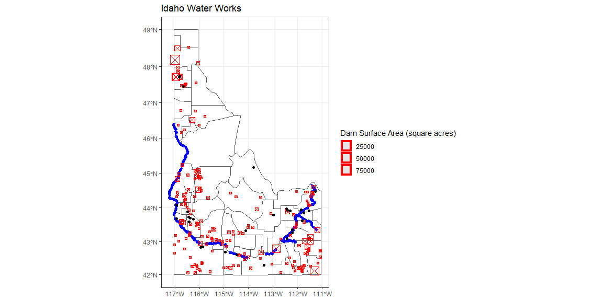

```r
# Use this R-Chunk to import all your datasets!
pathb <- "https://byuistats.github.io/M335/data/shp.zip"
pathw <- "https://opendata.arcgis.com/datasets/1abb666937894ae4a87afe9655d2ff83_1.zip?outSR=%7B%22latestWkid%22%3A102605%2C%22wkid%22%3A102605%7D"
pathd <- "https://opendata.arcgis.com/datasets/e163d7da3b84410ab94700a92b7735ce_0.zip?outSR=%7B%22latestWkid%22%3A102605%2C%22wkid%22%3A102605%7D"
pathh <- "https://research.idwr.idaho.gov/gis/Spatial/Hydrography/streams_lakes/c_250k/hyd250.zip"

read_my_zip <- function(my_path){
  df <- tempfile()
  uf <- tempfile()
  download(my_path, df, mode = "wb")
  unzip(df, exdir = uf)
  dataset <- read_sf(uf)
  file_delete(df)
  dir_delete(uf)
  dataset
}

state_shapes <- read_my_zip(pathb)
wells <- read_my_zip(pathw)
dams <- read_my_zip(pathd)
water <- read_my_zip(pathh)
```

## Background

We have been asked by the state of Idaho to visualize permitted well locations with a production of more than 5000 gallons and the spatial relationship of the large wells to the locations of large dams (surface area larger than 50 acres). They have provided a shp file for us and given us a web address for the well, dam, and water locations. They would like to have the Snake River and Henrys Fork rivers plotted.

Their US map is projected to show the entire US. You will need to subset the data to Idaho and then reproject the map, so Idaho is not tilted.

## Reading

* [Using library(sf) to read in spatial data](https://r-spatial.github.io/sf/articles/sf2.html)

## Tasks

* [X] Read in all four of the necessary shp file datasets 
* [X] Filter all the data for the specific needs of Idaho
* [X] Create a .png image that plots the required information
* [X] Save your script and .png files to GitHub
* [X] Be prepared to discuss your observations of the well and dam locations in our next class meeting

## Data Wrangling & Visualization


```r
big_dams <- dams %>% mutate(SurfaceAre = parse_number(SurfaceAre)) %>% filter(SurfaceAre > 50)
big_wells <- wells %>% filter(Production > 5000)
river <- water %>% filter(str_detect(FEAT_NAME, "Snake River") | str_detect(FEAT_NAME, "Henry"))
idaho <- state_shapes %>% filter(StateName == "Idaho")
```


```r
# Use this R-Chunk to clean & wrangle your data!
ggplot() +
  geom_sf(data = idaho, fill = "white") +
  geom_sf(data = river, color = "blue", size = 2) +
  geom_sf(data = big_dams, color = "red", pch = 7, aes(size = SurfaceAre)) +
  geom_sf(data = big_wells) +
  theme_bw() +
  labs(size = "Dam Surface Area (square acres)", title = "Idaho Water Works") +
  coord_sf(crs = st_crs(3857))
```

<!-- -->


```r
ggsave("task20.png")
```
