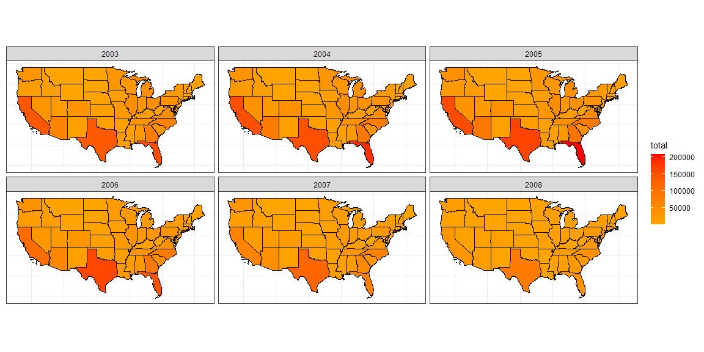
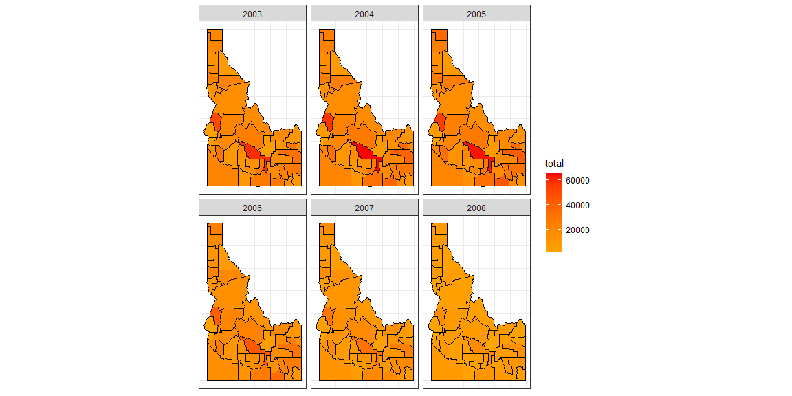
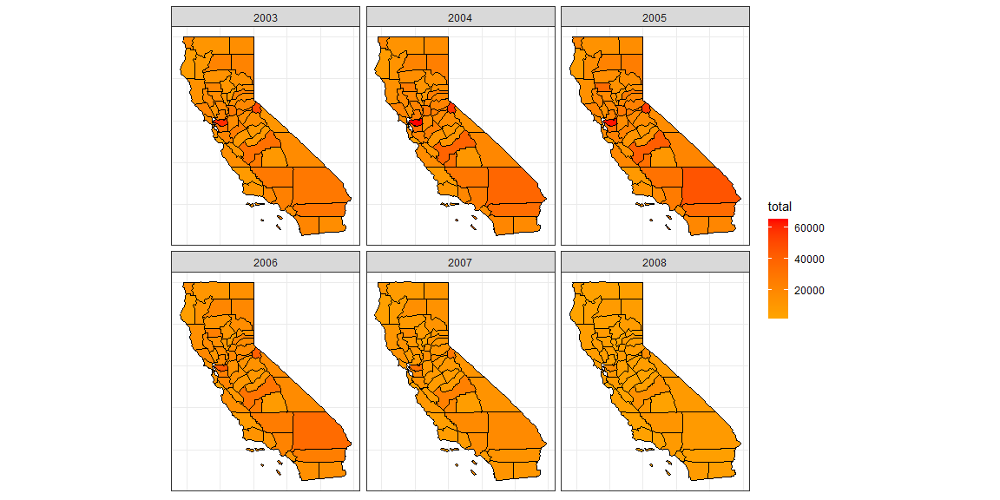

```r
my_continent <- function(dat){dat %>% unique() %>% filter(!state_abbr %in% c("AK","HI","PR"))}
```


```r
# Load States
state <- my_continent(us_states()) %>% mutate(statefp = parse_number(statefp)) 
  
# Load Builds
builds <- permits %>% 
  rename(state_abbr = "StateAbbr") %>% 
  rename(statefp = "state") %>% 
  rename(countyfp = "county") %>% 
  filter(variable == "Single Family") %>% 
  filter(year %in% c(2003, 2004, 2005, 2006, 2007, 2008)) 

builds <- my_continent(builds)
```


```r
my_create <- function(state_str){
  df <- us_counties() %>% unique() %>% 
    filter(state_abbr == state_str) %>%
    mutate(countyfp = parse_number(countyfp))
  
  df
} 
```


```r
my_join <- function(dat1, dat2){
  df <- inner_join(dat1, dat2, by = "countyfp") %>% 
    select(countyfp, countyname, year, value, geometry) %>% 
    group_by(countyfp, year) %>% 
    mutate(total = sum(value)) %>% 
    mutate(total = as.numeric(total)) 
  
  df
}
```


```r
USA <- inner_join(state, builds) %>% 
  select(state_abbr, year, value, geometry) %>% 
  group_by(state_abbr, year) %>% 
  mutate(total = sum(value)) %>% 
  mutate(total = as.numeric(total))

CA <- my_join(my_create("CA"), builds)

ID <- my_join(my_create("ID"), builds)
```

## Background

You have been asked to support a story for the local paper (that has a web presence) that looks back on the housing collapse and the early effects of residential construction. You have data on residential building permits from 1980 through 2010 for each county in the United States. Your colleague that is writing the article would like a few maps and graphics that highlight the single family building permit patterns across your state as well as the patterns in the US.

Remember the big story is the collapse of new building permits at the initial stages of the mortgage crisis. Make sure your graphics highlight the collapse in a clear and honest manner.

## Tasks 

* [X] Read in the permits data from devtools::install_github("hathawayj/buildings") and tidy it for spatial visualization needs
  + [X] You will need to merge it with the spatial data so it will require some column mutation
* [X] Use the library(USAboundaries) package to get the spatial maps for the US
  + [X] You will need to use the FIPS numbers to merge with the permit data
* [X] Create state level totals from the county level data to show general patterns across the US over time
* [X] Create an .Rmd file with 1-2 paragraphs summarizing your graphics and the choices you made in your visualization to address the reporter’s needs
* [X] Compile your .md and .html file into your git repository

## Data Visualization


```r
my_plot <- function(dat){
  ggplot(data = dat) +
    geom_sf(aes(fill = total), color = "black") +
    facet_wrap(~ year) + 
    theme_bw() +
    scale_fill_gradient(low = "orange", high = "red", space = "Lab",
                       na.value = "grey50", guide = "colourbar", aesthetics = "fill") +
    theme(axis.title.x=element_blank(), axis.text.x=element_blank(), axis.ticks.x=element_blank(),
          axis.title.y=element_blank(), axis.text.y=element_blank(), axis.ticks.y=element_blank()) 
}
```

### USA


```r
my_plot(USA)
```

<!-- -->

### ID


```r
my_plot(ID)
```

<!-- -->

### CA


```r
my_plot(CA)
```

<!-- -->

## Conclusions

My plots show the housing market between the years 2006 to 2009.     
I plotted for USA, ID and CA. I used functions to minimize the code. 
