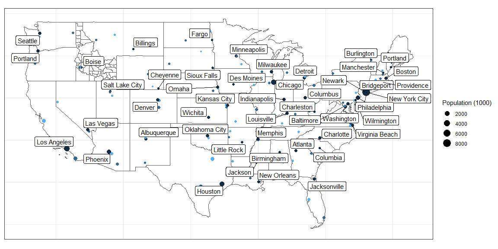
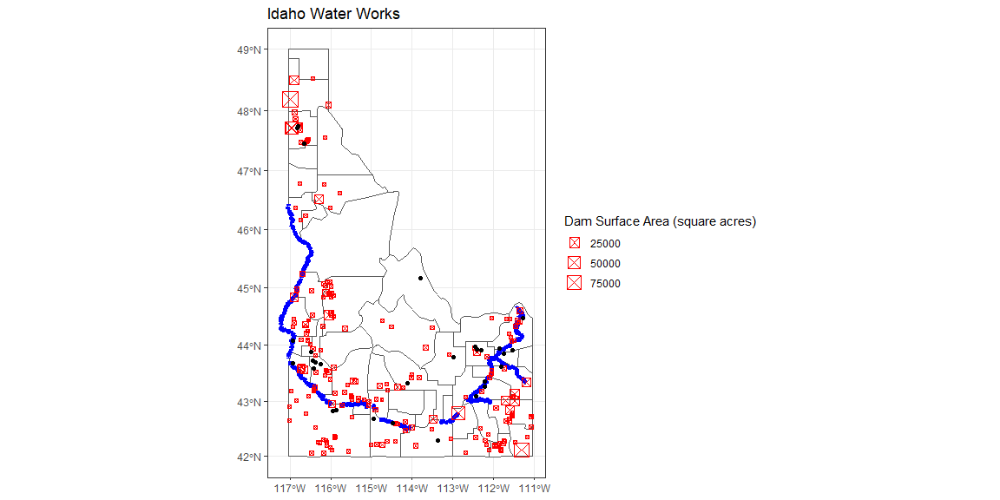

```r
my_continent <- function(dat){dat %>% unique() %>% filter(!state_abbr %in% c("AK","HI","PR"))}
```


```r
state <- my_continent(us_states())
IDcounties <- my_continent(us_counties()) %>% filter(state_abbr == "ID")

city <- my_continent(us_cities()) %>% 
  group_by(state_name) %>% 
  top_n(3, population)
```


```r
my_str <- function(dat){dat %>% unlist() %>% str_flatten("|")}
```


```r
city_max <- my_str(city %>%
  group_by(state_abbr) %>% 
  summarise(max(population)) %>% 
  select(`max(population)`))

city_min <- my_str(city %>%
  group_by(state_abbr) %>% 
  summarise(min(population)) %>% 
  select(`min(population)`))

cities <- city %>% 
  mutate(newpop = (population/1000)) %>% 
  group_by(state_abbr) %>% 
  mutate(rank = case_when(str_detect(population, city_max) ~ 1, str_detect(population, city_min) ~ 3, TRUE ~ 2))

top_cities <- cities %>% filter(rank == 1)
```


```r
pathb <- "https://byuistats.github.io/M335/data/shp.zip"
pathw <- "https://opendata.arcgis.com/datasets/1abb666937894ae4a87afe9655d2ff83_1.zip?outSR=%7B%22latestWkid%22%3A102605%2C%22wkid%22%3A102605%7D"
pathd <- "https://opendata.arcgis.com/datasets/e163d7da3b84410ab94700a92b7735ce_0.zip?outSR=%7B%22latestWkid%22%3A102605%2C%22wkid%22%3A102605%7D"
pathh <- "https://research.idwr.idaho.gov/gis/Spatial/Hydrography/streams_lakes/c_250k/hyd250.zip"
```


```r
read_my_zip <- function(my_path){
  df <- tempfile()
  uf <- tempfile()
  download(my_path, df, mode = "wb")
  unzip(df, exdir = uf)
  dataset <- read_sf(uf)
  file_delete(df)
  dir_delete(uf)
  dataset
}
```


```r
big_dams <- read_my_zip(pathd) %>% 
  mutate(SurfaceAre = parse_number(SurfaceAre)) %>% 
  filter(SurfaceAre > 50)

big_wells <- read_my_zip(pathw) %>% 
  filter(Production > 5000) 

river <- read_my_zip(pathh) %>% 
  filter(str_detect(FEAT_NAME, "Snake River") | str_detect(FEAT_NAME, "Henry"))

idaho <- read_my_zip(pathb) %>% 
  filter(StateName == "Idaho" & StateFIPSN == 16)
```

## Background

Choose from Task 19 or Task 20 and recreate your plot using leaflet

## Reading 

* Leaflet for R: Introduction
* Leaflet for R: The Map Widget
* Leaflet for R: Basemaps
* Leaflet for R: Markers
* Leaflet for R: Popups and Labels
* Leaflet for R: Lines and Shapes
* Leaflet for R: Colors

## Tasks

*See tasks for Task 19 (Leaflet)*

* [X] Create a plot that closely matches my example
  + [X] library(USAboundaries) has three useful functions - us_cities(), us_states(), and us_counties()

*See tasks for Task 20 (Leaflet)*

## Data Visualization

### Task 19


```r
ggplot() + 
  geom_sf(data = state, fill = NA) +
  geom_sf(data = IDcounties, fill = NA) +
  geom_sf(data = cities, aes(size = newpop, color = rank)) +
  theme_bw() +
  labs(size = "Population (1000)") +
  guides(color = FALSE) + 
  geom_label_repel(data = top_cities, aes(label = city, geometry = geometry), stat = "sf_coordinates") +
  theme(axis.title.x=element_blank(), axis.text.x=element_blank(), axis.ticks.x=element_blank(),
        axis.title.y=element_blank(), axis.text.y=element_blank(), axis.ticks.y=element_blank()) 
```

<!-- -->

### Task 20


```r
# Use this R-Chunk to clean & wrangle your data!
ggplot() +
  geom_sf(data = idaho, fill = "white") +
  geom_sf(data = river, color = "blue", size = 2) +
  geom_sf(data = big_dams, color = "red", pch = 7, aes(size = SurfaceAre)) +
  geom_sf(data = big_wells) +
  theme_bw() +
  labs(size = "Dam Surface Area (square acres)", title = "Idaho Water Works") +
  coord_sf(crs = st_crs(3857))
```

<!-- -->

### Task 21

#### Task 19 Plot

```r
leaflet(data = state) %>% 
  addTiles() %>% 
  addPolygons(data = IDcounties, fillColor = topo.colors(10, alpha = NULL), color = "black") %>% 
  addCircles(data = cities, color = "red") %>% 
  addMarkers(data = top_cities, popup = ~htmlEscape(city)) 
```

<!--html_preserve--><div id="htmlwidget-d2bed5330c0dc1cee792" style="width:1152px;height:576px;" class="leaflet html-widget"></div>
<script type="application/json" data-for="htmlwidget-d2bed5330c0dc1cee792">{"x":{"options":{"crs":{"crsClass":"L.CRS.EPSG3857","code":null,"proj4def":null,"projectedBounds":null,"options":{}}},"calls":[{"method":"addTiles","args":["//{s}.tile.openstreetmap.org/{z}/{x}/{y}.png",null,null,{"minZoom":0,"maxZoom":18,"tileSize":256,"subdomains":"abc","errorTileUrl":"","tms":false,"noWrap":false,"zoomOffset":0,"zoomReverse":false,"opacity":1,"zIndex":1,"detectRetina":false,"attribution":"&copy; <a href=\"http://openstreetmap.org\">OpenStreetMap<\/a> contributors, <a href=\"http://creativecommons.org/licenses/by-sa/2.0/\">CC-BY-SA<\/a>"}]},{"method":"addPolygons","args":[[[[{"lng":[-116.976024,-116.959871,-116.937342,-116.977351,-116.897854677115,-116.452068,-116.452551,-116.532117,-116.572224,-116.712501,-116.712672,-116.853154,-116.95452,-116.98554503849,-116.976024],"lat":[43.895548,43.982925,44.029376,44.085364,44.1526663953914,44.151465,44.065414,44.066024,43.980485,43.981326,43.807161,43.79271,43.836487,43.8811848528138,43.895548]}]],[[{"lng":[-115.086155,-114.594605,-114.594375,-114.617293,-114.616487,-114.812167,-114.857807,-114.933622,-114.901636,-114.960322,-115.037774,-115.086852,-115.086155],"lat":[43.198064,43.198345,42.850901,42.839761,42.649298,42.664415,42.755301,42.766931,42.859108,42.914925,42.911864,42.91456,43.198064]}]],[[{"lng":[-117.040490375568,-116.629059,-116.586549,-116.329406,-116.329418,-116.45812,-116.835269,-116.967735,-117.039833386028,-117.039836,-117.040159751863,-117.040490375568],"lat":[47.366028886698,47.371438,47.414695,47.414011,47.021915,47.036596,47.032452,47.115232,47.1272689922541,47.154734,47.259272,47.366028886698]}]],[[{"lng":[-117.041306446459,-116.634114,-116.504329,-116.505104,-116.329538,-116.329406,-116.586549,-116.629059,-117.040490375568,-117.041634,-117.041306446459],"lat":[47.9774559200268,47.977073,47.991386,47.890142,47.890393,47.414011,47.414695,47.371438,47.366028886698,47.7353,47.9774559200268]}]],[[{"lng":[-115.083071,-115.033834,-115.009699,-115.04234,-114.989258,-114.847781,-114.714648,-114.666202,-114.682355,-114.586743,-114.595698,-114.508233,-114.546546,-114.534488,-114.394606,-114.374962,-114.594605,-115.086155,-115.083071],"lat":[43.604399,43.618636,43.715585,43.745582,43.858563,43.816381,43.814669,43.737962,43.590349,43.558826,43.531235,43.481512,43.435445,43.333383,43.326467,43.19964,43.198345,43.198064,43.604399]}]],[[{"lng":[-112.999965,-112.654028,-112.653989,-112.497849,-112.498139,-112.419825,-112.298113,-112.327102,-112.190656,-112.126194,-112.071014,-112.10921,-112.109512054212,-112.109532,-112.15917745151,-112.264936,-112.648019,-113.000040139624,-112.999965],"lat":[42.327427,42.328872,42.416169,42.415998,42.502967,42.503038,42.454499,42.323836,42.350839,42.285229,42.238475,42.169781,41.9975980962947,41.997598,41.9986819297378,42.000991,42.000307,41.9982276125391,42.327427]}]],[[{"lng":[-117.041214453461,-117.041107,-117.035289,-117.033671,-117.032939182117,-116.785174,-116.784878,-116.049156520649,-116.049155,-116.048948,-116.048929247776,-116.048911,-116.049153,-116.038565829873,-116.233113,-116.282236,-116.329601,-116.329538,-116.505104,-116.504329,-116.634114,-117.041306446459,-117.041214453461],"lat":[48.0454651038028,48.124904,48.422732,48.656902,48.8466679212015,48.847402,48.500472,48.5020424817581,48.481247,48.309847,48.2161279479271,48.12493,47.999923,47.9846342564417,48.06889,48.059386,48.017722,47.890393,47.890142,47.991386,47.977073,47.9774559200268,48.0454651038028]}]],[[{"lng":[-116.273069,-116.213871,-116.11249,-116.103072,-115.520287,-115.401408,-115.357484,-115.294614,-115.178964,-115.167684,-115.024181,-115.04356,-114.990777,-115.067482,-115.136209,-115.181931,-115.230528,-115.197067,-115.287226,-115.508722,-115.547538,-115.592796,-115.627317,-115.696456,-115.875927,-115.975719,-115.993107,-116.263384,-116.282019,-116.273069],"lat":[44.151227,44.151387,44.147839,44.236409,44.235356,44.259623,44.345959,44.339445,44.296521,44.20284,44.155478,44.05882,43.949723,43.940745,43.983859,44.090533,44.098766,44.068552,43.93552,43.884855,43.792667,43.798289,43.722865,43.666505,43.591265,43.591438,43.595313,43.793792,43.807365,44.151227]}]],[[{"lng":[-111.398782,-111.187571,-111.04721938442,-111.046515,-111.04611,-111.04536056097,-111.207561,-111.243839,-111.399765,-111.398782],"lat":[43.923184,43.932191,43.9834527607018,43.908376,43.687848,43.5010514511122,43.543857,43.621853,43.621976,43.923184]}]],[[{"lng":[-113.243478,-113.007712,-113.00776,-112.816578,-112.750562,-112.747491,-112.558693,-112.515519,-112.49691,-112.37967,-112.419825,-112.498139,-112.497849,-112.653989,-112.654028,-112.999965,-113.002792,-113.175678,-113.236968,-113.178633,-113.178877,-113.236943,-113.243478],"lat":[43.110946,43.110933,42.863051,42.863231,42.951528,42.912735,42.961247,42.909975,42.733013,42.646273,42.503038,42.502967,42.415998,42.416169,42.328872,42.327427,42.588003,42.589464,42.625254,42.67546,42.762355,42.762212,43.110946]}]],[[{"lng":[-112.155935,-112.034317,-112.033664,-111.913601,-111.857851,-111.852276,-111.791541,-111.791624,-111.617437,-111.617107034305,-111.562814,-111.519126,-111.468833,-111.456947232494,-111.438793,-111.385005,-111.377138236735,-111.323669,-111.26875,-111.224161,-111.201459,-111.143557,-111.122654,-111.048974,-111.049148,-111.048452,-111.04721938442,-111.187571,-111.398782,-111.501009,-111.558833,-111.837308,-111.976833,-111.97709,-112.15637,-112.155935],"lat":[44.05778,44.057358,44.144049,44.144337,44.187759,44.316996,44.317021,44.40161,44.401254,44.5571272484186,44.555209,44.582916,44.679335,44.6956407378395,44.720546,44.755128,44.7511964139636,44.724474,44.668279,44.623402,44.575696,44.535732,44.493659,44.474072,44.374925,44.114831,43.9834527607018,43.932191,43.923184,43.929272,43.883305,43.927158,43.927431,43.970929,43.971382,44.05778]}]],[[{"lng":[-112.695242,-112.694744,-112.155935,-112.15637,-111.97709,-111.976833,-111.983527,-111.934357,-111.717356,-111.626043,-112.519861,-112.639238,-112.697385,-112.695242],"lat":[43.971941,44.058464,44.05778,43.971382,43.970929,43.927431,43.753806,43.76616,43.655326,43.626756,43.626623,43.626574,43.623139,43.971941]}]],[[{"lng":[-111.626104,-111.552151,-111.599188,-111.579764,-111.61763,-111.368065,-111.279388,-111.242455,-111.234827,-111.171174,-111.045530292713,-111.04708,-111.046689,-111.374129,-111.471381,-111.507806195687,-111.507813035176,-111.521577,-111.599116,-111.626104],"lat":[42.207542,42.351386,42.415818,42.429908,42.583037,42.590294,42.552861,42.60303,42.478329,42.4732,42.5139128777751,42.34942,42.001567,42.000893,41.999739,41.9996856783643,41.9996856683522,42.074437,42.099006,42.207542]}]],[[{"lng":[-115.279663,-115.168309,-115.151795,-115.089046,-114.953926,-114.812434,-114.819855,-114.74165,-114.662714,-114.562703,-114.477309,-114.386634,-114.406309,-114.344308,-114.221205,-114.189803,-114.215702,-114.135948,-114.084698,-114.021616,-113.81535,-113.503476,-113.45256,-113.341034,-113.320672,-113.416796,-113.416344,-113.457929,-113.453713,-113.361529,-113.412487,-113.528063,-113.758864,-113.798017,-113.813355,-113.97447,-114.029718,-114.070019,-114.275725,-114.292484,-114.359293,-114.507778,-114.56235,-114.681168,-114.81379,-114.813873,-114.873372,-114.971351,-114.990777,-115.04356,-115.024181,-115.167684,-115.178964,-115.294614,-115.228241,-115.246996,-115.305022,-115.279663],"lat":[44.612095,44.647451,44.728171,44.770877,44.720997,44.808138,44.747227,44.653252,44.662131,44.575665,44.594118,44.670988,44.719319,44.793921,44.879122,44.824723,44.745429,44.730309,44.755725,44.652192,44.494175,44.422479,44.455519,44.318797,44.232998,44.233311,44.059209,44.059209,43.873739,43.797376,43.81684,43.719091,43.6233,43.569058,43.600059,43.708186,43.773361,43.734696,43.831138,43.887062,43.874177,43.89909,43.844368,43.927705,43.927772,43.992941,43.992949,43.938308,43.949723,44.05882,44.155478,44.20284,44.296521,44.339445,44.422868,44.519552,44.579727,44.612095]}]],[[{"lng":[-116.865338,-116.833632,-116.858313,-116.841314,-116.78371,-116.783128263267,-116.754643,-116.696047,-116.690926620091,-116.342876,-116.285969,-116.144527,-116.089118,-116.197011,-116.211211,-116.157627,-116.183571,-116.157022,-116.213314,-116.299876,-116.407648,-116.528898,-116.529167,-116.624153,-116.625034,-116.889295186967,-116.865338],"lat":[44.870599,44.928976,44.978761,45.030907,45.076972,45.07771250501,45.113972,45.254679,45.2689552384449,45.267872,45.128732,45.107652,45.063617,44.864216,44.780872,44.702027,44.583655,44.498928,44.510813,44.444576,44.444436,44.491545,44.615154,44.663269,44.838952,44.8405297781533,44.870599]}]],[[{"lng":[-117.032351,-116.757234,-116.417503,-116.049193,-116.049156520649,-116.784878,-116.785174,-117.032939182117,-117.032351],"lat":[48.999188,48.999943,49.000099,49.000912,48.5020424817581,48.500472,48.847402,48.8466679212015,48.999188]}]],[[{"lng":[-117.023577,-116.98554503849,-116.95452,-116.853154,-116.712672,-116.512502,-116.513123,-116.473597,-116.511897,-116.579167,-116.622569,-116.781336,-116.844978,-116.911538,-117.025663810446,-117.023577],"lat":[43.823811,43.8811848528138,43.836487,43.79271,43.807161,43.807161,43.634183,43.459218,43.29052,43.306178,43.370009,43.478633,43.5944,43.603076,43.680293635954,43.823811]}]],[[{"lng":[-116.512502,-116.282019,-116.263384,-115.993107,-115.975719,-115.974881,-115.978651,-116.266207,-116.385955,-116.425275,-116.511897,-116.473597,-116.513123,-116.512502],"lat":[43.807161,43.807365,43.793792,43.595313,43.591438,43.36502,43.113432,43.112269,43.193577,43.293543,43.29052,43.459218,43.634183,43.807161]}]],[[{"lng":[-117.039833386028,-116.967735,-116.835269,-116.45812,-116.329418,-116.329437,-116.329279,-116.455881,-116.61174,-116.719085,-117.039777655562,-117.039833386028],"lat":[47.1272689922541,47.115232,47.032452,47.036596,47.021915,46.934502,46.6279,46.629097,46.631245,46.542874,46.5417089920381,47.1272689922541]}]],[[{"lng":[-116.455881,-116.329279,-116.329437,-115.63815,-114.961422906068,-114.927432,-114.943281,-114.880588,-114.79004,-114.76718,-114.699008,-114.676827162695,-114.626695,-114.621483,-114.591247894748,-114.594756,-115.629614,-115.651119,-115.733424,-115.748295,-115.814704,-115.999068,-116.052999,-116.170422,-116.183208,-116.308539,-116.369247,-116.369706,-116.451557,-116.455881],"lat":[46.629097,46.6279,46.934502,46.933935,46.9328938759708,46.914185,46.867971,46.811791,46.778729,46.738828,46.740223,46.7318387398131,46.712889,46.658143,46.6525747700772,46.633526,46.473498,46.420613,46.362857,46.297174,46.265718,46.306235,46.355491,46.371589,46.402476,46.412998,46.466971,46.500419,46.49077,46.629097]}]],[[{"lng":[-112.149835,-112.082053,-112.063023,-111.589489,-111.044052705118,-111.043959,-111.043564,-111.045530292713,-111.171174,-111.234827,-111.242455,-111.279388,-111.368065,-111.61763,-111.579764,-111.599188,-111.733715,-111.875636,-111.916927,-111.969449,-112.10588,-112.141034,-112.120335,-112.149835],"lat":[42.895558,42.950425,43.022364,43.020052,43.019407032899,42.96445,42.722624,42.5139128777751,42.4732,42.478329,42.60303,42.552861,42.590294,42.583037,42.429908,42.415818,42.430589,42.416333,42.617264,42.718039,42.699203,42.763093,42.831008,42.895558]}]],[[{"lng":[-112.519861,-111.626043,-111.565974,-111.399765,-111.243839,-111.207561,-111.04536056097,-111.044617,-111.044143,-111.044052705118,-111.589489,-111.588049,-111.822494,-111.822475,-112.043821,-112.043672,-112.103298,-112.520024,-112.519861],"lat":[43.626623,43.626756,43.622037,43.621976,43.621853,43.543857,43.5010514511122,43.31572,43.072364,43.019407032899,43.020052,43.281841,43.282286,43.366035,43.366708,43.410143,43.425057,43.42517,43.626623]}]],[[{"lng":[-117.035545,-117.036645748421,-117.039771,-117.039777655562,-116.719085,-116.61174,-116.455881,-116.451557,-116.369706,-116.369247,-116.368801,-116.489671,-116.713496,-116.701977,-116.745194,-116.799204532501,-116.859795,-116.886843,-116.915989,-116.942656,-116.981962,-116.935473,-116.923958,-116.962966,-116.964379,-116.99726,-117.062748,-117.035545],"lat":[46.410012,46.4261004826554,46.471779,46.5417089920381,46.542874,46.631245,46.629097,46.49077,46.500419,46.466971,46.343217,46.325586,46.325527,45.996177,45.873653,45.8510454354829,45.907264,45.958617,45.995413,46.061,46.084915,46.142448,46.17092,46.19968,46.253282,46.303151,46.353624,46.410012]}]],[[{"lng":[-114.812434,-114.72307,-114.694126,-114.604026,-114.793633,-114.793263,-114.663529,-114.523710674935,-114.506341,-114.456764,-114.36852,-114.279217,-114.251836,-114.18647,-114.083149,-114.014973,-114.015633,-113.971565,-113.94832148257,-113.898883,-113.861404,-113.806729,-113.802849,-113.759986,-113.763368,-113.73239,-113.735601,-113.650064,-113.57467,-113.510819,-113.45197,-113.437726,-113.448958,-113.474573,-113.422376,-113.377153,-113.301508,-113.247166,-113.131387,-113.101154,-113.049349,-113.061071,-113.006828,-113.006846,-112.951146,-112.881769,-112.826826881265,-112.813792,-112.995379,-113.320672,-113.341034,-113.45256,-113.503476,-113.81535,-114.021616,-114.084698,-114.135948,-114.215702,-114.189803,-114.221205,-114.344308,-114.406309,-114.386634,-114.477309,-114.562703,-114.662714,-114.74165,-114.819855,-114.812434],"lat":[44.808138,44.891124,45.197114,45.295618,45.436614,45.508641,45.471215,45.5852330860002,45.559216,45.543983,45.492716,45.480616,45.537812,45.545539,45.603996,45.654008,45.696127,45.700636,45.6825773584415,45.644167,45.62366,45.602146,45.523159,45.480735,45.427732,45.385058,45.325265,45.23471,45.128411,45.099902,45.059247,45.006967,44.953544,44.910846,44.842595,44.834858,44.798985,44.82295,44.764738,44.708578,44.62938,44.577329,44.518439,44.471715,44.416699,44.380315,44.4052024317675,44.230281,44.233956,44.232998,44.318797,44.455519,44.422479,44.494175,44.652192,44.755725,44.730309,44.745429,44.824723,44.879122,44.793921,44.719319,44.670988,44.594118,44.575665,44.662131,44.653252,44.747227,44.808138]}]],[[{"lng":[-116.266207,-115.978651,-115.974881,-115.975719,-115.875927,-115.696456,-115.627317,-115.592796,-115.547538,-115.508722,-115.287226,-115.197067,-115.230528,-115.181931,-115.136209,-115.067482,-114.990777,-114.971351,-114.996687,-114.989258,-115.04234,-115.009699,-115.033834,-115.083071,-115.086155,-115.086852,-115.037774,-115.037697,-115.454224,-115.441522,-115.622852,-115.771505,-115.791812,-115.935655,-115.964966,-116.145817,-116.20174,-116.191672,-116.266207],"lat":[43.112269,43.113432,43.36502,43.591438,43.591265,43.666505,43.722865,43.798289,43.792667,43.884855,43.93552,44.068552,44.098766,44.090533,43.983859,43.940745,43.949723,43.938308,43.914407,43.858563,43.745582,43.715585,43.618636,43.604399,43.198064,42.91456,42.911864,42.768414,42.767936,42.931127,42.955698,42.938664,42.972348,43.001733,42.943673,43.013416,43.04893,43.082473,43.112269]}]],[[{"lng":[-114.617293,-114.594375,-114.365366,-114.345659,-114.04987,-114.049868,-113.932904,-113.931799,-114.000388,-114.045718,-114.130573,-114.375289,-114.616487,-114.617293],"lat":[42.839761,42.850901,42.85079,42.809055,42.808521,42.765121,42.765032,42.535243,42.526373,42.528766,42.494996,42.598227,42.649298,42.839761]}]],[[{"lng":[-116.21291,-116.152295,-116.157022,-116.183571,-116.157627,-116.211211,-116.197011,-116.089118,-116.144527,-116.121743,-116.08143,-115.974957,-115.975756,-114.694126,-114.72307,-114.812434,-114.953926,-115.089046,-115.151795,-115.168309,-115.279663,-115.305022,-115.246996,-115.228241,-115.294614,-115.357484,-115.401408,-115.520287,-116.103072,-116.11249,-116.213871,-116.21291],"lat":[44.324373,44.324519,44.498928,44.583655,44.702027,44.780872,44.864216,45.063617,45.107652,45.15871,45.152885,45.219699,45.195499,45.197114,44.891124,44.808138,44.720997,44.770877,44.728171,44.647451,44.612095,44.579727,44.519552,44.422868,44.339445,44.345959,44.259623,44.235356,44.236409,44.147839,44.151387,44.324373]}]],[[{"lng":[-113.932904,-113.763862,-113.76382,-113.714044,-113.714642,-113.413867,-113.413138,-113.472155,-113.472177,-113.557193,-113.654149,-113.699044,-113.778137,-113.931799,-113.932904],"lat":[42.765032,42.764508,42.849823,42.849734,43.199783,43.199859,42.849169,42.849201,42.669352,42.656799,42.536155,42.51919,42.556424,42.535243,42.765032]}]],[[{"lng":[-113.758864,-113.528063,-113.412487,-113.361529,-113.453713,-113.457929,-113.416344,-113.416796,-113.320672,-112.995379,-112.994195,-112.695242,-112.697385,-112.69908,-112.816193,-112.816659,-112.936835,-112.947187,-113.00729,-113.361958,-113.36191,-113.63523,-113.634325,-113.701153,-113.798017,-113.758864],"lat":[43.6233,43.719091,43.81684,43.797376,43.873739,44.059209,44.059209,44.233311,44.232998,44.233956,43.972403,43.971941,43.623139,43.540244,43.535869,43.449048,43.449386,43.284725,43.284778,43.284678,43.36716,43.367546,43.497474,43.584553,43.569058,43.6233]}]],[[{"lng":[-114.285448,-114.069162,-114.067073,-114.000388,-113.931799,-113.778137,-113.699044,-113.654149,-113.557193,-113.472177,-113.373117,-113.3044,-113.236968,-113.175678,-113.002792,-112.999965,-113.000040139624,-113.000821,-113.249159,-113.496548,-113.817964,-114.041723,-114.28179946722,-114.285448],"lat":[42.417333,42.417124,42.514453,42.526373,42.535243,42.556424,42.51919,42.536155,42.656799,42.669352,42.687638,42.628749,42.625254,42.589464,42.588003,42.327427,41.9982276125391,41.998223,41.996203,41.993305,41.98858,41.99372,41.9942138857579,42.417333]}]],[[{"lng":[-116.713496,-116.489671,-116.368801,-116.369247,-116.308539,-116.183208,-116.170422,-116.127163,-116.012665,-116.133369,-116.189977,-116.44927,-116.514484,-116.53014,-116.638651,-116.701977,-116.713496],"lat":[46.325527,46.325586,46.343217,46.466971,46.412998,46.402476,46.371589,46.29861,46.225747,46.215189,46.154379,46.196751,46.131828,46.000661,46.036076,45.996177,46.325527]}]],[[{"lng":[-111.976833,-111.837308,-111.558833,-111.501009,-111.398782,-111.399765,-111.565974,-111.626043,-111.717356,-111.934357,-111.983527,-111.976833],"lat":[43.927431,43.927158,43.883305,43.929272,43.923184,43.621976,43.622037,43.626756,43.655326,43.76616,43.753806,43.927431]}]],[[{"lng":[-114.594605,-114.374962,-113.714642,-113.714044,-113.76382,-113.763862,-113.932904,-114.049868,-114.04987,-114.345659,-114.365366,-114.594375,-114.594605],"lat":[43.198345,43.19964,43.199783,42.849734,42.849823,42.764508,42.765032,42.765121,42.808521,42.809055,42.85079,42.850901,43.198345]}]],[[{"lng":[-114.996687,-114.971351,-114.873372,-114.813873,-114.81379,-114.681168,-114.56235,-114.507778,-114.359293,-114.292484,-114.275725,-114.070019,-114.029718,-113.97447,-113.813355,-113.798017,-113.701153,-113.634325,-113.63523,-113.36191,-113.361958,-113.00729,-113.007712,-113.243478,-113.236943,-113.178877,-113.178633,-113.236968,-113.3044,-113.373117,-113.472177,-113.472155,-113.413138,-113.413867,-113.714642,-114.374962,-114.394606,-114.534488,-114.546546,-114.508233,-114.595698,-114.586743,-114.682355,-114.666202,-114.714648,-114.847781,-114.989258,-114.996687],"lat":[43.914407,43.938308,43.992949,43.992941,43.927772,43.927705,43.844368,43.89909,43.874177,43.887062,43.831138,43.734696,43.773361,43.708186,43.600059,43.569058,43.584553,43.497474,43.367546,43.36716,43.284678,43.284778,43.110933,43.110946,42.762212,42.762355,42.67546,42.625254,42.628749,42.687638,42.669352,42.849201,42.849169,43.199859,43.199783,43.19964,43.326467,43.333383,43.435445,43.481512,43.531235,43.558826,43.590349,43.737962,43.814669,43.816381,43.858563,43.914407]}]],[[{"lng":[-115.037697,-115.037774,-114.960322,-114.901636,-114.933622,-114.857807,-114.812167,-114.616487,-114.375289,-114.130573,-114.045718,-114.000388,-114.067073,-114.069162,-114.285448,-114.28179946722,-114.281855,-114.598267,-114.89921,-115.038109752434,-115.037697],"lat":[42.768414,42.911864,42.914925,42.859108,42.766931,42.755301,42.664415,42.649298,42.598227,42.494996,42.528766,42.526373,42.514453,42.417124,42.417333,41.9942138857579,41.994214,41.994511,41.999909,41.9986341156765,42.768414]}]],[[{"lng":[-116.712501,-116.572224,-116.532117,-116.452551,-116.452068,-116.358492,-116.347394,-116.299876,-116.213314,-116.157022,-116.152295,-116.21291,-116.213871,-116.273069,-116.282019,-116.512502,-116.712672,-116.712501],"lat":[43.981326,43.980485,44.066024,44.065414,44.151465,44.151158,44.322103,44.444576,44.510813,44.498928,44.324519,44.324373,44.151387,44.151227,43.807365,43.807161,43.807161,43.981326]}]],[[{"lng":[-117.243027,-117.215072,-117.225932,-117.167187,-117.14293,-117.094968,-117.062273,-117.013802,-116.9318,-116.889295186967,-116.625034,-116.624153,-116.529167,-116.528898,-116.407648,-116.299876,-116.347394,-116.358492,-116.452068,-116.897854677115,-116.895931,-116.902752,-116.965498,-116.971958,-117.059352,-117.121037,-117.170342,-117.216974,-117.211995506953,-117.192203,-117.216911,-117.243027],"lat":[44.390974,44.427162,44.479389,44.523431,44.557236,44.652011,44.727143,44.756841,44.787181,44.8405297781533,44.838952,44.663269,44.615154,44.491545,44.444436,44.444576,44.322103,44.151158,44.151465,44.1526663953914,44.154295,44.179467,44.194126,44.235677,44.237244,44.277585,44.25889,44.288357,44.2964510959383,44.32863,44.360163,44.390974]}]],[[{"lng":[-112.995379,-112.813792,-112.826826881265,-112.821896,-112.828191,-112.735084,-112.707815,-112.601863,-112.473207,-112.387389,-112.358917,-112.286187,-112.221698,-112.125101,-112.034133,-111.870504,-111.807914,-111.704218,-111.617107034305,-111.617437,-111.791624,-111.791541,-111.852276,-111.857851,-111.913601,-112.033664,-112.034317,-112.155935,-112.694744,-112.695242,-112.994195,-112.995379],"lat":[44.233956,44.230281,44.4052024317675,44.407436,44.442472,44.499159,44.503023,44.491015,44.480027,44.448058,44.528847,44.568472,44.543519,44.528527,44.537716,44.564033,44.511716,44.560205,44.5571272484186,44.401254,44.40161,44.317021,44.316996,44.187759,44.144337,44.144049,44.057358,44.05778,44.058464,43.971941,43.972403,44.233956]}]],[[{"lng":[-112.126194,-111.98365,-111.896728,-111.875636,-111.733715,-111.599188,-111.552151,-111.626104,-111.599116,-111.521577,-111.507813035176,-111.750778,-112.109512054212,-112.10921,-112.071014,-112.126194],"lat":[42.285229,42.285549,42.256276,42.416333,42.430589,42.415818,42.351386,42.207542,42.099006,42.074437,41.9996856683522,41.99933,41.9975980962947,42.169781,42.238475,42.285229]}]],[[{"lng":[-116.329601,-116.282236,-116.233113,-116.038565829873,-116.030751,-115.959946,-115.900934,-115.845474,-115.835365,-115.72377,-115.73627,-115.694284,-115.721207,-115.717024,-115.634684,-115.69293,-115.71034,-115.578619,-115.531971,-115.470959,-115.371825,-115.326903,-115.29211,-115.255786,-115.189451,-115.120917,-115.071254,-115.031651,-114.961422906068,-115.63815,-116.329437,-116.329418,-116.329406,-116.329538,-116.329601],"lat":[48.017722,48.059386,48.06889,47.9846342564417,47.973349,47.898142,47.843064,47.814967,47.760957,47.696671,47.654762,47.62346,47.576323,47.532693,47.48176,47.457237,47.417784,47.367007,47.314121,47.284873,47.265213,47.255912,47.209861,47.174725,47.131032,47.061237,47.022083,46.971548,46.9328938759708,46.933935,46.934502,47.021915,47.414011,47.890393,48.017722]}]],[[{"lng":[-113.007712,-113.00729,-112.947187,-112.936835,-112.816659,-112.816193,-112.69908,-112.697385,-112.639238,-112.519861,-112.520024,-112.103298,-112.043672,-112.043821,-111.822475,-111.822494,-111.588049,-111.589489,-112.063023,-112.678364,-112.750562,-112.816578,-113.00776,-113.007712],"lat":[43.110933,43.284778,43.284725,43.449386,43.449048,43.535869,43.540244,43.623139,43.626574,43.626623,43.42517,43.425057,43.410143,43.366708,43.366035,43.282286,43.281841,43.020052,43.022364,43.02173,42.951528,42.863231,42.863051,43.110933]}]],[[{"lng":[-112.750562,-112.678364,-112.063023,-112.082053,-112.149835,-112.120335,-112.141034,-112.10588,-111.969449,-111.916927,-111.875636,-111.896728,-111.98365,-112.126194,-112.190656,-112.327102,-112.298113,-112.419825,-112.37967,-112.49691,-112.515519,-112.558693,-112.747491,-112.750562],"lat":[42.951528,43.02173,43.022364,42.950425,42.895558,42.831008,42.763093,42.699203,42.718039,42.617264,42.416333,42.256276,42.285549,42.285229,42.350839,42.323836,42.454499,42.503038,42.646273,42.733013,42.909975,42.961247,42.912735,42.951528]}]],[[{"lng":[-117.026889,-117.025663810446,-116.911538,-116.844978,-116.781336,-116.622569,-116.579167,-116.511897,-116.425275,-116.385955,-116.266207,-116.191672,-116.20174,-116.145817,-115.964966,-115.935655,-115.791812,-115.771505,-115.622852,-115.441522,-115.454224,-115.037697,-115.038109752434,-115.313877,-115.625914,-115.870181,-116.332763,-116.625947,-117.018203216741,-117.026197,-117.026551,-117.026253,-117.026652,-117.026889],"lat":[43.596033,43.680293635954,43.603076,43.5944,43.478633,43.370009,43.306178,43.29052,43.293543,43.193577,43.112269,43.082473,43.04893,43.013416,42.943673,43.001733,42.972348,42.938664,42.955698,42.931127,42.767936,42.768414,41.9986341156765,41.996103,41.997415,41.996766,41.997283,41.997379,41.9998398503691,41.99989,42.378557,42.807447,43.025128,43.596033]}]],[[{"lng":[-116.799204532501,-116.745194,-116.701977,-116.638651,-116.53014,-116.514484,-116.44927,-116.189977,-116.133369,-116.012665,-116.127163,-116.170422,-116.052999,-115.999068,-115.814704,-115.748295,-115.733424,-115.651119,-115.629614,-114.594756,-114.591247894748,-114.547321,-114.453239,-114.360709,-114.335724935405,-114.320665,-114.331338,-114.351655,-114.403019,-114.384756,-114.422458,-114.431708,-114.441326,-114.449819,-114.445928,-114.514706,-114.5213,-114.460049,-114.480241,-114.441185,-114.402261,-114.413168,-114.388243,-114.422963,-114.517143,-114.562509,-114.504869,-114.499637,-114.53577,-114.538132,-114.523710674935,-114.663529,-114.793263,-114.793633,-114.604026,-114.694126,-115.975756,-115.974957,-116.08143,-116.121743,-116.144527,-116.285969,-116.342876,-116.690926620091,-116.674648,-116.588195,-116.502756,-116.463504,-116.528272,-116.535698,-116.593004,-116.665344,-116.736268,-116.78752,-116.799204532501],"lat":[45.8510454354829,45.873653,45.996177,46.036076,46.000661,46.131828,46.196751,46.154379,46.215189,46.225747,46.29861,46.371589,46.355491,46.306235,46.265718,46.297174,46.362857,46.420613,46.473498,46.633526,46.6525747700772,46.644485,46.649266,46.669059,46.6552729673536,46.646963,46.577781,46.508119,46.498675,46.411784,46.387097,46.310744,46.2738,46.237119,46.173933,46.167726,46.125287,46.097104,46.030325,45.988453,45.961489,45.911479,45.88234,45.855381,45.835993,45.779927,45.722176,45.669035,45.650613,45.606834,45.5852330860002,45.471215,45.508641,45.436614,45.295618,45.197114,45.195499,45.219699,45.152885,45.15871,45.107652,45.128732,45.267872,45.2689552384449,45.314342,45.44292,45.566608,45.615785,45.681473,45.734231,45.778541,45.781998,45.826179,45.840204,45.8510454354829]}]]],null,null,{"interactive":true,"className":"","stroke":true,"color":"black","weight":5,"opacity":0.5,"fill":true,"fillColor":["#4C00FF","#0019FF","#0080FF","#00E5FF","#00FF4D","#4DFF00","#E6FF00","#FFFF00","#FFDE59","#FFE0B3"],"fillOpacity":0.2,"smoothFactor":1,"noClip":false},null,null,null,{"interactive":false,"permanent":false,"direction":"auto","opacity":1,"offset":[0,0],"textsize":"10px","textOnly":false,"className":"","sticky":true},null]},{"method":"addCircles","args":[[33.5274441,30.668426,32.3462512,36.0715607,35.3492757,34.7254318,33.4019259,33.5721625,32.1542888,34.0193936,32.8152995,37.2968672,39.6880021,38.8672553,39.7618487,41.1873858,41.7660453,41.3108088,38.9041485,39.1606061,39.677569,39.7352263,30.3370193,25.775163,27.9700861,33.7629088,33.3655309,32.510197,41.9670481,41.5541036,41.5739461,43.5984881,43.617852,43.582381,41.763455,41.8375511,42.2633938,37.9877339,41.0881729,39.7766644,39.1225389,38.8890422,37.6906938,36.9709194,38.0401572,38.1780769,30.4484535,30.0686361,32.4670204,42.33196,42.115454,42.2694781,39.3002135,39.4330863,39.0836473,44.8306292,44.0895941,43.663811,42.3830375,42.961156,42.4929044,44.9633235,44.0154424,44.9488695,39.125212,37.194152,38.6356988,30.4160584,32.3158308,34.9508416,45.7895184,47.5014389,46.8693223,35.2087069,36.0964835,35.8302035,46.8110381,46.8652063,47.9127893,41.1542932,40.8089574,41.2646751,43.2324926,42.9846891,42.7490744,40.7114174,40.7242204,40.9147462,35.1055517,32.3264441,35.2850958,36.0122334,36.2277116,39.4744867,42.8924919,40.6642738,43.1699272,39.1399019,41.4781381,39.9847989,35.2405774,35.4670795,36.1279488,44.0567484,45.5369506,44.9236937,40.5939656,40.0093755,40.4397525,41.7697341,41.8230556,41.7007569,32.8179219,34.0297833,32.9173424,45.4646777,44.0710712,43.5383351,35.9708752,35.1035431,36.1718001,32.794176,29.7804724,29.4724026,40.2453301,40.7785197,40.6884927,36.6793761,36.9230149,36.7793219,44.4919905,43.6096702,44.4364933,47.6204993,47.6735545,47.2521991,44.5206763,43.0878055,43.0633484,38.3486917,38.4106509,39.2613533,42.8405322,41.1521947,41.3102405],[-86.799047,-88.1002261,-86.2685927,-94.1665396,-94.370883,-92.358556,-111.7173787,-112.0879662,-110.8710622,-118.4108248,-117.134993,-121.8193058,-104.68974,-104.760749,-104.8806251,-73.1957339,-72.6833394,-72.924953,-77.0170942,-75.5216585,-75.7573084,-75.5292892,-81.6613021,-80.2086152,-82.4796734,-84.4226745,-82.0734219,-84.874946,-91.6777599,-90.6039968,-93.616708,-116.2310843,-116.397129,-116.5638753,-88.290099,-87.6818441,-89.0628271,-87.534703,-85.14388,-86.1459355,-94.7417813,-94.6905839,-97.3426776,-86.4384623,-84.4584429,-85.6667077,-91.1258993,-89.9390074,-93.7926845,-71.0201725,-72.5399783,-71.8077831,-76.6105159,-77.4127579,-77.1556178,-68.7923966,-70.1721851,-70.255365,-83.1022365,-85.6555701,-83.0250007,-93.2682835,-92.4772105,-93.1038552,-94.5511362,-93.2913048,-90.2445816,-89.071845,-90.2128226,-89.977981,-108.5498909,-111.299975,-114.0103464,-80.8307389,-79.8271079,-78.6414394,-100.7701017,-96.8290052,-97.0750101,-95.9328384,-96.6803544,-96.0419269,-71.5612523,-71.4438932,-71.4905435,-74.0647599,-74.1725735,-74.1628255,-106.6473884,-106.7896951,-106.6988694,-115.0374619,-115.2640448,-119.7765384,-78.8596862,-73.9385004,-77.6168907,-84.5064465,-81.6794861,-82.9850438,-97.3453056,-97.5136565,-95.9023162,-123.1162068,-122.649971,-123.0231194,-75.4781595,-75.1333459,-79.9765919,-71.4850489,-71.4187795,-71.4203343,-79.9589267,-80.8965664,-80.0651497,-98.468104,-103.2179242,-96.7319985,-83.9464787,-89.9784984,-86.7850016,-96.7655033,-95.3863425,-98.5251419,-111.6448069,-111.9314142,-112.0117586,-76.3017884,-76.2446413,-76.0240202,-73.2393625,-72.9777884,-73.1826185,-122.3508761,-117.4165955,-122.4598318,-87.9841686,-89.4301208,-87.9666952,-81.632324,-82.4346886,-81.5433763,-106.3201684,-104.7832381,-105.6096249],10,null,null,{"interactive":true,"className":"","stroke":true,"color":"red","weight":5,"opacity":0.5,"fill":true,"fillColor":"red","fillOpacity":0.2},null,null,null,{"interactive":false,"permanent":false,"direction":"auto","opacity":1,"offset":[0,0],"textsize":"10px","textOnly":false,"className":"","sticky":true},null,null]},{"method":"addMarkers","args":[[33.5274441,34.7254318,33.5721625,34.0193936,39.7618487,41.1873858,38.9041485,39.7352263,30.3370193,33.7629088,41.5739461,43.5984881,41.8375511,39.7766644,37.6906938,38.1780769,30.0686361,42.33196,39.3002135,43.663811,42.3830375,44.9633235,39.125212,32.3158308,45.7895184,35.2087069,46.8652063,41.2646751,42.9846891,40.7242204,35.1055517,36.2277116,40.6642738,39.9847989,35.4670795,45.5369506,40.0093755,41.8230556,34.0297833,43.5383351,35.1035431,29.7804724,40.7785197,36.7793219,44.4919905,47.6204993,43.0633484,38.3486917,41.1521947],[-86.799047,-92.358556,-112.0879662,-118.4108248,-104.8806251,-73.1957339,-77.0170942,-75.5292892,-81.6613021,-84.4226745,-93.616708,-116.2310843,-87.6818441,-86.1459355,-97.3426776,-85.6667077,-89.9390074,-71.0201725,-76.6105159,-70.255365,-83.1022365,-93.2682835,-94.5511362,-90.2128226,-108.5498909,-80.8307389,-96.8290052,-96.0419269,-71.4438932,-74.1725735,-106.6473884,-115.2640448,-73.9385004,-82.9850438,-97.5136565,-122.649971,-75.1333459,-71.4187795,-80.8965664,-96.7319985,-89.9784984,-95.3863425,-111.9314142,-76.0240202,-73.2393625,-122.3508761,-87.9666952,-81.632324,-104.7832381],null,null,null,{"interactive":true,"draggable":false,"keyboard":true,"title":"","alt":"","zIndexOffset":0,"opacity":1,"riseOnHover":false,"riseOffset":250},["Birmingham","Little Rock","Phoenix","Los Angeles","Denver","Bridgeport","Washington","Wilmington","Jacksonville","Atlanta","Des Moines","Boise","Chicago","Indianapolis","Wichita","Louisville","New Orleans","Boston","Baltimore","Portland","Detroit","Minneapolis","Kansas City","Jackson","Billings","Charlotte","Fargo","Omaha","Manchester","Newark","Albuquerque","Las Vegas","New York City","Columbus","Oklahoma City","Portland","Philadelphia","Providence","Columbia","Sioux Falls","Memphis","Houston","Salt Lake City","Virginia Beach","Burlington","Seattle","Milwaukee","Charleston","Cheyenne"],null,null,null,null,{"interactive":false,"permanent":false,"direction":"auto","opacity":1,"offset":[0,0],"textsize":"10px","textOnly":false,"className":"","sticky":true},null]}],"limits":{"lat":[25.775163,49.000912],"lng":[-123.1162068,-68.7923966]}},"evals":[],"jsHooks":[]}</script><!--/html_preserve-->
