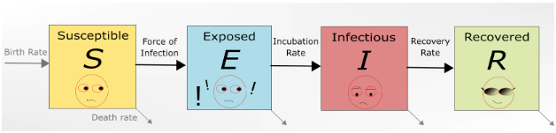

```{r, echo=FALSE}
knitr::opts_chunk$set(echo = TRUE, message = FALSE, warning = FALSE)
```

```{r load_libraries, include=FALSE}
# Use this R-Chunk to load all your libraries!
#install.packages("tidyverse") # run this line once in console to get package
library(tidyverse)

```

```{r load_data}
# Use this R-Chunk to import all your datasets!

```

## Background

This week we are going to get introduced to “big data” principles. We will discuss some of the issues and terminology but will not have any coding tasks associated with “big data”.

## Reading 

* [What is Spark?](https://mapr.com/blog/spark-101-what-it-what-it-does-and-why-it-matters/)
* [What is Hadoop?](https://www.youtube.com/watch?v=4DgTLaFNQq0&feature=youtu.be)

## Tasks

[X] Complete the listed reading for class discussion

[X] Find an additional article on R or Python and “big data” and write a summary of the article

[X] Create an .Rmd file summarizing your reading

[X] Compile your .md and .html file into your git repository

## Conclusions

[Big Data and Artificial Intelligent Can Save the Earth From Covid-19](https://www.eetimes.com/big-data-and-artificial-intelligent-can-save-the-earth-from-covid-19/)

This article is about how data science (BIG DATA) and AI can help fight COVID-19. We can learn the predict of how COVID-19 is transmitted. The SEIR Model can show the transmission of COVID-19 among people. 

```{r, out.width='100%', fig.align='center'}

```