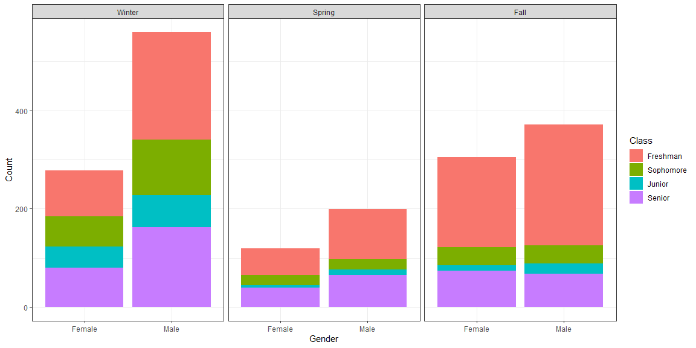
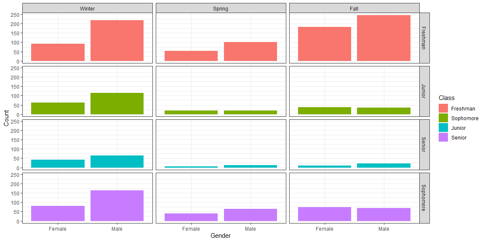
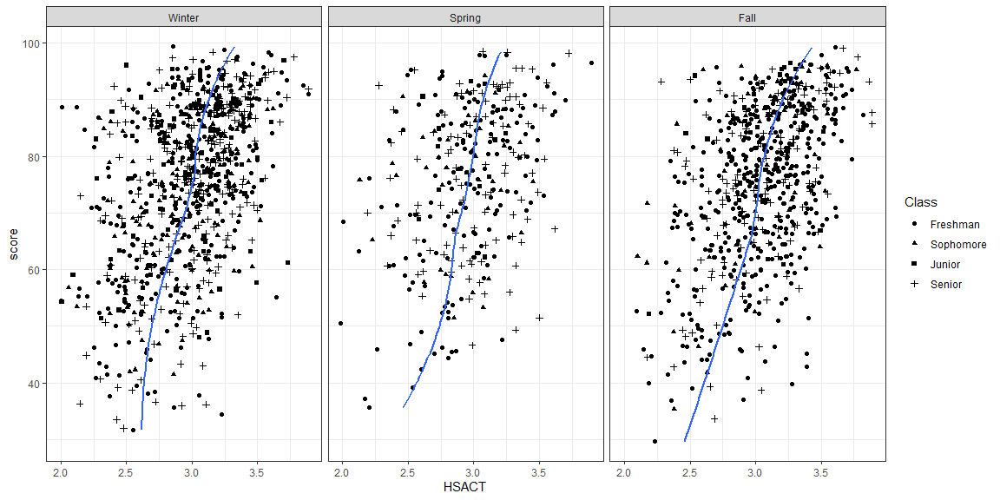
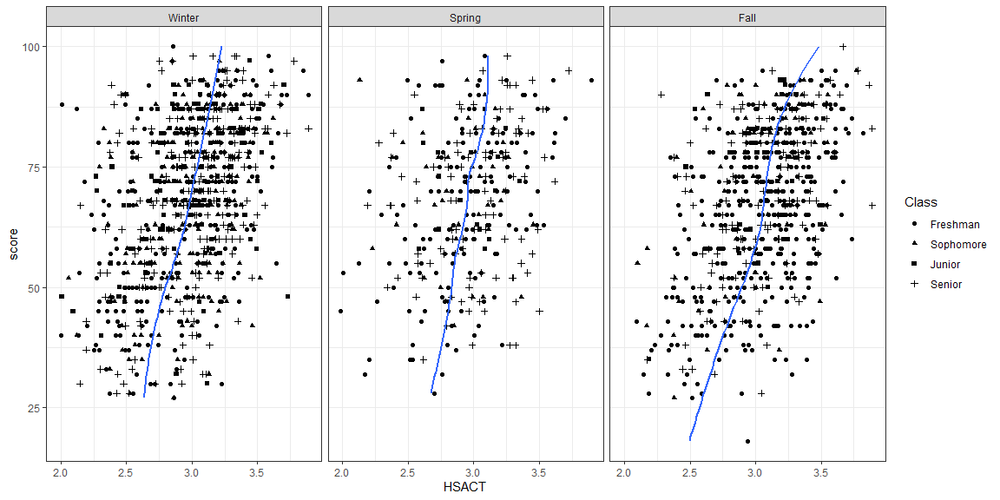
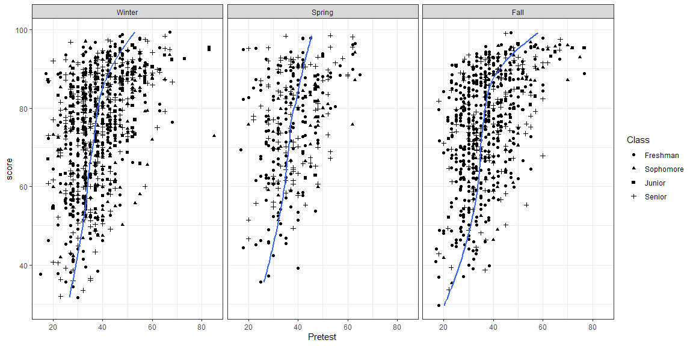
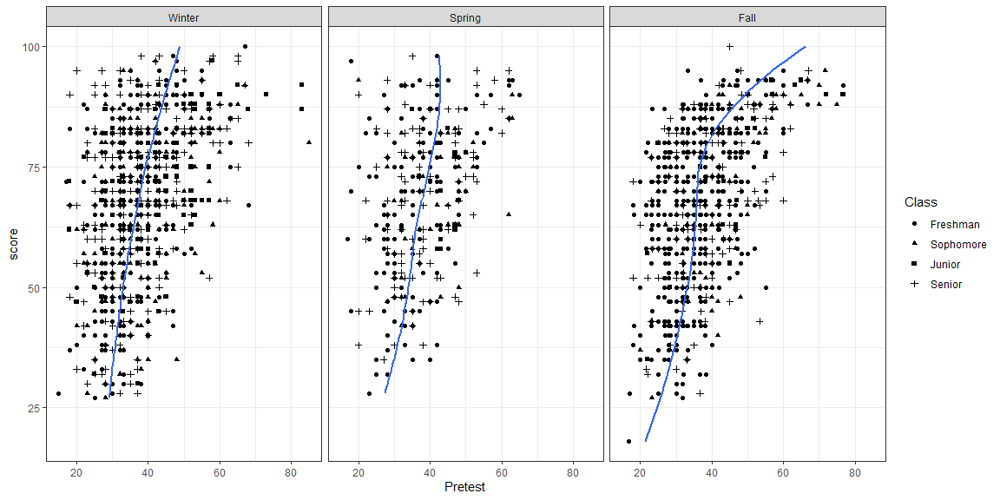
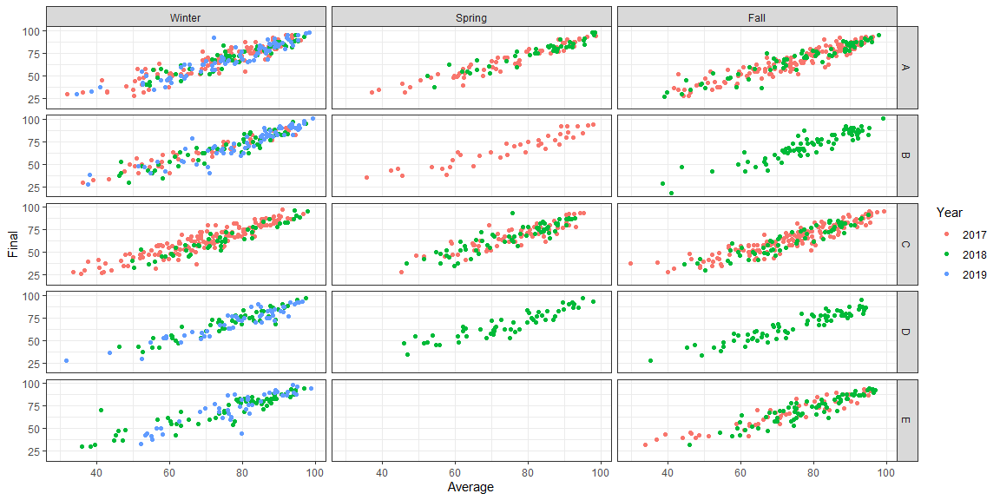
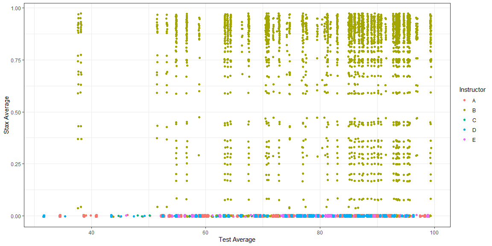
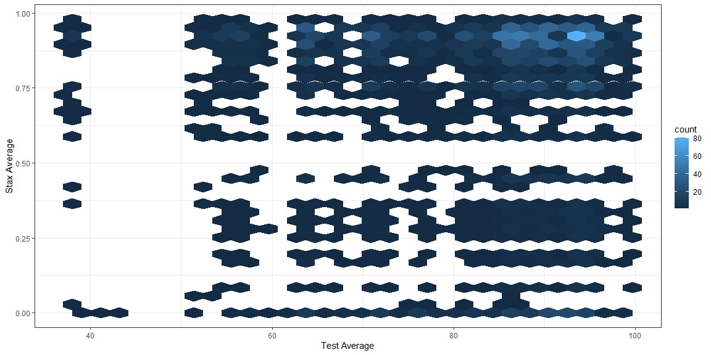

# Semester Project

## Background

This week we will learn new coding techniques and visualization principles. However, your case study will provide time to makes sure you have the semester project completed.

Each of you will be responsible to create a data driven question, find the data to answer this question, and build a visual analysis that answers your question with data. A few notes on this project;

This project is done over a semester. If you try to complete it during the last few weeks of the semester you will not succeed.

The data science majors will submit this as a part of their degree completion. This project could be a great stepping stone for your senior project.

I would highly recommend that you do this project well and make it public on your Github repository to demonstrate to employers that you have data programming skills.

## Brother Diehl    
### Exam Data

* [X] Compare ACT/HS GPA to Final Exam
* [X] Openstax Instuctor vs Normal
* [X] Compare the Professor by semester

## Data Wrangling & Visualizations


```r
# Wrangling for the 1st dataset
exams <- read_csv("180_exams.csv") 

exams <- exams %>% 
  mutate(HS = `HS GPA`) %>% 
  mutate(ACT = `ACT conversion`) %>% 
  select(- `ACT conversion`, - `HS GPA`) %>% 
  mutate(Exam1 = `Exam 1`) %>% 
  mutate(Exam2 = `Exam 2`) %>% 
  mutate(Exam3 = `Exam 3`) %>% 
  mutate(Exam4 = `Exam 4`) %>% 
  mutate(Exam5 = `Exam 5`) %>% 
  select(- `Exam 5`, - `Exam 4`, - `Exam 3`, - `Exam 2`, -`Exam 1`) %>% 
  mutate(Average = (Exam1 + Exam2 + Exam3 + Exam4 + Exam5 + Final)/6) %>% 
  mutate(HSACT = ((ACT/9) + HS)/2) %>% 
  select(- ACT, - HS) %>% 
  filter(!Gender %in% c("#N/A", "0")) %>% 
  filter(!Class %in% c("#N/A", "0", "Non-Matriculating","NonMatriculating")) %>% 
  mutate(Semester = factor(Semester, c("Winter", "Spring", "Fall"))) 

exams$Exam1[is.na(exams$Exam1)] <- 0  # Replace NAs with 0
exams$Exam2[is.na(exams$Exam2)] <- 0
exams$Exam3[is.na(exams$Exam3)] <- 0
exams$Exam4[is.na(exams$Exam4)] <- 0
exams$Exam5[is.na(exams$Exam5)] <- 0
exams$Final[is.na(exams$Final)] <- 0

exams <- exams %>% drop_na()

write.csv(exams,'exams_180.csv')
```


```r
stax_fun <- function(dat){
 df <- dat %>% 
  mutate(courseavg = `Course Average*`) %>% 
  mutate(readingscore = `Reading Score`) %>% 
  mutate(reading = `Reading Progress`) %>% 
  select(- `Course Average*`, - `Reading Score`, - `Reading Progress`) %>% 
  filter(!Gender %in% c("#N/A", "0")) %>% 
  filter(!Class %in% c("#N/A", "0", "Non-Matriculating","NonMatriculating")) %>% 
  mutate(Semester = factor(Semester, c("Winter", "Spring", "Fall"))) 
 
 df
}
```


```r
staxF18 <- stax_fun(read_csv("Stax_F18.csv"))
```


```r
staxW19 <- stax_fun(read_csv("Stax_W19.csv"))
```


```r
stax <- left_join(exams, staxF18) # Join the different data sets
stax <- left_join(exams, staxW19)

stax$courseavg[is.na(stax$courseavg)] <- 0  # Replace NAs with 0
stax$readingscore[is.na(stax$readingscore)] <- 0
stax$reading[is.na(stax$reading)] <- 0

stax <- stax %>% 
  mutate(yrsem = paste(Year, Semester, sep = "_")) %>%   
  filter(yrsem %in% c("2019_Winter", "2018_Fall")) %>% 
  drop_na() %>% 
  select(Year, Semester, Instructor, Gender, Class, Average, courseavg)

write.csv(stax,'stax_180.csv')
```
 
### What is the distribution of people taking Bio 180 by Gender and Semester?


```r
exams %>% select(Year, Semester, Class, Gender) %>% 
ggplot(aes(x = Gender, fill = Class)) + 
  geom_bar() + 
  facet_grid(~ Semester) +
  scale_fill_discrete(labels = c("Freshman", "Sophomore", "Junior", "Senior")) + 
  labs(y = "Count") + 
  theme_bw()
```

<!-- -->


```r
exams %>% select(Year, Semester, Class, Gender) %>% 
ggplot(aes(x = Gender, fill = Class)) + 
  geom_bar() + 
  facet_grid(Class ~ Semester) +
  scale_fill_discrete(labels = c("Freshman", "Sophomore", "Junior", "Senior")) + 
  labs(y = "Count") + 
  theme_bw()
```

<!-- -->

### Does High School predict grades?


```r
test <- exams %>% select(Year, Semester, Average, HSACT, Class, Final)

question2_plot <- function(dat, score){
  ggplot(data = dat, aes(x = score, y = HSACT)) + 
    geom_point(aes(shape = Class)) +
    geom_smooth(se = FALSE) + 
    facet_grid(~ Semester) +
    scale_shape_discrete(labels = c("Freshman", "Sophomore", "Junior", "Senior")) + 
    coord_flip() +
    theme_bw()
}
```

#### Average


```r
question2_plot(test, test$Average)
```

<!-- -->

#### Final


```r
question2_plot(test, test$Final)
```

<!-- -->

### How does the Pretest score predict grades?  


```r
prefinal <- exams %>% select(Year, Semester, Average, Instructor, Class, Final, Pretest)

question3_plot <- function(dat, score){
  ggplot(data = dat, aes(x = score, y = Pretest)) +
    geom_point(aes(shape = Class)) + 
    geom_smooth(se = FALSE) + 
    facet_grid(~ Semester) +
    scale_shape_discrete(labels = c("Freshman", "Sophomore", "Junior", "Senior")) + 
    coord_flip() +
    theme_bw()
}
```

#### Average 


```r
question3_plot(prefinal, prefinal$Average)
```

<!-- -->

#### Final 


```r
question3_plot(prefinal, prefinal$Final)
```

<!-- -->

### How do Instructors compare between Semesters?


```r
exams %>% select(Year, Semester, Average, Instructor, Class, Final) %>% 
ggplot(aes(x = Final, y = Average)) + 
  geom_jitter(aes(color = as.factor(Year))) +
  facet_grid(Instructor ~ Semester) +
  coord_flip() + 
  labs(color = "Year") + 
  theme_bw()
```

<!-- -->

### How does OpenSTAX effect exam average?


```r
stax %>% 
ggplot(aes(x = Average, y = courseavg, color = Instructor)) +
  geom_jitter() +
  labs(x = "Test Average", y = "Stax Average") + 
  theme_bw()
```

<!-- -->


```r
stax %>% filter(Instructor == "B") %>% 
ggplot(aes(x = Average, y = courseavg)) +
  geom_hex() +
  labs(x = "Test Average", y = "Stax Average") + 
  theme_bw()
```

<!-- -->

## Conclusions

I was able to answer the quesions that Brother Diehl wanted. Each one of the plots answer a different question. I came to the conclusion that more freshmen males take Bio 180 than any other group. High School and the Pretest show that students that did will do bad in Bio 180 but it can't predict the success of high scoring students. There is no difference between the average scores of professors. Openstax doesn't change the test scores that much. Is Openstax worth it?   

### What I learned

I made a legend to show the distribution of the class. I learned alot about the tidyverse package and R commands. I like this project cause each question was like another puzzle. 

### Methods

* I figured out that you can make a HS cummulative by dividing the ACT Score by 9 (which will make the score from 36 to 4) then you take the average of that and HS GPA

* I joined a few datasets which allowed the OpenStax dataset to be available

* I used `data$col[is.na(data$col)] <- 0` which replaces NAs with 0


## Tasks

The semester project has three different tasks that need to be completed in order to fulfill the task - question generation, data acquisition, and answer development.

### Question Generation & Data Acquisition

* [X] Find 4-5 examples of data-driven answers and write a one-paragraph review of each.
  + [X] List 2-3 items that are unique/good
  + [X] Identify 1 issue with the each example
* [X] Develop a few novel questions that data can answer
  + [X] Get feedback from 5-10 people on their interest in your questions and summarize this feedback
  + [X] Find other examples of people addressing your question
  + [X] Present your question to a data scientist to get feedback on the quality of the question and if it can be addressed in 2-months.

### Answer Development

* [X] Build an interactive document that has links to sources with a description of the quality of each
  + [X] Find 3-5 potential data sources (that are free) and document some information about the source
  + [X] Build an R script that reads in, formats, and visualizes the data using the principles of exploratory analysis
  + [X] Write a short summary of the read in process and some coding secrets you learned
  + [X] Include 2-3 quick visualizations that you used to check the quality of your data
  + [X] Summarize the limitations of your final compiled data in addressing your original question
* [X] After formatting your data identify any follow on or alternate questions that you could use for your project

* [X] Finalize first draft of your project analysis
  + [X] Choose your flavor of .Rmd for your presentation
  + [X] Build a stand-alone analysis that helps a reader answer the question at hand with that available data
* [X] Present your visualization based analysis that addresses your question
  + [X] Present your analysis to your roommates (or spouse) and update your presentation based on the feedback
  + [X] Get feedback from 2-3 fellow classmates on your presentation and update it based on their feedback
  + [X] Present your draft presentation to a data scientist to review for clarity
  + [X] Present your work in class, at a society meeting, the research and creative works conference, or as a blog post online
